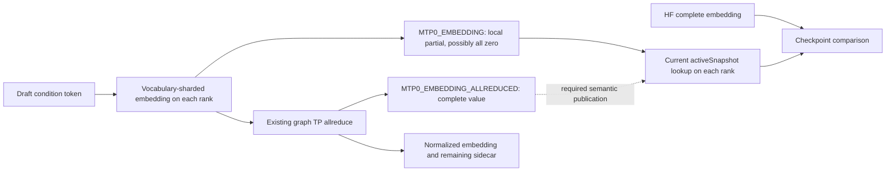
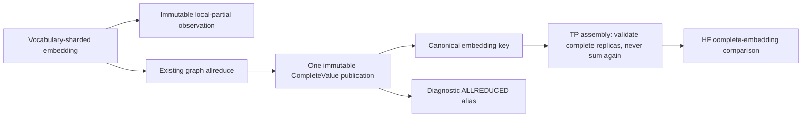

# Cross-rank MTP embedding publication — 2026-09-09

## First unseen failure

`Qwen36MoE_35B_IQ3S_NodeTP_2xMPI_CPU_ExpertOverlay_Static_Ordinal_ActFP32_KVFP16_MTPDepth1`
is the first red after twelve new greens in `ci-local-unseen-pass-08`. Its
MTP-off counterpart passed immediately before it. The cell finishes in 14.036
seconds, not a timeout or teardown fault. All nine required CSVs exist.

One rank fails `MTP0_EMBEDDING` with cosine 0, relative L2 1 and max absolute
error 0.2119140625. Rank-zero's canonical CSV instead records cosine 0.999969
and relative L2 0.007869 for that same stage. This is not a CSV write race:
`exportDecodeCSV()` writes only on rank zero outside pipeline-parallel cases,
while MTP checkpoint comparison executes on both ranks. The rank-wide outcome
consensus correctly imports the other rank's assertion and rejects the cell.

Main-model prefill LM-head cosine is 0.998096 (KL about 0.0022). Decode summaries
pass. The MTP transaction emits `[271, 760]`, exactly matching its serial oracle,
and records one accepted draft. Fresh seed, full hit and partial prefix restore
all pass. These are evidence against a general MTP computation failure, not a
substitute for the failed checkpoint.

## Producer/consumer audit

`Qwen35Graph::buildMTPGraph` explicitly places `embedding_allreduce` between
the sharded embedding and its consumers. `SnapshotCapture` preserves that
collective only under the `*_EMBEDDING_ALLREDUCED` diagnostic key. The parity
checkpoint requests `MTP0_EMBEDDING`. `OrchestrationRunner::getSnapshot` combines
rank-local `RankOrchestrator` participants, but a single graph on each NodeTP
MPI rank returns its local publication directly. Thus the non-vocabulary-owner
rank compares a zero partial with the complete HF tensor.

## Installed publication boundary

`SnapshotCapture` now publishes the existing embedding allreduce result as
`SnapshotPublication::CompleteValue` under the canonical embedding key. The
`*_ALLREDUCED` diagnostic key aliases that same immutable payload. Previously
retained partial handles remain valid; no inference collective, device copy,
weight format, or numerical threshold changes. Producer-key enumeration and
capture filters use the same depth/context grammar as publication, so a
canonical-only filter includes the finalizing producer.

The focused regression failed before the fix. It covers zero and nonzero local
partials, main embeddings and MTP depths 0–15, primary/chained contexts,
canonical-only filters, and immutable-handle lifetime. FP32/FP16/BF16 snapshot
payload tests pass. The complete SnapshotCapture Unit registration passes in
0.55 seconds. Backend-specialized CUDA and ROCm graph-capture registrations
pass in 1.75 and 0.74 seconds, including a real captured finalizer publication
with one snapshot slot/allocation and byte-identical canonical/diagnostic
aliases. This model-free test isolates publication, not collective arithmetic;
the existing collective gates and real-model cell prove transport.

TP assembly coverage also spans CPU/CUDA/ROCm identities and degrees 1–8,
including conflicting completed replicas. The complete RankOrchestrator Unit
registration passes in 3.19 seconds. Fresh full prerequisites pass 645/645 Unit
tests (78.56 seconds) and 122/122 production-preflight tests, with a combined
539.493-second receipt in `ci-local-unseen-pass-09`.

The original CPU2 Static/Ordinal depth-1 cell now passes in **12.898 seconds**
with all nine required artifacts. `MTP0_EMBEDDING` reports canonical-HF cosine
0.999969 and relative L2 0.007869, with rank-wide success instead of the
non-owner's zero-partial failure. Subsequent unseen depth-2 and depth-3 cells
pass in 13.100 and 13.199 seconds, also with all nine artifacts. The queue
continues without rerunning historical ledger greens. Depth 15, dynamic depth,
and Dynamic/Ordinal MTP-off also pass, for six new greens and **129/510** total.
The next first red is Dynamic/Ordinal depth 1, at a distinct shifted-MTP
partial-prefix boundary; see the [new audit](production-ci-shifted-prefix-boundary.md).
These are individual fixup proofs, not a fresh full-matrix or Docker certificate.
