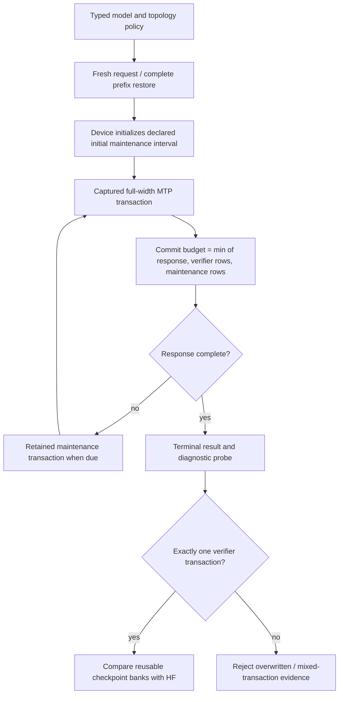
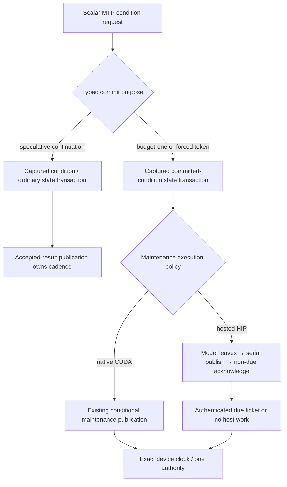
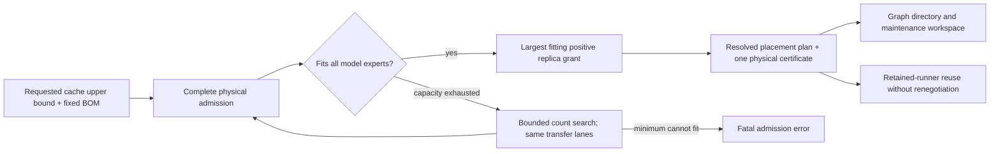
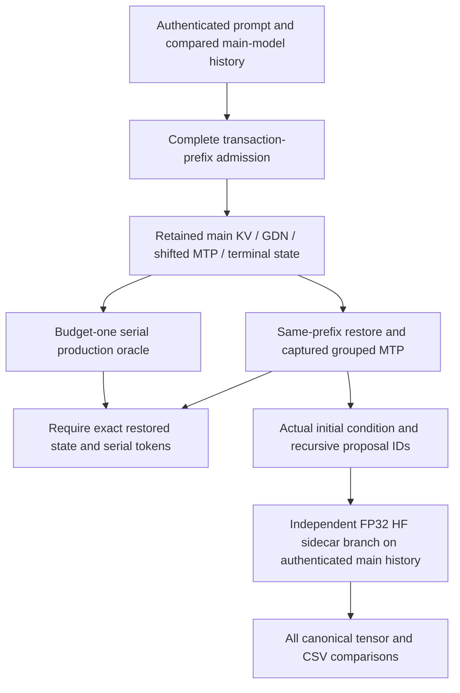

# MTP checkpoint admission at the first device maintenance boundary

2026-09-09. Follow-on to container proof 20; this is diagnostic work, not an
image certificate.

## Failure and evidence

The first red was Qwen3.6 35B IQ3_S, two ROCm participants, Dynamic/Ordinal,
MTP depth 1. The 122B CUDA/CPU sibling was cancelled, not another first failure.
The exact Qwen cell reproduces alone in 42.558 seconds. Its captured HIP ticket
policy passes production-path certification, but the checkpoint call reports
two verifier transactions and therefore cannot publish the required one-bank
MTP mathematical proof. The missing `mtp_transactions.csv` is a consequence of
that fatal assertion, not an independent numerical failure.

The fixture declares an initial device maintenance interval of one token and
a two-token checkpoint response. CUDA and ROCm both initialize the controller
from that policy. The shared `prepare_device_generation_transaction_budget`
transition takes the minimum of response, selected verifier rows, and
maintenance headroom. A one-token interval can therefore split a two-token
response. The test incorrectly claimed that response size alone guaranteed one
transaction. Static has no such maintenance boundary, explaining why the six
preceding Static MTP settings passed.

The focused `Qwen36InitialEpochAdmitsOneMTPCheckpoint` regression uses the actual
model economics and shared production controller math. Before the definition
fix it fails at every depth 1–15 in zero milliseconds: admitted budget 1,
required checkpoint response 2. No profiler or alternative execution mode is
needed to reproduce the contradiction.

## Lifecycle audit

The production lifecycle is correct to respect the earlier boundary. There is
no need for another host stop protocol, per-transaction host snapshot loop,
graph recapture, or an inference policy change.

## Simplification

- Qwen3.6/Ornith short-test economics derive their initial interval from the
  shared checkpoint response plan (two rows), still inside the short decode
  trace that must prove physical movement. The recurring interval continues
  to admit the complete maximum-width verifier.
- Checkpoint admission explicitly rejects a smaller initial native-device
  interval. The runtime topology classification comes from the production
  migration-storage resolver, not a copied vendor/rank heuristic.
- One typed adaptive-witness plan owns warmup length, speculative response
  allowance, and complete serial-oracle horizon. This replaces the independent
  hard-coded one-row warmup and `+1` oracle offset. Warmup remains ordinary
  one-token server calls, outside the numerical checkpoint and adaptive proof.
- Other topologies retain their existing one-row warmup; their maintenance
  authority does not use this native-device cadence.

The first targeted fixed run passed all nine CSV validators, including exactly
one MTP verifier, accepted drafts, serial tokens, and all prefix phases, but
failed physical movement evidence. This exposed the other half of the same
fixture contract: individually restored numerical rows restart the initial
cadence. Their token induction is a valid numerical oracle, but not a
continuous-request movement witness. Native Dynamic therefore uses the
existing independent serial-request oracle instead of reusing those reset
rows. That ordinary request now delivers `maybeApplyMoERebalance` after each
nonterminal result, matching the serving lifecycle. No alternate inference
implementation or second training loop is introduced.

## Production commit defect exposed by the continuous request

The continuous oracle still failed movement: three budget-one MTP calls
advanced live KV from position 9 to 12, but the authenticated HIP maintenance
ticket continued to report its initial two rows remaining. The ordinary decode
graph embeds `MoEDeviceDecodeCommitBoundaryStage`; the scalar MTP condition
graph did not. Host non-due dispatch intentionally enqueues nothing, assuming
the complete model graph already published that edge. The assumption was false
for budget-one and forced-token MTP commits.

`MTPConditionForwardPurpose` now travels explicitly through scalar runner APIs
and every rank-local participant. `ForwardStateTransaction::CommittedMTPCondition`
separates native cache identity without cloning the mathematical role. Setup
captures the complete purpose inventory; canonical graph memory admission
prices the same additional retained forward. No new kernel, host clock,
runtime allocation, event protocol, or per-token launch is introduced. CUDA
keeps its conditional publication rather than also embedding HIP's publisher.
The exact two-ROCm Dynamic/Ordinal depth-one cell now passes in 48.626 seconds,
with all nine CSVs validated and physical movement applied. The purpose and
identity regressions each pass twenty repeats; both real-device boundary
groups also pass twenty repeats (64.86 seconds combined).

A separate exact CUDA run fails before inference during physical admission,
with 4.18 GB of aggregate staging per device. The initial hypothesis that the
inherited 20-swap search width caused that charge was disproved: an explicit
production-width diagnostic left staging unchanged and still failed admission.
That ineffective override was removed. The physical transfer directory uses
its own active-residency and rolling-wave geometry; diagnose its canonical BOM
instead. Capacity failures now expose weight-load, activation-transport, and
expert-migration staging separately. No numerical tolerances, precision,
weight format, prefix requirement, or timeout is relaxed.

ROCm depth fifteen passed in 88.860 seconds with nine CSVs during the temporary
search-width diagnostic and a concurrent build. It is useful commit-path
evidence, not final canonical-policy or timing evidence; rerun after restoring
the declared search policy.

## Bounded replica-cache admission

The exact CUDA diagnostic splits staging into 536,870,400 weight-loading bytes
and 3,642,133,152 expert-migration bytes per participant. The requested native
cache is 25 replicas/layer (the ordinary 10% limit), with 1,000 persistent
directory slots and four rolling transfer slots. Reserving that whole upper
bound before mandatory coverage prevents the last layer from fitting.

The implementation now performs bounded replica selection within the canonical
admission layer, distinguishes physical exhaustion from malformed policy, and
carries an immutable count grant into the existing graph consumer. It changes
no weight format, activation precision, transfer parallelism, kernel, or
movement enablement. New device-free regressions cover all 21 catalogued
quantized sources on CUDA/ROCm, unequal budgets, exact byte boundaries, minimum
failure, full/off requests, and retained grant identity. The capacity Unit group
passes; its two new tests pass twenty repetitions. Canonical-policy ROCm depth
1 and 15 pass with all nine CSVs (51.735 and 50.595 seconds). CUDA now admits
21/25 requested replicas and reaches inference instead of failing admission.

## Same-prefix numerical oracle

CUDA Static and Dynamic depth 1 produce the same failure, independent of
movement: the test's serial run begins at a nine-token prompt, while the MTP
checkpoint restores eleven tokens. Its first admission hits nine tokens and
computes the remaining two with captured prefill. At position 11, serial decode
selects token 71093 (13.9699 versus token 760 at 13.8676), but the two-row
prefill selects token 760 (13.976 versus 71093 at 13.9089). A complete cache hit
preserves that latter state exactly. The difference exists before MTP starts;
the resulting near-zero embedding cosine compares two different token IDs.

The fix under verification derives the checkpoint's serial suffix from that
same complete prefix and compares persistent input state before grouped
execution. The earlier continuous request remains the maintenance witness and
certifies the token history leading to the checkpoint. The existing additive
HF branch helper now names an optional initial condition as well as recursive
drafts; it never imports native hidden values, changes HF arithmetic, or
overwrites canonical reference tensors. Independent branches reuse the loaded
sidecar but never each other's modified cache. Strict native token equality,
actual draft acceptance, and every numerical threshold remain unchanged.

The dense/MoE Python reference group passes 110 tests and all 24 snapshot-policy
tests pass, including twenty repetitions of all snapshot-policy cases. Fresh
prerequisites pass 645/645 Unit (74.42 seconds) and 120/120 preflight (469.25
seconds). Exact CUDA Static depth 1, Dynamic depth 1, and Dynamic depth 15 pass
in 34.369, 35.222, and 47.848 seconds respectively, with nine validated CSVs
each. Native serial tokens, actual acceptance, and the full independent HF
checkpoint gate all pass. CUDA adaptive depth also passes (53.886 seconds),
as do refreshed ROCm Dynamic depth 1 (54.092 seconds) and adaptive depth
(72.211 seconds), all with nine CSVs. The four-cell ROCm Static D1 → Dynamic
D1 → D15 → adaptive sequence also passes (190.311 seconds, 36 CSVs). This
fixture reports `model_context_reused=false`: its process-level sequence proves
teardown/re-entry, not retained-runner reuse. The corresponding CUDA sequence
also passes (126.699 seconds, 36 CSVs). Six isolated executions plus both
four-cell sequences yield 126 validated CSVs across eight distinct exact
configurations. This enables a fresh source-frozen Docker proof 21 for AVX512
and AVX2; these diagnostics are not image certificates. Current build/campaign
progress belongs in `parity-results/ci-container-proof-21/`, not this source.

## Gate

Focused MTP admission tests pass twenty repetitions, including the registered
five-case lifecycle preflight entry. The complete Unit gate passed 645/645 in
73.23 seconds after the committed-condition fix, before the bounded-cache
change. The bounded-cache tests and original ROCm depth-one/depth-fifteen cells
are green. Same-prefix CUDA fixed/deep/adaptive and ROCm fixed/adaptive proofs
now pass alongside the complete updated Unit/preflight gate and both short
process-level transition sequences. Docker proof 21 is the next image gate. The
checkpoint/adaptive geometry regressions join the existing model-free
`ParityMTPCheckpointNamespaceLifecycle` preflight entry. Keep local logs and
CSVs under `parity-results/`; they are not source assets.

New commit-ownership and graph-identity regressions join preflight, together
with the existing symmetric real-device serial/grouped commit-boundary tests.
The full gate and both image receipts must be rebuilt after this production
interface change; proof 20 cannot certify newer source.
