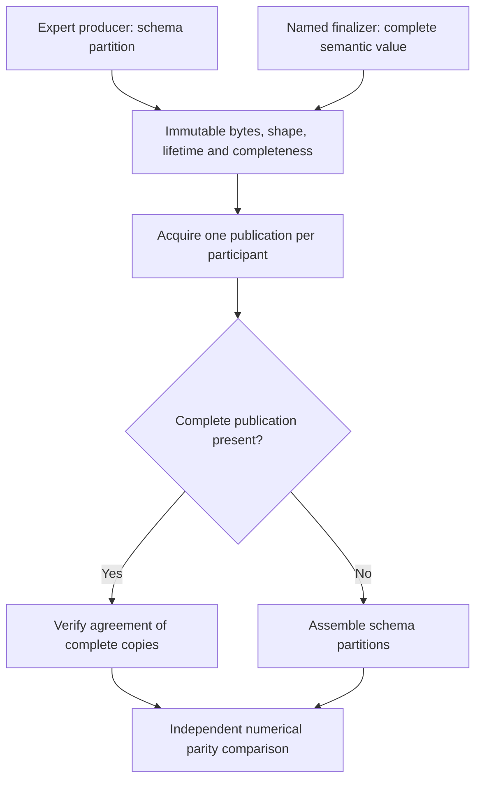
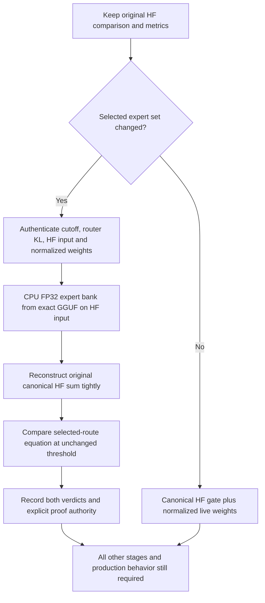
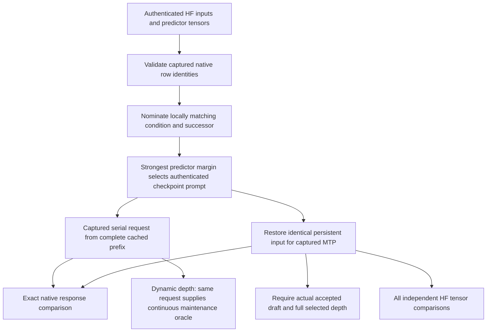
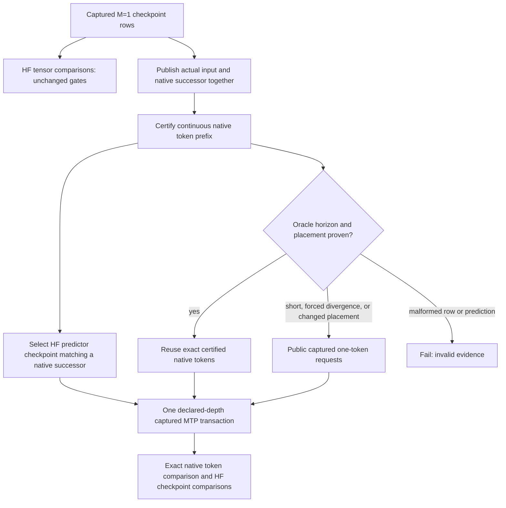
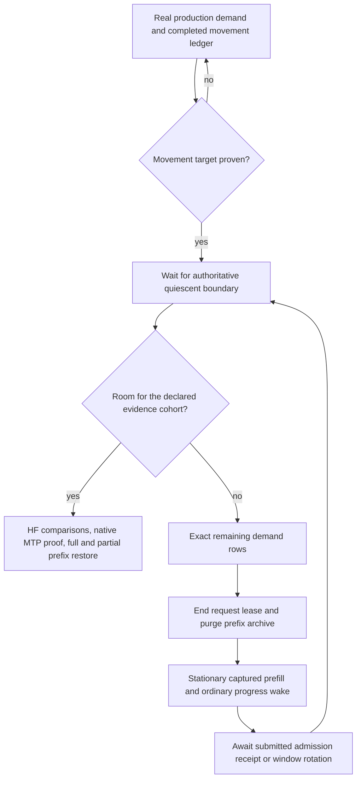

# Production CI: native MTP oracle authority

## September 9: completed snapshot publication owns assembly

The routed-output diagnostic exposed a second, independent ownership error:
the fused shared gate (or canonical publication finalizer) publishes a complete
routed row under the same semantic key as an earlier expert partial. The TP
collector used only the static schema and summed both. This also occurs on
CUDA and is not a weight-codebook issue.

`SnapshotPublication` now travels with each immutable snapshot and its shaped
runner view. Ordinary producers retain schema assembly; named finalizers
declare `CompleteValue`. A TP collector acquires each publication once, then
uses complete publications exclusively when present. Multiple complete copies
must still agree under the existing replicated-value check. Partial-only
collection still applies the original sharding policy. No division by TP
degree, backend special case, inference allocation, or numerical tolerance
change is involved. Prefill joins preserve completeness and reject mixed
partial/complete chunks.

Device-free regressions cover TP degrees 1–8 on all three backend identities,
nonzero root ownership, conflicting complete copies, immutable replacement,
and consistent/inconsistent prefill joins. They are included in existing
production-preflight registrations. All three focused registrations pass in
1.54s. Full Unit rerun passes 645/645 in 82.97s. The preceding Unit run had one
30-second trainer-script timeout; that unchanged script passes alone in 9.42s
and in the full rerun in 9.38s. Full preflight passes 121/121 in 458.43s.

The exact ROCm2/CPU2 depth-3 cell still fails after the snapshot correction:
cosine remains 0.970127, while relative L2 falls from 1.06860 to 0.245148.
Thus double summation was real, but did not explain this angular discrepancy.
Failure-only CSV capture now retains the FFN input, full router probabilities,
and selected expert IDs at the canonical checkpoint observer. No successful
cell gains extra tensor dumps. The first operand attempt was mistakenly added
to another MTP entrypoint; that edit was removed before installing the observer.

### Independent CPU FP32 replay: no expert/router kernel failure found

Replay reads the exact selected expert slices from the same tmpfs GGUF using
the reference project's existing format decoder. The measured expert tensors
are Q8_0 and router weights BF16; neither file formats nor activation policies
are changed. PyTorch evaluates `down(silu(gate(x)) * up(x))` independently.
Canonical HF inputs/routes reproduce the cached reference to relative L2
1.08e-7, authenticating the equation and selected source tensors.

| Comparison | Cosine | Relative L2 |
|---|---:|---:|
| Native expert result vs original HF result | 0.97012740 | 0.245148 |
| Native vs FP32 equation with exact native operands | 0.99995702 | 0.009273 |
| Native vs FP32 HF input, native routes/weights | 0.99752467 | 0.075733 |
| Native vs FP32 HF input/router, native selected set | 0.99728994 | 0.079460 |
| Native router vs FP32 same input | effectively 1.0 | 4.69e-7 |

Expert 213 leaves the selected set and expert 115 enters it. The live router
is its own exact FP32 top-k: `[196,186,34,211,21,90,48,115]`. Actual normalized
route weights are checked against the same live distribution. The selection
change alone explains 89.94% of squared result error; ordinary incoming-state
drift and small quantized expert arithmetic error account for the remainder.
This is evidence of a discontinuous routing boundary under small upstream
numerical drift, not a failure repaired by changing a kernel or MTP lifecycle.

The user approved the independent route-conditioned HF authority. The
implementation preserves the canonical 0.98 gate and original metrics, requires
the existing authenticated cutoff/router-KL/input proofs, verifies both selected
weight vectors against their own full router, and evaluates the selected set on
the HF input. The independent bank must reconstruct the original canonical HF
sum to relative L2 <=2e-5, then meet the unchanged cosine gate and its implied
unit-vector relative-L2 budget. No native activation/output is supplied to Python.
Explicit CSV authority and both verdicts prevent conditional green from being
misread as canonical-tensor green. The exact ROCm2/CPU2 Static/Ordinal depth-3
cell now passes in 75.887s with all nine required artifacts: canonical cosine
0.970127, independent conditioned cosine 0.997525, conditioned relative L2
0.0757328. The original score remains in the CSV; no threshold changed.

Focused C++/Python preflight registrations pass 2/2 in 9.40s; Python cache,
equation, all-format slicing, and FP32/FP16/BF16 equation tests pass 39/39.
The host rebooted before this continuation; all six GPUs are visible and idle,
and canonical persistent tmpfs restaging is in progress. The bounded target
rebuild passed after correcting the requested target's missing `122b` qualifier.

Next milestone (user-directed): **unseen/unproven exact cells only**, one at a
time, until every current cell has an individual green. Fix/recheck a red but
do not repeat green predecessors or restart the expensive full matrix. Only
then run the fresh unfiltered local campaign, and only after that goes green
attempt Docker again. Docker AVX512/AVX2 certification remains the overall goal
but is not the next feedback loop. No proof-23 container run has been started.

The canonical rebuild discovers 510 cells in 69 campaigns. An audited import
of 77 historical reports and their completed GTest results/CSV artifacts
recovers 97 exact current greens; 413 remain unproven. Historical schema is
accepted only by this non-certifying scheduling audit, never by active-run
artifact validation. A newer red/unfinished observation supersedes an older
green. The progress ledger and audit are ignored artifacts:
`ci-local-unseen-green-ledger.json` and `ci-local-unseen-history-audit.json`.
Fresh Unit passes 645/645 in 80.98s and preflight 122/122 in 460.78s. Including
the corrected exact cell, the merged ledger has 98/510 greens with 412 unproven.
The unfiltered **individual/unseen-only** driver stopped at its first unseen
Qwen2 CPU NodeTP cell in `ci-local-unseen-pass-01`: a local/global attention
workspace geometry mismatch, tracked in the
[local workspace audit](production-ci-attention-local-workspace.md).
After the focused fix and regressions, `ci-local-unseen-pass-02` refreshes the
prerequisite receipt and resumes that queue. This is not an aggregate
certificate: no previously green cell is repeated and every new green is
durably recorded immediately. Docker remains paused until local completion.

Evidence: `ci-qwen122-snapshot-publication-rocm-depth3-v1` (72.63s),
`ci-qwen122-expert-operand-rocm-depth3-v2` (75.10s), and
`ci-qwen122-expert-operand-fp32-equation-v2.log`, all below ignored
`parity-results/`. The broader container pipeline remains stopped.

## September 9: checkpoint request is not a free-running suffix

Proof 22 passed 645 Unit and 120 preflight registrations, then failed at
122B CUDA2/CPU2 Static/Ordinal MTP depth 1. The unchanged builder image
reproduced the same admission failure in 46.1 seconds. No MTP transaction ran;
the missing transaction evidence was downstream of that first failure.
Ordinary prefill and four decode checkpoints passed. Native row zero chose
198 versus HF 271 (cosine 0.999282, KL 0.00359646). Unlike the earlier CUDA1
case, the first HF draft, 561, matched neither native nor HF target argmax.

The previous selector incorrectly required all candidate checkpoints to lie
on the original free-running native trajectory. Row two has native condition
760 and native successor 3841, agreeing with its authenticated HF input and
first draft. It is a valid new request with prompt suffix `13,271`, even
though the original native response begins `13,198`. Substituting that native
response prefix would also be wrong: it names different HF hidden/cache history.

The first isolated repair reached the transaction and emitted the exact native
serial response `760,3841`, but rejected draft 11316. HF's top-two predictor
margin at row two was only 0.00996. The collector also refused the new serial
row because it retained another request's row from the same placement epoch.
That produced invalid cross-request tensor comparisons, not new kernel evidence.

The selector now validates every supplied row, then nominates the locally
matching condition/successor pair with the strongest HF top-two predictor margin
(earliest on ties). Row three's margin is 5.95. This selects an acceptance
witness; it does not relax any numerical gate or omit ordinary checkpoint rows.
One prompt builder binds the checkpoint to its authenticated reference inputs.

Every MTP proof now has exactly one captured serial request from that complete
cached prefix. It owns expected response tokens, restored input state, and the
selected main-verifier tensor row together. The competing forced-row observer,
serial-token reuse selector in the fixture, extra original-prompt oracle and
same-epoch replacement logic are removed. Duplicate serial checkpoint
publication is fatal. Dynamic-depth's same request supplies its full continuous
maintenance/adaptive oracle. Exact restored persistent state, exact emitted
tokens, actual accepted drafts, all tensor comparisons, and declared captured
depth remain required. No runtime graph, precision, weight format, numerical
gate, or production policy changed.

Focused device-free regressions reproduce the 198/271 divergence, reject a
locally mismatched condition and malformed later rows, verify the exact request
prefix and strongest-margin nomination, and retain the prohibition against
calling forced rows free-running. They join the existing MTP checkpoint
preflight registration. Full Unit passes 645/645 in 76.23 seconds.

Real-cell evidence remains diagnostic, not image certification:

- Original CUDA2/CPU2 depth-1 cell: passes, 56.65s GTest / 64.96s complete
  invocation, nine required CSVs. Exact response `3841,13477`, one accepted draft.
- CUDA2/CPU2 Static/Ordinal off, 1, 2, 3, 15, adaptive: all pass in one retained
  sequence, 116.47s and 53 validated CSVs. Post-setup depths take 9–20s each.
- Qwen36 IQ3_S two-CUDA Static/Ordinal same six policies: all pass, 108.47s,
  53 validated CSVs.
- ROCm2/CPU2 Static/Ordinal: off, 1 and 2 pass. Depth 3 fails at row three's
  `MTP2_MOE_EXPERT_OUTPUT` cosine 0.970127 (route overlap 7/8). The exact
  depth-3 cell reproduces this result alone. Response `3841,13477` remains
  serial-exact, draft identity is `13477,37550,33075`, and one draft is accepted.
  Depth 15/adaptive were not executed after fail-fast; skipped GTest lines are
  not passes. The broader pipeline remains stopped.

The numerical audit also finds roughly 2x routed-expert standard deviation on
both two-GPU backends, even in passing rows. `SnapshotCapture` publishes a
complete `routed_output` from the fused shared gate under `MOE_EXPERT_OUTPUT`,
while the Qwen schema and replicated-sidecar exception retain ROW_PARALLEL
combination for that key. This is a concrete publication/sharding inconsistency
to resolve; it does not yet establish the cause of the cosine failure. Do not
relax a gate or pick another checkpoint to hide it. Local evidence is under
`parity-results/ci-qwen122-checkpoint-*` and `ci-qwen36-checkpoint-*`.

## September 8 failure

Container proof 17 passed 644 Unit and 118 preflight registrations. The first
122B CUDA1/CPU2 Static/Ordinal MTP-depth-1 cell then rejected the serial oracle
before executing the grouped transaction. Its preceding MTP-off cell passed.
An isolated invocation reproduced the failure in 38.065 seconds.

Both cells produced identical ordinary decode CSVs. At row zero, native chose
token 561 and HF chose 271 (cosine 0.998562, KL 0.0058712, identical top-five
sets). The reference-forced next row consumed 271. The test correctly refused
to call that entire forced trajectory a free-running native oracle, but
incorrectly made reuse of that trajectory a prerequisite for MTP certification.
It also selected its acceptance checkpoint using HF's target tokens rather
than native target predictions. The HF MTP0 predictor at row zero selects 561:
that is an accepting **native** edge, not an accepting HF-target edge.

## Simplified authority

The native prediction belongs to the same typed boundary as its consumed token,
before optional maintenance can publish another placement. Fixed GPU proofs
need exactly their selected prefix plus the two admitted output tokens, not an
unrelated suffix of teacher-forced rows. CPU and dynamic-depth proofs retain
their complete response horizons and use the existing public production
serial-request contract where reuse is unavailable. Malformed metadata still
fails closed. No production graph, precision, weight format, numerical threshold,
or capture policy changes.

Device-free regressions cover the concrete 561/271 case, refusal to select a
checkpoint beyond forced divergence, changed placement, and malformed rows.
Focused real-cell verification passes on 122B CUDA1/CPU2 Static/Ordinal:

| MTP policy | Seconds | Required CSVs validated |
|---|---:|---:|
| Depth 1 (original red) | 37.069 | 9 |
| Depth 2 | 37.218 | 9 |
| Depth 3 | 37.234 | 9 |
| Depth 15 | 37.631 | 9 |
| Dynamic (capacity 15) | 41.765 | 9 |

Depth 1 emits `13;561`, exactly matching the native oracle, and commits one
accepted draft. Dynamic proves both its depth-15 checkpoint and an exact native
adaptive witness with one controller-window update. Evidence is retained under
`parity-results/ci-mtp-oracle-{fixed,depths}/`; these diagnostic runs do not
certify either shipping image. ROCm1/CPU2 Static depth 1 and dynamic depth also
pass in 37.970 and 41.968 seconds with 18 required CSVs, under
`parity-results/ci-mtp-oracle-rocm/`.

## Dynamic-placement boundary exposed by focused checking

The next individually selected CUDA1/CPU2 Dynamic/Ordinal depth-1 cell failed
in 121.356 seconds at current-fingerprint prefix restore, before its MTP
transaction. Ordinary numerical comparisons passed. The production authority
published successive profitable epochs while the fixture attempted to seed
and restore its invalidate-on-rebalance cache.

`qwen122DynamicRuntimePolicies()` still documented growth immediately after
movement, but the installed authority deliberately resets to short observation
windows after successful movement and grows only after an observed no-move
proposal. Movement-only settlement checked quiescence without reserving room
for the subsequent MTP/serial/prefix proof. A short bank was therefore declared
ready for a seed request that could invalidate itself.

The test now selects an explicit `MTPNumericalParity` settlement purpose. Its
row budget counts the possible cache-seeding requests, ordinary decode, serial
oracle, declared-width verifier and full adaptive witness, including the
worst case of rejected drafts. The existing authoritative headroom classifier
and exact production-demand closure transitions perform settlement; no new
controller, pause, policy override, or cache retry is introduced.

The new model-free regression is included in
`V2_Integration_DynamicConvergenceFiniteHorizonLifecycle`. It and
`V2_Unit_SnapshotCapture` pass together in 1.56 seconds. The first real retry
was deliberately stopped at 226.410 seconds after more than 150 movement waves;
this is interrupted diagnostic evidence, not a pass or an extended timeout.

That attempt exposed another fixture defect: demand-bank closure changed the
leading token on every request to avoid prefix-cache hits. This changes every
downstream route and continually trains a different workload. Closure now uses
stationary authenticated tokens and the public prefix-archive purge, after
ending the preceding request lease. The obsolete closure nonce namespace is
removed. The cache remains enabled for the subsequent numerical/prefix proof.
Its new focused regression and SnapshotCapture pass together in 1.55 seconds.
The first stationary retry was also stopped after 180 waves. A subsequent
edge-instrumented run **passes in 148.307 seconds with all nine required CSVs**,
under `parity-results/ci-mtp-edges/`. It reaches an observed no-move proposal
after 71 proposals and then passes the complete MTP/prefix proof. Early edge
evidence showed 173 transfers with only one repeatedly moved expert and no
reversals; later same-tier corrections did revisit a small number of experts.
This is convergence cost, not merely a hanging completion flag.

The fixture allocated 49 transfer slots for this topology but independently
capped active cycles at two. The follow-up removes that test-only cap and
uses the existing production resolver's physical-slot default. No additional
memory, production default, or numerical policy changes. A model-free
regression checks both evidence policies across every 122B topology and joins
the same preflight registration. Full-capacity real-cell verification passes
on CUDA in **153.318 seconds** (22 proposals) and ROCm in **202.259 seconds**
(23 proposals), with nine required CSVs each. Evidence is under
`parity-results/ci-mtp-concurrent/` and `ci-mtp-concurrent-rocm/`. Fewer waves
are not an end-to-end speedup claim: CUDA did not beat the prior 148.307-second
sample and the wider planner published substantially more useful work.

The MTP row bound is now owned beside the shared model definitions, and
preflight checks every 122B topology's attainable window against it. The older
35B overlay definitions currently select MTP-off only; their fixed window is
unchanged. Depth-15 and dynamic-depth Ordinal follow-ups pass on both CUDA and
ROCm after the
bounded-admission correction below. CUDA Random depth 15 and ROCm Random
dynamic-depth also pass. The complete production-preflight gate passes
118/118 in 456.21 seconds. These focused checks and the rebuilt 644/644 Unit
gate precede the next source-frozen container pipeline.

The first Dynamic depth-15 follow-up exposed a separate bounded movement
admission failure before MTP verification. Its reduced reproduction and
state-machine simplification are tracked in the
[cycle admission audit](production-ci-overlay-cycle-admission.md).

The controller remains enabled throughout. The fixture neither invents a
placement epoch nor freezes publication, and retains the ten-minute cell
watchdog. The full Unit gate passed **644/644** during this slice. A fresh
complete preflight is still required before restarting container certification.
