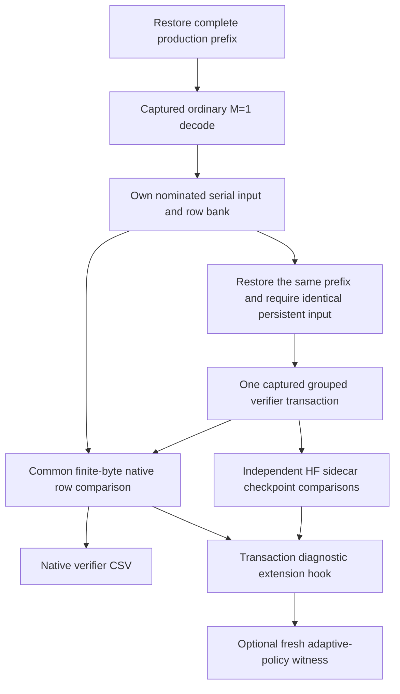

# MTP verifier evidence audit — 2026-09-10

## Observed evidence, not another runtime regression

During `ci-local-unseen-pass-14`, Qwen35 122B ROCm4/CPU2 Dynamic/Random passed
MTP depths 1/2/3/15, reaching 312/510 historical individual greens. Each cell
attempted its named draft count, emitted the exact native serial token vector,
accepted a draft, and passed full/partial prefix restore. The depth-15 terminal
sidecar LM head reports cosine **0.998532**, KL **0.00206545**.

The additional `mtp_sidecar_snapshot_breakdown.csv` has three distinct scopes:

- Nonnegative depths: independent HF sidecar checkpoint banks. The production
  primary bank persists; a reusable chained bank exposes its final iteration.
  Depth 15 therefore publishes depth 0 and depth 14, not fifteen independently
  retained activation banks. The transaction ledger independently proves all
  fifteen attempted drafts.
- Depth -2: supplementary grouped-main row-zero diagnostics against the
  original HF trajectory. `compareReusedMTPMainVerifierRows()` currently gates
  aggregate non-routing cosine and LM-head cosine/KL/Top-K, not each such row.
  Below-threshold routing/expert rows remain visible in this artifact.
- Depth -1: grouped-main row zero against the selected same-prefix native
  serial snapshot, with per-stage assertions.

An audit of all available corresponding files in the 312-entry ledger found
**139 cells / 104,176 serial rows**, all with `max_abs_diff=0` and
`exact_indices=1`. All 139 also had some below-threshold supplementary HF
rows. Thus their presence is an established diagnostic contract, not evidence
that the source-retirement change corrupted grouped execution. Do not claim
that every supplementary HF row passed individually.

## Required assertion hardening before final certification

### Implementation slice (targeted live proof complete)

The common fixture now retains the nominated native serial bank before its
virtual observation hook, and compares grouped row zero before optional model
diagnostics. The same restored persistent input and condition position
authenticate the pairing. One published LM-head geometry owns every row stride;
missing stages or inconsistent sizes cannot silently shrink the comparison.
`mtp_native_verifier_rows.csv` is an additional mandatory MTP artifact, with
explicit finite-byte disposition and first-mismatch evidence. Original HF
checkpoint CSVs and tolerances remain unchanged.

The diagram describes diagnostic ownership, not another production execution
mode. No extra model context, eager replay or mutable policy switch is added.

`NativeVerifierRowEvidence` is shared with both specialized node-overlay loops
and older dense/MoE logit checks. Seven device-free tests pass, covering ULPs,
signed zero, nonfinite values, missing rows and every matrix width 2–32. The
campaign artifact validator's 70 tests pass, including rejected missing,
duplicate, mixed-boundary, nonfinite and merely close evidence.

Fresh prerequisites pass **647/647 Unit** (73.40s) and **128/128 preflight**
(479.03s). All six canonical Qwen3.6 MoE single-device policies pass on **both
CUDA and ROCm**: Off, 1, 2, 3, 15 and dynamic-depth. MTP cells retain ten required
CSVs and take 12.31–13.85 seconds apiece; Off controls retain eight. Evidence is
under `parity-results/native-verifier-qwen36-{cuda,rocm}-01/`. This is a new
12-cell targeted proof, not a fresh 510-cell certificate. Dense, CPU and
multi-participant consumers still need explicit live validation of the common
assertion; rebuild their binaries before running the stronger artifact contract.
The older dense/MoE helper consumer
`v2_integration_qwen36_mtp_forward_verifier_operation_equivalence` also compiles
successfully after the shared comparator change, but was not executed in this
slice. That final compatibility build advances the Ninja receipt boundary;
do not reuse the earlier preflight report across it without normal validation.

The original Ornith ROCm dynamic-depth red separately reproduced its same three
HF mismatches while passing **614 native verifier rows byte-exact**. The
subsequent independent bounded-suffix proof now passes that cell in 26.894s,
preserving original scores and unchanged thresholds. Its fresh prerequisites
pass 647 Unit / 128 preflight, and its two focused proof suites pass twenty
repetitions each. Historical individual progress is **509/510**, not a claim
that all 509 cells ran this new byte gate. See the
[Ornith equation audit](production-ci-ornith-rocm-recursive-routing.md).

The follow-up shared-family regression passes **24/24** cells: all six
Qwen3.6 MoE policies on CPU, CUDA and ROCm plus all six Ornith ROCm policies.
The twenty MTP cells prove **12,280 finite byte-exact rows** and the complete
slice retains 232 canonical CSVs. This closes the single-device CPU live-proof
gap identified above; dense and multi-participant live proof remains pending.
Reports are `parity-results/route-suffix-rocm-regression-01/report.json` and
`parity-results/route-suffix-cpu-cuda-regression-01/report.json`.

### Dense and multi-rank live proof

The next unchanged-build slice passes **30/30** more canonical cells using the
same validated 647-Unit / 128-preflight receipt:

| Family | Fresh cells | Native verifier checkpoint rows | Evidence report |
|---|---:|---:|---|
| Qwen3.8 dense 27B, CPU/CUDA/ROCm, all six MTP policies | 18 | 7,980 | `parity-results/native-verifier-dense-regression-01/report.json` |
| Qwen3.5 122B, CUDA1 + CPU2 across two MPI ranks, Static/Dynamic ordinal, all six MTP policies | 12 | 7,360 | `parity-results/native-verifier-overlay-regression-01/report.json` |

The dense cells take 11.171–40.203 seconds each and retain 174 canonical CSVs.
The overlay Static cells take 33.661–41.609 seconds; Dynamic cells take
161.024–190.278 seconds because each independently trains and settles placement
before its post-movement proof. The overlay slice retains 116 canonical CSVs.
These are process launch-to-retirement diagnostic times, not served throughput
measurements or a full-campaign economy result.

Every overlay Dynamic cell has authoritative completed movement in both axes;
its ledger contains 1,140–1,488 edges, including tier-residency, participant-
placement and combined objectives. Static passes the no-movement contract.
The final adaptive witness proves one advanced policy window, thirty attempted
draft tokens, two verifier transactions and exact serial emitted tokens.
Every MTP cell passes its mandatory finite-byte bank (532 rows for dense,
736 for this overlay topology), independent HF checkpoints, prefix restore and
captured execution requirements. No implementation or tolerance changed in
this slice and no new device failure occurred.

The symmetric 122B ROCm1/CPU2 MPI2 slice also passes all twelve Static/Dynamic
ordinal cells (Off/1/2/3/15/dynamic), retaining 116 CSVs and another 7,360 finite
byte-exact checkpoints. Static takes 34.659–41.570 seconds; Dynamic takes
170.994–214.573 seconds. Dynamic ledgers contain 909–1,313 completed edges and
prove both movement axes; the adaptive witness advances its policy window and
matches the serial token stream. Report:
`parity-results/native-verifier-rocm-overlay-regression-01/report.json`.

Together with the preceding single-device family, **66 distinct cells** now
pass the stronger common gate, retaining 638 canonical CSVs and 34,980 finite
byte-exact row comparisons. These comparisons concern the nominated grouped
row zero versus its authenticated native serial row; the separate all-format
operation sweeps cover the other grouped row indices. This is not an assertion
that every historical cell ran the new gate. Other multi-participant topologies,
including larger ROCm/CPU and mixed-vendor overlays, still require fresh execution.
The global historical count remains **509/510**; the Qwen2 Q16_1 Top-5 decision,
unfiltered numerical run, approved token corpus and dual-ISA image certification
are still outstanding.

Failed recursive HF banks now retain exact native/reference NumPy operands and
a checkpoint-identity CSV for diagnosis. Native operands are outputs of that
diagnostic only, never inputs to the independent HF generator.

Every confirmed device defect exposed by this stronger gate must be reduced to
a model-free integration regression, registered in the CMake-owned
`V2_PRODUCTION_PARITY_PREFLIGHT_TESTS` inventory, and verified on every affected
backend/format before the broader campaign resumes. Race/lifetime fixes need
the requested twenty-repeat stability proof as well. The device-free comparator
tests alone cannot close an actual device-execution defect.

Before the implementation above, the depth -1 loop computed exact equality
but asserted a numerical
cosine gate for non-routing tensors (and a KL gate for logits). This is weaker
than the required native grouped/serial byte-equivalence contract, even though
the retained evidence above is numerically exact. Float equality also does
not distinguish signed-zero representations.

The fresh certifying matrix must consume the installed explicitly byte-exact
assertion for equal-shaped, finite native snapshots, with the focused device-free
regressions rejecting a one-ULP change and a signed-zero bit change. Preserve
the numerical diagnostics, independent HF proof and full serial-token/prefix
contracts. Do not conflate HF tolerance with native batch equivalence or relax
either gate to hide the distinction. Historical unseen-sweep evidence is not
a certificate of this stronger assertion or of either deployable image.

## Historical entrypoint audit (scope that motivated the correction)

The same tolerance-based native row loop also exists in
`NodeExpertOverlayParityMTPReference.cpp` around its serial snapshot comparison
(`reference_depth=-1`), not just the reused-boundary diagnostics shard.
Harden both consumers through one device-free finite-byte comparison helper
and retain their existing numerical/CSV diagnostics. Do not fix only one
execution branch or one model weight format.

The older dense and MoE helpers in `Qwen36DenseParityTestBase.h` and
`Qwen36MoEParityTestBase.h` already use `memcmp` for their grouped-verifier
logits gates; their token-vector `EXPECT_EQ` is an additional sampled-token
assertion, not their only mathematical proof. Any consolidation must preserve
that byte gate. Their local `memcmp` success branch does not itself reject
identical nonfinite payloads, so the shared primitive should explicitly reject
nonfinite, empty or mismatched spans rather than depending on a caller's
separate numerical assertion. This is an assertion audit, not an observation
of nonfinite output in the completed sweep.

### Canonical fixture inheritance must be included

An entrypoint audit confirms that the older `Qwen36*ParityTestBase` helpers
above do **not** by themselves prove the canonical dense/MoE matrix's native
tensor byte gate. Qwen3.8's registered `ProductionParity` fixture inherits
`Qwen35ConfigDrivenParityTest`; the Qwen3.6/Ornith overlay fixture inherits
`Qwen35MoEConfigDrivenParityTest`. They use the common `ParityTestBase`
transaction proof, not those older focused helpers.

The common proof calls `captureProductionParityMTPSerialOracle()`, retaining
the exact serial tokens and persistent checkpoint input. Its
`observeProductionParityMTPSerialOracleBoundary()` and
`observeComparedProductionParityMTPTransaction()` defaults are no-ops. Only
the specialized node-overlay fixture overrides both to retain and compare
main-verifier tensors. Thus strengthening just the two node-overlay loops
would leave the registered dense/common-MoE cells with token-exact evidence,
independent HF sidecar mathematics and prefix-state comparisons, but no direct
shared native verifier-tensor byte assertion.

The correction must live at the common transaction-proof boundary and be
consumed by the specialized collector, with one finite-byte primitive and
explicit checkpoint identity/geometry. Preserve diagnostic extension hooks;
do not infer coverage from an unused helper elsewhere in the tree. Keep the
already-required full token trajectory and HF sidecar proofs in addition to
this tensor assertion. The fresh certifying matrix must exercise the installed
common gate; historical passes from before that change cannot certify it.

## Ordinary decode rows are distinct from native verifier equality

Ornith two-CUDA Static/Ordinal depth two passes the current suite in
`ci-local-unseen-pass-15`. Its ordinary `decode_stages.csv` retains 897 rows,
including 63 rows with `passed=0`: 55 routing-index rows, five routing-weight
rows and three combined-expert rows. All 121 decode layer rollups and all
three output-step rows pass. This is not the `reference_depth=-1` native
grouped/serial comparison discussed above.

The ordinary shared fixture computes layer-average cosine through
`parityStageContributesToLayerCosine()`, excluding routing metrics and treating
discrete route identity separately. Its assertions gate the configured early
layer coverage and output-step/distribution summary. Stage-level `passed`
values remain diagnostic evidence; artifact validation does not require every
one of them to be true. No independent route-conditioned admission is recorded
for these ordinary rows. Do not describe a passing cell as every original HF
stage individually exceeding its diagnostic threshold, or misclassify these
rows as a newly observed native batch-invariance violation.

This audit records the installed contract without changing its thresholds or
its coverage. The explicit native grouped/serial byte-equivalence obligation
still needs the assertion hardening above.
