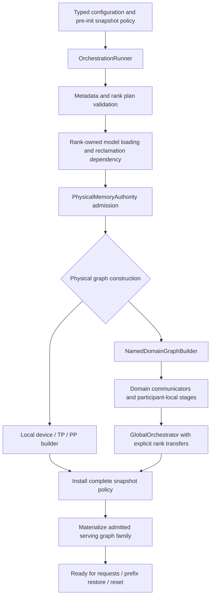

# NodePP initialization consolidation — 2026-09-09

The first unseen Qwen3.5 0.8B CPU2 NodePP cell stopped before inference:
`setSnapshotMemoryCapacity` inherited the interface's unsupported default.
No numerical checkpoints ran. Simply forwarding that method would be too late:
the named-domain wrapper constructed physical graphs, then adopted them through
an already-initialized unit-test constructor. That skipped the ordinary physical
memory admission and serving preparation phases entirely.

The named-domain runner wrapper is removed. Its replacement is a construction-
only function using the already validated plan, hardware inventory, loaded
metadata, and model authority. It neither loads a second model nor claims
readiness through an injected runner constructor. Snapshot capacity and filter
remain owned by the common lifecycle from pre-initialization onward.

Model-free regression coverage belongs to the existing production-preflight
`V2_Integration_OrchestrationRunner` member. It checks common factory ownership,
invalid capacity rejection, valid capacity acceptance, prepared-inactive policy,
and rejection of activation before readiness. CPU/CUDA/ROCm declarations and
unused-domain exclusion share that regression. The rebuilt registration passes
in 0.92 seconds. Fresh full Unit passes 645/645 in 79.96 seconds and production
preflight passes 122/122; the combined prerequisite receipt is 540.755 seconds
in `parity-results/ci-local-unseen-pass-08/report.json`.

The original exact NodePP cell now passes in **3.698 seconds**, including all
eight numerical/prefix/path CSVs. The unseen-only queue adds twelve exact greens
without rerunning ledger greens:

| Model / CPU topology | KV / decode profile | Seconds |
|---|---|---:|
| Qwen3.5 0.8B, NodePP CPU2 | FP16 | 3.698 |
| Qwen3.5 0.8B, NodeTP CPU2 | FP16 | 3.333 |
| Qwen3.5 4B, NodeTP CPU2 | FP16 | 4.635 |
| Qwen3.5 27B, NodeTP CPU2 | FP16 | 12.507 |
| Qwen3.5 0.8B, CPU1 | FP16 | 4.248 |
| Qwen3.5 0.8B, CPU1 | Q8_1 | 4.049 |
| Qwen3.5 0.8B, CPU1 | Q16_1 | 4.148 |
| Qwen3.5 4B, CPU1 | FP16 | 6.508 |
| Qwen3.5 4B, CPU1 | FP16, decode 20 | 12.598 |
| Qwen3.5 27B, CPU1 | FP16 | 16.336 |
| Qwen3.5 27B, CPU1 | Q8_1 | 15.793 |
| Qwen3.6 MoE 35B, CPU2 ExpertOverlay Static/Ordinal | FP16, MTP off | 13.534 |

All twelve have eight validated artifacts. The ledger advances **111 → 123 of
510**, not a fresh full-matrix certificate. The thirteenth attempted cell,
Qwen3.6 MoE CPU2 Static/Ordinal MTP depth 1, fails its embedding checkpoint on
one MPI rank after 14.036 seconds, with nine complete CSVs. This is the next
unseen failure; see [the publication audit](production-ci-mtp-embedding-publication.md).
The Qwen2 CPU Q16_1 Top-5 decision remains deferred and unchanged. Docker remains
paused. No process is left running after the queue's first-failure stop.
