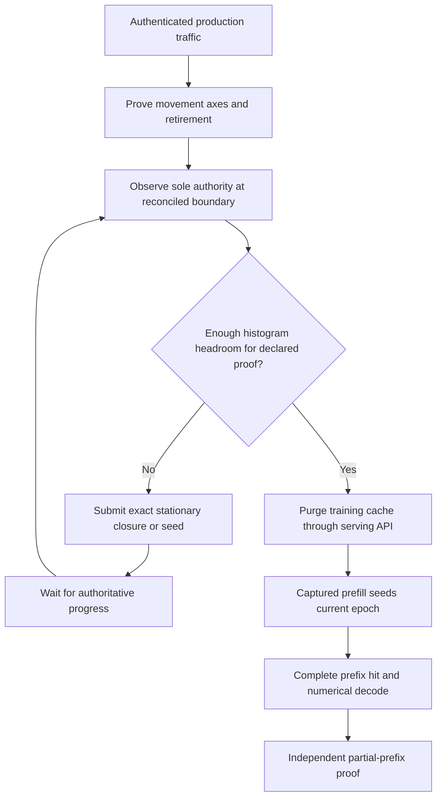

# Dynamic parity admission without MTP — 2026-09-09

Follow-up: the original prompt-plus-decode bound below was insufficient for
the now-mandatory partial-prefix reseed and suffix. The later
[participant-admission and complete-traffic audit](production-ci-prefix-participant-admission-span.md)
records the stress failure and shared request-geometry correction. The earlier
individual passes remain historical evidence, not a stability certificate.

Container proof 19 passed AVX512 Unit (645) and production preflight (118),
then all six Static/Ordinal CUDA1+CPU2 122B cells. Its next cell,
Dynamic/Ordinal/MTP-off, failed the full-prefix hit assertion. Prefill and
decode checkpoint comparisons passed. The prefix CSV records seed epoch 2
and restore epoch 3, with zero matched tokens on the latter request.

## Root cause and simplification

The fixture selected a movement-only settlement purpose when MTP was off.
That purpose treated quiescence as sufficient, even though every production
parity cell subsequently runs the mandatory prefix seed/restore proof.
An idle nine-row histogram bank could therefore admit a nine-token seed,
close, and publish a new placement before restore. Invalidate-on-rebalance
correctly invalidated the old entry. This is not another cache-key sampling
race and does not require a new production synchronization mechanism.

Remove the no-headroom settlement alternative. Ordinary numerical parity,
MTP numerical parity, and the matched timing cohort all declare their needed
rows; none may bypass demand-bank validation. Ordinary parity reuses the
definition-owned prompt-plus-decode bound already used by the timing witness.
It does not inherit the much larger speculative proof budget. The independent
partial-prefix proof keeps its existing explicit current-fingerprint seed/hit
boundary; it does not assume the earlier epoch survives forever.

No movement pause, synthetic histogram edit, extra lifecycle flag, new runtime
ledger, numerical tolerance change, or permissive prefix assertion is needed.
Exclusive request admission belongs to the test driver, not a production-server
lock or promise that unrelated concurrent requests cannot trigger movement.

## Verification plan

First reproduce the missing MTP-off admission with a device-free classifier
regression, then run the exact CUDA cell and its ROCm counterpart. Exercise
the canonical neighboring Static/Dynamic transitions before another full
source-frozen container pipeline. Full pipeline certification remains pending.

The focused MTP-off classifier reproduced the old unsafe `Ready` decision in
zero milliseconds. After the fix, all 18 convergence lifecycle tests pass 20
in-process repetitions, and the registered six-test finite-horizon preflight
passes 20 fresh-process repetitions (19.39 seconds).

The original CUDA1+CPU2 Dynamic/Ordinal/MTP-off cell passes in 172.28 seconds
(179.59 seconds including launcher/artifact validation). All eight required
CSV artifacts validate. The full-prefix lookup is a true hit and the partial
lookup restores nine of ten tokens; both report epoch 31, matching their
oracles. Prefill/decode checkpoint cosines remain 0.998946/0.998421. Settlement
now waits for the real authority to expand its short bank after profitable
movement is exhausted; no movement is suppressed to obtain that result.

The short Static/dynamic-depth → Dynamic/MTP-off → Dynamic/depth-one sequence
passes on CUDA1+CPU2 in 329.07 seconds, validating 26 fresh CSVs. Cell times
are 35.61, 172.81, and 113.28 seconds respectively. ROCm1+CPU2 passes the same
three-cell sequence in 384.02 seconds with another 26 validated CSVs and no
artifact errors. Both backends' MTP-off full and partial restores retain the
seed epoch. These six neighboring cells plus the standalone reproduction are
green before restarting the broader gates. The finished-slice complete Unit
gate passes 645/645 in 72.80 seconds and production preflight passes 118/118 in
453.87 seconds. All gate build targets were up to date. The next source-frozen
dual-ISA container run is `parity-results/ci-container-proof-20`; no image is
certified yet. These targeted results cannot substitute for its complete
per-image numerical, HTTP E2E and benchmark evidence.
