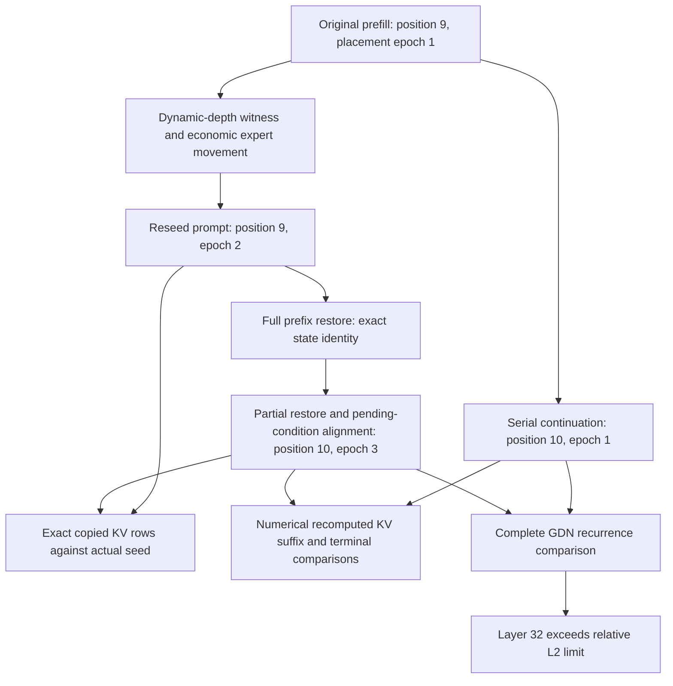
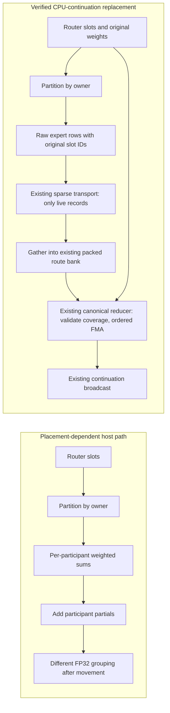

# Ornith dynamic-depth GDN prefix drift — 2026-09-09

## Preserved first red

Local unseen pass 10 adds 28 exact greens after 645 Unit and 124 production
preflight registrations pass. It stops at **157/510** on
`Ornith15MoE_35B_Q4KM_NodeTP_2xMPI_CPU_ExpertOverlay_Dynamic_Ordinal_ActFP32_KVFP16_MTPDynamicDepth`.
The canonical matrix still contains 510 cells; the local diagnostic selector
defers the separately unresolved Qwen2 Q16 Top-5 decision, without awarding a pass.

The first red takes 22.011s, with all nine canonical CSV artifacts validated.
GDN recurrence at layer 32 has relative L2 **0.052952**, above **0.05**;
cosine is **0.998605**, above 0.99. This is neither missing state nor a hang.
Main and shifted KV, terminal/checkpoint, token equality, and dynamic-controller
witnesses pass. The MTP acceptance witness accepts fifteen tokens and remains
serial-token exact. Ornith's fixed depths 1/2/3/15 all passed immediately before
this cell. Their worst GDN relative L2 values range from 0.0222 to 0.0293.

## Actual lifecycle and unresolved comparison

The KV fix is not failing here. The unresolved question is how much GDN drift
originates in reseeding versus the subsequent recurrent update, and where the
first mathematical divergence appears. A recurrent bank cannot be partitioned
into copied-prefix and appended-suffix rows like KV. Do not apply that scheme
to GDN, assume all drift is quantization, or relax the limit without evidence.

## Reproductions

- `parity-results/ci-local-unseen-pass-10`: original uninstrumented red.
- `parity-results/ci-local-ornith-gdn-diagnostic`: read-only GDB observation,
  **passes** in 25.798s. Raw FP32 recurrence/conv banks at layers 29–35 are in
  `gdb/`, with a manifest naming original prefill, seed, serial and restored
  boundaries. In the observed rank, layer-32 recurrence already differs between
  original prefill and reseed by relative L2 0.026352. Its final comparison is
  0.031706. This proves some divergence predates partial restore, not that the
  failing trajectory is correct.
- `parity-results/ci-local-ornith-gdn-uninstrumented-01`: uninstrumented exact
  repeat **fails** in 22.208s, layer-32 relative L2 **0.0529532**, cosine
  **0.998605**, maximum absolute difference 0.104059.

Every run uses the same current compiled build and authenticated 769-test
prerequisite receipt. Serial/seed/restored epochs are 1/2/3. The debugger run's
measured service-profile identity differs, so it may choose different economic
expert moves; it is not a stability certificate. The diagnostic ledgers are
separate and their pass is not merged into the durable 157-cell green ledger.

## First divergent operation localized

The late observer run `ci-local-ornith-gdn-late-03` reproduces a red at layer
30 (relative L2 0.0513247). That failing bank belongs to rank 1; the captured
rank-0 bank is below the gate. Do not conflate those two observations.

Rank-0 semantic snapshots first diverge at the layer-9 MoE output by relative
L2 5.42e-8, while its expert inputs, router IDs and weights are identical.
Later quantized projections/routing amplify this initially tiny discrepancy.
The independent installed HF recurrent GDN function agrees with the observed
rank-0 native single-step updates at worst relative L2 8.81e-6 across all 30
GDN layers. This localizes the investigation upstream; it does not certify
rank 1 or justify relaxing the complete recurrent-state gate.

The actual call stack enters `MoELocalExpertStage`, not the LocalTP canonical
publication path. Its ordinary host packet collapses locally owned expert rows
using weighted additions. Both sparse return stages then add participant
partials. Changing ownership changes FP32 parenthesization even when every
individual expert computes the same bytes. Sorting participants does not fix
that mathematical contract.

## Simplification: reuse the canonical publication, not another state machine

The return layout is a typed, authenticated wire field in rank-local, MPI and
node-local rank-batched transports. CPU continuation uses raw route records;
the final reducer already owns duplicate/missing-slot validation and fixed
router-order arithmetic. No new controller, host/device synchronization,
precision change, or parity tolerance is introduced. CPU compact compute
already has a serial raw-route arena; the root already has its canonical
publication bank. The node-local physical layout contributes the exact larger
CPU return capacity to the existing admission authority. Portable host return
payloads now use canonical Tensor allocation ownership rather than untracked
bulk `std::vector<float>` storage.

The focused build-02 gate passes four Unit registrations in 0.74s. It exercises
every two/three-participant ownership map and arrival ordering for a cancellation
witness, real CPU expert-stage raw publication after route filtering, transport
layout round trips, and rejection of invalid/missing/duplicate records. A new
real-MPI all-two-rank-placement regression is in the already registered
`ProductionParityPreflight` sparse-transport suite. Its focused run passes all
six cases on both ranks in 0.97s, including the new placement sweep.

The first full rebuilt Unit gate passes 644/646 registrations in 78.39s. Two
source-pattern checks still assumed a token-row return, and the graph regression
expected broadcast directly after the old partial reducer. The source check now
protects the generic destination-coherence infrastructure; the compiled graph
regression verifies the actual raw-bank pointer/BufferId, final ordered-FMA
policy, weights binding, and root-fold-before-broadcast dependency. It also
checks the follower contract and exposed one missing follower return-layout
assignment, which is fixed. The source-policy suite is green. Build-07 verifies
the final graph wiring before another complete prerequisite run. No model has
been admitted by the failed prerequisite receipt.

GPU-continuation lowering is unchanged. The new raw host-packet compute contract
currently accepts CPU producers only; CPU-continuation/GPU-producer symmetry
must be completed and tested before claiming general mixed-backend coverage.
The repaired CPU2 model cell is now green with the stability proof below. This
does not certify the unfinished CPU-continuation/GPU-producer combination.

## Fresh verification and resumption

Build-07 and the three focused Unit registrations pass. The complete fresh gate
passes **646/646 Unit** in 77.96s and **124/124 production preflight**; combined
prerequisites take 541.539s. The canonical exact Ornith cell then passes, with
all nine required CSVs validated, in 27.049s including the first branch-qualified
reference/cache work. Evidence is under
`parity-results/ci-local-ornith-canonical-host-02`.

The requested gate completes **20/20 fresh-process runs**, including that first
pass, with **180 validated canonical CSVs**. The following nineteen runs reuse
the authenticated unchanged-build prerequisite receipt, not old model results.
Median exact-cell wall time is 21.732s; range is 21.497–27.049s. Each exported
partial-prefix result reports state equivalence without invoking GDN numerical
comparison, and terminal hidden/logits hashes match exactly. The comparator's
unchanged policy only takes that path when GDN recurrence/conv hashes match.
These detailed CSVs are rank-zero observations; every run also passes both
ranks' full mathematical assertions. The serial epoch is 1, while seed epochs
vary between 2 and 3 and restored execution reaches epoch 3. Different observed
maintenance timing therefore retains the same restored arithmetic.

No expert kernel, codebook, precision, graph policy, or threshold changed. The
20-run summaries and individual reports remain under ignored
`ci-local-ornith-canonical-host-stress.log` and
`ci-local-ornith-canonical-host-repeat-02` through `-20`. Only after all repeats
passed was the exact cell promoted through the canonical ledger writer:
**158/510 historical individual greens**. The sequential unproven queue resumes
as `ci-local-unseen-pass-11`, reusing this build's complete prerequisite receipt.
The separately unresolved Qwen2 Q16 Top-5 decision remains deferred and ungreen.
Docker/E2E/benchmark certification is still paused; no image is certified by
these individual fixup proofs.

Pass 11 subsequently clears all twelve previously unproven Ornith CPU2 Random
cells (Static/Dynamic, MTP off/1/2/3/15/dynamic), reaching 170/510. Together with
the preserved Ordinal receipts, every generated Ornith CPU2 configuration now
has an individual pass. The queue continues through previously unproven
single-CPU Qwen3.6 MoE cells; it does not restart historical greens. A fresh
complete source-frozen matrix remains required before Docker certification.

Pass 11 then clears all six single-CPU Qwen3.6 MoE cells, all six single-CPU
Qwen3.8 dense cells, and the previously unproven Qwen3 CPU KV/NodeTP/NodePP
cells. The 122B CUDA2+CPU2 Dynamic/Ordinal cases pass with MTP off, depth 1,
depth 2, and depth 3 in 270.223s, 356.250s, 303.060s, and 293.436s respectively.
The durable ledger reaches **192/510 individual greens**; explicit depth 15
is running next. These are new exact-process results, not a fresh aggregate
certificate, and the deferred Qwen2 Q16 case remains ungreen.

Depth 2 records 1,651 committed movement edges: 1,280 tier-residency, 44
participant-placement, and 327 combined edges. Its MTP transaction and
acceptance witness are serial-token exact, and complete/partial prefix restore
both pass. This is physical two-axis movement proof, not a planner-counter
substitute. Timing remains expensive: initialization takes about 45s, and
the first-to-final proposal interval takes another 158s across 36 proposals.
The final proposal has zero migrations; movement settles without suppressing
the controller or relaxing the protected prefix/MTP demand-window contract.
The remaining time includes numerical, MTP, prefix, and teardown checks. The
unseen queue continues unchanged; no new compiled edits or repeated preflight
are needed for these passes.

Explicit depth 15 and dynamic depth also pass on 122B CUDA2+CPU2
Dynamic/Ordinal in 300.340s and 339.998s, respectively, bringing the ledger to
**194/510**. The fixed-depth CSV reports requested, snapshot, and verifier
identity depths all equal to 15, with serial-token exactness. The dynamic
witness executes, remains serial-token exact, advances the controller window
by one, and attempts 29 draft tokens over two verifier transactions. Thus all
six MTP modes for this topology/movement/placement slice have individual
passes. Random-placement cells run next in the same unchanged-build queue.

All six 122B CUDA2+CPU2 Static/Random cells subsequently pass: MTP off,
1, 2, 3, 15, and dynamic depth take 48.657s, 56.342s, 56.983s, 58.374s,
56.480s, and 59.935s. The fixture checks zero committed migrations and an
empty authoritative movement ledger across all ranks. The durable total is
now **200/510**, with **42 new passes and 366 validated canonical CSVs** in
this uninterrupted pass-11 queue. No new red has appeared. Dynamic/Random
MTP-off on the same topology is running next; the Qwen2 decision and fresh
complete local/Docker certification remain outstanding.
