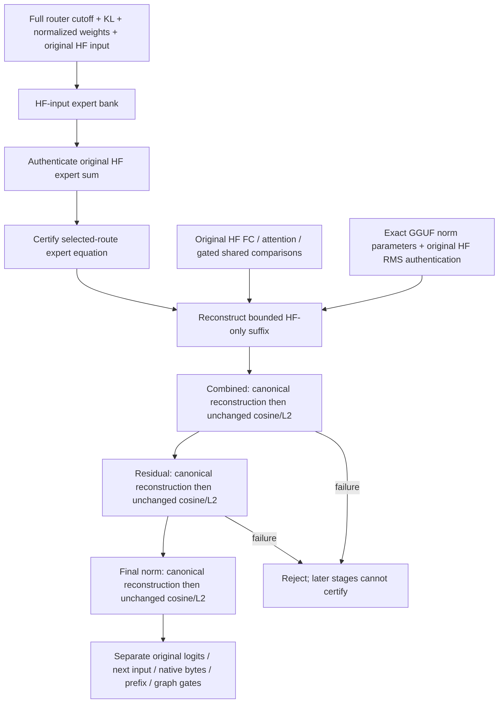

# Ornith single-ROCm adaptive-depth numerical failure — 2026-09-10

The unseen sweep `ci-local-unseen-pass-17` stopped after **498/510** canonical
cells had individually passed. Its new red is
`Ornith15MoE_35B_Q4KM_ROCm0_ActFP32_KVFP16_MTPDynamicDepth`.
This does not count as a fresh complete-matrix or image certificate.

## Evidence

The cell completed in 51.398 seconds and produced all nine required CSVs.
The following passed: prefill, all three ordinary decode output rows, all
three prefix probes, the authenticated captured HIP transaction policy,
serial-token MTP equivalence, accepted-draft witness and adaptive-window
witness. It is not a new teardown, timeout or memory-reclamation failure.

At the terminal recursive sidecar checkpoint, depth 14, three original HF
comparisons miss the existing 0.98 floor:

| Stage | Cosine | Relative L2 |
|---|---:|---:|
| FFN residual | 0.978195 | 0.207745 |
| Final norm | 0.977234 | 0.213222 |
| Combined MoE output | 0.973445 | 0.228955 |

The full router's symmetric KL is 0.00384932. The selected-set boundary proof
passes (gap 0.00076018, measured error limit 0.00799835). The independent
HF-input expert equation passes at cosine 0.983582; the original routed-output
comparison is 0.968438. Existing route conditioning adjudicates the routed
expert equation only; downstream checkpoint scores remain their original HF
comparisons and have not been replaced or waived.

The passing fixed-depth-15 cell is not the same causal branch: its checkpoint
uses reference step 2 and draft vector beginning `3841;13477;37550`, whereas
adaptive depth uses step 0 and begins `198;3710;369`. Both attempted 15 drafts.
Identical policy capacity is therefore not evidence that the failing branch
was already tested by the fixed-depth cell.

## Next diagnosis

Preserve the original gate and snapshots. Quantify how much of the downstream
error is the expected consequence of the admitted near-cutoff routing change,
versus native arithmetic/state error. Any conditional suffix oracle must use
independent HF inputs/weights and authenticate the original HF equation; it
must not consume native hidden states or silently relabel an original score.
No threshold adjustment or inference fix is justified by the current evidence
alone. The new 384-token generation comparison remains complementary, not a
way to mark this mathematical cell green.

The CSV narrows this further: depth 14 already receives a terminal hidden row
at cosine **0.980064** (hidden normalization 0.982580), and its FFN input is
0.980248. Shared-expert output is 0.984169 even though it is independent of
the routed top-k choice. Thus conditioning only this last routed output cannot
by itself explain or remove all accumulated recurrence error.

An offline HF-only recombination of the existing expert bank shows that
replacing expert 19 with expert 1, using HF probabilities, changes the routed
output to cosine 0.986844 and the combined output to 0.990166 relative to the
original HF route. Its probability gap exactly matches the published boundary
gap. This is a useful estimate of the discontinuity, not a native-kernel proof:
the actual routed weights and incoming hidden trajectory also differ.

## Failed-bank operand analysis (same original red reproduced)

`native-verifier-ornith-01` reproduces exactly the same three failures with a
fresh 647-Unit / 128-preflight receipt. The new mandatory native verifier gate
passes **614 checkpoint rows**, each at physical width 16 with exact finite
FP32 bytes. The cell retains ten canonical CSVs and a complete depth-14 failed
bank. It takes 18.824 seconds including its exact process launch/retirement;
the prerequisites take 553.157 seconds and are reused for unchanged runs.

`parity-results/diagnose-ornith-conditioned-bank.py` now evaluates the suffix
using the real retained native values for comparison, but only **HF operands,
HF-input expert-bank outputs and GGUF normalization weights** for its expected
values. The only native conditioning data are the already-validated route IDs
and normalized route weights. Reconstructing the original HF routed, combined,
residual and final-norm equations first achieves relative L2 between
1.17e-7 and 1.59e-7, authenticating the equation and loaded normalization tensor.

| Native comparison to the independently conditioned HF suffix | Cosine | Relative L2 |
|---|---:|---:|
| Routed experts | 0.983582035 | 0.180462821 |
| Combined routed + gated shared | 0.985248203 | 0.171226804 |
| FFN residual | 0.985303014 | 0.170833092 |
| Final norm | 0.984509139 | 0.176034297 |

All exceed the existing 0.98 cosine floor and satisfy its implied 0.2 relative
L2 bound. Native residual addition and final normalization also reproduce their
own direct equations exactly; combined addition has relative L2 2.74e-8.
This accounts for the final threshold crossing as the validated route
discontinuity superimposed on accumulated recurrence approximation. It is not
evidence of a newly broken residual or normalization kernel. It does not prove
the absence of every upstream device defect.

The cell remains **red**: this is an offline diagnosis, not installed suffix
adjudication. The next implementation must make the conditional suffix an
explicit typed HF equation proof, preserve the original scores, authenticate
its non-routed inputs and normalization parameter, retain the unchanged
cosine/L2 gates, and add adversarial reference/equation regressions to the
existing model-free preflight. It must not feed native activations into HF,
substitute a reference merely because it scores better, or waive the separate
native byte, prefix, graph and token obligations.

## Installed proof structure

The common reference interface now returns one typed independent expert bank
and model RMS parameters. Norm parameters have a small identity-bound receipt
and must reconstruct the original HF terminal norm before publication. The
existing expert cache remains usable; no full model reload or model hash was
added. Both paths use the same reference-generation lease.

Every original score/verdict is retained. Suffix rows identify
`route_conditioned_hf_suffix`, distinct from the expert-only proof and canonical
HF comparison. Only the selected expert IDs and already-validated weights
condition the independent equation; native activations never enter it. The
suffix is deliberately limited to three typed stages, not a transitive waiver
of later recurrence or logits.

The Python reference suite now passes 70 tests, including cache corruption,
canonical normalization reconstruction and all-codebook dequantizer dispatch.
The C++ gate adds corrupt-stage/dependency/geometry/nonfinite and row-local RMS
regressions. Both are already registered in `ProductionParityPreflight`.
Both focused suites pass **20/20 repetitions each** in 142.63 seconds total
(`parity-results/route-suffix-focused-20.log`). The shared single-device, dense,
35B overlay and 122B overlay fixtures build cleanly.

## Fresh exact-cell result

`parity-results/route-suffix-ornith-01/report.json` passes **647/647 Unit**
(73.91 seconds), **128/128 preflight** (476.07 seconds), then the previously
failing Ornith dynamic-depth cell in **26.894 seconds** including process
retirement. All ten canonical CSVs validate. The native verifier retains
**614 finite byte-exact rows** at physical width sixteen.

The three original failing scores remain unchanged in `decode_stages.csv`.
The installed independent suffix produces combined cosine **0.985248**,
residual **0.985303**, and norm **0.984509**, with relative L2
0.171227/0.170833/0.176034 respectively. Canonical reconstruction relative L2
is 1.17e-7 to 1.42e-7. The unchanged cosine/L2 gates, graph/ticket path, prefix
restoration, exact serial tokens, accepted drafts and adaptive witness all pass.

Historical individual numerical progress is now **509/510**. Qwen2 CPU Q16_1's
Top-5 boundary remains unresolved; no tolerance authorization is assumed.
This targeted green is not a fresh full-matrix or Docker certificate.

The complete affected single-device family subsequently passes **24/24**:
Qwen3.6 MoE on CPU/CUDA/ROCm and Ornith on ROCm, each with Off/1/2/3/15/dynamic.
Receipts are `parity-results/route-suffix-rocm-regression-01/report.json` and
`parity-results/route-suffix-cpu-cuda-regression-01/report.json`. They reuse the
unchanged prerequisite receipt, retain **232 canonical CSVs**, and prove
**12,280 finite byte-exact native verifier rows** across twenty MTP cells.
Per-cell launch-to-retirement times are 10.971–19.484 seconds. Ornith dynamic
passes again in 16.534 seconds using its validated additive reference cache.
No new device defect, format exception, precision change or tolerance change
was introduced. Dense and multi-participant native-byte live proof remains
separate follow-up work; their rebuild alone is not execution evidence.
