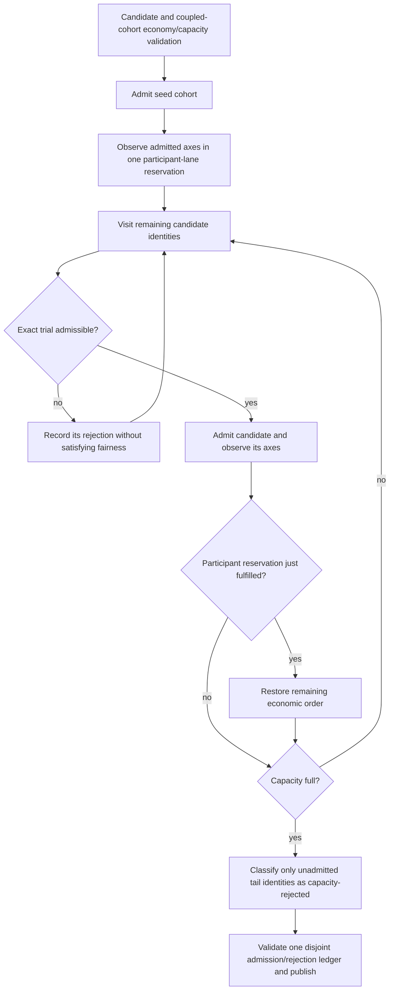

# Production CI: bounded overlay cycle admission

## September 8 isolated failure

After the native MTP oracle and prefix-cohort fixes passed Dynamic depth 1 on
CUDA1/CPU2 and ROCm1/CPU2, the individually selected 122B CUDA1/CPU2
Dynamic/Ordinal depth-15 cell stopped during movement, before MTP verification:

> independent-axis reservation admitted a non-tier cycle before its tier prerequisite

Evidence: `parity-results/ci-mtp-deep-dynamic/` and its adjacent process log.
The failed process group was terminated after the error remained stuck in
cleanup; this is a failed diagnostic, not a timeout pass. No later deep cell
or full pipeline was admitted.

## Audit

The planner already validates actual coupled dependencies through complete
candidate/cohort capacity and marginal-economy checks. Its separate fairness
state incorrectly imposed a second tier prerequisite. It also followed the
planned ordering rather than actual admission: seeded cycles were skipped by
the ordinary loop without advancing that state. A rejected first tier
candidate likewise left an independent profitable participant candidate
facing an invalid prerequisite.

The small cold-start reproduction passed. Extending the same real planner
through published epochs exposed another inconsistency in the same loop:
the tail-capacity exit classified a seed cycle as capacity-rejected even
though it was already admitted. Mixture 17 at publication two failed in
17 ms with `cycle belongs to more than one host-admission classification`.
The regression uses 27 three-layer mixtures, at most 16 generations each,
and the existing device-free transport to publish exact owner maps.

`ParticipantLaneReservation` has only Unneeded, Pending and Fulfilled states.
Only actual admitted work fulfills it, including a seed or a combined cycle.
There is no fairness-owned tier dependency. One shared capacity-tail helper
excludes admitted identities at both exits. Coupled-economy validation,
capacity conservation, transfer concurrency and inference execution are
unchanged; this adds no GPU work or foreground synchronization.

## Verification

The reduced multi-wave regression passes in 22 ms after the fix and is added
to the existing `V2_Integration_DynamicDependentCycleCohortLifecycle`
preflight registration. The complete residency-authority Unit registration and
that preflight registration each pass 20 repetitions: **40 passing executions
in 22.22 seconds**, under `parity-results/ci-cycle-reservation-20x.log`.
The linked targets rebuilt and the complete Unit gate passes **644/644 in
74.44 seconds**. The exact CUDA1/CPU2 Dynamic/Ordinal depth-15 retry passes
in **176.951 seconds**, with all nine required CSVs and clean process/context
retirement: `parity-results/ci-cycle-depth15-fixed/`. CUDA Dynamic dynamic-depth
also passes in **203.743 seconds**, with nine required CSVs, under
`parity-results/ci-cycle-cuda-dynamic-depth/`. The corresponding ROCm
depth-15 cell passes in **211.162 seconds**, with nine required CSVs, under
`parity-results/ci-cycle-rocm-depth15/`. ROCm Dynamic dynamic-depth passes in
**215.225 seconds** under `parity-results/ci-cycle-rocm-dynamic-depth/`, also
with nine CSVs and clean retirement. CUDA Random depth 15 also passes in
**203.705 seconds** and ROCm Random dynamic-depth in **193.205 seconds**, under
`parity-results/ci-cycle-cuda-random-depth15/` and
`parity-results/ci-cycle-rocm-random-dynamic-depth/` respectively. All six deep
checks pass with **54 required CSVs**. The complete production preflight then
passes **118/118 in 456.21 seconds**, with log and JUnit evidence under
`parity-results/ci-cycle-full-preflight.{log,xml}`. These focused and full
model-free gates precede the next source-frozen container pipeline; neither
local diagnostic evidence nor a previous image pass certifies the new images.

All six passing cells' authority-ledger CSVs prove both placement objectives.
Their MTP transaction CSVs prove depth 15 and serial-token equality, and all
18 prefix-restore rows pass. Each dynamic-depth cell additionally proves a
completed adaptive controller window and an exact serial witness.
These checks retain real movement, prefix restore and numerical comparisons;
they do not disable maintenance or weaken the reference thresholds.
Full image certification remains incomplete.
