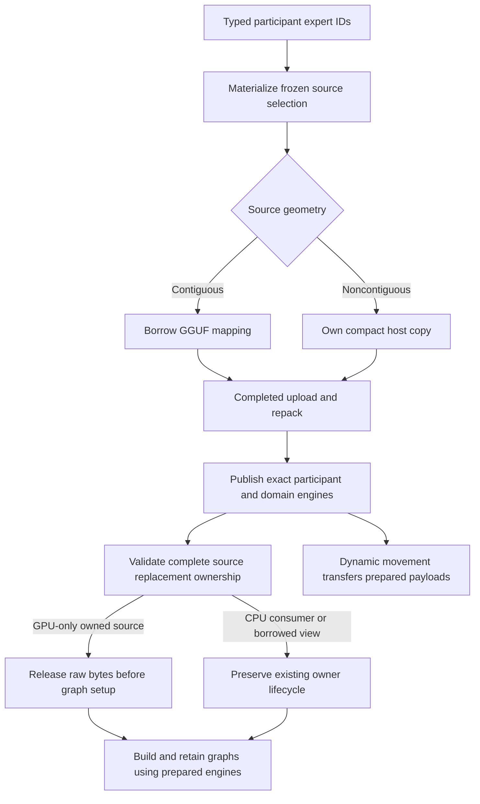

# Frozen expert upload-source retirement — 2026-09-10

## First failure and evidence

After 101 consecutive fresh individual passes, `ci-local-unseen-pass-13`
stopped at **307/510** canonical cells individually green. The first red was
Qwen35 122B, ROCm4/CPU2, two MPI ranks, Dynamic/Random, FP32 activations,
FP16 KV, MTP off. This is the topology's declared convergence-speed witness.
It completed its six numerical CSVs and measured a 13.2% Integration-mode
prefill improvement before SIGKILL prevented the prefix/path epilogue. This
is not a completed parity or Release performance certificate.

The kernel report at 06:52:42 UTC identifies `CONSTRAINT_MEMORY_POLICY`,
NUMA node **1**, rather than a global/cgroup memory limit. The killed rank had
about 139.6 GiB anonymous RSS and 145.4 GiB shared-memory RSS. Node 1 was
exhausted while the other socket still had substantial free memory. The
persistent GGUF tmpfs was preserved unchanged.

An ignored, diagnostic-only allocator interposer stopped a second exact run
before OOM (exit 86, not a test pass). Its backtraces found over 100 GB of
live allocations from `ModelLoader::loadTensorExpertSelection`, retained via
`WeightManager::materialize`. The last intercepted 8 MiB disk-prefix scratch
allocation was a victim of pre-existing pressure, not the dominant owner.
The diagnostic ledger is separate from the canonical green ledger.

## Ownership audit

The old release sweep walks `cache_` and `per_device_cache_`. Explicit
selections deliberately bypass those caches and live in frozen bindings, so
the sweep cannot reclaim them. Unlike ordinal mmap views, Random placement
therefore retains an anonymous source copy in addition to prepared GPU weights.

The fix installs one setup-only retirement operation at successful overlay
preparation. It walks the actual frozen bindings, checks the complete selected
expert set against the scoped preparation plan, and requires matching owning
engine aliases in both participant and domain registries. Every candidate is
validated before any source is freed. It preserves explicit CPU host consumers,
graph-lifetime requirements, borrowed views, metadata and binding identity.
No format conversion, kernel change, inference synchronization or memory
reserve is added. Retirement is independent of Static/Dynamic and tensor dtype.

## Verification status

The focused suite passes (16 cases, 0.79 s CTest wall time). The model-free regression
joins the existing `V2_Unit_WeightManagerMoEExpertOverlayPreparation` target,
which is already in every campaign's full Unit prerequisite. It sweeps the
canonical format inventory plus FP32/FP16/BF16 under both GPU registry
identities, and checks incomplete/torn ownership and CPU/graph retention.
Q8_1 is covered as a rejected 2-D activation source, not falsely advertised as
a loadable 3-D expert parent. A second regression calls WeightManager's actual
preparation entrypoint with an already-published bank and sources that never
entered its caches; it proves retirement and idempotent preparation reentry.
All Unit/preflight/parity targets rebuilt successfully. Fresh **645 Unit + 128
production-preflight** registrations passed in **546.433 s** under
`ci-local-numa-allocation-02`. The guarded model diagnostic then confirmed an
additional **85,633,007,616 bytes (79.75 GiB)** of source reclamation during
preparation: the same traced large-allocation total now has 26.1 GB live rather
than 111.7 GB. At that checkpoint NUMA node 1 retained about 77 GiB free, and
graph/prefix materialization continued without the guard firing. That
diagnostic completed in **365.413 s**, validating all eight required CSVs,
fresh/full/partial prefix checks, four published movement generations and clean
four-device retirement. Its prefill cosine/KL remained **0.999089 / 0.00157704**.
The before/after convergence cohort measured **12.071% prefill** and **25.984%
decode** latency improvement; these instrumented Integration measurements are
not Release benchmark certification.

`ci-local-unseen-pass-14` then passed the affected cell **without** the allocator
interposer in **352.643 s**, reusing the authenticated unchanged-build 773-test
prerequisite receipt. All eight required CSVs validated, both full and partial
prefix restores were state-equivalent, and device retirement completed. This
ordinary result advances the main ledger to **308/510**; the diagnostic-only
ledger remains separate. The unchanged persistent cache provided all 16 model
files with zero copied bytes.

The ordinary run recorded 604 authoritative movement edges: 216 `combined`
and 388 `tier_residency` objectives; physical directions were 280 promotions,
280 demotions and 44 same-priority edges. Its observed before/after latency
improvement was **2.5419% prefill / 23.1626% decode**. The difference from the
instrumented prefill measurement reinforces that neither short Integration
cohort is a Release benchmark certificate. The unseen queue continues with the
five Dynamic/Random MTP variants of this topology.

The next unseen cell, MTP depth 1, also passed without instrumentation in
**375.402 s**, advancing the historical individual ledger to **309/510**.
Its nine required CSVs validate; the MTP witness emits the exact serial-oracle
tokens and accepts one draft. Depth 2 subsequently passes in **450.175 s** with
nine validated artifacts and clean teardown, raising the ledger to **310/510**.
Depth 3 then passes in **393.958 s**, again validating all nine artifacts and
clean teardown (**311/510**). Depth 15 follows green in **375.822 s**, with the
same complete artifact contract (**312/510**). Adaptive depth then passes in
**450.573 s** with nine validated artifacts and clean teardown (**313/510**).
All 24 ROCm4/CPU2 cells are now individually green; the sweep proceeds to the
previously unproven ROCm1/CPU1 rank-local topology. These remain individual
passes, not an unfiltered campaign or Docker certificate.

ROCm1/CPU1 subsequently passes all six Static/Ordinal settings: MTP off,
1/2/3/15/adaptive in **45.071 / 51.229 / 51.706 / 51.861 / 51.679 / 54.368 s**.
The ordinary case validates eight artifacts; each MTP case validates nine.
Adaptive depth records 30 attempted drafts in two verifier transactions, one
controller-window advance and the exact 17-token serial response. Historical
individual coverage is now **319/510**, with Dynamic/Ordinal MTP-off running.
No additional source or build change occurred during this continuation.

The ROCm1/CPU1 Dynamic/Ordinal settings then all pass, with MTP off,
1/2/3/15/adaptive taking **377.048 / 344.621 / 346.685 / 394.873 / 398.028 /
478.045 s**. Each process exits cleanly and validates its full eight/nine-CSV
contract. The ordinary case records 708 promotions and 708 demotions; a
single participant per tier has no independent within-tier participant axis.
Depth 15 actually attempts fifteen drafts, emits serial-exact tokens, and has
terminal sidecar LM-head cosine **0.999671**, KL **0.000653892**. All retained
serial checkpoint rows audited for these fixed-depth cells are numerically
exact. Historical coverage reaches **325/510**, completing all twelve Ordinal
settings for ROCm1/CPU1; Static/Random MTP-off is next. No implementation,
threshold, timeout or build change was needed for these six new passes.
Static/Random MTP-off subsequently passes in **46.862 s**, with eight validated
artifacts (**326/510**); Static/Random depth 1 follows. The completed adaptive
witness records 30 attempted drafts in two verifier transactions, one
controller-window advance and an exact 17-token response; its 736 retained
native serial checkpoint rows also show zero numerical error.

The remaining Static/Random settings then pass: MTP 1/2/3/15/adaptive in
**52.776 / 52.731 / 53.280 / 52.870 / 56.232 s**, each validating nine required
artifacts. This completes all twelve Static cells for ROCm1/CPU1 and advances
historical individual coverage to **331/510**. Depth 15 and adaptive each have
736 retained native serial checkpoint rows with zero numerical difference;
both full and partial prefix restore pass. The adaptive witness executes depth
15, advances one controller window and emits the exact 17-token serial
response. Dynamic/Random MTP-off is the next unproven cell. No source, build,
precision, threshold or timeout change occurred during these five passes.

Dynamic/Random MTP-off then passes in **414.922 s**, validating all eight
required artifacts and clean retirement (**332/510**). Its movement ledger
records 708 CPU-to-ROCm promotions and 708 matching demotions, all on the
`tier_residency` axis and reported as nonblocking. Those counters prove the
selected movement path, not a standalone no-contention performance claim.
The fresh/full/partial prefix cohort passes at placement epoch 29, with both
restores state-equivalent. Terminal prefill cosine is **0.998304**, KL
**0.00338198**, with exact Top-1 and Top-5 membership. Dynamic/Random depth 1
is now the next unproven cell.

Dynamic/Random depth 1 subsequently passes in **427.350 s**, validating nine
required artifacts and clean retirement (**333/510**). The unchanged sweep
continues with depth 2. A separate read-only audit explains the repeated
post-target closure traffic in
[the Dynamic proof-window economy investigation](production-ci-dynamic-proof-window-economy.md);
its proposed workload-policy change is not installed.

Dynamic/Random depth 2 passes next in **437.661 s**, with all nine required
artifacts and clean device retirement (**334/510**). Its transaction attempts
two drafts, emits the exact serial token vector and accepts one draft. All
736 retained native serial checkpoint rows have zero numerical difference;
full and partial prefix restores are state-equivalent. Depth 3 follows on the
same authenticated build.

Dynamic/Random depth 3 then passes in **437.649 s**, with nine validated
artifacts and clean retirement (**335/510**). It executes three drafts,
produces serial-exact tokens, accepts a draft, and retains 736 native serial
checkpoint rows with zero numerical difference. Full and partial prefix
restores are state-equivalent. Depth 15 and adaptive depth are the remaining
unproven settings for this topology.

Dynamic/Random depth 15 passes in **384.373 s**, validating nine required
artifacts and clean teardown (**336/510**). Adaptive depth is now the final
unproven cell in the ROCm1/CPU1 topology; all other 23 settings have individual
passes.

Dynamic/Random adaptive depth then passes in **454.089 s**, with nine required
artifacts and clean retirement (**337/510**). All 24 ROCm1/CPU1 settings now
have individual passes. Its adaptive witness actually executes depth 15,
advances one controller window, attempts 30 drafts in two verifier transactions
and emits the exact 17-token serial response. All 736 retained native serial
checkpoint rows are numerically exact; both prefix restores are
state-equivalent. The unseen sweep proceeds to the 35B ROCm1/CPU2
Dynamic/Ordinal MTP-off cell, still without implementation or build changes.

The supplementary/native MTP artifact audit is recorded separately in
[the verifier evidence audit](production-ci-mtp-verifier-evidence-audit.md).
It found no observed serial/grouped numerical drift, but identifies an assertion
that must become explicitly byte-exact before final certification.

The accounting audit also needs to reconcile noncontiguous anonymous selection
bytes with the host `ModelSourcePayload` BOM. The existing bounded mmap-upload
assumption describes direct mapped sources and the upload ring, not these
compacted selections. Retiring unnecessary sources does not itself prove
complete peak host-memory admission; no new parallel ledger or anonymous
reserve is an acceptable substitute.

The follow-up must bind the lease to physical raw storage, not merely to the
`FrozenModelWeightSet` descriptor: prepared-source retirement intentionally
frees raw bytes while that immutable descriptor remains alive. `AlignedVector`
currently owns the noncontiguous compact allocation, moves it into the typed
tensor, and releases it through the tensor's raw-storage lifecycle; a lease
carried only by the binding would remain charged after physical reclamation.
`WeightManager` already receives the rank's immutable
`PhysicalMemoryAuthority`, but `ModelLoader::loadTensorExpertSelection()` does
not consume an allocation claim. Exact source geometry must enter admission
before this allocation, and its claim must follow move, exception, retirement
and destruction edges across every affected format. An after-allocation
certificate or an independent byte counter would not close this gap.
