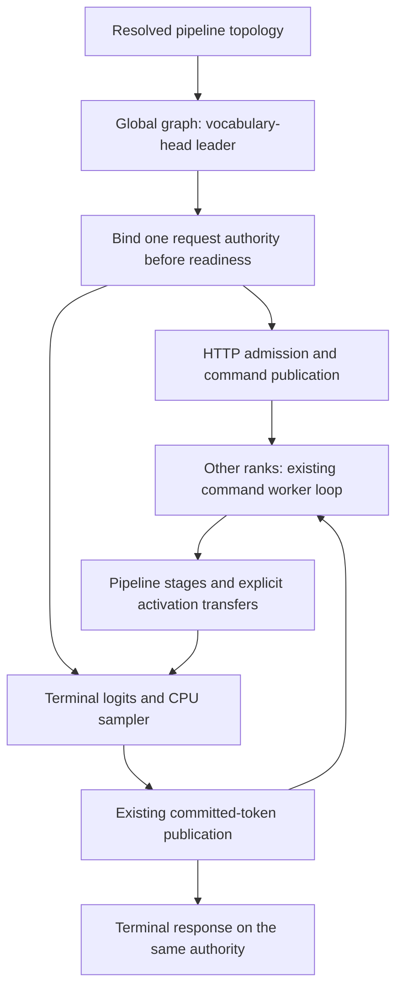

# Pipeline request authority — 2026-09-11

## First failure and root cause

The first continuous-generation attempt of Qwen3 Q8_0 / two-rank CPU NodePP /
FP32 activation / FP16 KV / MTP off aborts at its first decode. Rank zero is
the command/HTTP root but has only the pipeline head. `GlobalOrchestrator`
correctly exposes logits only at rank one, the tail; CPU stochastic decode
therefore reports `No logits available` on the wrong rank. This is not a
cache, numerical-tolerance or short-EOS failure.

The short numerical fixtures drive ranks inline and do not establish the
serving worker-loop ownership contract. Existing coordinated tests used
root-local logits. Their separate passes missed this composition.

## Simplified ownership

`IInferenceRunner::requestAuthorityRank()` is immutable topology metadata.
Global graphs name their actual vocabulary-domain leader; local graphs do not
override the outer plan's existing authority. The enclosing runner validates
the rank and rejects any conflict with an ExpertOverlay continuation owner.
This requires no host logits copy, per-token authority election, additional
collective, new stream or allocation. Frontend mode routing already consumes
`coordinatedRootRank()` and needs no topology-specific branch.

Greedy GlobalOrchestrator sampling already broadcasts its terminal token.
Its coordinated worker participation must therefore be explicit; otherwise
the tail enters that broadcast while a follower skips to the next command
fence. CPU stochastic sampling remains local to the one tail authority.

## Focused proof

`V2_Integration_PipelineRequestAuthority_MPI` joins production preflight.
It uses real two-rank MPI commands, global pipeline activation transfers and
outer request sampling around tiny CPU stages, with no model/accelerator.
Only the tail exposes logits. Both tail placements (rank zero and rank one),
greedy/stochastic policies, initial sampling, subsequent decode, request reset
and worker shutdown are exercised. A device-free global-topology regression
also covers a TP tail whose leader is rank two in a four-rank topology, and
rejects missing/duplicated vocabulary ownership.

Before the fix, the rank-one-tail test fails on both ranks in **2.07 seconds**:
the outer authority is zero while the graph's terminal owner is one. Evidence:
`parity-results/pipeline-request-authority-red-test.log`.

The fix passes the focused MPI registration plus the complete existing
GlobalOrchestrator and MPICoordinatedMode unit registrations (1.11 seconds
combined). The new four-scenario MPI registration then passes **20 complete
repeats**, 24.22 seconds total. Evidence is in
`pipeline-request-authority-focused-01.log` and
`pipeline-request-authority-repeat-20.log` under `parity-results/`.
The Integration gate/matrix build (705 actions) and Release build both finish
successfully. A fresh inventory export is exactly equal to all 510 preceding
canonical cell records: no topology, precision, prompt or gate is changed.
The full **647/647 Unit** phase passes in 73.67 seconds; refreshed
**136/136 Integration preflight** passes in 501.67 seconds. The canonical
combined receipt is `pipeline-request-authority-prerequisites-01/prerequisites.json`
(783 tests, 576.068 seconds including driver overhead). The exact NodePP
Release-server recheck uses that receipt with zero repeated gate time.

The actual server now records authority rank **one** of two and completes fresh
and full-restore responses with **384 exactly matching tokens** each
(14.666/14.295 seconds). The partial response restores 214/290 prompt tokens,
then stops naturally at **213 output tokens**. Logs and shutdown are clean;
there is no missing-logits abort. A separate cold server given that exact
extended body also produces **the same 213 token IDs and stopping point**, in
7.993 seconds, with no prefix hit. That distinguishes the fixed ownership
defect from an insufficient-horizon workload. The generation cell remains
red at the unchanged 384-token minimum (42.341 seconds whole cell).

Evidence: `generation-qwen3-node-pp-authority-02` and
`generation-qwen3-node-pp-cold-02`, under `parity-results/`. The original failed
artifacts are preserved; neither this diagnosis nor the short cold witness
approves a control stream.

The exact NodePP mathematical parity cell also passes after the fix in
**2.909 seconds**, including prefill, five incremental decode steps, prefix
restoration and **eight validated canonical CSV artifacts**. It reuses the same
783-test receipt and sealed tmpfs model; evidence is
`parity-results/pipeline-request-authority-hf-01`. This closes the focused
ownership fix without waiving the separate continuous-generation horizon.

The original real-server failure remains in
`parity-results/generation-qwen3-node-cpu-01`. The still-unseen Qwen3 CPU NodeTP
control passed separately in 50.881 seconds. All thirteen Qwen3 generation
controls have now been attempted; see the [coverage audit](generation-qwen3-control-coverage.md).
