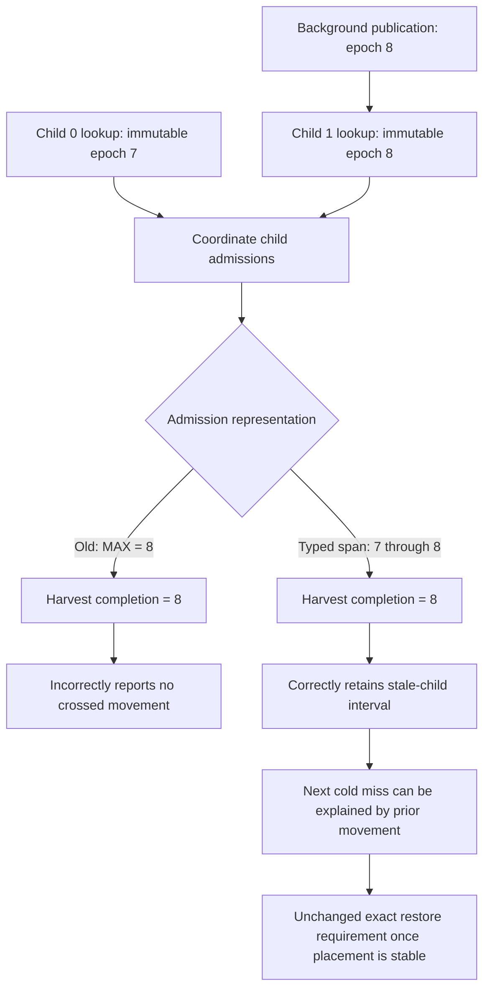
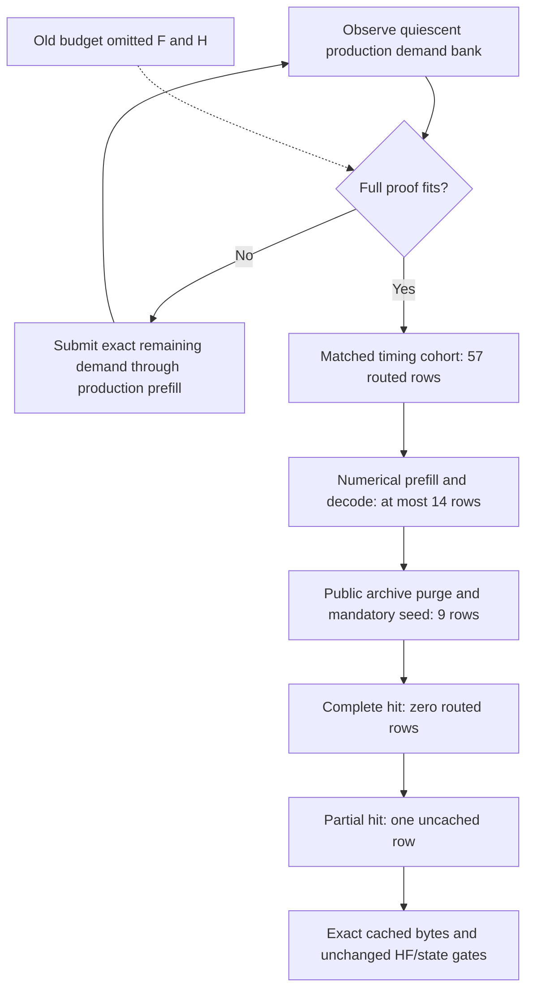

# Coordinated prefix admission interval — 2026-09-09

## First red and evidence

Local unseen pass 11 adds 42 individual greens and validates 366 canonical
CSVs before stopping at 200/510. Its first red is
`Qwen35_122B_CUDA2_CPU2_2xMPI_NodeExpertOverlay_Dynamic_Random_ActFP32_KVFP16_MTPOff`
in 91.048s. The stationary convergence-training request fails before numerical
parity: cold and restored request summaries both report admission/completion
epoch 2, but the repeated 17-token prompt is a cold miss. Missing mathematical
CSVs and the subsequent incomplete-movement assertions follow that early exit.

The trace-only reproduction, `ci-local-random-prefix-trace-01`, passes in
304.841s with all eight canonical CSVs. Its explicit state probes change
maintenance timing; it is not an uninstrumented stability proof and is not
promoted into the durable green ledger. The original per-GPU lookup identities
were not logged, so the precise interleaving of that model failure remains to
be revalidated after the focused fix.

## Proven information loss and lifecycle audit

`coordinatePrefixLookups()` previously retained only MAX(placement epoch).
The new device-free regression supplies child admissions at epochs 7 and 8,
projects the coordinated result back through the normal runner interface, then
executes the real `OrchestrationRunner::prefill()` summary path. Both
`crossedMovementEpoch()` and the following-miss explanation fail in 0 ms.
This proves an actual nested-admission bug independently of timing the model.

The old coordinator regression expected the maximum epoch, so it asserted the
lossy representation rather than the request-lifecycle invariant. A leaf lookup
test alone also cannot expose movement between two child admissions. The new
regression carries differing child epochs through both nesting levels and the
real request-summary path; the real-MPI test permutes which rank contains the
older child. Equal-epoch and movement-only-after-later-admission cases retain
their negative guarantees. This closes the specific coverage gap without
claiming that one repaired model cell certifies the rest of the matrix.

One immutable `PrefixPlacementEpochSpan` replaces the scalar admission in
leaf/participant/coordinated lookup records. Nested reductions retain MIN and
MAX; the summary uses the oldest admission to detect movement through harvest
and the newest admission of the next lookup to detect publication before its
aggregate miss. Reversed spans are rejected. Epoch zero remains a real value,
not an accumulator sentinel. The existing JSON admission field remains the
earliest epoch and a new latest-admission field exposes the complete interval.

There is no new placement authority, cache state machine, retry, forced cold
path, numerical relaxation, inference synchronization, or disabled movement.
Both endpoints use one packed two-word MIN reduction: complementing the latest
epoch encodes MAX without another round trip. The number of request-boundary
prefix collectives is unchanged. Real cache keys and stale-harvest rejection remain
participant-local and unchanged. Movement occurring solely after the later
lookup still cannot excuse its cache result.

## Verification in progress

The focused pre-fix regression is red. The implementation adds nested/permuted
epoch-span tests, preserves the negative after-later-admission test, and extends
real two-rank coordination coverage. The MPI suite is reclassified from Unit
to Integration, moved into the integration source tree, and included in the
canonical ProductionParityPreflight label rather than maintaining a duplicate
test path. Full Unit/preflight/matrix targets build successfully in
`ci-local-prefix-admission-span-build-03.log` (757 tasks). The five focused
coordinator, runner, device-orchestrator, and real-MPI suites pass. The
coordinator, prefill-flow, and two-rank MPI suites then each pass 20 fresh
process invocations in 21.19 seconds total; the original device-free regression
is now green without timing instrumentation.

`ci-local-random-prefix-span-01` passes all 645 Unit tests and all 125
ProductionParityPreflight tests (770 registrations, 540.257 seconds including
prerequisite builds). Its exact uninstrumented model cell passes in 190.916
seconds, validating all eight canonical CSVs after four persistent tmpfs cache
hits and zero model copy bytes. Prefill LM-head cosine is 0.999041 with KL
0.00105283; all 49 reported layer checks pass. The authoritative movement ledger
contains 531 committed edges: 302 tier-residency, six participant-placement,
and 223 combined. Complete and partial prefix hits both pass persistent-state
equivalence, with exact terminal-logit hashes and no changed numerical gates.

Fresh-process repetitions 2 through 20 were driven through
`parity-results/stress-random-prefix-span.py`, reusing only the authenticated
unchanged-build prerequisite receipt. Repetitions 1 through 9 pass, validating
72 canonical CSVs; elapsed times are 190.916, 198.428, 203.422, 202.499,
204.202, 198.890, 202.927, 192.925, and 200.445 seconds. Repetition 10 fails
later, in the mandatory partial-prefix proof, after numerical prefill/decode
pass. Its complete restore observes epoch 5, but a new demand window admits
another movement and the partial lookup misses at epoch 6. The run stops;
repetitions 11–20 never start. These nine model passes are not the
requested 20-run race certification and have not been promoted to the durable
200-cell ledger. The first three completed bounded Integration timing cohorts
retain 7.7393–10.7359% prefill and 21.6308–28.4583% decode latency reductions
after movement; those results are not Release benchmark certificates. The
remaining unseen queue
stays paused at the first red. Neither the full local campaign nor either ISA's
Docker image is certified by these partial results.

The interrupted stress sequence must not be promoted. After a fresh complete
20-run sequence passes on the next build, the ignored local helper
`parity-results/promote-random-prefix-span.py` revalidates all 20 distinct
artifact sets, their registered command identities, and the unchanged-build
prerequisite receipt before calling the canonical individual-ledger writer.
It cannot promote an incomplete stress sequence. Then resume the existing
unseen-cell driver; the next new cells are the same topology's Dynamic/Random
MTP variants. The separate Qwen2 Top-5 policy decision remains unresolved.

## Second red: complete proof traffic was undercounted

The new device-free `OrdinaryTrafficIncludesPartialPrefixReseed` regression
fails immediately against the previous implementation: the numerical budget
is 14 rows, but the actual sequence requires 24 (nine prefill, up to five
decode, nine mandatory reseed, one uncached suffix). The prior calculation
predates automatic partial-prefix proof. The cache correctly invalidates on
movement; the fixture incorrectly claimed sufficient headroom for its whole
proof. This is not a recurrence of the lossy admission-span assertion.

The audit also finds an independent bound on training overlap: a repeated
17-token prefix may legitimately miss after movement. One admitted training
request therefore contributes at least 19, but at most 36 routed rows. The
minimum still owns the finite training horizon; the maximum owns post-wave
headroom. Confusing those two bounds would leave another timing-dependent edge.

`ProductionParityPrefixRestorePlan` is a small immutable request-geometry value,
shared by actual partial-proof execution and admission. It adds no cache or
movement state. The speed-witness window is now derived as maximum overlap
(36) + matched cohort (57) + complete numerical/prefix proof (24) + one row
required by the strict threshold predicate = 118. No runtime policy is frozen,
no cache invalidation is disabled, and no additional retry is introduced.
MTP already included the reseed/suffix rows; it now names the same shared plan
without increasing its existing budget. Focused Unit geometry checks and the
existing model-free convergence preflight family cover old-bank rejection,
exact-threshold rejection, invalid request sizes, maximum overlap, and every
phase of the complete admitted proof. The full Unit/preflight/matrix rebuild
passes (`ci-local-prefix-traffic-build-01.log`, 63 tasks, followed by CMake
registration/one-test expectation updates in `-02` and `-03`). All three new
Unit checks pass. The two explicit model-free preflight registrations pass
seven tests in 2.05 seconds. One wider geometry check had a stale expectation
of a two-cycle MTP cap; the installed policy already uses its allocated
parallel transfer slots. The expectation now asserts that existing typed
policy and joins preflight, without changing execution or movement settings.
Discovery remains 69 campaigns / 510 exact cells.

The source-frozen `ci-local-random-prefix-traffic-01` passes all 645 Unit tests
in 73.30 seconds and all 127 preflight registrations in 467.24 seconds; the
combined fresh receipt takes 541.292 seconds including builds. Its exact
model retry passes in 201.910 seconds after four persistent tmpfs hits and zero
copy bytes. All eight canonical CSVs validate. Prefill cosine/KL remain
0.999041/0.00105283; complete and partial restores both retain epoch 5, with
exact terminal-logit hashes and passing persistent-state equivalence. The
authoritative ledger records 516 edges: 302 tier-residency, six participant,
and 208 combined. This is repetition 1 of the new sequence, not 10 of the old
sequence. Repetitions 1 through 14 pass, validating 112 canonical CSVs, with
elapsed times from 197.395 to 219.895 seconds. The new tenth run passes in
208.014 seconds and retains epoch 5 for both complete and partial restore;
its persistent states are equivalent. This does not make the earlier failing
tenth run disappear or complete the requested 20-run proof. Repetitions 11–14
pass in 212.887, 205.479, 208.835, and 197.395 seconds. Repetitions 15–20
also pass in 213.464, 216.919, 216.970, 204.365, 212.407, and 216.631 seconds.
Repetitions
2–20 use the parameterized ignored helper
`stress-random-prefix-span.py ci-local-random-prefix-traffic`, with first-red
stop and only unchanged-build prerequisite reuse. Only a successful
new 20-run sequence may promote the cell; the earlier nine passes do not
contribute to that count.

### Audit of the larger successor bank in repetition 15

Repetition 15 observes 38 rows already collected in generation 5. Admission
correctly rejects its remaining 80 rows for the 81-row protected cohort,
submits exactly 80 ordinary prefill rows, and waits for the resulting wave.
Both complete and partial prefix checks then pass at epoch 6, with nine
matched tokens and equivalent persistent state. Repetition 16 also completes
both checks at epoch 6. The proof does not require an artificial four-wave
ceiling or discard demand to force epoch 5.

A read-only audit considered, then rejected, an extra GPU forward as the
explanation. `OrchestrationRunner::decodeStep()` skips the main forward when
`prefill_logits_ready_` is set for ordinary CPU and GPU decode. The
`ReturnedTokenCommitState::Committed` branch inspected initially belongs to
forced GPU MTP continuation, not this MTP-off call. The existing complete
`PrefillDecodeTransition` and `ModelParityDefinition` Unit registrations pass
again in 1.14 seconds; no source or arithmetic change was needed.

Histogram rotation occurs when the authority freezes a proposal window,
before asynchronous movement finishes. Inference can therefore populate the
successor during that movement, and completion evidence can arrive after more
than one training request. Thirty-eight rows are consistent with two ordinary
19-row requests; the current logs do not identify every contributing request.
The single-request maximum is a window-sizing input, not a claimed upper bound
on observed occupancy. Correctness uses the actual generation/count from the
RCU histogram and requires all published inference notifications reconciled
before passive admission. The existing exact-closure regression covers excess
occupancy. The repetition launcher was briefly paused during this audit while
its admitted child continued; it was resumed without changing the frozen build
or discarding evidence.

### Completed stability gate and next unseen cells

The new sequence completes **20/20 fresh-process passes**, with **160 canonical
CSVs** independently revalidated before promotion. Exact-cell wall time is
197.395–219.895 seconds, median 207.805 seconds. All forty complete/partial
prefix rows match nine tokens and report equivalent persistent state. Fourteen
runs finish those proofs at epoch 5; six finish at epoch 6 after exact closure.
This exercises both admission outcomes without weakening movement or cache
invalidation. The original failing sequences remain preserved separately.

`promote-random-prefix-span.py ci-local-random-prefix-traffic` authenticates the
unchanged 772-test prerequisite receipt, all twenty command identities and
distinct artifact sets, then records the repaired exact cell through the
canonical ledger writer: **201/510 historical individual greens**. No source or
threshold change occurred during the sequence.

`ci-local-unseen-pass-12` resumes the sequential unproven queue at
`Qwen35_122B_CUDA2_CPU2_2xMPI_NodeExpertOverlay_Dynamic_Random_ActFP32_KVFP16_MTPDepth1`.
It reuses the same authenticated prerequisite receipt and persistent model
cache, skips earlier individual greens, and stops at the first new red. The
separate Qwen2 Q16 Top-5 decision remains deferred and ungreen; this local
selector has 509 cells while canonical discovery still has 510. Neither this
historical ledger nor the diagnostic sequence certifies a fresh full matrix,
Release benchmark, E2E suite, or either Docker ISA image.

The first resumed cell, Dynamic/Random MTP depth 1, passes in **293.760 seconds**
with all nine canonical CSVs validated and clean teardown. The canonical writer
advances the historical ledger to **202/510** and immediately admits MTP depth
2. No further source or threshold change was required. Depth 1's short-window
settlement performed 42 exact demand closures (43 authored proposals) before its existing no-move
growth policy admitted the numerical cohort; retain that as test-economy work,
not a numerical failure or a Release performance result.

Dynamic/Random MTP depth 2 also passes on the unchanged build in **320.826
seconds**, validating all nine canonical CSVs and completing teardown. The
historical ledger reaches **203/510**; depth 3 is the next running exact cell.

Depth 3 subsequently passes in **316.080 seconds**, again validating nine CSVs
and clean teardown without another code change. The ledger reaches
**204/510**, and the driver admits depth 15 next. Fixed depths 1, 2 and 3 all
retain positive acceptance, serial-token equality, and both prefix restores.

Fixed depth 15 passes in **290.684 seconds**, with all nine artifacts validated
and clean teardown. The historical ledger reaches **205/510** and dynamic-depth
MTP starts next. All four newly admitted fixed-depth cells passed without a
further implementation or tolerance change.
