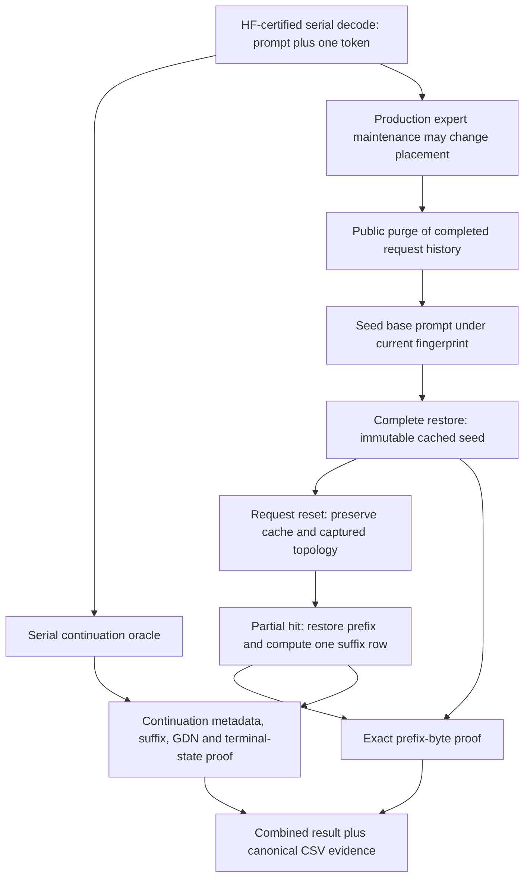

# Production parity: exact prefix seed authority

## September 9 diagnosis

The unseen queue reached 105/510 green cells, then stopped on Qwen3.5 MoE 35B,
two CPU MPI participants, Dynamic/Ordinal, FP32 activations, FP16 KV, MTP off.
All HF prefill/decode checkpoints and actual movement passed. Partial restore
failed an exact cached-prefix hash at layer 7. Static/Ordinal had just passed.

The fixture deliberately purges cache history before the partial-hit proof:
ordinary decode already cached prompt-plus-token, which would otherwise be a
complete hit. It then seeds and completely restores only the base prompt under
the current placement fingerprint. That new immutable seed was discarded as
an oracle: the final comparison demanded that its nine restored tokens equal
the earlier serial request's prefix, despite intervening expert movement.

## Lifecycle and simplification

`MTPPartialPrefixRestoreOracle` names the two immutable authorities explicitly.
The common comparator checks cache identity and the actual seed's prefix bytes
before a full-hash fast path can succeed. The serial continuation remains the
authority for suffix, shifted MTP KV, recurrent state, positions and terminal
payloads. Existing epoch-authenticated numerical gates remain unchanged; absent
movement, differing continuation bytes still fail.

The seed's **full** digest owns that range. Its legacy leading/trailing split
deliberately leaves one trailing token and therefore is not the seed's complete
prefix. Hybrid cache inventories also include GDN-only entries with zero K/V
tokens and bytes; those require symmetric empty metadata, while the independent
serial oracle still catches any lost full-attention layer. Focused regressions
cover both boundaries before admitting a real model.

No snapshot bytes are repaired, no movement is disabled, no inference operation
is added, and no numerical threshold changes. The existing two-snapshot API
continues to use its single oracle for both ranges. The prefix CSV adds the
cached seed's epoch alongside the already recorded serial/observed epochs.

## Proof plan

- Device-free tests cover FP16/BF16/FP32 suffix values with CPU/CUDA/ROCm
  participant identities, and exact seed checks across asymmetric native KV
  precision pairs.
- Adversarial mutations include stale serial bytes that match the old oracle,
  K-only/V-only damage, missing hashes, wrong owner/device/shard/sequence,
  missing/duplicate/bad suffix values, unchanged-epoch drift, and weakened
  proof options. These join the full Unit gate through its existing target.
- Run the focused comparator gate, rebuild the canonical matrices and both
  prerequisite inventories, then rerun the exact Dynamic cell before resuming
  unseen cells. Real-device integration preflight remains mandatory once per
  changed build, not once per cell.

The rebuilt focused comparator registration passes twenty repetitions in
10.31 seconds in the final implementation. A prior prerequisite attempt passed
645/645 Unit, then was explicitly interrupted during preflight to finish the
hybrid/digest audit; it is not reusable evidence. The final build's fresh Unit
gate passes 645/645 in 80.15 seconds and preflight passes 122/122 in 458.09
seconds (`ci-local-unseen-pass-05`).

That run passed the exact Dynamic cell's runtime proofs but the artifact auditor
rejected the added seed-epoch column. Its canonical schema is now synchronized,
with a red-before/green-after regression and the full campaign-driver Unit
registration green. The unchanged build receipt is reused, not the failed
artifact verdict. A fresh exact-cell run passes in 14.423 seconds with all eight
required CSVs (`ci-local-unseen-pass-06`), advancing the ledger to 106/510.

The CSV confirms serial epoch 4, cached-seed epoch 6, restored epoch 7. Nine
affected full-attention layers pass exact seed-prefix checks and numerical
suffix comparison; minimum suffix cosine is 0.997218. HF checkpoint and live
movement obligations also pass. The unseen queue continues to the random owner
orders. Neither Docker image is certified.

The next unseen Static/Random cell exposed missing diagnostic evidence, not
numerical drift: Static previously captured only full hashes, so its partial
restore had no leading range digest. The fixture now requests that bounded
range at the partial-proof boundary for every cell, without adding it to
ordinary Static prefill/decode or enabling numerical suffix tolerance there.
A focused Unit rejects an exact serial match when the actual seed range is
missing. Fresh full Unit passes 645/645 (79.77s) and preflight passes 122/122.
The next exact-cell run (`ci-local-unseen-pass-07`) passes:

| Cell | Seconds | Required CSVs |
|---|---:|---:|
| Qwen3.5 MoE 35B CPU2 Static/Random | 12.926 | 8 |
| Qwen3.5 MoE 35B CPU2 Dynamic/Random | 17.977 | 8 |
| Qwen3.5 MoE 35B single CPU | 13.408 | 8 |
| Qwen3.5 dense 0.8B local CPU pipeline | 5.598 | 8 |
| Qwen3.5 dense 4B local CPU pipeline | 8.509 | 8 |

The ledger is now 111/510. The next unseen dense 0.8B NodePP CPU2 cell stops
before inference while declaring graph snapshot memory capacity. Its
`NamedDomainGlobalRunner` wrapper has no `setSnapshotMemoryCapacity` override,
so the public interface's default returns false without a diagnostic. The
ordinary runner accepts that declaration only before physical initialization;
merely forwarding it after constructing the global runner would be too late.
The next slice must carry the same typed setup policy through global stage
planning and physical-memory admission, not suppress the capacity declaration.
No code for that separate defect is implemented here.
