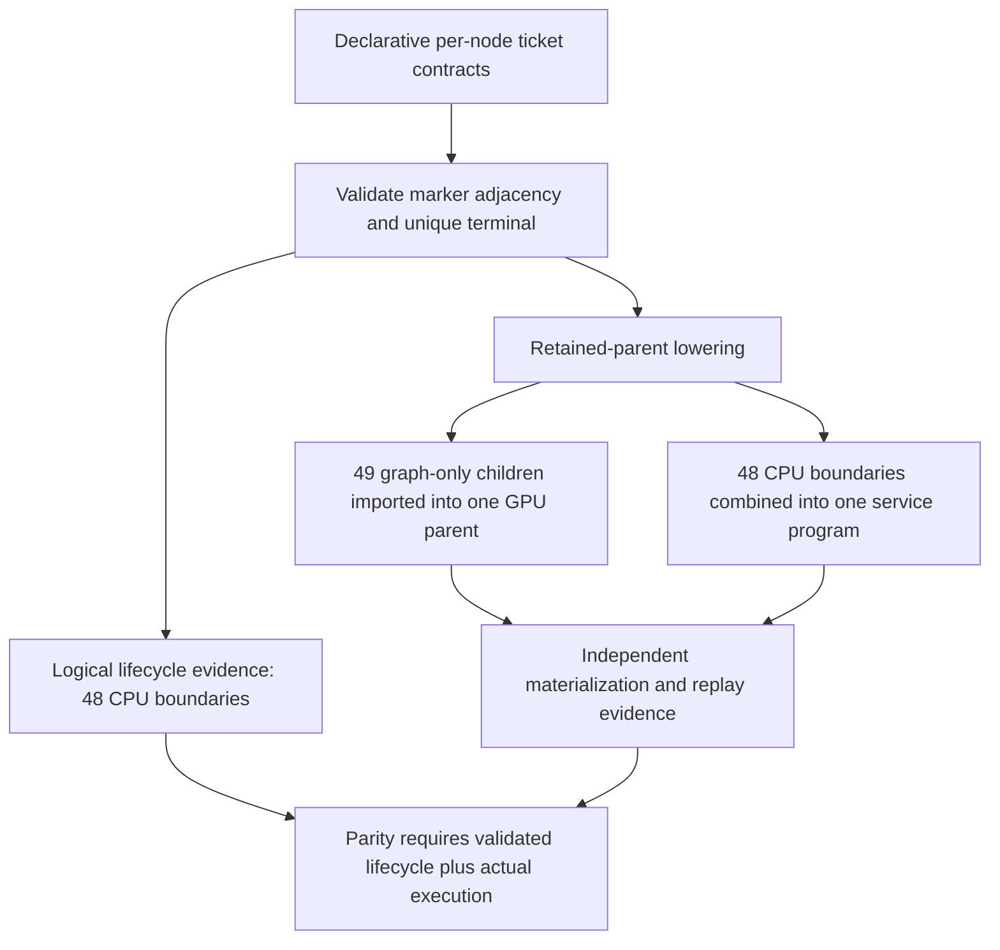

# Rank-local ticket lifecycle evidence — 2026-09-10

## First red after the CUDA2/CPU2 MTP sweep

`ci-local-unseen-pass-12` passes CUDA2/CPU2 Dynamic/Random at MTP depths
1, 2, 3, 15 and dynamic depth, raising the historical individual ledger from
201 to **206/510**. Their exact times are 293.760, 320.826, 316.080, 290.684,
and 351.228 seconds. All five validate nine canonical CSVs. This remains
individual diagnostic evidence, not a fresh full-matrix or image certificate.

The next unseen cell is
`Qwen35_122B_CUDA1_CPU1_1xMPI_RankExpertOverlay_Static_Ordinal_ActFP32_KVFP16_MTPOff`.
It fails in 44.422 seconds at the rank-local canonical-ticket assertions, after
numerical and prefix checks complete. All eight canonical artifacts validate;
the graph-evidence epilogue reports one malformed lifecycle record and no
accepted transaction record. The sequential driver stops immediately.

An unchanged-build exact diagnostic with the existing PerfStats JSON export
reproduces the failure in 44.419 seconds. Its record contains 49 captured
segments, one manual segment, 48 logical boundaries, one terminal and authority
role. The retained-parent counters independently show one executable per
prefill/decode context, each composed from 49 child units, with actual replay.
No eager execution, missing capture or numerical failure is established.

## Logical lifecycle and physical lowering were conflated

The old counter was emitted after lowering but mixed post-lowering physical
segment counts with pre-lowering logical marker counts. The parity validator
then incorrectly required logical boundaries to equal compiled CPU programs.
It also assumed one captured child per logical interval, although valid scalar
packet frontiers may introduce extra graph-only children. Runtime marker-
adjacency validation already handles those children correctly.

The fix moves lifecycle evidence publication into that existing validator,
after all adjacency/role/terminal checks pass, using its own observed logical
counts. `lifecycle_contract=typed_marker_adjacency_v1` identifies that proof.
The separate physical materialization/replay counters are unchanged. No new
state machine, synchronization, graph, transfer, kernel or precision is added.

`HeterogeneousTicketParityEvidence.h` supplies the shared fail-closed observer.
It requires validation provenance and consistent role/terminal/cutpoint
geometry, permits additional captured children, and rejects malformed or old
mixed-phase records. Rank-local parity still requires every layer's consumer
materialization/capture and forbids a fictitious mapped follower. A rejected
lifecycle now prints its actual tags rather than only an aggregate count.

## Verification

The new model-free planner/lowering/interpreter regression covers authority and
follower roles, CUDA and ROCm device addresses, and 1/2/48 boundaries. It checks
that the authority still lowers to one CPU service program while preserving
all logical boundaries. Existing additional-child coverage now consumes the
same interpreter. Missing provenance, malformed numbers, bad roles, missing
cutpoints and duplicate terminal claims are rejected.

Both focused tests fail against the previous production emitter in **2 ms**,
including the exact many-boundaries/one-service count mismatch. Evidence is
`ci-local-ticket-evidence-red.log`; the build log is
`ci-local-ticket-evidence-red-build.log`. The new
`V2_Integration_HeterogeneousTicketLifecycleEvidence` registration joins the
canonical production preflight and exercises the production planner rather
than copying the model fixture's arithmetic. Existing real CUDA/ROCm capture
integration coverage remains in that gate.

The full Unit/preflight/matrix target rebuild completed. The first focused
rerun exposed three existing exact-tag expectations that needed the newly
required lifecycle-contract tag; their logical counts were unchanged. After
updating those expectations, both the complete `ForwardGraphTypes` Unit test
and the new preflight registration passed in **0.79 seconds**. Evidence is
`ci-local-ticket-evidence-green-build-02.log` and
`ci-local-ticket-evidence-focused-green-02.log`.

`ci-local-unseen-pass-13` passed a fresh **645 Unit + 128 production-preflight**
prerequisite in **544.192 seconds**, with no reused receipt. The preserved
CUDA1/CPU1 Static/Ordinal MTP-off cell then passed in **42.372 seconds**, with
all eight canonical CSVs validated and clean teardown. Historical individual
coverage reached **207/510** with that repair.

Without another source change, the remaining Static/Ordinal settings on this
topology passed: MTP depths 1/2/3/15 in **48.108 / 47.773 / 48.022 / 48.476
seconds**, and dynamic depth in **50.611 seconds**, nine CSVs each. Fixed-depth
proofs retain positive acceptance and serial-exact output. Dynamic depth also
advances its adaptive window, attempts 30 drafts in two witness verifier
transactions, and emits the exact 17-token serial-oracle response. Thus all six
Static/Ordinal settings are individually green and historical coverage is
**212/510**. Dynamic/Ordinal MTP-off subsequently passed in **200.953 seconds**
with eight validated CSVs, raising coverage to **213/510**; its longer run
includes the required completed movement and protected post-movement proof.
Dynamic/Ordinal MTP depths 1/2/3/15 subsequently passed in **210.368 /
210.007 / 209.816 / 212.253 seconds**, followed by adaptive depth in
**227.586 seconds**, nine validated CSVs each. Historical coverage is now
**218/510**: all twelve CUDA1/CPU1 Ordinal combinations of Static/Dynamic and
MTP off/1/2/3/15/adaptive are individually green on the same unchanged build.
The adaptive witness advances its window, attempts 30 drafts in two verifier
transactions, and matches its 17-token serial oracle exactly; its completed
movement ledger records 723 promotions and 723 demotions. Complete and partial
prefix restores both match nine tokens with equivalent state.

Static/Random MTP-off also passed in **43.323 seconds**, eight CSVs, raising
coverage to **219/510**. Static/Random MTP depths 1/2/3/15 then passed in
**50.380 / 49.826 / 50.325 / 49.777 seconds**, with adaptive depth passing in
**52.579 seconds**, nine CSVs each. Each fixed depth attempts its requested
draft count, has positive acceptance, and emits the exact serial-oracle
response. The adaptive witness additionally advances its controller window.
Thus both owner orders' complete Static MTP matrices are individually green.

Dynamic/Random MTP-off passed in **218.728 seconds**, eight validated CSVs,
raising historical coverage to **225/510**. Dynamic/Random MTP depths 1/2/3/15
then passed in **230.805 / 231.139 / 230.485 / 234.305 seconds**, followed by
adaptive depth in **248.756 seconds**, nine validated CSVs each.

All **24 CUDA1/CPU1 122B cells** are now individually green on this unchanged
build: Ordinal/Random, Static/Dynamic, and MTP off/1/2/3/15/adaptive. They retain
212 canonical CSVs. Historical coverage reached **230/510**. The next unproven
case, `Qwen35MoE_35B_Q4KXL_CUDA1_CPU2_2xMPI_NodeExpertOverlay_Dynamic_Random_ActFP32_KVFP16_MTPOff`,
also passed in **64.113 seconds**, eight validated CSVs, raising coverage to
**231/510**. The next generated 35B cell was Dynamic/Ordinal MTP-off, which
passed in **63.090 seconds**, eight CSVs, raising coverage to **232/510**.
The 35B Static/Random and Static/Ordinal MTP-off cases then passed in
**14.830 / 14.112 seconds**, eight CSVs each, raising coverage to **234/510**.
`Qwen2_Q4_0_LocalPP_TP2xROCm_CPU_ActFP32_KVFP16_MTPOff` then passed in
**12.740 seconds**, eight CSVs, raising coverage to **235/510**.

The next unproven 122B ROCm1/CPU2 Dynamic/Ordinal depths 2/3/15/adaptive passed
in **202.027 / 197.153 / 178.081 / 195.353 seconds**, nine CSVs each. Their
movement ledger proves both tier residency and participant rebalancing; MTP
remains serial-exact and complete/partial prefix restores remain equivalent.
The adaptive witness advances a controller window and attempts 30 drafts in
two verifier transactions with an exact 17-token response. Historical coverage
reached **239/510**. ROCm1/CPU2 Dynamic/Random MTP-off then passed in
**228.975 seconds**, eight validated CSVs, raising coverage to **240/510**.
Dynamic/Random MTP depths 1/2/3/15 then passed in **162.039 / 217.313 /
216.420 / 177.082 seconds**, with adaptive depth passing in **199.705
seconds**, nine validated CSVs each. Their ledgers retain both movement axes,
their MTP proofs retain positive acceptance and serial-exact output, and their
complete/partial prefix restores remain equivalent. Historical coverage is
**245/510**. ROCm2/CPU2 Static/Ordinal MTP depth 15 then passed in **69.888
seconds**, nine validated CSVs, raising coverage to **246/510**.
ROCm2/CPU2 Static/Ordinal adaptive depth then passed in **71.042 seconds**,
nine validated CSVs, raising coverage to **247/510**. Its adaptive window
advances, 30 drafts are attempted across two verifier transactions, and the
17-token witness matches the serial oracle exactly. Dynamic/Ordinal MTP-off
then passed in **229.686 seconds**, eight validated CSVs, raising coverage to
**248/510**. Its completed movement ledger contains 848 tier-residency, 70
participant-placement, and 294 combined-axis edges; complete and partial prefix
restores both match nine tokens with equivalent state.
Dynamic/Ordinal MTP depth 1 then passed in **326.817 seconds**, nine validated
CSVs, raising coverage to **249/510**. It retains positive draft acceptance and
serial-token-exact output; the longer run completed its movement, comparison,
prefix, and teardown obligations within the unchanged per-cell watchdog.
Dynamic/Ordinal MTP depth 2 then passed in **344.023 seconds**, nine validated
CSVs, raising coverage to **250/510**. Its MTP output is serial-exact with
positive acceptance, and both prefix-restore variants have equivalent state.
Its completed ledger records 1,032 tier-residency, 106 participant-placement,
and 328 combined-axis edges.
Dynamic/Ordinal MTP depth 3 then passed in **270.488 seconds**, nine validated
CSVs, raising coverage to **251/510**. Its MTP output remains serial-exact
with positive acceptance, complete/partial prefix restores remain equivalent,
and its movement ledger records 952 tier-residency, 88 participant-placement,
and 309 combined-axis edges. Depth 15 then passed in **343.325 seconds**,
nine validated CSVs, raising coverage to **252/510**. Its movement ledger
records 1,060 tier-residency, 118 participant-placement, and 304 combined-axis
edges.
Dynamic/Ordinal adaptive depth then passed in **290.685 seconds**, nine
validated CSVs, raising coverage to **253/510**. Its ledger contains 848
tier-residency, 62 participant-placement, and 255 combined-axis edges. All
twelve ROCm2/CPU2 Ordinal combinations now have individual passes: both
Static/Dynamic regimes and MTP off/1/2/3/15/adaptive (including four preserved
earlier Static passes, not twelve fresh passes in this run).
ROCm2/CPU2 Static/Random MTP-off then passed in **60.885 seconds**, eight
validated CSVs, raising coverage to **254/510**. Depths 1/2/3/15 passed in
**72.386 / 72.841 / 73.543 / 72.242 seconds**, followed by adaptive depth in
**74.996 seconds**, nine validated CSVs each. Historical individual coverage
is now **259/510**. All twelve Static owner-order/MTP combinations on this
topology have individual passes. Fixed-depth CSVs authenticate their requested
depths, positive acceptance, serial-exact output, and equivalent complete and
partial prefix restores. Static immobility is asserted against every rank's
complete typed movement ledger, in addition to zero physical movement counters;
the Dynamic-only movement CSV writer intentionally emits no Static ledger file.
ROCm2/CPU2 Dynamic/Random MTP-off then passed in **259.204 seconds**, eight
validated CSVs, raising coverage to **260/510**. Its ledger records 1,422
tier-residency, 98 participant-placement, and 399 combined-axis edges, with
870 promotions and 870 demotions; both prefix restores remain equivalent.
Depth 1 then passed in **271.311 seconds**, nine validated CSVs, raising
coverage to **261/510**. Its ledger records 1,558 tier-residency, 80
participant-placement, and 423 combined-axis edges.
Dynamic/Random MTP depth 2 then passed in **249.779 seconds**, nine validated
CSVs, raising historical individual coverage to **262/510**.
Dynamic/Random depth 3 then passed in **275.277 seconds**, nine validated CSVs,
raising coverage to **263/510**. Its ledger contains 1,522 tier-residency, 94
participant-placement, and 486 combined-axis edges. Depth 15 passed in
**255.447 seconds**, nine validated CSVs, raising coverage to **264/510**;
its corresponding axis counts are 1,304 / 68 / 378. Both retain serial-exact
MTP output, positive acceptance, and equivalent complete/partial prefix restores.
Adaptive depth then passed in **311.082 seconds**, nine validated CSVs, raising
coverage to **265/510**; its ledger records 1,642 tier-residency, 84
participant-placement, and 514 combined-axis edges. All **24 ROCm2/CPU2
122B cells** now have individual passes across ordinal/random, Static/Dynamic,
and MTP off/1/2/3/15/adaptive. Four Static/Ordinal passes are preserved earlier
evidence; twenty cells were newly proven in this source-frozen run.
The next topology, ROCm3/CPU2 Static/Ordinal MTP-off, passed in **62.769
seconds**, eight validated CSVs, raising historical coverage to **266/510**.
ROCm3/CPU2 Static/Ordinal MTP depths 1/2/3/15 then passed in **85.146 /
87.606 / 92.316 / 89.359 seconds**, followed by adaptive depth in **89.757
seconds**, nine validated CSVs each. All six Static/Ordinal settings on this
topology are individually green; historical coverage is **271/510**. Fixed
depths retain positive acceptance, serial-exact output, and equivalent complete
and partial prefix restores.
ROCm3/CPU2 Dynamic/Ordinal MTP-off then passed in **287.987 seconds**, eight
validated CSVs, raising coverage to **272/510**. Its ledger records 1,108
tier-residency, 84 participant-placement, and 263 combined-axis edges, with
642 promotions and 642 demotions. Depth 1 then passed in **339.175 seconds**,
nine validated CSVs, raising coverage to **273/510**; its corresponding axis
counts are 1,220 / 96 / 256. Both retain equivalent complete and partial
prefix restores.
Dynamic/Ordinal depth 2 then passed in **328.169 seconds**, nine validated
CSVs, raising coverage to **274/510**. Its ledger contains 1,176 tier-residency,
116 participant-placement, and 240 combined-axis edges.
Dynamic/Ordinal depth 3 then passed in **364.825 seconds**, nine validated
CSVs, raising coverage to **275/510**; its ledger records 1,288 tier-residency,
130 participant-placement, and 231 combined-axis edges. Depth 15 passed in
**291.135 seconds**, nine validated CSVs, raising coverage to **276/510**;
its corresponding axis counts are 942 / 50 / 252. Adaptive depth passed in
**388.875 seconds**, nine validated CSVs, raising coverage to **277/510**;
its axis counts are 1,182 / 110 / 245. All twelve ROCm3/CPU2 Ordinal
Static/Dynamic and MTP combinations are now individually green on this build.
ROCm3/CPU2 Static/Random MTP-off subsequently passed in **77.650 seconds**,
eight validated CSVs, raising historical coverage to **278/510**.
ROCm3/CPU2 Static/Random depths 1/2/3/15 then passed in **106.524 / 99.264 /
106.770 / 90.673 seconds**, followed by adaptive depth in **97.649 seconds**,
nine validated CSVs each. All twelve Static owner-order/MTP combinations on
this topology now have individual passes, and historical coverage is
**283/510**. Fixed-depth CSVs authenticate their requested depths, positive
acceptance, serial-exact output, and equivalent complete/partial prefix restores.
ROCm3/CPU2 Dynamic/Random MTP-off then passed in **295.283 seconds**, eight
validated CSVs, raising coverage to **284/510**. Its ledger records 1,908
tier-residency, 78 participant-placement, and 566 combined-axis edges, with
1,181 promotions and 1,181 demotions. Depth 1 then passed in **339.973
seconds**, nine validated CSVs, raising coverage to **285/510**; its
corresponding axis counts are 1,994 / 134 / 625. Both retain equivalent
complete and partial prefix restores.
Dynamic/Random depth 2 then passed in **328.847 seconds**, nine validated
CSVs, raising coverage to **286/510**. Its ledger records 1,700 tier-residency,
88 participant-placement, and 573 combined-axis edges; MTP remains
serial-exact with positive acceptance, and both prefix restores remain equivalent.
Dynamic/Random depth 3 then passed in **351.688 seconds**, nine validated
CSVs, raising coverage to **287/510**. Its ledger records 2,000 tier-residency,
136 participant-placement, and 606 combined-axis edges. Depth 15 passed in
**335.559 seconds**, nine validated CSVs, raising coverage to **288/510**;
its corresponding axis counts are 1,816 / 98 / 621. Both retain serial-exact
MTP output, positive acceptance, and equivalent complete/partial prefix restores.
Dynamic/Random adaptive depth then passed in **400.877 seconds**, nine
validated CSVs, raising coverage to **289/510**. Its ledger records 2,072
tier-residency, 142 participant-placement, and 581 combined-axis edges, with
1,268 promotions and 1,268 demotions. Its adaptive controller advances a window,
attempts 30 drafts across two verifier transactions, and accepts 15 tokens;
the witness is serial-exact and both prefix restores remain equivalent.
All **24 ROCm3/CPU2 122B cells** now have individual passes in this run.
ROCm4/CPU2 Static/Ordinal MTP-off then passed in **73.130 seconds**, eight
validated CSVs, raising coverage to **290/510**; complete and partial prefix
restores both match nine tokens with equivalent state.
ROCm4/CPU2 Static/Ordinal depths 1/2/3/15 then passed in **106.474 /
109.945 / 109.276 / 101.872 seconds**, followed by adaptive depth in
**111.537 seconds**, nine validated CSVs each. All six Static/Ordinal MTP
settings now have individual passes, raising historical coverage to **295/510**.
Fixed-depth evidence retains the requested depth, positive acceptance,
serial-exact output, and equivalent complete and partial prefix restores.
ROCm4/CPU2 Dynamic/Ordinal MTP-off then passed in **334.278 seconds**,
eight validated CSVs, raising coverage to **296/510**. Its completed ledger
records 1,256 tier-residency, 96 participant-placement, and 257 combined-axis
edges, with 714 promotions and 714 demotions. Complete and partial prefix
restores both match nine tokens with equivalent state.
ROCm4/CPU2 Dynamic/Ordinal depth 1 then passed in **416.987 seconds**,
nine validated CSVs, raising coverage to **297/510**. Its ledger records
1,278 tier-residency, 78 participant-placement, and 255 combined-axis edges.
MTP executes the requested depth with positive acceptance and serial-exact
output; complete and partial prefix restores remain equivalent.
ROCm4/CPU2 Dynamic/Ordinal depth 2 then passed in **471.181 seconds**,
nine validated CSVs, raising coverage to **298/510**. Its ledger records
1,272 tier-residency, 84 participant-placement, and 249 combined-axis edges.
The requested depth is authenticated, MTP output remains serial-exact with
positive acceptance, and both prefix restores remain equivalent.
ROCm4/CPU2 Dynamic/Ordinal depth 3 then passed in **421.167 seconds**,
nine validated CSVs, raising coverage to **299/510**. Its ledger records
1,294 tier-residency, 94 participant-placement, and 250 combined-axis edges.
MTP output remains serial-exact at the requested depth, acceptance is positive,
and complete and partial prefix restores remain equivalent.
ROCm4/CPU2 Dynamic/Ordinal depth 15 then passed in **404.736 seconds**,
nine validated CSVs, raising coverage to **300/510**. Its ledger records
1,276 tier-residency, 96 participant-placement, and 252 combined-axis edges.
MTP executes the requested depth with positive acceptance and serial-exact
output; complete and partial prefix restores remain equivalent.
ROCm4/CPU2 Dynamic/Ordinal adaptive depth then passed in **498.692 seconds**,
nine validated CSVs, raising coverage to **301/510**. Its ledger records
1,290 tier-residency, 104 participant-placement, and 250 combined-axis edges.
The adaptive witness advances a controller window, attempts 30 drafts across
two verifier transactions, and accepts 15 tokens. Its output is serial-exact,
and both prefix restores remain equivalent. All **12 ROCm4/CPU2 Ordinal
Static/Dynamic and MTP combinations** now have individual passes in this run.
ROCm4/CPU2 Static/Random MTP-off then passed in **91.891 seconds**, eight
validated CSVs, raising coverage to **302/510**. Depths 1/2/3/15 passed in
**127.420 / 126.927 / 117.372 / 109.822 seconds**, followed by adaptive
depth in **112.039 seconds**, nine validated CSVs each. Historical individual
coverage is **307/510**. All **12 ROCm4/CPU2 Static owner-order/MTP
combinations** now have individual passes. Fixed-depth evidence authenticates
the requested depth, positive acceptance, serial-exact output, and equivalent
complete and partial prefix restores. The adaptive witness advances one window,
attempts 30 drafts over two verifier transactions, and accepts 15 tokens with
serial-exact output and equivalent prefix restores.
This is **101 consecutive newly green cells** in `ci-local-unseen-pass-13`,
with no additional inference, reference, threshold or build change after the
ticket-evidence fix.
These identities come from the generated queue; do not infer its next MTP
setting from the preceding topology's ordering.
The canonical prerequisites are not rerun between unchanged cells. Docker
certification remains paused; this is not a full-matrix certificate.
