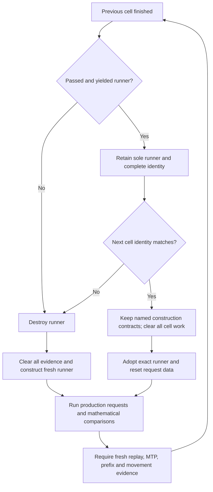
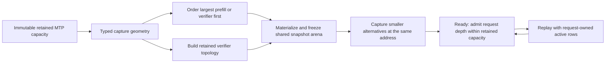

# Retained runner evidence scope — 2026-09-09

## Reproduction

Docker proof 18 passed AVX512 Unit (644 tests) and production preflight (118
tests). Its original Static 122B CUDA1/CPU2 MTP-depth-one failure was green.
The following Static/Ordinal depth-two cell then failed on absent construction
evidence. A standalone depth-two run had passed; a targeted depth-one then
depth-two sequence reproduced the aggregate failure in 44 seconds.

Missing records described the sidecar read-only contract, compact CPU follower
arenas, retained mapped graph families, Static authority certification, and
initial physical expert-bank owner order. Runtime counters were present. The
common cell reset erased once-per-runner records although the exact compatible
runner, graph envelope and physical banks remained alive.

## Audit and change

Use the existing collector's exact-family reset, not a second evidence cache
or another runtime lifecycle. The fixture's actual retained-runner identity
probe chooses the reset policy. Prepared-model reuse or generic eligibility
alone grants no retention. Original tags/counts stay intact; no allocation or
capture is republished as though the next cell rebuilt it. Static's once-per-
authority contract can persist; its fresh zero-movement counters and empty
authority-owned ledger remain mandatory in every cell.

No inference kernel, graph execution, numerical threshold, timeout, model
format or memory budget changes are required by this defect.

## Verification

- Device-free evidence reset: five tests passed. Twenty consecutive boundaries
  per CPU/CUDA/ROCm label retain original setup records byte-for-byte in JSON
  while erasing counters, timings and ordered request sequences.
- Production preflight fixture ownership: passed. The real fixture rejects a
  split runner/key and every mismatched immutable key field without models or
  initialized devices.
- CUDA1/CPU2 Static Ordinal depth 1 → 2: passed in 44.97 seconds, 18 fresh CSVs.
- ROCm1/CPU2 Static Ordinal depth 1 → 2: passed in 46.72 seconds, 18 fresh CSVs.
- Complete Unit gate: 645/645 passed in 73.37 seconds.

The longer CUDA sequence passed Off, depth 1 and depth 2, then exposed the same
scope defect in depth 3's segment plan and companion capture records. Unlike
replay, these are published only when a graph family is materialized; depth two
had already materialized the compatible family. The initial plan-only retention
still lacked capture evidence. The shared record-to-certificate adapter now
lives with the device-free evidence helpers, not inside the model fixture.
Its regression exercises the complete verdict on production-shaped records:
retained plan/capture alone fails; fresh decode replay is required every time.
The real retained-parent transaction-zero producer also counts as decode
capture, consistently with its existing role as segmented capture proof.

The revised real CUDA sequence has passed Off, depth 1, depth 2 and depth 3.
Both missing-construction checks were diagnosed without another full-pipeline
restart; full numerical and prefix obligations stayed in place.

## Retained-capacity capture defect

The next depth-15 request aborted before verification: the shared GPU snapshot
arena had frozen at 233,998,912 bytes, but the deep verifier required
428,376,640 bytes. The guard correctly rejected growth beneath captured
pointers. This is distinct from the evidence-reset bug above, and standalone
depth-15 runs did not expose it because they began with the largest request.

The faulty edge derived capture geometry from the **first request's depth**
instead of the already-admitted retained capacity. The fix belongs in the
existing setup geometry resolver; it needs no extra state, allocation reserve,
request-time arena growth, or teardown/reconstruction. The helper is extracted
from the large orchestrator implementation so device-free tests can exercise
the actual policy, not a source-text approximation. The existing symmetric
snapshot integration regression also checks shallow-first retained geometry
and repeated shallow/deep manifest reuse.

The policy regression reproduced the old bug in one millisecond. The fixed
resolver uses `resolveMTPRetainedDraftCapacity` for setup without changing the
device controller's admitted execution depth. The policy suite passes 20/20
repetitions (18 tests per repetition), CUDA and ROCm snapshot regressions each
pass 20/20 fresh-process repetitions, and the complete rebuilt Unit gate
passes 645/645 in 73.76 seconds. A verbose backend check confirms real device
allocation, address reuse, and rejection of deliberately undersized storage;
neither backend skipped its test.

The real CUDA1/CPU2 and ROCm1/CPU2 Static sequences both pass all twelve cells
(Ordinal/Random × Off/1/2/3/15/Dynamic), in 154.20 and 151.85 seconds respectively.
Each validates 106 CSV artifacts with no artifact errors. Depth-15 CSV evidence
records all fifteen attempted drafts and exact serial-oracle tokens after
shallower cells retained the same runner. Evidence lives under ignored
`ci-retained-static-*-v4` result roots.

The complete production-preflight integration gate passes 118/118 in 454.65
seconds. Known failures were therefore reproduced and fixed in short sequences
before another source-frozen Docker attempt. The next run is
`parity-results/ci-container-proof-19`, with separate AVX512 and AVX2 evidence.
The full pipeline is not certified and no image has been published.

Proof 19 built both ISA images and passed AVX512 Unit/preflight plus fourteen
complete campaigns. Its six Static/Ordinal 122B cells also passed, preserving
the retained-runner fixes above. The following Dynamic/MTP-off cell exposed a
separate missing prefix-proof admission budget, diagnosed and fixed through
short CPU/CUDA/ROCm sequences before another pipeline attempt. See the
[MTP-off boundary audit](production-ci-non-mtp-prefix-boundary.md) for its
Mermaid lifecycle and fresh finished-slice gates.
