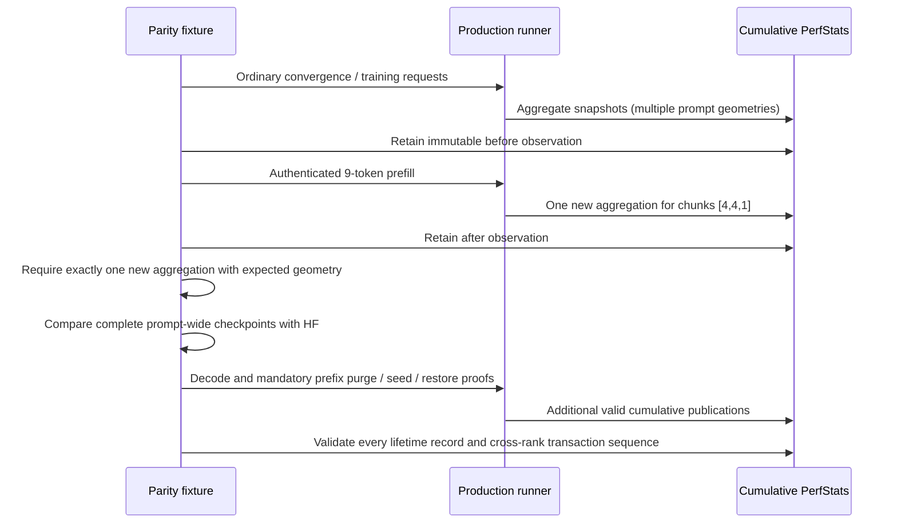

# Segmented-prefill evidence lifetime audit

2026-09-08. Container run 15 passed both ISA build gates and the complete
AVX512 Unit/preflight gates. Its first two numerical cells passed. The third,
Qwen35B Dynamic/Random with four-row captured prefill buckets, passed HF
prefill, all five decode rows, and full/partial prefix restore, but failed its
final snapshot-evidence count assertion.

## Cause and ownership

The fixture now enables diagnostic snapshots during ordinary Dynamic training
as well as mathematical parity. Mandatory partial-prefix proof also reseeds
the base prompt. PerfStats correctly coalesces all requests sharing metric
tags; its `count` is a lifetime publication total, not one parity request.
The diagnostic reproduction showed nine three-chunk publications and four
62-chunk publications. The old assertion rejected both records because it
expected exactly one lifetime publication with three chunks.

`ParityPrefillSnapshotEvidence` validates cumulative records and compares
immutable observations bracketing the one authenticated request. Missing,
duplicate, reset, or wrong-geometry publication remains a failure. The final
lifecycle check still validates every record; it no longer confuses lifetime
counts with request counts. No inference implementation, capture path,
numerical tolerance, or PerfStats reset was changed.

## Verification

- Focused failing cell: diagnostic reproduction in
  `parity-results/ci-segmented-evidence-diagnostic.log`; fixed individual run
  passed in 72.9 seconds, with eight canonical CSV artifacts validated.
- The other three registered segmented cells (Dynamic/Ordinal,
  Static/Ordinal, Static/Random) each passed individually, with eight CSV
  artifacts apiece. Their report is
  `parity-results/ci-segmented-siblings/report.json`.
- `V2_Unit_ParityPrefillSnapshotEvidence` covers coalesced training and later
  prefix seeds, unchanged/wrong/duplicate request deltas, counter reset,
  malformed tags, backend-independent records, and empty/split families.
  It is device-free and belongs to the complete Unit gate.
- After all four individual cells passed, the final local prerequisite run
  passed 644/644 Unit and 118/118 production preflight tests in 541.6 seconds.
  Evidence is in `parity-results/ci-segmented-final-gate/` and
  `parity-results/ci-segmented-final-preflight.log`.

Individual diagnosis uses the registered exact command and the canonical CSV
validator, but does not issue a production certificate. All affected cells
must pass individually before restarting an expensive whole-container run.
