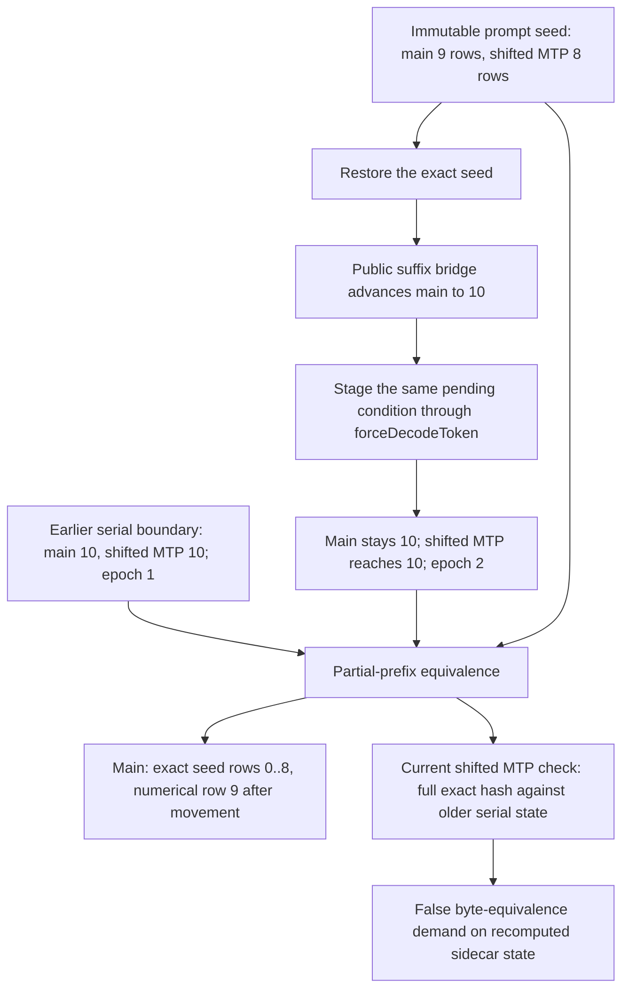
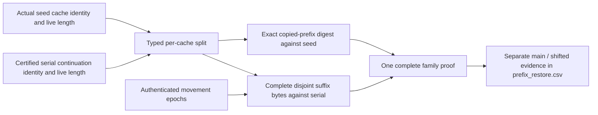

# Shifted MTP partial-prefix boundary — 2026-09-09

## Preserved first red

After the embedding-publication fix, the unseen-only queue adds six greens and
reaches **129/510**. The next cell is
`Qwen36MoE_35B_IQ3S_NodeTP_2xMPI_CPU_ExpertOverlay_Dynamic_Ordinal_ActFP32_KVFP16_MTPDepth1`.
It fails in 15.788 seconds with all nine required artifacts. Both ranks report
the same shifted-MTP KV payload mismatch during partial-prefix restore; no
timeout or teardown failure occurs. Full prerequisites for this build pass
645 Unit and 122 production-preflight registrations.

The serial/MTP emitted vector is `[271, 760]`, exactly equal, with one accepted
draft. Prefill and decode summary gates pass. Fresh seed and complete prefix
hit pass; the partial hit alone fails runtime-state equivalence. The embedding
checkpoint is fixed. Main-KV suffix, terminal hidden/logits, and the restored
LM-head checkpoint pass their existing placement-aware numerical gates.

Artifacts are in `parity-results/ci-local-unseen-pass-09`. A single focused
reproduction under a read-only GDB observer is in
`parity-results/ci-local-prefix-shifted-diagnostic`. It reuses the authenticated
unchanged-build prerequisite receipt, fails identically, and awards no green.
`gdb-evidence.jsonl` retains full-operand numerical metrics and cache geometry.
Neither observer nor reproduction changes a threshold or an inference value.

## Actual ownership and sequence

`assertProductionParityPartialPrefixRestore` correctly aligns the deferred
CPU pending condition before comparison. `compareMTPPartialPrefixRestoreSnapshots`
already separates actual seed ownership from the serial-continuation oracle.
However, its internal KV comparator hardcodes `ExactBytes` for shifted MTP,
while only main KV can use the typed placement-aware suffix contract. The
sidecar consumes a main hidden row that already differs after expert placement
changes, so it is not being evaluated on byte-identical operands.

The current diagnostic range is also main-specific: `recomputed_suffix=9:1`
and a nine-row leading digest. The real shifted seed has **eight** rows.
Therefore shifted rows 8 and 9 are both recomputed; the nine-row digest is not
the seed boundary, even though it happens to match the earlier serial state in
this run. Do not certify the sidecar by checking nine leading rows against the
serial oracle and numerically comparing only row nine.

## Measured payload evidence

The observer reads the comparator's immutable input snapshots, decodes every
retained FP16 element, and accumulates metrics independently in Python FP64.
Serial/seed/restored movement epochs are 1/1/2. The main seed has nine rows;
the shifted seed has eight; both continuation states have ten rows.

| Retained sidecar row 9 | Elements | Cosine | Relative L2 | Maximum absolute error |
|---|---:|---:|---:|---:|
| K | 512 | 0.9998537735 | 0.0171209783 | 0.1953125 |
| V | 512 | 0.9997113169 | 0.0240501487 | 0.0847167969 |

All main cached-prefix digests match their actual seed digests. The sidecar's
first nine rows match the serial continuation, but the probe does not retain
the candidate's eight-row seed digest. The numbers support a recomputation-
contract diagnosis; they do not by themselves prove the missing exact
eight-row boundary. No numerical policy change is installed for this defect.

## Simplification target for the next implementation

Use one KV-family comparison implementation with an explicit typed segment
contract. The actual immutable seed owns each cache's copied length; the
serial continuation owns that cache's uncached suffix. Do not derive shifted
length from the main count or add an MTP-specific bypass boolean.

Required regressions: main and shifted banks with unequal prefix lengths;
same-epoch exactness; shifted prefix corruption even when full serial hashes
match; missing/ambiguous/overlapping suffix evidence; all floating payload
formats and opaque exact-hash formats; CPU/CUDA/ROCm participant identities;
deferred-condition alignment; complete-hit exactness. Existing MTP token,
acceptance, HF checkpoint and graph gates remain unchanged. Obtain every
required sidecar row before admitting a numerical suffix proof, then rerun the
focused cell and resume the unseen queue. Docker remains paused.

## Implementation under verification

`PrefixProbeCapturePolicy::forKVContinuationOf` now builds one identity-bound
partition per seed cache/layer/sequence. The public probe call carries that
immutable policy through Orchestration/Global/Rank/Device runners. Parity keeps
the policy local to each observation sequence; there is no fixture-wide mutable
override and no global prompt-sized split for partial replay.

The common KV comparator applies exact actual-seed hashing independently to
both banks, then compares every retained suffix value only after the serial and
candidate snapshots prove a placement change. Complete hits and unchanged
epochs remain byte-exact. The cosine floor is unchanged; relative L2 is also
bounded by the corresponding unit-vector distance to reject scale-only errors.
`prefix_restore.csv` appends eight independent shifted-MTP evidence columns.

Regressions cover unequal main/shifted seeds, both recomputed shifted rows,
FP16/BF16/FP32 with all backend identities, all exact-hash KV formats, missing
or ambiguous payloads, stale prefixes, nonfinite values, and scale corruption.
Real CUDA/ROCm captured unequal-request-length tests now check seed-derived
probe export too; both registrations join model-free production preflight.
The CSV driver tests pass 68/68 and pipeline-policy tests pass 53/53. The full
Integration Unit/preflight/matrix build is current. Five focused registrations
pass in 2.59 seconds: MTP state transactions, physical CPU probe, Rank forwarding,
CUDA captured unequal-length continuation (1.69s), and its ROCm mirror (0.77s).

The GPU additions first exposed a stale pre-existing test setup. A catch-throw
backtrace identified `TransferEngine::requireDeviceInput` rejecting an external
producer event that had not been joined before capture. Both tests now mirror
the production executor's `prepareDeviceInput`/`requireDeviceInput` admission,
instead of assuming legacy residency setup proves a captured event edge. No
production wait or hot-path change was needed.

Full Unit passes 645/645 in 78.31s; preflight passes 124/124, 543.173s combined.
Pass 10 adds **28 exact greens**, reaching **157/510**. The original Qwen36 CPU2
Dynamic/Ordinal D1 cell passes in 13.335s (14.699s driver wall), all nine CSVs
validated. Its shifted proof checks one exact prefix and both complete suffix
payloads: 2048 elements, minimum cosine 0.999865, maximum relative L2 0.0164435.
All remaining Qwen36 CPU2 cases pass, including ordinal/random Dynamic depth
15 and dynamic depth. Ornith CPU2 Static/Ordinal and Dynamic/Ordinal through
fixed depth 15 also pass. Individual evidence is not full-matrix certification.

The queue stops at Ornith CPU2 Dynamic/Ordinal dynamic depth: layer-32 GDN
relative L2 0.052952 exceeds 0.05; cosine is 0.998605. Main and shifted KV,
token identity, acceptance, and restored LM-head comparison all pass. The
serial/seed/restored epochs are 1/2/3, unlike fixed depths' 1/1/2. A read-only
GDB repeat in `ci-local-ornith-gdn-diagnostic` passes, with raw FP32 layer
29–35 recurrence/conv banks retained for original prefill, seed, serial, and
restored states. Layer-32 recurrence already differs between original prefill
and reseed (relative L2 0.026352); continuation comparison in that observed
rank is 0.031706. No gate is relaxed and no diagnostic pass is merged into the
durable ledger. An uninstrumented repeat reproduces the red at relative L2
0.0529532. Continue in the [Ornith GDN audit](production-ci-ornith-gdn-prefix-drift.md).
