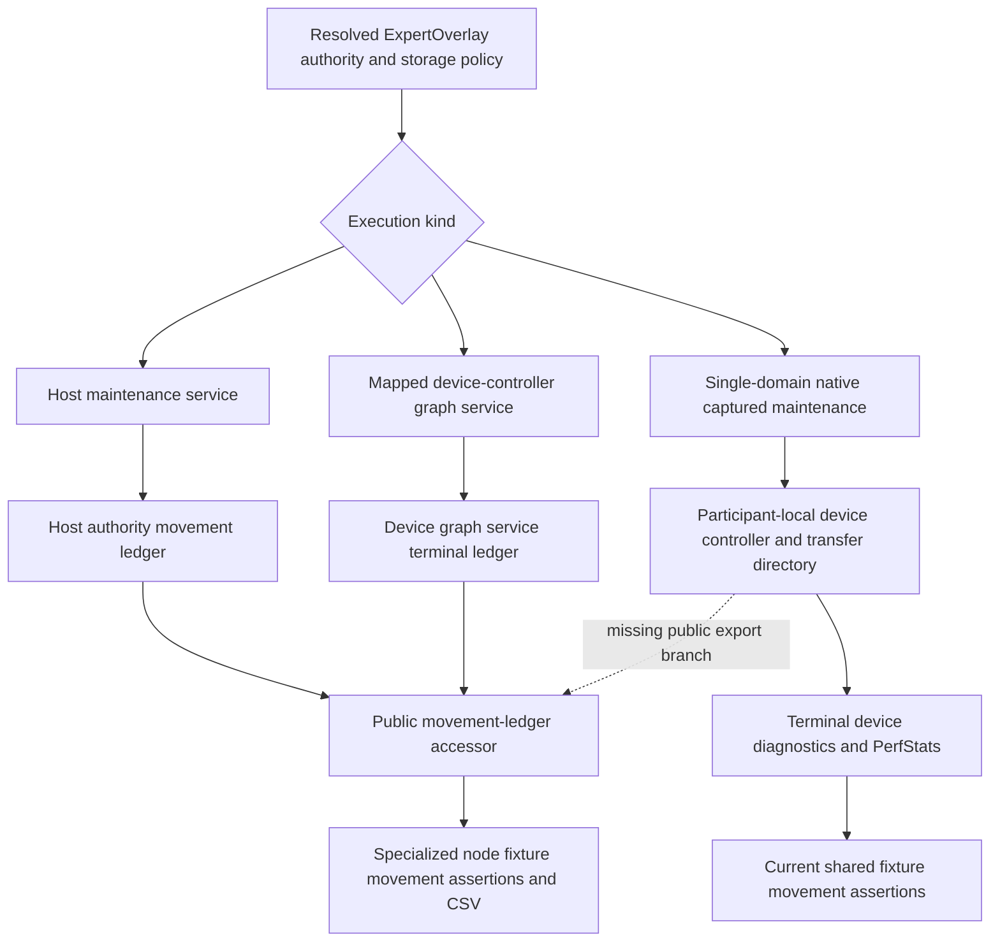

# Single-domain GPU movement evidence audit — 2026-09-10

## Scope and observed result

The unchanged `ci-local-unseen-pass-15` passes Qwen3.6 35B, two-CUDA
ExpertOverlay, Dynamic/Ordinal with MTP off, depth two and depth three. The
MTP cells retain all nine required CSVs, a certified native conditional parent
and serial-exact response tokens. These are real passes of the currently
installed tests, not a new image certificate.

Unlike the specialized Qwen3.5 node-overlay fixture, the shared fixture emits
no `expert_movement.csv`. `ParityTestBase::assertProductionParityMoEMovementEvidence`
checks accepted placement, copied payload, physical bytes and destination apply
using terminal PerfStats records. This is result-boundary observation; the test
does not use these counters to schedule production movement. Nevertheless it
does not yet implement the documented common authority-ledger proof/export.

## Actual ownership paths

`OrchestrationRunner::initializeMoEExpertOverlayResidencyMaintenance()`
deliberately does not create a host maintenance service or mapped graph service
for `usesSingleDomainNativeGpuDeviceResidentMoEOverlayAuthority()`. Its native
captured family owns maintenance and the NCCL/RCCL transfer stream. That
single-writer design must remain intact.

The public `moeOptimizationStatus()` and `moeOptimizationMovementLedger()`
methods select the host service, mapped graph service, their retained terminal
state, or the host residency authority. They have no explicit native
single-domain device-controller export branch. Consequently the host authority
is not a truthful substitute for the device's completed-movement evidence;
in Dynamic mode the status accessor can report a missing service even though
the native maintenance graph is the intended implementation.

## Follow-up boundary, not another planner

Before claiming one uniform authority-ledger proof across every overlay,
connect the native controller's existing terminal diagnostic publication to a
typed immutable movement result. Inspect the device-owned committed identity
and transfer records before deciding whether their ABI needs more fields.
Do not reconstruct completed edges from optional PerfStats, create a host
planner, or add per-token device downloads. Publish diagnostics at the existing
terminal boundary, retain them through teardown, and make the public status and
ledger dispatch explicit for this authority kind.

The shared fixture can then assert an empty complete ledger for Static or
completed physical participant-placement edges for single-tier Dynamic and
write the same CSV. Multi-tier cells retain their separate tier-residency and
participant-placement obligations. CPU, CUDA and ROCm need symmetric interface
tests, with all-format real-device publication coverage in preflight. This is
an identified evidence/API conformance gap, not evidence of numerical corruption
or a runtime dependence on PerfStats in the completed cells.

No implementation change is installed during the authenticated unseen sweep.

## Terminal export follow-up

The subsequent read-only audit narrows the missing boundary. In
`DeviceGraphOrchestrator`, `drainCompletedDeviceMoERebalanceMaintenanceDiagnostics`
already calls `exportCompletedDeviceMoERebalanceMaintenanceStats` with a typed
`DeviceMoERebalanceMaintenanceOutcome`, including when optional profiling is
disabled. It validates device/controller/copy/apply status and throws on fatal
publication errors at the existing request epilogue. The ordinary export does
not retain a complete edge history: full plan entries are copied only for
explicit trace output, from the reused one/two wave command buffers. A terminal
plan snapshot therefore cannot recover every earlier movement in a long
request. The public ledger must not be populated by treating those buffers as
an append-only log or by interpreting PerfStats counters as completed edges.

The smallest complete implementation needs these explicit boundaries:

1. Device apply/commit authors immutable completed identities, not merely
   proposals. The existing typed edge needs layer/expert, source/destination,
   publication epoch/transaction and physical payload/cycle identity.
2. An instance-owned device evidence journal retains those publications until
   the existing terminal export. Capacity belongs to the normal physical BOM;
   overflow must mark evidence incomplete, never silently overwrite history or
   block inference. No per-token download, new host planner, or extra kernel
   launch is justified solely to observe the records.
3. The existing terminal event/readback boundary authenticates and retains a
   typed immutable result. Participant aggregation composes those results; it
   does not infer missing destinations or ownership from routing counters.
4. The public status/ledger dispatch handles the native single-domain authority
   explicitly, then the shared parity fixture and HTTP terminal summary consume
   that same result. Static remains a complete empty ledger.

This remains a design boundary, not installed functionality. CUDA and ROCm
need model-free publication, request-reset, overflow and PerfStats-off
regressions in preflight before any generation certificate can rely on it.

The source follow-up identifies two apply boundaries on each GPU backend:
`apply_rebalance_arrivals_kernel` and the embedded
`try_apply_ready_rebalance_wave_for_layer_thread0`, in the CUDA/ROCm MoE kernel
files. Both publish the completed runtime bank and then advance/clear the
reused wave command header. A common publication helper must preserve the
immutable command epoch before that clear and author destination-local
completed edges only after bank publication. Recording only the standalone
kernel would miss embedded captured maintenance. The host reference helper
`applyDeviceMoERebalanceArrivalsHost` is not the production GPU implementation.
Distinguish actual payload arrivals, resident-only assignments and transient
current-batch placement explicitly; do not equate all plan entries with durable
physical moves. This is a read-only implementation map, not an installed journal.
