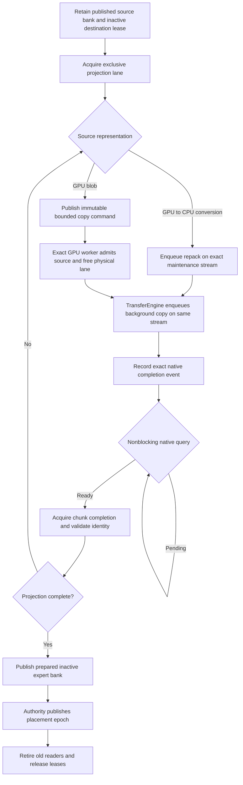
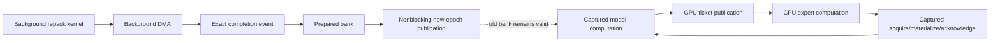
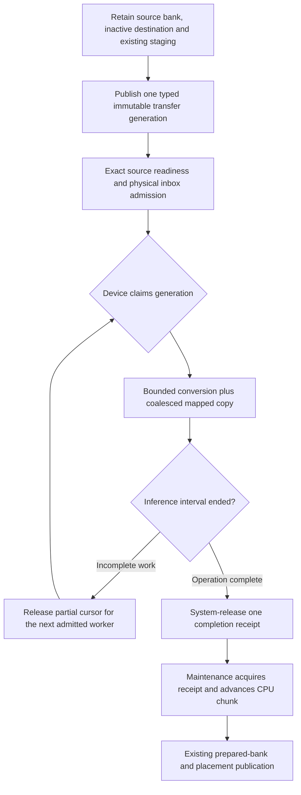
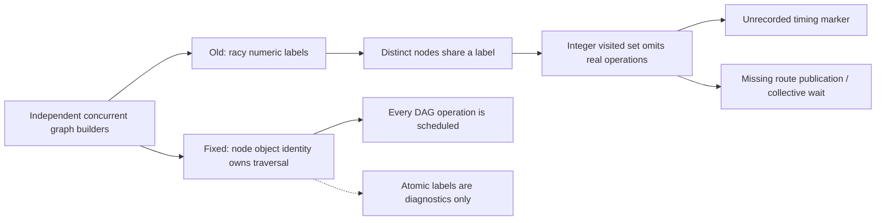

# Published-image remote-transfer progress audit — 2026-09-21

## Current slice

The native-runtime graph-identity repair and CUDA transfer-progress repair are
now in the published images from `6f823000c`. Both complete image prerequisite
gates pass: **661 Unit + 278 preflight on AVX512**, and **661 Unit + 266 preflight
on AVX2**. The previously red AVX2 CUDA2/CPU2 HTTP cell also passes against the
unchanged new image, including every long-context check and clean retirement.
The full 26-cell published-image E2E run `35674792791` now has **26/26 green
cells** and a complete same-image pair receipt. Benchmarks and README
publication remain pending. This is HTTP E2E evidence, not a full production
image certificate. The investigation below preserves which observations
preceded each proof.

## Initial observation, before root-cause isolation

Published-image E2E run `35610343423`, source `0136594f0`, reproduces a
request-time stall in AVX512 cell 5: Qwen3.5 122B, four ROCm GPUs and two CPU
NUMA participants across two MPI ranks, Dynamic/Ordinal residency, FP32
activations, FP16 KV and dynamic-depth MTP. The first non-thinking arithmetic
request passes. The second, thinking request stalls before long-context checks.

At 15:36:53 UTC, native completion queries report pending expert copies on
ROCm:1–3. Several permanent relay slots have submitted generation 7 while
their last acquired completion remains generation 6. The remote GPU-to-CPU
gate/up/down conversion lanes on ROCm:2 and ROCm:3 each report ten submitted
chunks and nine completions. These are native not-ready observations, not
delayed host polling or a PerfStats-based readiness decision.

At 15:37:14, the CPU follower reaches the ordinary 30-second protocol deadline
waiting for layer 26, dispatch timeline 14 with 13 observed. The ROCm:0 ticket
service also times out awaiting that layer's captured publication. MPI aborts;
subsequent HTTP connection/JSON failures and missing follower PerfStats are
consequences, not additional independently diagnosed defects. The kernel log
has no preceding GPU fault or reset; queue eviction messages occur after abort.

The same-source local cell and the prior concurrent-submission regression had
passed. They were insufficient proof: the latter exercised raw blobs, not a
native device producer followed by the copy while inference is held. There is
not yet evidence distinguishing native queue starvation, a dependency cycle,
or a separate inference-protocol fault which also strands maintenance.

## Published-image logical lifecycle, before the current repair

On CUDA, raw epoch-bound copies instead execute through the existing captured
bounded service and publish exact generation receipts. Conversion-shaped
native lanes retain their kernel/copy/event chain. On ROCm both the raw relay
and conversion copy use the native no-compute DMA boundary. Logical lanes may
share a setup-owned physical stream, but have exclusive staging and events.

## Independence that must be proved

There is no intended dependency from a published-bank copy or repack to a
future inference ticket, nor from the current inference to completion of an
unpublished migration. Native streams, queues and event-marker placement must
preserve that independence; merely serializing host API submission cannot
prove it. Conversely, simultaneous stalls do not prove maintenance caused the
inference stall.

## Focused investigation

Add a model-free CUDA/ROCm proof using a native byte-kernel producer before a
remote copy on each exact maintenance stream. Hold the captured inference
graph and its future observers with a CPU-owned release signal. Require every
native producer/copy and unrelated relay to complete before releasing that
signal, and compare the complete bytes. This isolates queue progress from
repack arithmetic and reuses the existing `MappedTransferProgressEpoch`
preflight registration. It is not a substitute for real all-codebook
conversion tests or the original HTTP cell.

The aggregate continues through both ISAs to obtain the full failure map.
No timeout, movement policy, graph-capture mode or image certificate is changed
to hide the red. After an actual root cause is reproduced, verify the focused
repair repeatedly, refresh the amortized Unit/preflight gate, then retry the
failed HTTP cell before publishing another image pair.

### First focused results

The added diagnostic reproduces a progress failure without a model on both
backends. CUDA finishes zero of 32 native-produced remote copies before the
held inference is released; ROCm finishes 24 of 32, with the remaining eight
also blocking the unrelated relays sharing their physical streams. All copies
drain and match the expected bytes after release. Complete test times are
2.276 seconds (CUDA) and 1.657 seconds (ROCm), including setup and teardown.
The ROCm diagnostic uses otherwise-idle physical card 1 while the aggregate
uses card 0; the CUDA diagnostic likewise uses an idle accelerator.

This establishes delayed native producer/copy progress while the diagnostic
holds inference indefinitely. Native APIs do not promise that every independent
kernel will execute concurrently, so this artificial condition alone is not a
valid inference-deadlock regression. Keep the experiment as diagnostic evidence;
the production invariant must also be tested while inference actually advances.

### Native controls and conclusions

ROCm kernel/API traces show one of four native queue groups waiting until the
held graph is released: 24/32 producers complete first, with zero scratch spills
in either the wait or byte-producer kernel. Pure HIP reproduces the same outcome
at low, normal and high stream priority. Native `hipStreamWaitValue64`, an
any-order launch and independently captured producer graphs do not remove it.
Eight independent DMA probes all complete, including their payloads, while the
affected producer chains remain pending. Therefore the stronger hypothesis that
one pending producer blocks every unrelated DMA is disproved by this control.

CUDA Nsight tracing likewise finds delayed native producer/copy kernels, with
three of 32 streams starting only after the held graph's D2H completes in the
producer-only control. A wait-only control completes 32/32; future native
observers can extend the delay to every producer. Priority or transport rewrites
are not justified merely by those observations.

`Test__CapturedCollectiveMaintenanceProgress.cpp` adds the missing finite
interaction: 32 captured layers, real NCCL/RCCL, CPU acknowledgements, native
maintenance, optional future output readers, and a three-way participant-local
compute-stream fork. Native completion receipts govern staging reuse. Copies
are resubmitted only after their exact previous event completes; inference
never depends on a maintenance result. Terminal readback verifies all sums and
copied bytes. The CTest entry is explicitly registered in production preflight.

The initial four-ROCm collective, future-reader and concurrent-stage cases all
complete in 2.4–2.8 seconds. The strengthened continuous-maintenance control on
two otherwise-idle ROCm devices observes 644/651 completed chunks during the
32-layer inference, and passes in 1.5 seconds. The CUDA concurrent-stage case
advances all 32 inference rendezvous but observes **zero** completed chunks on
either device until inference ends; final bytes then pass. This is evidence for
a maintenance-progress/economy defect, not a reproduced inference deadlock.

### Complete aggregate result

The aggregate completed at 17:36:56 UTC: **22/26 cells pass**, with AVX512
12/13 and AVX2 10/13. The workflow is red and did not admit benchmarks.
The complete failure map contains these independent outcomes:

- Both CPU-only cells time out at the unchanged 900-second whole-cell watchdog.
  All completed accuracy checks pass, including 2,048 generated tokens; both
  are interrupted during the final near-boundary context probe. No numerical
  gate has failed. The user subsequently approved a 20-minute allowance for
  these two AVX2 CPU-only cells; all other cell budgets remain unchanged.
- The 122B two-CUDA plus CPU cell completes all accuracy and full long-context
  checks and exits cleanly, but fails log hygiene on 195 genuine native repack
  completion warnings exceeding five seconds. The warnings occur with inference
  still making progress, so they must not be equated with the ROCm deadlock or
  silently suppressed to certify this image.
- Both two-ROCm plus CPU and four-ROCm plus CPU pass on AVX2, including the
  request that stalled on AVX512. The ROCm failure remains intermittent; a
  second ISA's pass does not establish a repair. All other AVX2 cells pass.

### CUDA conversion and copying share the existing service

The working-tree repair extends the existing CUDA graph-owned transfer worker,
instead of admitting another native producer stream. A typed immutable work
description names bytes, GPU-to-CPU conversion, or CPU-to-GPU conversion. The
same device claim, partial-byte cursor and system-visible generation receipt
cover the entire operation. The CPU wire representation is unchanged; the
worker calls the same unit conversion functions as the native kernel entrypoints.
All 21 source formats retain their independent CPU oracles. Floating FP16,
BF16 and FP32 experts continue through the existing byte-copy description.

Finite passes and captured workers use the same claims. No extra device
staging, native conversion event, independent placement authority or inference
wait is added. The enlarged node-local command envelope is admitted using its
actual type size through the existing physical-memory ledger. CUDA conversion
is integrated into both local CPU-tier lanes and remote projection lanes;
fixing only remote MPI lanes would leave the same scheduling gap locally.

The initial implementation passes both captured all-format regressions twenty
consecutive times. Each direction must finish before releasing a held inference
graph with 32 queued future readers, and compares complete CPU/GPU bytes. The
existing twelve CUDA progress tests also pass, including all three floating
formats. The new focused registration is explicitly part of production preflight.
Malformed work-kind/codebook/complement rejection is covered separately in the
existing mapped-transfer preflight registration.

These are focused functional results, not a model or image certificate. A
Release benchmark extension distinguishes native kernel/DMA, finite service
and captured service measurements, with separate timing semantics and the same
byte oracles. Resource/throughput checks, refreshed complete Unit/preflight, and
the original CUDA/CPU HTTP cell still precede publication. The original
four-ROCm HTTP stall still requires its own first-blocked-edge evidence; this
CUDA-specific repair is not claimed to solve it.

### CUDA transfer economy and final focused validation

The initial 64-thread service was correct but uneconomical: Q8_0 promotion
measured 0.428 GB/s. A single 256-thread CTA now operates four independent
64-column units. Vectorized CPU-interleaved word gathers and GPU payload stores
retain the original unit arithmetic. IQ4 compensation uses warp-uniform
constant-word loads; Q6_K uses its actual eight-byte payload alignment rather
than assuming sixteen-byte block strides. Neither change adds a staging buffer.

The final Release sweep checks all 21 source formats, both `512 x 2048` gate/up
and `2048 x 512` down projections, and both directions: **84/84 rows are byte
correct and exceed the existing 1 GB/s service floor**. Q8_0 gate/up measures
3.341 GB/s GPU-to-CPU and 2.105 GB/s CPU-to-GPU; the slowest IQ4_NL download
measures 1.153 GB/s. These are unprofiled medians of three ten-iteration samples
after three warmups, with a captured service interval active. Independently
queued finite passes share the same claims, exactly as they do in production;
the timings must not be described as exclusive captured-worker attribution.

An isolated final Q8_0 upload Nsight Compute application-replay profile reports
96 registers/thread, zero local-memory spilling requests, one 256-thread CTA,
33.33% theoretical and 16.67% achieved occupancy on its active SM. The deliberately
bounded service does not fill all 82 SMs. Its profiled duration is 552.86 us,
down from 1.19 ms before vectorization, but only the unprofiled sweep above is
timing evidence. Compiler resources remain stack/local zero, 348 shared bytes.
Artifacts are `/tmp/llaminar-packed-service-allformats-final.csv` and
`/tmp/llaminar-packed-service-upload-final.ncu-rep` in this workspace.

The final implementation passes both local/remote all-format progress tests
for another twenty repetitions, all twenty CUDA expert-weight integration
tests, and malformed-kind/codebook/complement rejection. The held-graph tests
retain 32 future native readers, so they independently prove progress when a
native producer is starved. Complete Unit/preflight and the failed HTTP cell
were the next gates, not presumed passes from these focused results.

### Amortized gate and targeted HTTP retry

The final CUDA implementation passes the complete local prerequisites:
**661 Unit and 275 production-preflight tests, zero failures**, in 641.827
seconds. Evidence is in `parity-results/published-packed-service-prerequisites-20260921`
and `/tmp/llaminar-packed-service-final-prerequisites.log`. This is not an image
certificate and does not resolve the separate ROCm stall.

The approved CPU deadlines are now explicit ISA-independent typed metadata.
The one AVX2 inventory companion serves both runtime images, so compile-time
selection would incorrectly give an AVX512 runtime the AVX2 allowance. Each
profile instead exports both ISA budgets, and the runner selects the tested
image's immutable ISA label (or the local Release build's configured ISA).
Only Qwen3.6 and Ornith two-socket CPU definitions declare AVX2=1200 seconds;
their AVX512 budgets and GPU profiles retain 900 seconds. Plan and HTTP phases
still share one immutable deadline. Protocol and request watchdogs are unchanged.

Focused verification passes 67 C++ metadata tests, 23 HTTP-driver tests,
29 published-image workflow tests and 206 production-pipeline tests. The new
`V2_Integration_HTTPCellDeadline` preflight entry also passes. These harness-only
changes were verified after the complete runtime gate; they do not imply a
second complete gate run.

The targeted local **AVX512 Release CUDA2/CPU2** retry passes **43/43 HTTP
checks**, all eight full long-context checks, 2,048-token structured generation,
canonical graph/movement evidence, clean shutdown and complete GPU VRAM release.
Its log has zero transfer warnings. The cell takes 606.598 seconds; the four
model shards are persistent tmpfs cache hits with zero bytes restaged. Evidence
is `parity-results/published-packed-service-http-20260921/e2e.json`.
Do not describe this as an AVX2 image repair certificate: the originally red
AVX2 image must still be rebuilt and tested with this implementation.

The two CPU-only AVX2 cells are being retried against the exact existing image
`sha256:411c024c5239ec8a94c32834c17ca66d0d11e4c936578ab3b4c794038df64f14`,
using the canonical newly exported ISA budgets. These cells do not use the
CUDA runtime repair. Their targeted report is
`parity-results/avx2-cpu-deadline-http-20260921/e2e.json`. The direct host Docker
socket is required; the existing attach validator correctly rejects the
devcontainer's half-close-breaking socket proxy before launching model work.

The first retry, **Qwen3.6 IQ3_S CPU2 on AVX2**, passes all 43 HTTP checks in
**1037.390 seconds**, inside its approved 1200-second whole-cell budget. All
eight long-context checks pass, including 2048 generated tokens (135 ordered
lines, no resets or duplicates), 7595/8192-token boundary admission, oversized
context rejection, clean logs and shutdown. GPU usage is unchanged. This
confirms that the earlier 900-second result truncated a correct but slower CPU
workload; neither the model runtime nor its accuracy thresholds changed for
this retry. Ornith CPU2 is the next independent cell in the same report.

**Ornith Q4_K_M CPU2 on AVX2** also passes all 43 HTTP checks, in
**962.974 seconds**. Its eight long-context checks include 2048 tokens with
169 ordered lines, no resets or duplicates, and the complete context-boundary
checks. Shutdown and logs are clean, GPU memory is unchanged, and the harness
authenticates 699376 PerfStats records. The two-cell report finishes with
`correctness_passed: true` after 2000.385 seconds. These are exact existing-image
retries, not a new aggregate certificate.

For the separate ROCm failure, the preserved log still establishes only a
missing layer-26 captured publication, not its cause. The transfer generations
reported as pending were submitted about four seconds after the final CPU
follower wait began. That ordering is insufficient to blame maintenance:
earlier outstanding work could still participate in a cycle. Source inspection
rules out a stale reused remote-source readiness dependency (acquisition resets
it and production source banks are already published), and ticket metadata is
armed before the retained parent launches rather than reset late per layer.
The next real-device reproduction must retain this distinction and the
unchanged 30-second protocol deadline.

The existing `V2_Integration_ROCm_TPCapturedEpochTransactionGraphCapture`
regression previously instantiated only uninstrumented parents, while HTTP
certification enables per-step timing. Its four retained families now alternate
between ordinary parents and `PerStepEvents`, importing the same 49 immutable
fragments. Node conservation includes the two explicit event nodes per timed
step, completed timing samples are validated, and each selected family executes
twice to exercise event reuse after another family. This is an added diagnostic
coverage axis within the existing preflight registration, not a claimed fix for
the unresolved model stall.

The strengthened registration passes **20 complete executions** (one focused
run plus nineteen CTest repeats); the latter take 81.85 seconds. Each execution
replays the ordinary and instrumented families twice with four real ROCm GPUs,
the production-shaped collective/ticket sequence, and the existing VRAM-pressure
envelope. This closes the instrumentation/reuse coverage gap but does not
reproduce the original stall. The exact published AVX512 ROCm4/CPU2 HTTP cell is
now retried separately. A read-only diagnostics mount contains ROCgdb for a
possible stuck-wave snapshot; no debugger or profiler is attached during
ordinary execution, and no inference settings or runtime image bytes change.

### Exact-image repetition with a pre-abort diagnostic trigger

The first isolated retry fails after **135.733 seconds**, again at request
generation 4 / main-decode logical step 19. This time the missing ticket is at
layer 27 rather than layer 26; its CPU dispatch timeline remains 13 when 14 is
required. ROCm:0's ticket worker independently reaches the same protocol
deadline. The earliest pending-copy warning is at 19:31:38 UTC and the protocol
abort at 19:31:59. No debugger was attached to this reproduction. Evidence is
`parity-results/rocm4-cpu2-published-retry-20260921/e2e.json`.

The next repetitions delegate to the same canonical driver, manifest and exact
published image, with one new artifact directory per attempt. A passive log
watcher triggers bounded ROCgdb snapshots of both MPI ranks on the first
five-second native pending warning. This preserves the normal 30-second
protocol deadline while collecting queues, live dispatches and host stacks
before abort. An attached attempt is diagnostic-only even if it subsequently
finishes. The loop stops on the first failure or diagnostic trigger rather than
restarting inside a failed cell; no prerequisite gate is rerun per repetition.

Attempts 2 and 3 pass the full 43-check HTTP suite and all eight long-context
checks in **435.441** and **436.279 seconds**, respectively, with no debugger
attachment. Attempt 4 fails after **132.424 seconds** on the first non-thinking
request: generation 2, depth-15 `mtp_grouped_verifier`, transaction 16, logical
step 17, layer 44, timeline 22 observed versus 23 required. No pending-transfer
warning precedes that failure. Therefore the missing-publication fault is not
specific to the earlier main-decode step or a reliable consequence of the
observed pending-copy warnings.

The local diagnostic watcher now also triggers when the shell harness's short
HTTP curl request remains outstanding for twelve seconds. Healthy short
requests finish well before that threshold; the Python-driven long-context
requests are explicitly excluded. This changes only debugger collection, not
the image, request payload, inference policy, or canonical timeout. Attempt 5
uses this expanded trigger. All attempt artifacts remain under the same ignored
root, with distinct subdirectories.

Attempt 5 reproduces the first-request grouped-verifier stall at layer 25 in
**131.340 seconds**. The short-request trigger fires at 12.175 seconds and
preserves both MPI host stacks before the unchanged protocol abort. Rank 1 has
returned from parent submission and is waiting for its ticket worker;
`awaitCapturedPublication` is that worker's active frame. Its other TP workers
are idle. CPU copy-lane workers and both ranks' residency-maintenance workers
are waiting on condition variables, not performing long copies or expert
computation. This narrows the fault to device/protocol progress; it does not yet
identify which GPU operation blocks publication.

Concurrent ROCgdb attachment itself exposes a tooling limitation: the CPU
rank also discovers the GPU agents and claims their device-wide debug access,
so the GPU-rank debugger reports `agent is busy` and cannot collect waves. Both
debuggers detach cleanly. The next attempt collects the GPU-owning source rank
first, detaches it, and only then snapshots the CPU rank. This ordering change
is confined to the diagnostic watcher, not inference or maintenance.

Attempts 6 and 7 pass the complete HTTP and long-context suites in **444.849**
and **439.933 seconds**. Attempt 8 obtains a GPU snapshot with sequential
attachment. Three devices have live RCCL ring kernels and one has no queued
compute, but the host threads were not stopped atomically: the fourth worker
is still before its next submission. Subsequent output is corrupted after
attachment, and the diagnostic run is stopped through `/admin/shutdown`.
Neither that output nor the non-atomic queue snapshot establishes the original
root cause. In particular, a twelve-second HTTP duration is only an attachment
heuristic, not proof that the current ticket has stalled.

The next local loop uses a diagnostic-only passive HSA queue sampler rather
than GPU debug traps. It records unchanged native queue frontiers and their
pending kernel/barrier packets without adding events, altering packets, or
stopping execution. The mature HTTP harness omits only the later long-context
checks for this diagnostic loop; the exact published image, canonical server
arguments, 8K allocation and normal protocol deadline are retained. These
shortened runs cannot certify a cell or image. Four untouched complete retries
have passed, two untouched retries have failed, and the two debugger-attached
attempts remain separately classified. No ROCm production repair is claimed.

### Passive queue evidence (20:53 UTC)

Short diagnostic attempts 9 and 10 reproduce missing publication in **132.838**
and **130.877 seconds**, respectively. Attempt 9 stops at main-decode layer 19;
attempt 10 stops during the first grouped verifier near layer 15/16. Three
participants have stationary RCCL queue frontiers while the continuation
participant's observed read/write indices are equal. This is not by itself
proof that every previously dispatched kernel completed. Attempt 10 also takes
a host-only GNU gdb snapshot after the passive stall: parent submission has
returned, the continuation worker awaits its ticket service, and the other TP
workers and maintenance workers are idle. No GPU debug traps are enabled.

Attempt 11 passes the short HTTP suite in **167.253 seconds**. Attempt 12 fails
in **131.165 seconds**, but with a distinct initiating diagnostic: participant 2
reports `hipEventElapsedTime failed: invalid resource handle` before its next
MTP-draft submission. The later missing-ticket/collective timeout is secondary
in that attempt. The first passive snapshot follows that timing failure, so
the diagnostic event queries did not initiate it. Do not classify this as the
same silent missing-publication failure without further evidence.

Attempt 13 passes the short HTTP suite in **165.558 seconds**. The next trace
retains the packets immediately before each read index and the latest large
parent's existing event markers, not only the most recent small draft graph.
It also records exact timing handles if the native elapsed-time call fails.
These diagnostic hooks do not inject GPU events, modify graph submissions,
change the model allocation, or relax any deadline. Passing shortened runs
remain explicitly non-certifying; full long-context checks are still required
after a root-cause repair.

### Native HIP graph identity defect isolated (21:24 UTC)

Attempt 14 reproduces a missing grouped-verifier publication at layer 47;
attempt 15 instead fails on an unrecorded timing event in the first MTP draft.
The passive probe observes no failed graph launch or launch-inside-capture.
Attempts 16–20 pass the shortened HTTP workload, but their native graph DOTs
expose duplicate numeric node IDs **inside individual graphs**, including
distinct expert-compute and route-acknowledgement operations. Some affected
variants are not selected by those requests, explaining why a duplicate does
not imply that every request must fail. These diagnostic passes are not full
cell certificates.

The pinned ROCm 7.2.4 CLR source allocates `GraphNode::id_` with an unsynchronized
process-global `nextID++` before taking the node-registry lock. Independent
participant builders can lose counter updates. Its hierarchical execution-path
walker then uses that diagnostic integer as the visited-set key. An ID
collision causes real operations and dependent paths to be omitted while native
graph launch still reports success. Missing route publication or a never-run
event marker follows naturally. `hipEventQuery` also reports success for an
event that has never been recorded, so successful queries alone did not prove
the earlier timing markers ran.

The new model-free `V2_Integration_HIPConcurrentGraphIdentity` creates disjoint
graphs concurrently and checks every independently written result word and
every recorded timing marker across construction generations and repeated
replay. It does not contain RCCL, MPI, a model, or shared graph mutation:

- Stock runtime: fails in **3.676 seconds**, with missing result words.
- Repaired runtime: **20/20 repeated passes**, approximately 3–4 seconds each.
- Canonical installer output, through registered CTest: passes in **3.49
  seconds**; explicitly registered in `ProductionParityPreflight`.

The repair makes scheduling use node object identity, not diagnostic labels,
and gives graph/node labels relaxed atomic counters. It leaves parallel graph
construction, packet capture, replay, kernel arithmetic and all timeouts
unchanged. `scripts/docker/install-hip-graph-runtime.sh` pins CLR
`fe5035afc8713dfc6adedd3c00c4306c93a160f8` and HIP
`bc9af25177f96c0fea93198b89cf4c3cf08f3ea3`, applies the tracked source patch,
and builds the standard-SONAME runtime. A full isolated install and idempotent
second invocation pass. Both shipping ISAs export that exact builder DSO;
runtime containers do not build or download sources. The installer rejects a
different SDK version rather than combining incompatible dependencies.

The complete original HTTP/long-context cell is now rerunning with the
published image and **only** the repaired DSO mounted ahead of its runtime
search path. `/proc` mappings confirm both MPI ranks load that exact DSO.
No debugger, queue probe or additional logging is active. This validates the
candidate repair without disguising it as an untouched published-image pass.
Artifacts are under `patched-full-01`, including a runtime-override receipt.
Full model stability, refreshed Unit/preflight, and rebuilt image certificates
remain separate obligations; the narrow 20-pass regression does not certify
the existing published image.

The first complete repaired-runtime cell passes **43/43 HTTP checks and all
8/8 long-context checks in 440.944 seconds**, with all 2,048 generation tokens
and clean shutdown. This is comparable to healthy stock-runtime retries, not
a throughput benchmark. An independent full repeat is in progress. All
**661 Unit tests pass** in 81.72 seconds, including the expanded 208-test
pipeline module. Unit execution overlapped only the second attempt's startup;
do not use that repeat's wall time as performance evidence. The full
production-preflight suite will run after the model releases its devices.

The independent repeat also passes all **43 HTTP and eight long-context
checks**, including 2,048 generated tokens and clean process/VRAM retirement.
The canonical installer now repairs the workspace's default HIP runtime too;
its second invocation is idempotent and the native regression resolves that
default library without an `LD_LIBRARY_PATH` override. The independent repeat
finishes in **448.379 seconds**. The final checkpoint's normal pre-commit gate
passes **661/661 Unit tests in 77.52 seconds** and **277/277 production-preflight
tests in 870.31 seconds**. No test was skipped to produce this checkpoint.
The complete hook log is retained beside the native red/green evidence under
`hip-graph-identity-proof/llaminar-published-image-fixes-commit.log`.

The graph audit separates diagnostic labels from scheduling ownership:

The old branch is historical explanation, not a selectable runtime path.
Fresh AVX512/AVX2 image builds and published-image aggregate E2E/benchmark
results remain outstanding; the mounted-library diagnostic is not their
certificate.

### Minimal image-builder dependency closure

Develop image run `35659664517` fails before Llaminar compilation: the pinned
HIP source's `ROCclrHSA.cmake` unconditionally requires OpenGL, including for
the HIP-only headless build. The full development SDK supplied those headers
transitively; the minimal `MODE=build` installer did not. This is a packaging
failure, not a new inference failure or evidence against the graph repair.

Both source-building installer modes now explicitly install `libglvnd-dev`
(the GL/GLX/X11 header closure), alongside `rocm-llvm-dev`. Runtime-only mode
does not install development packages. The repaired DSO's `NEEDED` entries
contain no GL/X11 libraries. The new executable installer-boundary regression
fails on both old builder modes and passes after the fix; runtime-only mode
remains minimal. It is registered as `V2_Integration_HIPRuntimePackaging` in
production preflight, together with the existing shared-DSO/SDK-pin checks.
All **209 pipeline tests pass**, and the registered focused packaging gate
passes. In the canonical Dockerfile's isolated toolchain build, the repaired
HIP library configures, compiles, links and installs successfully; its complete
ROCm install/source-build layer takes **189.5 seconds**. The remaining shared
toolchain layers continue populating the same host BuildKit cache. Full
Unit/preflight gates will also run inside both freshly built ISA images; the
packaging-only follow-up does not alter the already-gated engine or HIP patch.

### Fresh published-image proof — 2026-09-22

[Develop image run 35661953683](https://github.com/Llaminar/llaminar/actions/runs/35661953683)
completes successfully and publishes both runtime tags from source
`6f823000cd0654cf70b1187cae2128aff551ce95`. The image-bound prerequisite receipts
cover the complete installed inventories, not a selected subset:

| Runtime ISA | Unit | ProductionParityPreflight | Gate wall time |
|---|---:|---:|---:|
| AVX512 | 661/661 | 278/278 | 653.464 s |
| AVX2 | 661/661 | 266/266 | 596.606 s |

The inventory difference consists of explicit ISA/comparison registrations:
six AVX512 CPU cases and six additional AVX2-override controls in the AVX512
build. The native AVX2 inventory is complete. The HIP graph-identity regression
passes inside both new images (3.27 s and 3.22 s respectively), and the new
packaging regression passes in both. Runtime image identities are:

- AVX512: `sha256:4c0d80a85a600ac35ca2181a2b43d4399e9d5a70b3a475b5017a677d3ac2ad5b`.
- AVX2: `sha256:347d62f71498820d8fcd8d1488074531a994fd3354a3384d803240beac3fa31d`.

The focused AVX2 Qwen3.5 122B CUDA2/CPU2 Dynamic/Ordinal, FP32-activation,
FP16-KV, dynamic-depth MTP cell passes in **727.060 seconds**. It uses the new
published runtime without library overrides, probes, reduced checks or changed
deadlines. All four GGUF shards are tmpfs cache hits, with zero bytes copied.
All **43 HTTP checks and eight long-context checks** pass, including 2,048
structured completion tokens, exact needle recall, strict-JSON multi-needle
recall, cache reset, 7,595/8,192-token boundary admission, and oversized-request
rejection. Canonical production-path and movement evidence passes. There are
zero server warnings/errors; the server exits cleanly and GPU usage returns
from its model allocation to the same 2 MiB baseline. This is a targeted cell
proof, not the full image-pair E2E or benchmark certificate.

Local evidence is retained in
`parity-results/published-image-gates-20260922/` and
`parity-results/published-avx2-cuda2cpu2-20260922/e2e.json`.
[Full E2E run 35674792791](https://github.com/Llaminar/llaminar/actions/runs/35674792791)
then pins these exact published images and prepares the source-matched inventory
companion. Both complete ISA suites must pass before the separate benchmark
workflow can publish real results and the README chart.

The first five AVX512 cells in that aggregate pass: both CPU-only MoE models,
the 122B CUDA2/CPU2 topology, and the 122B ROCm2/CPU2 and ROCm4/CPU2 topologies.
In particular, the previously stalling **ROCm4/CPU2** cell now passes all
43 HTTP and eight long-context checks on the unchanged published image, without
the mounted HIP-library diagnostic override. Its 2,048-token generation produces
169 ordered lines with no resets or duplicates; the near-boundary request uses
7,595 of 8,192 context tokens. Shutdown exits zero, GPU usage returns to the
same 40 MiB baseline, and the full server log contains no warnings or errors.
The run's evidence is under
`avx512/e2e-1790042417841587099/5/`. This establishes the repaired runtime inside
the published artifact, while the remaining aggregate cells and benchmark
publication are still pending.

The AVX512 lane subsequently completes **13/13 cells**, zero failures, in
**4,748.575 seconds**. Its image-bound report has `correctness_passed: true`
and is retained locally as
`parity-results/published-image-e2e-20260922/avx512-e2e.json`. The original
ROCm4/CPU2 stall cell takes 448.249 seconds, and the six-GPU CUDA2/ROCm4 cell
takes 357.452 seconds. The final Qwen3.8 ROCm dense cell passes at 32K context
in 827.285 seconds, including a 30,205/32,768-token near-boundary request.
The outer receipt authenticates the complete AVX512 report and begins the
AVX2 lane without rebuilding or rerunning Unit/preflight. The AVX2 lane and
benchmark/README publication remain outstanding.

The same aggregate also passes the original **ROCm4/CPU2 cell on AVX2**,
using the unchanged published `347d62f71498...` image. It completes all 43
HTTP checks and all eight long-context checks, including 2,048 generated
tokens, 169 ordered lines, zero resets/duplicates, and the 7,595/8,192-token
boundary. Shutdown exits zero, the complete server log is clean, and VRAM
returns from 40 MiB to the same 40 MiB baseline. Evidence lives under
`avx2/e2e-1790047169989288119/5/`. Both image variants now prove the original
stall repair end to end; at this point 18/26 aggregate cells are green, with
the remaining AVX2 cells and benchmark publication still pending.

### Full published-image HTTP E2E pair is green (22 September, 04:51 UTC)

Run `35674792791` completes **13/13 AVX512 + 13/13 AVX2 cells**, with no failed
cells on either ISA. Both reports have `correctness_passed: true`; the outer
receipt has `complete: true`, binds the original image pair and canonical
manifest, and authenticates both complete report digests. The AVX2 lane takes
**5,475.137 seconds**, compared with **4,748.575 seconds** for AVX512.

The previously failing AVX2 CUDA2/CPU2 cell takes 702.335 seconds and
ROCm4/CPU2 takes 494.180 seconds. The all-GPU CUDA2/ROCm4 case takes 350.142
seconds. The final ROCm dense 32K-context case takes 823.169 seconds and proves
30,205/32,768-token admission, oversized-request rejection, 2,048 generated
tokens, a clean server log and zero post-shutdown VRAM delta. The two approved
AVX2 CPU-only deadlines are respected: Qwen35B takes 970.985 seconds and
Ornith35B takes 943.489 seconds, both below 1,200 seconds.

The complete per-ISA reports, manifest, image identities and completed pair
receipt are retained under
`parity-results/published-image-e2e-20260922/`. At this checkpoint Actions is
uploading the full E2E artifact; the separate benchmark workflow must consume
that successful run and the same exact published images before publishing
JSON, SVG and README results. No benchmark or full-image certificate is
claimed from these HTTP passes.

Actions subsequently marks E2E run `35674792791` **successful** and retains
artifact `published-e2e-35674792791` (249,021,517 bytes). The independent manual
benchmark workflow is dispatched as run `35688756377`, explicitly selecting
that E2E run on `develop` at `6f823000c`. Its timing and branch publication
results are pending; the runner must reject any changed image pair.

That first benchmark dispatch fails before inference: the stock
`ghcr.io/actions/actions-runner` container does not install GitHub CLI, but
remote E2E artifact admission invokes `gh`. This is a control-plane dependency
failure, not a new model failure or invalidation of the 26 green HTTP cells.
The workflow now explicitly installs and verifies `gh`; the driver diagnoses
a missing CLI before acquiring the device lease, pulling images or touching
the model cache. Explicit local bundles remain usable without GitHub CLI.

The focused tests first reproduce the missing setup and late failure, then
verify the real workflow shell using inert package commands, including package
and version-check failures. They are part of the already registered
`V2_Integration_PublishedImageSuites` production preflight. The actual setup
block also succeeds inside the idle ARC pod on Ubuntu 24.04, installing the
distribution GitHub CLI. The complete 209-test pipeline script passes. This
harness-only repair will retry benchmarks against the unchanged E2E-proven
images, without rebuilding images or rerunning E2E.
