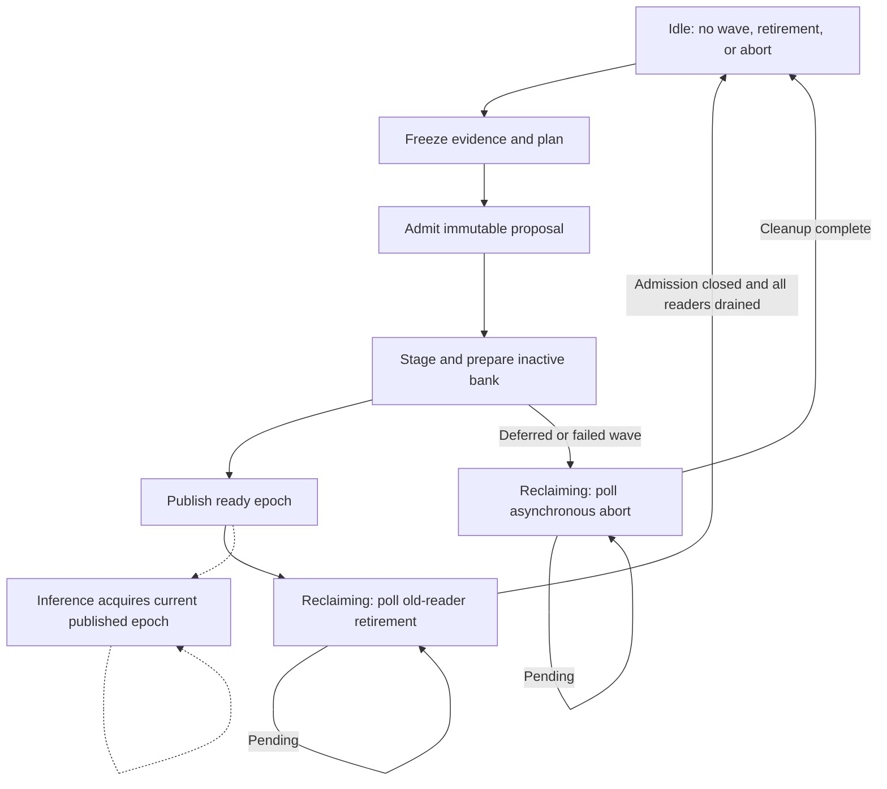
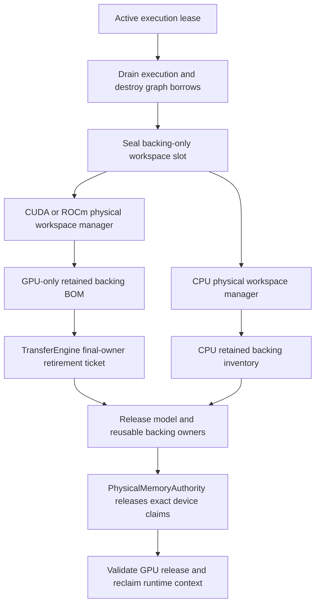
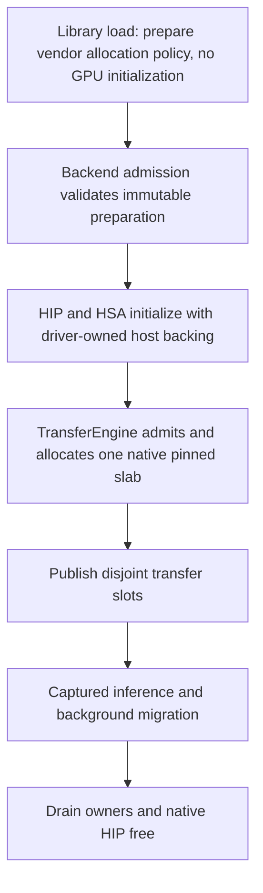

# Published-image HTTP retirement progress — 2026-09-20

## Reproduction and ownership

The first published-image HTTP cell is the Qwen 3.6 35B IQ3_S model,
two CPU MPI ranks, Dynamic/Ordinal ExpertOverlay, FP32 activations, FP16 KV,
and dynamic-depth MTP with capacity 15. The earlier sidecar workspace defect
used KV capacity (8192) instead of the operation's actual row count. Its
focused regression reproduces the old failure and passes with exact row-bound
workspace publication. That slice passed 659 Unit and 258 preflight tests.

With the workspace correction, the Release HTTP cell passes ordinary requests,
both thinking modes, streaming, prefix restore, and the first 5232-token
needle. Two runs then stop during the second needle with the identical
residency-consensus timeout: phase 5, expected epoch 25, candidate epoch 26.
The missing final PerfStats file is a consequence of MPI abort, not the cause.

Live stacks show the coordinator's maintenance worker evaluating the next
observed-transaction placement objective while the other rank polls the previous
epoch's retirement vote. `advanceBackground()` reported `Idle` whenever the
active publication wave was absent, even with pending retirement/abort work.
The same worker could therefore spend tens of seconds planning while a live
MPI collective needed its progress. No inference arithmetic change or larger
collective timeout is justified by this evidence.

## Simplified lifecycle contract

`Published` completes publication, not resource reclamation. The authority now
returns typed `Reclaiming` until existing polls have completed every retirement
and abort. Only `Idle` admits new proposal construction. The maintenance worker
does not add a thread, barrier, collective, stream wait, or inference admission
fence. Current-epoch tickets remain available while old readers finish.
Prepared-context restoration consumes the same `Idle` contract rather than
reconstructing quiescence with several separate authority queries.

## Verification

The focused device-free regression fails against the old implementation: both
local and distributed-coordinator paths freeze a second window and construct a
second proposal before retirement finishes. It exercises continued retirement
polls and current-epoch ticket admission while holding an old reader, then
requires the queued wave to publish after that reader returns.

The corrected worker regression passes 20 consecutive runs. The companion
real-MPI test also passes 20 consecutive runs (20.66 seconds total), using
production proposal and retirement lanes with either rank as coordinator.
The complete authority, maintenance-service, and participant-residency Unit
families pass as well. Both focused regressions are explicitly registered in
`ProductionParityPreflight`. The full refreshed gate passes **659 Unit + 260
preflight registrations** (919 total) in **628.974 seconds**, including both GPU
lanes and the exclusive cross-backend checks. Its receipt is retained under
`parity-results/published-retirement-prerequisites-20260920`.
The unchanged Release HTTP cell then passes **43/43 checks in 709.606 seconds**:
all three 5230–5232-token needle placements, multi-needle JSON recall, a
2048-token structured report (169 ordered lines, no resets or duplicate lines),
cache reset, 7595/8192-token boundary admission, and oversized-context rejection.
The server exits cleanly, leaves GPU use unchanged, and produces its complete
rank-qualified PerfStats evidence. Rank zero records **750 expert migrations,
78 committed waves, and 78 completed old-epoch retirements**. The report is retained at
`parity-results/retirement-cpu-targeted-20260920/e2e.json`.

The other twelve canonical E2E cells will use the same fixed Release build
before paying for new image builds. The older published-image manifest was
correctly rejected because it names another source revision. All local matrix
targets were refreshed for current-source export and the refreshed 919-test
prerequisite gate passed again before the next admission attempt.

That attempt stopped before launching any server: six persistent-cache misses
required 172.3 GB of copy traffic, but admission incorrectly treated every
replacement as concurrently allocated. The actual sequential replacement peak
is 49.8 GB, which fits the available 118.1 GB with the existing 9.4 GB reserve.
The fix follows that peak, including retained growth and actual allocated-block
reclamation, and rechecks filesystem availability before each copy. It never
deletes an old file to manufacture capacity or weakens identity validation.
Eight focused tests cover successful replacement, growth, shrinking, new files,
sparse files, hardlinks, unexpected capacity loss and interrupted publication;
the old implementation fails three and the corrected implementation passes all.
The complete Python campaign framework passes 86 tests. The focused family is
also registered explicitly as `V2_Integration_ModelStagingCapacity`.
The refreshed full gate passes **659 Unit + 261 preflight registrations**
(920 total) in **632.760 seconds**. Its receipt under
`parity-results/published-staging-prerequisites-20260920` is reused across the
unchanged remaining Release cells, without repeating prerequisites per cell.
The seven-file real corpus then staged successfully in the existing tmpfs
(six replacements and one metadata-only hit). The next cell, Ornith 1.5 35B
Q4_K_M on two CPU MPI ranks with Dynamic/Ordinal placement and dynamic-depth
MTP, passes **43/43 checks in 671.909 seconds**. Its full long-context proof
includes 2048 generated tokens with 178 ordered lines and no resets/duplicates,
all needle placements, prefix reuse and context-boundary handling, followed by
clean shutdown and complete movement/path evidence (708220 PerfStats records).
The remaining-cell report is retained at
`parity-results/published-e2e-remaining-release-stagingfix-20260920/e2e.json`.

## Physical workspace identity at final retirement

The next cell, Qwen 3.5 122B on two CUDA devices and two CPU MPI ranks,
passes all eight long-context checks, including 2048-token structured output,
but fails the final error-log check: its retirement BOM exceeds CUDA:0's
canonical live allocations by **678216704 bytes**. The server exits normally
and both GPUs return to their baseline usage. This is an incorrect retention
inventory, not evidence of an inference error or a physical leak.

A short diagnostic with the same server configuration reproduces the exact
delta. Allocation evidence identifies **836239360 bytes of CPU scratch** inside
a CUDA:0-keyed execution slot. That slot also owns **2470715652 bytes of actual
CUDA scratch**. The old registry reports their sum, **3306955012 bytes**, as
CUDA:0 workspace because it selects the execution key and then sums every
physical manager. Other genuine CUDA allocations outside this minimum retained
inventory mask part of the overcharge, explaining the smaller observed delta.
Prepared weights are independently reconciled and are not the source of it.

The fix removes the ambiguous allocator-wide byte query. Every query must name
the actual physical device, and the registry projects that device's backing
across all reusable slots. Structural keys continue to control reuse lifetimes,
not memory domains. This also corrects future model-reuse admission; it adds no
live ledger, allocation, synchronization, or inference-path work. The same code
handles CPU, CUDA and ROCm.

The device-free regression reproduces the old mistake with small CPU allocations
under CUDA- and ROCm-keyed owners, including reacquisition and release. It fails
against the old implementation in under a millisecond. Real CUDA/CPU and
ROCm/CPU integration regressions additionally exercise exact canonical claims,
retirement-ticket creation, release and runtime reclamation. All three focused
regressions are explicitly registered in `ProductionParityPreflight`. The fixed
unit regression passes 20 consecutive repetitions. All three focused preflight
registrations pass on this host in 1.27 seconds, including real CUDA/HIP context
retirement. Both Release and the complete Integration gate/matrix targets build
successfully. The refreshed full gate passes **659 Unit + 264 preflight
registrations** (923 total) in **627.122 seconds**, with its receipt retained at
`parity-results/published-physical-retention-prerequisites-20260920`. The exact
122B CUDA2/CPU2 Release HTTP cell then passes **43/43 checks in 585.133 seconds**:
all eight long-context checks, 2048-token structured generation, clean final
retirement and clean server logs. GPU usage returns from its pre-launch
**2 MiB** baseline to **2 MiB** (zero residual delta). It emits 945746 PerfStats
records. The report is retained at
`parity-results/physical-retention-cuda-cpu-e2e-20260920/e2e.json`.

Local progress is now **3/13 complete cells green**. The same unchanged build
and 923-test receipt continue through the ten unseen cells, beginning with
122B ROCm2/CPU2. No finished CPU cell or prerequisite gate is repeated for this
continuation. These local results still precede the required published-image
pair verification.

This is local diagnostic progress, not a
passing published-image pair or benchmark certificate; those workflows still
need to run on newly published image IDs containing the fixes.

## ROCm native pinned-host backing at startup

The next unseen cell, 122B ROCm2/CPU2, exceeds its unchanged 180-second
readiness allowance in three runs. Native stacks and a kernel-inclusive
`perf` sample locate the stall before inference: **97.62%** of the 436 samples
are in Linux huge-page direct compaction beneath `hipHostMalloc`, while
materializing ExpertOverlay's mapped transfer-lane slab. The other MPI rank
is waiting for initialization consensus. This is not graph traversal latency.

ROCr 7.2.4's native host allocator normally implements pageable host backing
using USERPTR memory, applies `MADV_HUGEPAGE`, and faults it through HMM while
pinning. Native HIP ownership alone does not exclude this path. Its existing
`HSA_USERPTR_FOR_PAGED_MEM=0` policy selects KFD/GTT-owned pages instead.
The relevant upstream implementation is
[`libhsakmt/src/fmm.c`](https://github.com/ROCm/ROCR-Runtime/blob/rocm-7.2.4/libhsakmt/src/fmm.c).
No host THP configuration, model format, inference geometry or timeout changes
are needed.

The exact Release cell, with only this vendor-policy override and INFO logging,
passes **43/43 checks in 530.623 seconds**, including all eight long-context
checks and clean final retirement. The structured request produces 2048 tokens
with 155 ordered lines, no resets and no duplicate lines. This is controlled
diagnostic evidence, not yet a default-policy certification. Its report is at
`parity-results/rocm2-cpu2-kfd-backed-diagnostic-20260920/e2e.json`.

A same-binary ABBA microbenchmark on ROCm:0, pinned to socket-one physical
cores, compares the existing public DMA, background-progress, CPU-staging and
captured route-ticket paths. Both policies pass every byte check. For 4 MiB,
download remains approximately **12.96–12.98 GB/s** and upload **13.38–13.43
GB/s**; no meaningful throughput penalty is observed. This performance test
remains outside preflight. The focused functional regression instead checks
that the real host slab maps the DRM device rather than anonymous USERPTR
memory, then verifies an exact-stream odd-tail upload/download. It fails on
the old production default in 66 ms, without needing a model or deliberately
fragmenting RAM, and is explicitly registered in `ProductionParityPreflight`.

The production implementation prepares this single vendor contract during
library initialization without enumerating or initializing a GPU. It uses the
central `BackendStartupConfig` parser, not a direct environment read or eager
construction of every debug/profiling setting. Runtime admission raises precise
errors for incompatible backing or an already-initialized runtime that cannot
be repaired late. CPU-only commands remain usable. No second allocator,
transport, physical-memory ledger or per-request policy is introduced.

Both Release and the complete Integration/matrix target set build successfully.
Four focused registrations (central parsing, pure startup policy, its preflight
entry and real host backing) pass **20 repetitions each**. The real-device test
covers both mapped slabs and ordinary pinned staging, including odd tails.
An isolated Release run without an override retains **12.95–12.98 GB/s**
download and **13.41–13.42 GB/s** upload at 4 MiB. The first broad Unit run
caught the initially misplaced vendor environment read; it was moved into the
central parser without weakening the source-policy gate. The final full gate
passes **660 Unit + 266 preflight registrations**, **926 total**, in **617.916
seconds**. Its canonical receipt is retained at
`parity-results/published-rocm-central-startup-prerequisites-20260920`.
The exact ROCm2/CPU2 HTTP cell without a policy override or diagnostic logging
then completes in **592.677 seconds**, passing every inference, movement,
memory and shutdown check. All eight long-context checks pass, including 2048
tokens with 155 ordered lines and no resets/duplicates. GPU memory returns from
40 MiB to 40 MiB. The report remains **42/43, failed**, not a certificate:
successful native graph setup emitted three timing-only warnings at
1012, 1602 and 1715 ms, and the strict final log scanner correctly rejected them.
Its evidence is at
`parity-results/rocm2-cpu2-production-backing-20260920/e2e.json`.

The source audit finds a ROCm-only hard-coded one-second severity threshold;
CUDA already logs successful instantiation at DEBUG. This threshold is neither
the model's readiness budget nor a failed native operation. HIP now retains the
same node count, elapsed time and memory observations at DEBUG regardless of
duration. Native errors and accounting errors are unchanged, as are the strict
HTTP warning/error scanner and the readiness timeout. This is a diagnostic
classification correction, not a claim of faster native graph setup.
A focused source-policy regression fails against the old HIP implementation,
passes for both corrected backends, and preserves the strict log-scanner test.
It is explicitly registered as `V2_Integration_GraphInstantiationDiagnostics`.
All 129 HTTP graph/evidence-policy tests pass. Rebuild, the refreshed complete
gate and exact-cell verification precede the nine unseen cells. The three
earlier complete cells are retained rather than repeated.
