# ROCm retained packet publication investigation — 2026-10-01

## Failure and current evidence

### Consumer-only prompt transport and the active SDK — 2026-10-02

Expert-only ranks no longer receive prompt-token vectors they do not consume.
`ContinuationRequestGroup` owns immutable continuation membership for both
prompt payload and prefix/KV consensus. Outer commands and their small header
still reach every execution rank; payload reaches only actual consumers. One
consumer needs no prompt collective, and a proper multi-rank consumer subset
retains its own setup-time communicator with explicit root remapping. No rank
role is inferred from discovery order or mutable request flags.

The focused MPI regression observes real `PMPI_Bcast` extents for sole-consumer,
whole-world, proper-subgroup and nonzero-root configurations. Twenty
large-to-small cycles verify exact live token counts and the next command's
integrity. The same test exercises unbarriered sparse command-ring progress.
Both two- and three-rank entries are explicit `ProductionTestPreflight`
members; three ranks here prove a proper subgroup, not a deployment requirement.

The development container's active `/opt/rocm` alias now selects the retained
Core 10 SDK through `/opt/rocm-sdk`. Its matched HIP, RCCL and complete
rocBLAS/Tensile closure resolve from the same qualified installation. Retired
SDK directories and the replaced files remain recoverable; the host kernel,
driver and disabled-P2P policy are unchanged. Fresh container builds use the
shared pinned installer, not this local staging path.

This cleanup exposed a real loader defect: `ldconfig` preferred the package's
stock `libamdhip64.so.7.15.26333-0000000` over the separately named repaired
DSO, silently retargeting the SONAME. An old installation receipt could still
authenticate the unused repaired file. The installer now atomically makes
the package-stamped name and both public aliases identify the same repaired
artifact, and authenticates all three aliases before accepting reuse. No
kernel, scheduling workaround or inference synchronization was added.

Removing the new alias checks makes the focused installer regression fail;
restoring them passes. Twelve focused native/packaging entries pass after
correcting the actually loaded DSO, and twenty real `ldconfig` refreshes retain
the same authenticated artifact. The full current dependency closure then
passes **686/686 Unit** and **600/600 production-preflight** entries:
host 260, CUDA 116, ROCm 138 and exclusive cross-device 86. Unit takes
78.178 seconds; preflight takes 1,830.712 seconds; the complete transaction
takes **1,909.903 seconds**. Its canonical receipt and JUnit/log evidence are
under `continuation-payload-rocm-alias-qualified-gates/` in the ignored result
root. This gate does not by itself certify a server lifetime or establish the
cause of the earlier intermittent request-407 stall. The preserved six-GPU
prefix-pressure sequence must still be replayed with the current Release.

The refreshed Release replay is `continuation-payload-sdk10-prefix-pressure-02`.
All four staged GGUF shards are reused with zero copied bytes. Actual process
maps bind HIP to the repaired artifact, rocBLAS to its paired source build and
RCCL to the qualified Core 10 build. The first 57 requests pass, including
three cold, ten full and three partial prefix probes with authenticated GDN
and shifted-MTP restoration. Request **58**, cycle 3,
`captured_sse_thinking`, then stalls before emitting content; the follower
aborts its PREFILL ticket at the standard 30-second deadline. Its clean driver
bookend has zero new records. Memory/shutdown/missing-rank failures after
`MPI_ABORT` are consequences, not additional primary failures.

The callback preserves both ranks' maps/status, but only discovery-rank-0's
backtrace completes. It proves that process is an idle expert follower waiting
inside the transaction channel, not the HTTP continuation authority.
Discovery-rank-1's 126-thread attachment exceeds the six-second debugger
budget and leaves an empty stack. The blocked producer's cause remains unknown.
The collector must be repaired before this trace can support an inference fix.
A model-free control with 126 idle workers per rank and the actual Release DSO
preloaded validates explicit individual `sharedlibrary` commands: it reaches
`PMPI_Bcast` and the known application caller in 0.688 seconds. An unescaped
alternation matched no modules and produced bogus frames; that control is
rejected. The revised bounded collector also saves wait channels before ptrace
and reports incomplete rank snapshots as failures rather than returning success.
Only diagnostic collection changes; native/inference code and timeouts do not.

### Current HTTP prefill lifecycle and the missing producer

The replacement replay, `continuation-payload-sdk10-prefix-pressure-03`,
passes **897 requests / 44 complete cycles** before request **898**, cycle 45,
stalls at the same `captured_sse_thinking` boundary. Its production binary,
selected model, retained graphs and request sequence are unchanged; only the
dormant failure collector is replaced. The HTTP response contains its initial
role chunk but no generated content. The follower fails its standard
30-second PREFILL ticket deadline. The complete driver bookend passes; its
one new record is an unrelated firmware-updater AppArmor notice, not a GPU
warning. No finite passing request count is a fix certificate while the
blocked producer remains unidentified.

This replay's pre-ptrace snapshot finds **two continuation threads in
uninterruptible `rq_qos_wait` disk I/O**. One such worker can prevent an all-stop
debugger attaching to the whole process: the follower stack completes, but
the continuation's bounded attachment is empty again. This does not prove
which archive operation, if any, blocks inference. The next collector saves
CPU syscalls, kernel stacks and file-descriptor paths before any attachment,
and skips all-stop attachment when an uninterruptible worker is present.

A separate device-free control calls the real Release archive API. It obtains
a verified hydration ticket, holds a separately opened native archive lock,
then queues an unrelated background append. Passive CPU-method probes identify
that writer and the restore on the **same archive object**. The writer waits
in `flock`; the restore waits in `futex` at that exact object's source-bound
mutex address. Releasing the owned lock lets both complete, with **byte-exact
restored payloads**. Evidence is `prefix-lock-verified.Pk2wqf/` under the ignored
result root. This proves an archive-lock hazard, not yet the model timeout's
causal chain.

`continuation-payload-sdk10-prefix-pressure-05` replays the same model sequence
with the validated passive CPU boundary observer. It observes public prefill,
prefix lookup, archive append/compaction, verification/hydration and required
RAM-capacity completion. Namespace identities and exact CPU object pointers
are retained; no model/device payload is read. The ordinary runtime and
timeouts remain unchanged. A preceding `-04` tooling attempt was rejected
before server launch because the diagnostic output directory already existed;
it is not a model lifetime or a passing/failing inference result.

That replay finishes red after **497 requests / 24 complete cycles**, at
request **498**, cycle 25, again `captured_sse_thinking`. This time the passive
observer captures the actual producer dependency continuously: public prefill
and prefix lookup are active while `completePendingCapacity` waits. Native
namespace identities map that HTTP thread to local TID 4133428; its saved
syscall is a completion-receipt futex wait. The append worker, TID 4133128,
waits in `fsync` on descriptor **189**, the live model archive. The compaction
worker, TID 4133127, simultaneously waits in `fsync` on descriptor **186**, its
unpublished replacement, inside `rq_qos_wait` / `wbt_wait` / ext4 writeback.
Both paths share the same backing NVMe filesystem. The surviving unpublished
output is **34,355,710,931 bytes** (about 32 GiB). The background append remains
blocked after the follower's ordinary 30-second receive deadline. HTTP closes
after 68.498 seconds; the complete driver bookend passes with **zero new records**.

The close/inode observer is validated by an independent tiny actual archive
replacement (`prefix-close-control.miQjX0/`), but descriptor retirement is **not
active during this failing request**. The earlier transient close frame is
therefore not used as this failure's cause. Both model and observers are
retired before any runtime edit. The useful CPU evidence is under
`-05/hammer/host-stall.bIi93k/`, its current-boundary log is
`-05.prefix-boundaries.log`, and its independent close probe is
`-05.archive-close.log`.

The source audit exposes a distinct unbounded resource: the copy scratch is
4 MiB, but copied destination pages can accumulate across the **whole archive**
before the final fsync. The maintenance thread then competes with the small
durable write required to reclaim RAM for a live restore. A bounded C++ buffer
does not bound this dirty-page frontier.

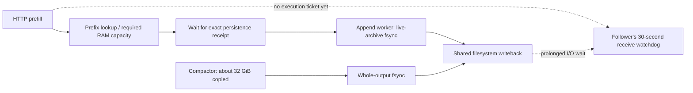

The candidate repair gives maintenance one typed range-writeback frontier.
After writing each actual copy extent, it submits that range and joins the
preceding range before copying again. At most **two 4-MiB windows** overlap,
with no extra payload allocation or worker. Tail catch-up and partial ranges
use their exact destination offsets, not file size or scratch capacity.
Submission/join failure is terminal. Draining is only traffic pacing: the
original file fsync, committed-frontier check, atomic rename and directory
fsync remain mandatory. Protocol timeouts, weights, activation precision,
GPU graphs, stream semantics and physical-memory accounting are unchanged.

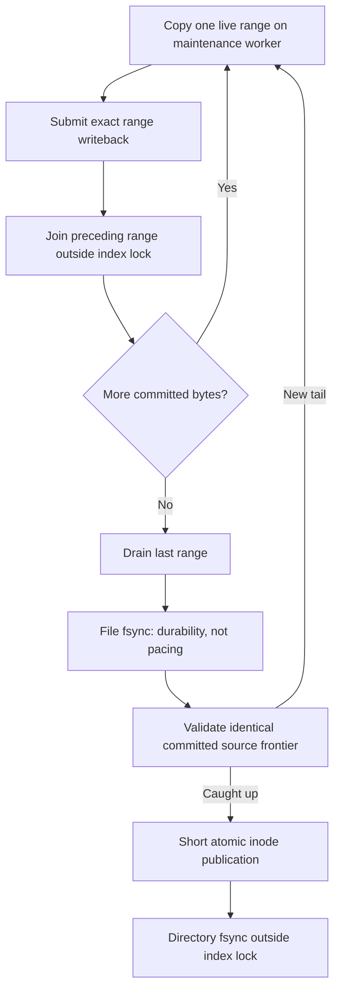

`PrefixArchiveWritebackWindow` has device-free coverage for overlap, exact
live extents, metadata gaps, repeated drains, offset limits and native failure
transitions. Its `V2_Integration_PrefixArchiveWritebackWindow` entry belongs
explicitly to `ProductionTestPreflight`; actual filesystem/rename/durability
coverage remains in `PrefixArchiveBackgroundPublication`. This is a candidate
repair until focused tests and the preserved real-model replay prove it.

The focused candidate gate now passes **5/5 entries** in 2.28 seconds after
adding native-call evidence. The backend exposes immutable counts only after
successful range syscalls and actual replacement publication; those counts
never participate in admission or pacing. Bypassing the range calls is a
negative control: byte-exact restoration still succeeds, but the automatic
compaction regression fails with zero native submissions/bytes. Restoring
the calls then passes all five entries for **20 fresh-process repetitions
each (100 invocations)** in 25.46 seconds. The checks retain file/directory
durability, concurrent tails and background-worker ownership. Evidence is
`prefix-writeback-native-evidence.*`, `prefix-writeback-negative-control.*`
and `prefix-writeback-repeat20.*` in the ignored result root. Both Integration
and Release are rebuilt with the restored implementation. This is focused
mechanism evidence, not yet a fixed real-model stall or a performance certificate;
the refreshed aggregate gate and preserved six-GPU replay remain required.

### October 2: reject the range-pacing candidate and simplify native completion

The restored range candidate subsequently passes the full **687/687 Unit**
and **601/601 ProductionTestPreflight** gate in 1,945.316 seconds. That is a
real aggregate pass, but not proof that the native operation paces the physical
backing file. The preserved `-06` lifetime passes 17 complete pressure cycles
(340 requests, followed by additional completed requests) before an explicit
diagnostic interruption. It is not a fixed-stall certificate. Its closed driver
interval has zero new records, and both ranks/observers retire before editing.

Passive native observation exposes the candidate's blind spot: **11,012
submissions and joins, 36,056,315,388 logical bytes**, but at most 23.727 us
per submission and 18.055 us per join, followed by a **6.784-second** destination
fsync. The actual cache is on non-volatile container OverlayFS over ext4. Its
live archive descriptor has more than 54 GB of file data but **zero pages in
the logical mapping** (`s_magic=0x794c7630`). A separate tiny real-backend
compaction on the same filesystem proves that its range syscall also observes
an empty logical mapping. Linux's range syscall writes `file->f_mapping`;
OverlayFS forwards ordinary writes to its backing file instead. Successful
range calls therefore failed to bound the relevant dirty pages.

Evidence: `-06.range-mapping-v3.log` through `-v5.log`,
`prefix-writeback-overlay-mapping-control-02.log`, and
`-06/driver-diagnostics-interrupted.json` in the ignored result root.
The running host is `6.14.0-37-generic`; the relevant native contracts are in
[Linux 6.14 sync.c](https://github.com/torvalds/linux/blob/v6.14/fs/sync.c) and
[OverlayFS file.c](https://github.com/torvalds/linux/blob/v6.14/fs/overlayfs/file.c).
The earlier tests correctly detected omitted calls, but not successful calls
on a mapping that owned no dirty data. They must not be cited as a physical
pacing certificate.

The replacement removes `PrefixArchiveWritebackWindow` and its submit/join
state machine entirely. `PrefixArchiveMaintenanceWriter` verifies the actual
kernel `O_DSYNC` flags and writes at most one existing 4-MiB scratch chunk at
a time on the sole maintenance worker. Each native write completes the data
before another chunk is produced. There is no second thread, pending-range
queue, extra allocation, host inference sync or filesystem-specific alternate
path. Small touch records use that same data-synchronous output descriptor.
The final fsync, same-source/frontier check, atomic rename and directory fsync
remain intact. Native failure permanently forbids output publication.

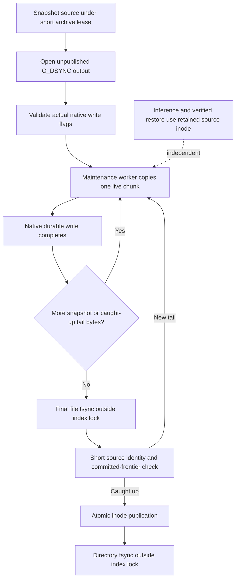

The six initial native writer tests pass in 24 ms. They require actual writable
data-synchronous flags, exact partial payload bytes, the maximum chunk,
terminal geometry/native failures and the `O_SYNC` superset. The backend
regression now verifies native descriptor flags as well as durable write
extents. Its dedicated `V2_Integration_PrefixArchiveMaintenanceWriter` entry
remains in `ProductionTestPreflight`. Backend rebuilds, negative controls,
repeated focused gates, refreshed aggregates and real-model validation are
still pending for this replacement; no performance or E2E claim is made yet.

The replacement's five focused entries now pass **20 fresh runs each (100
invocations)** in 63.43 seconds. The actual-backend negative control removes
`O_DSYNC` from the unpublished destination, and automatic compaction fails
immediately with `prefix maintenance requires a writable O_DSYNC destination`.
The flag is restored and both binaries are rebuilt before the repeated gate.
Evidence is `prefix-maintenance-dsync-negative.*` and
`prefix-maintenance-dsync-repeat20.*`; no negative-control code remains.

Isolated, unprofiled I/O timing on the actual OverlayFS path copies 256 MiB
with the same 4-MiB geometry, alternating mode order for three repetitions.
Bounded data-synchronous throughput is **543.5–562.0 MiB/s**, versus
849.6–958.9 MiB/s for a diagnostic buffered/final-flush baseline. The cost is
confined to background maintenance; these are not model throughput numbers.
The final-flush debt drops from **95.2–163.5 ms** to **0.50–0.59 ms**, with
the largest durable chunk taking 8.2–8.7 ms. The output is privately owned,
never touches a model or live archive, and is retired after each sample.

A separate passive native run proves the backing-file contract rather than
assuming the advertised mode works: ext4 receives **192 writes, 805,306,368
bytes, `ki_flags=0x2`**, and executes **192 native data-sync calls**. All native
write extents are at most 4 MiB. The baseline has no data-sync flag; its
observer also sees its small stdout log write. The profiled run is not used
for timing. Artifacts are `prefix-maintenance-dsync-io-timing.log`,
`prefix-maintenance-native-backing.log` and its separate profiled diagnostic.

The canonical combined gate finishes green under
`prefix-maintenance-dsync-qualified-gates/`: **687/687 Unit**, **601/601
ProductionTestPreflight**, and 1,952.782 seconds overall. Its preflight lanes
are host **261/261** (352.64 seconds), CUDA **116/116** (637.89 seconds),
ROCm **138/138** (1,220.50 seconds) and exclusive mixed/rank work **86/86**
(261.29 seconds). The current receipt is `prerequisites.json` in that directory.

The preserved Release six-GPU pressure replay is now running as `-07`, with
50 cycles / 1,000 requests as a bounded diagnostic horizon. Its same passive
CPU-boundary observer additionally records actual compaction write extents
and native completion times; it reads no payload and suspends no rank. The
runtime/harness/callback source stays frozen until retirement. All four GGUF
shards are cache hits in the existing persistent tmpfs, with zero copied bytes.
This is a diagnostic, not an inference benchmark or fresh-lifetime certificate;
the ordinary native/HTTP/readiness watchdogs are unchanged.

At twelve completed cycles, `-07` has passed **240 requests**, including
**48 full and 12 partial** prefix-restore proofs. The passive observer records
**20,716 compaction writes / 38,584,598,467 bytes**, with an actual maximum
write extent of **4,194,304 bytes**. The compaction worker's final fsync peaks
at **8.17 ms**, versus the superseded range candidate's 6.784 seconds. This
proves the real model exercised maintenance, not a compaction-free pass.
It does not establish interference-free storage: one durable chunk took
1.487 seconds and the separate append worker's fsync peaked at 3.288 seconds.
The unchanged lifetime remains in progress; the requested fresh-start HTTP
stability proof and full current-source aggregate remain outstanding.

The completed `-07` diagnostic passes **1,000/1,000 requests / 50 cycles**,
including **50 cold, 200 full and 50 partial** prefix proofs, in 2,622.59
seconds of request work (2,785.95 seconds including startup and retirement).
It crosses all previously observed request-failure positions, including 898,
without a failure or stall attachment. The harness passes its **9/9 diagnostic
lifecycle checks**: both MPI ranks exit cleanly, GPU memory returns from 42 MiB
to 42 MiB, and the closed driver interval has **zero new records**. These nine
checks are not the full 45-check HTTP certification suite.

Final passive evidence records **44,421 completed compaction writes /
89,706,981,312 bytes**, a **4-MiB maximum extent**, **2.302 seconds** for the
slowest durable chunk, and **10.526 ms** for the compactor's slowest final
fsync. The append worker's fsync peaks at **4.613 seconds**. Thus the actual
backing workload no longer accumulates the earlier unbounded final-flush debt,
but storage contention is still measured rather than declared absent. Both
observers are identity-checked and retired only after the server exits.

The completed PerfStats export independently records **two actual background
publications**: 73,123,311,216 → 38,584,598,467 bytes and
85,601,308,271 → 51,122,382,845 bytes, both owned by `archive_worker`. Their
published output sizes sum exactly to the passive observer's 89,706,981,312
completed write bytes. The same export records 8,230 background persistence
blocks / 76,305,555,456 bytes. These are completed work counters, not admission
authority or a claim that all requests restored from the disk tier.

The unchanged-source fresh-start gate ran under
`prefix-maintenance-dsync-full-http-20.{log,json}`, with independent lifetime
artifacts in `e2e-1790975433722818601/`. It retains full long-context, 2,048-token
accuracy generation, prefix/tool/movement, driver and retirement checks, and
stops on the first failed lifetime for diagnosis. The green **687/687 Unit +
601/601 preflight** receipt is amortized across this run; no gate is paid per
request or lifetime. The warm diagnostic is not substituted for twenty fresh
full HTTP lifetimes, a new full matrix, performance or Docker certificates.

All **20/20 fresh full lifetimes pass 900/900 HTTP checks**, taking
286.29–289.63 seconds each (5,765.22 seconds including loop setup). Each includes all eight
long-context checks, the structured generation, tool/prefix/movement evidence,
zero VRAM delta, a clean server exit and zero new driver records. Independent
validation finds 20 complete, passing driver reports, each with zero new
records, and every harness reports retirement from 42 MiB back to 42 MiB.
The driver exits zero with `correctness_passed: true`; no iteration is retried
or restarted. This completes the requested fresh-lifetime stability gate, not
the full matrix, performance or image certification. The benchmark driver's read-only inventory
validation also accepts all 21 canonical E2E cells, including the CUDA and ROCm
gate/up-owned/down-column cases, with their separate production-default
benchmark policies. No benchmark executes alongside the stability run.

The unchanged Release is now running the **unfiltered 21-cell HTTP matrix**
under `prefix-maintenance-dsync-full-http-matrix.{log,json}`. It starts with
dual-socket CPU Qwen3.6 and continues through all CPU/GPU, dense TP/PP, mixed
vendor, three-tier and projection-owned cells. The aggregate deliberately
collects every cell's result rather than stopping at the first red. All seven
GGUF files/shards are persistent tmpfs hits with **zero copied bytes**; the
same 687-Unit/601-preflight prerequisite receipt remains amortized. No full
matrix pass or production-default timing is claimed while this run is live.

The matrix's first cell is **red at its existing 900-second watchdog**, not an
inference-accuracy failure. Dual-socket CPU Qwen3.6 passes all eight long-context
checks, including the complete 2,048-token ordered generation (400.64 seconds)
and valid 7,595/8,192-token admission. It then fails to retire the distributed
host maintenance service. Both rank stacks were captured before forced
retirement in `full-http-matrix-cpu1-rank{0,1}-shutdown-stack-root.log`:

- Rank 0's serving thread is joining `MoEOverlayResidencyMaintenanceService`
  inside `stopAndDrain`; its maintenance worker remains in the polling loop.
- Rank 1's serving thread is inside `MPI_Barrier` in the same topology drain.
- The captured archive-compaction and persistence threads are idle on their
  condition variables, not blocked in archive writeback.

This narrows the failed frontier to the coordinator-first maintenance drain.
It does **not** yet identify which retained proposal/wave prevents termination;
the worker's sampled wake-mutex acquisition is not proof of a permanent mutex
deadlock. Forced retirement also prevents a completed shutdown/driver/PerfStats
receipt, so passing response checks must not be promoted into a cell pass. The
aggregate continues to Ornith dual-CPU and then the remaining cells without
runtime changes. Its final failure list will determine the affected-cell fixup.

A read-only timing cross-check separates this from a late inference deadline:
the original long-check journal is complete at 22:59:20.443 UTC, whereas the
coordinator shutdown snapshot finishes at 23:01:55.771, about 155 seconds
later. In successful exact attempt fifteen, the corresponding complete
long-check journal is at 03:36:22.083 and the finalized clean driver report at
03:36:50.011, about 28 seconds later. These artifact timestamps are not an
isolated shutdown benchmark, but they confirm that substantial post-check
drain time remains unexplained in the red lifetime. They do not identify a
blocked phase or justify changing the existing watchdog.

The existing distributed shutdown protocol and observed stall are:

```mermaid
sequenceDiagram
    participant R0 as Coordinator serving thread
    participant W0 as Coordinator maintenance worker
    participant W1 as Peer maintenance worker
    participant R1 as Peer serving thread
    R0->>R1: Barrier 1 - inference closed, workers remain live
    R0->>W0: Close new proposals and request stop
    R0->>W0: Join after admitted ownership drains
    R1->>R1: Wait at barrier 2 for coordinator drain
    W1->>W1: Remain runnable for admitted protocol work
    W0->>W0: Poll retained ownership - terminal edge unresolved
    Note over R0,R1: Captured stall is here; barriers 2/3 cannot complete
```

After collecting the complete 21-cell failure list, the first fresh, exact
Qwen3.6 IQ3S CPU2 retry is **green 45/45** in **673.75 seconds**. Its eight
long-context checks include a 2,048-token structured response (325.25 seconds,
167 lines, ordered progression ratio 1.00, no resets or duplicate lines) and a
7,595/8,192-token near-boundary request. Shutdown exits zero, VRAM returns
42→42 MiB, and the complete passing driver report has zero new records or
findings. Its 1,206,040-record PerfStats export passes the canonical checks.
Evidence is `prefix-maintenance-dsync-cpu-drain-repro-01.{log,json}` and
`e2e-1790988485788878034/1/`. No runtime, harness or timeout change was made.
An attachment attempted after process retirement correctly finds no live
process; it supplies no lifecycle snapshot and is not another failure.

This successful retry does **not** resolve the earlier intermittent drain
failure or make the red aggregate green. The unchanged exact-cell loop now
admits up to nineteen further fresh lifetimes, stopping at the first failure,
under `prefix-maintenance-dsync-cpu-drain-repro-02-through-20.{log,json}`.
Immutable tmpfs weights and the existing prerequisite receipt are reused;
the normal durable prefix archive is not erased between server lifetimes.
Current-ELF read-only diagnostics are prepared to observe retained proposal,
active-wave phase, pending retirement/abort and old-epoch reader state if the
shutdown stall recurs; they are not part of the production controller or a
replacement certificate.

The exact fresh CPU retry ledger is **20/20 green**:

| Fresh attempt | Full HTTP checks | Elapsed seconds | Artifact directory |
|---|---|---:|---|
| 1 | 45/45 | 673.75 | `e2e-1790988485788878034/1/` |
| 2 | 45/45 | 672.96 | `e2e-1790989204118888804/1/` |
| 3 | 45/45 | 671.16 | `e2e-1790989204118888804/2/` |
| 4 | 45/45 | 680.24 | `e2e-1790989204118888804/3/` |
| 5 | 45/45 | 673.75 | `e2e-1790989204118888804/4/` |
| 6 | 45/45 | 669.75 | `e2e-1790989204118888804/5/` |
| 7 | 45/45 | 672.62 | `e2e-1790989204118888804/6/` |
| 8 | 45/45 | 673.06 | `e2e-1790989204118888804/7/` |
| 9 | 45/45 | 670.20 | `e2e-1790989204118888804/8/` |
| 10 | 45/45 | 674.78 | `e2e-1790989204118888804/9/` |
| 11 | 45/45 | 671.51 | `e2e-1790989204118888804/10/` |
| 12 | 45/45 | 671.58 | `e2e-1790989204118888804/11/` |
| 13 | 45/45 | 673.68 | `e2e-1790989204118888804/12/` |
| 14 | 45/45 | 670.49 | `e2e-1790989204118888804/13/` |
| 15 | 45/45 | 681.00 | `e2e-1790989204118888804/14/` |
| 16 | 45/45 | 677.53 | `e2e-1790989204118888804/15/` |
| 17 | 45/45 | 672.09 | `e2e-1790989204118888804/16/` |
| 18 | 45/45 | 671.70 | `e2e-1790989204118888804/17/` |
| 19 | 45/45 | 674.44 | `e2e-1790989204118888804/18/` |
| 20 | 45/45 | 672.86 | `e2e-1790989204118888804/19/` |

Every completed attempt exits zero, returns VRAM 42→42 MiB and retains an
independently checked complete, passing driver report with zero new records
or findings. The first ten have no native debugger/probe attachment. Attempt
eleven has a bounded passive probe, described below, but no debugger attachment.
Runtime, harness and
timeouts remain unchanged. These repetitions do not explain the original
stalled frontier or supersede the red aggregate or any performance result.
After both drivers and the observer exit, an independent read-only pass of
the shared saved-evidence validators also accepts all twenty complete HTTP,
eight-check long-context, tool, automatic-selection and final driver records.
`cpu-drain-20-independent-evidence-validation.log` retains that audit. No native
shutdown fix is claimed; fresh-lifetime prefix-pressure stress is the next
reproduction step.

During attempt five, the diagnostic observer's process guard was tightened:
it captures the original rank pair and Linux birth identities
**before** its shutdown threshold, then revalidates both before attachment.
It must not discover a later lifetime's ranks after that delay. The old
observer alone is stopped before its Bash source is changed; the canonical
E2E driver and its inference processes are untouched. The replacement starts
at the active lifetime, passes `bash -n`, and writes a separate observer log.
This fixes a diagnostic targeting hazard, not the production drain failure.

A test-definition audit during this frozen-runtime cohort finds two missing
same-model whole-expert controls for the tagged CUDA2/ROCm2 projection mode,
and the reported Ornith Q8 ROCm4 topology is diagnostic-only. Test-only edits
now tag those three existing numerical configurations. The shared Qwen3.6
overlay certification helper keeps CPU/control/projection selection consistent;
Ornith retains its independent Q8 model/reference identity and 424-token,
89-step HF diagnosis. No mathematical cells, gates, runtime defaults or active
HTTP arguments are changed.

The eighth attempt's 2,048-token response takes 326.74 seconds, retains all
167 ordered lines without resets or duplicate lines, and ends with a clean
42→42 MiB retirement and a 1,214,132-record PerfStats export. Its complete
driver report independently contains zero new records and no findings. The
observer correctly declines attachment after the original ranks retire.
Review of the preserved original failing server log finds no `ERROR`/`WARN`
entry; a failed-publication hypothesis is therefore not established either.
No native lifecycle modification has been made from these source audits.

Attempt ten independently passes all 45 checks, including its 326.86-second
2,048-token response with 167 ordered lines and no resets/duplicates. The valid
near-boundary request admits 7,595/8,192 tokens in 46.90 seconds. Shutdown exits
zero, VRAM returns 42→42 MiB, and the 1,208,524-record PerfStats export passes.
Its finalized driver report is complete/passing with zero new records and no
findings. The observer again declines attachment after the original ranks
retire; the next exact lifetime uses the same frozen native binary and manifest.

Attempt eleven's 45/45 lifetime lasts 671.51 seconds. Its 2,048-token response
has 167 ordered lines and no resets/duplicates (325.12 seconds), the boundary
request admits 7,595/8,192 tokens, and shutdown/42→42 MiB retirement/driver
evidence all pass. Its 1,209,060-record PerfStats export is complete. Unlike the
first ten, its native ranks survive the observer's 25-second delay: a bounded
passive probe attaches, reports no stopping-worker samples and ends before any
debugger attachment. This is not a drain reproduction or an uninstrumented
stability claim. The finalized driver report has zero new records/findings.

That healthy tail shows the diagnostic threshold is premature. The observer
alone is stopped after authenticating its PID/birth, then its Bash delay changes
to 60 seconds and passes `bash -n`. It restarts at active attempt twelve in
`cpu-drain-repro-12-through-20-observer.log`; the E2E owner, native processes,
request sequence and all production/cell watchdogs are untouched. This adjusts
observation from measured healthy retirement, not the unresolved native lifecycle.

Attempt twelve subsequently passes 45/45 in 671.58 seconds with no observer
attachment, a clean shutdown and a complete passing final driver report
(zero new records/findings). The exact frozen-runtime loop advances to attempt
thirteen. These repetitions still do not explain the original drain stall.

Attempt thirteen also passes 45/45 in 673.68 seconds, including all eight long
checks and clean shutdown. Its final driver interval is independently checked,
complete/passing, with zero new records/findings; the observer declines native
attachment after the original ranks retire. Attempt fourteen is live with the
same binary, frozen canonical manifest and production watchdogs.

Attempt fourteen passes 45/45 in 670.49 seconds, including all eight long
checks and clean shutdown. Its independently checked final driver report is
complete/passing with zero new records/findings. The observer again declines
attachment after the original ranks retire; exact attempt fifteen is active.

Attempt fifteen passes 45/45 in 681.00 seconds, including all eight long
checks and clean shutdown. The finalized driver report is independently
checked, complete/passing, with zero new records/findings; the observer again
declines attachment after the original ranks retire. Attempt sixteen keeps
the same frozen binary, manifest and watchdogs. The original drain failure
is still unexplained, not repaired by these successful retries.

Attempt sixteen passes 45/45 in 677.53 seconds, with all eight long checks,
clean retirement and independently checked complete/passing driver evidence
(zero new records/findings). The observer again declines attachment after
the original ranks retire. Exact attempt seventeen is running unchanged.

Attempt seventeen passes 45/45 in 672.09 seconds, with all eight long checks,
clean retirement and independently checked complete/passing driver evidence
(zero new records/findings). The observer declines attachment after the
original ranks retire. Attempt eighteen uses the same frozen runtime and
manifest; the initial red lifetime remains unresolved.

Attempt eighteen passes 45/45 in 671.70 seconds, with all eight long checks,
clean retirement and independently checked complete/passing driver evidence
(zero new records/findings). The next exact lifetime is unchanged; the earlier
red aggregate remains red and its retained drain frontier is still unknown.

To exercise actual retirement if twenty attempts finish without a reproduction,
the existing HTTP hammer now has a **staged** fresh-lifetime option.
`--cycle-limit` bounds each preserved workload and `--lifetime-limit 0` repeats
normal harness-owned lifetimes until failure. One canonical model lease covers
all launches; immutable serve arguments and complete per-lifetime artifacts
remain separate. Zero process exit requires a finalized clean driver report
before another launch. Six focused driver/group regressions extend its existing
Unit and explicit preflight registrations. The testing reference documents this
mode. Its complete 25-test device-free Python file passes in 0.543 seconds;
`http-lifecycle-fresh-driver-focused.log` preserves that evidence. These mocked
launches do not use models, devices or the live runtime. Real model execution
and the refreshed complete gates wait until this frozen cohort ends. No native
controller, timeout, launch policy or active E2E harness changes are made.

A read-only configuration check distinguishes fresh processes from fresh
prefix data: the ordinary long-needle prompts are deterministic, the frozen
cell enables tiered prefix storage without a per-lifetime disk directory,
and the default archive lives under the serving account's `.llaminar/kvcache`.
The completed retries therefore do not certify every long request as a cold
admission; no actual cache-hit rate is inferred from that source inspection.
The pressure hammer's existing lifetime/cycle nonce and cold/full/partial
receipts are the appropriate additional coverage, without deleting user
archives or changing the production cache policy.

`Test__ModelParityOverlayCertification.cpp` isolates device-free public-parser,
matched-profile and identity-preservation regressions from the large existing
fixture. `V2_Integration_ExpertOverlayCertificationControls` explicitly joins
preflight. These edits have **not** been compiled or executed; discovery is
expected to grow the E2E projection from 21 to 24, but must verify that delta
after rebuilding. Unit/preflight must then refresh once for that new inventory.
The current CPU loop continues on its frozen Release binary and manifest; its
passes cannot certify the added coverage or an image.

A separate test-only preparation targets issue #16's retained-capacity lead:
`Perf__MoEVerifierPrefill.ROCm_AdaptiveVerifierCapacityTax` is staged in the
existing `v2_perf_moe_verifier_prefill` target. Its default M4/M16 pair has
exactly four live rows, identical route weights and deterministic expert seeds;
inactive tail routes use -1/zero weights before capture. The shared strengthened
quantized registry, reused/uniform expert profiles and explicit mixed-down
selector cover more than the currently observed source format. Each CSV row
names both source/execution formats, complete MoE geometry, live/capacity
extents and captured-event sample, alongside the serial-byte certificate.
The serial oracle's inactive-row host time is never a speedup denominator.

Static review finds a separate measurement admission hazard: ROCm's local
`envCsvInts` silently ignores invalid CSV entries and reverts to default rows
when none survive. CUDA already rejects most malformed entries, but maintains
its own parser. Both are now replaced by the shared, device-free
`BenchmarkGeometrySelection.h`: absence alone selects declared defaults;
explicit empty, invalid, overflowing or duplicate entries reject the whole
inventory. Valid order/whitespace are preserved. Five focused tests live in a
small separate shard of the existing trainer-evidence Unit target, and the
functional `V2_Integration_BenchmarkGeometrySelection` joins preflight. This
is **unbuilt/unrun**, not a timing gate, kernel change or a measured speedup.

A separate read-only host epoch audit follows command completion through
sequence retirement and the dispatch-result lease into both sparse-return
transports. Each return implementation already releases that lease at its
typed final-return terminal; model wiring declares one transport-independent
terminal after the final ordered return. The focused device-free
`DistributedOverlayHasOneHostDispatchLeaseTerminalAcrossTransports` regression
already exercises CPU graph wiring, but was registered only through Unit.
It now has an explicit `V2_Integration_MoEOverlayHostDispatchLeaseTerminal`
preflight entry. This closes a coverage hole, not a demonstrated runtime bug:
correct declarative wiring does not prove the stalled lifetime reached its
release edge. No native lease or shutdown implementation is changed. These
three added preflight entries should bring discovery from 601 to 604 after
reconfiguration; that inventory and its execution are still unverified.

After the frozen CPU cohort finishes on October 3, the five owning Integration
targets, including every model matrix and the MoE performance harness, rebuild
successfully. Discovery now confirms **604 preflight entries** and **24 HTTP
tags** (21 before). Exactly the whole-expert Qwen3.6 CUDA2/ROCm2 controls and
Ornith Q8 ROCm4 are added; no original local HTTP, benchmark, runtime or model
profile changes. The only existing nonlocal metadata difference is the earlier
`planning.mpi_ranks` repair on the four cross-host scenarios. The four focused
preflight entries pass in **2.02 seconds**, and the complete **687/687 Unit**
gate passes in **77.722 seconds**. Renewed full preflight finishes **604/604**
in **1,842.281 seconds**; the canonical **1,291-entry** combined receipt passes
in **1,921.011 seconds**. Host/CUDA/ROCm/exclusive lanes pass 264/116/138/86;
`fresh-lifetime-coverage-qualified-gates/` owns the receipt and per-lane XML.
The benchmark runner also validates/selects all 24 candidates with `--list`,
without staging or inference. The fresh-prefix CPU hammer then starts after
successful canonical unchanged-build receipt validation, with two
finite nonce-qualified prefix/request cycles per lifetime, normal retirement,
one staging lease, and no lifetime limit. Its shutdown-only observer reads the
actual hammer journal, authenticates original process births and preserves the
same 60-second passive diagnostic threshold. This is diagnostic tooling, not a
native lifecycle fix or a new HTTP/benchmark certificate.

The first real fresh-prefix lifetime finishes **40/40 requests**, two cycles,
in **252.008 seconds** (222.739 seconds in the request journal). It proves two
fresh long prefills, eight full restores and two partial restores, then
retires both ranks normally and passes the post-retirement driver validator.
The partial restore explicitly reports both hybrid recurrent and MTP state
restored; one such request is admitted at movement epoch 14 and completes at
15. The complete PerfStats artifact contains 388,530 records. The journal has
no active request or first failure at completion. Independent saved-evidence
validation checks all forty ordered result records, exit zero and driver
health, then authenticates a distinct nonce for lifetime two. The passive
observer finds the original rank pair already retired and does not attach.
These are diagnostic lifecycle results, not a repair of the original drain
stall or a replacement for the full 24-cell HTTP matrix. Lifetime two remains
live and the first failure is still terminal.

A subsequent October 3 read-only audit confirms **three complete fresh-prefix
lifetimes**, each with **40/40 requests**, in 252.008, 254.726 and 250.045
seconds. Lifetime four is live; none of the first three requires native
attachment. The second lifetime's finalized coordinator PerfStats reports 214
published proposals, 125 dynamic no-movement decisions, **89 started and 89
committed waves**, and **1,958,477,824 completed transfer payload bytes**. Its
single topology-drain observation accompanies normal native process exit and
the completed driver validator. These are passive completed-path observations,
not a policy input, an inference speed measurement or a proof that the original
stall has been repaired.

The focused real-MPI preflight already exercises 64 successive complete
maintenance lifecycles, arbitrary coordinator placement, pending proposal
acknowledgements during drain, and old-reader retirement with queued demand.
`V2_Integration_MoEOverlayResidencyConsensus_MPI` passes its 20 underlying tests
in 2.884 seconds in the current full gate, and the separately selected
`V2_Integration_ExpertOverlayRetirementProgress_MPI` passes in 1.100 seconds.
Adding another happy-path worker-join test would not isolate this server-only
failure. The worker's actual terminal guard still requires Empty retained
ownership, a drained coordinator proposal lane, no active/aborting/retiring
authority work, and terminal economy certification. Its wake mutex is held
only around the condition-variable wait, never around `pollOnce()`. The next
failed lifetime therefore needs the exact retained state/reader counts and
publisher generation captured by the dormant observer; the original sampled
mutex acquisition alone cannot select a native repair.

### October 3: close the real-MPI final-reader coverage gap

The two-rank sparse-return regression previously verified exact FP32 folds
over all sixteen contribution placements, while its final residency-reader
release assertion existed only in a single-participant Unit test. The actual
MPI proof now acquires a real `MoEOverlayResidencyAuthority::TicketLease` on
the continuation rank and retains its descriptor through the native final
return. Every placement, including an empty root or follower, must preserve
the arithmetic result and reduce the exact active-reader count from one to
zero without the test resetting the descriptor. Protocol-only followers do
not receive or release the root's reader.

`V2_Integration_MoEOverlayHostDispatchEpochLease_MPI` is explicitly registered
in `ProductionTestPreflight`. Its initial focused pair, including the original
sparse-transport group, passes in 2.85 seconds. A test-only negative control
selects Retain rather than Release at that final edge: all sixteen placements
fail with one outstanding reader and a non-null lease. Restoring Release
passes **20/20 fresh process repetitions in 24.98 seconds**. Evidence is
`cpu-exact-return-lease-focused.log`, `cpu-exact-return-lease-negative-control.log`
and `cpu-exact-return-lease-restored-20.log` under the ignored result root.
No production source, active Release executable, HIP runtime, timeout or
observer is changed by this coverage slice.

The current source-owned shutdown relationship remains:

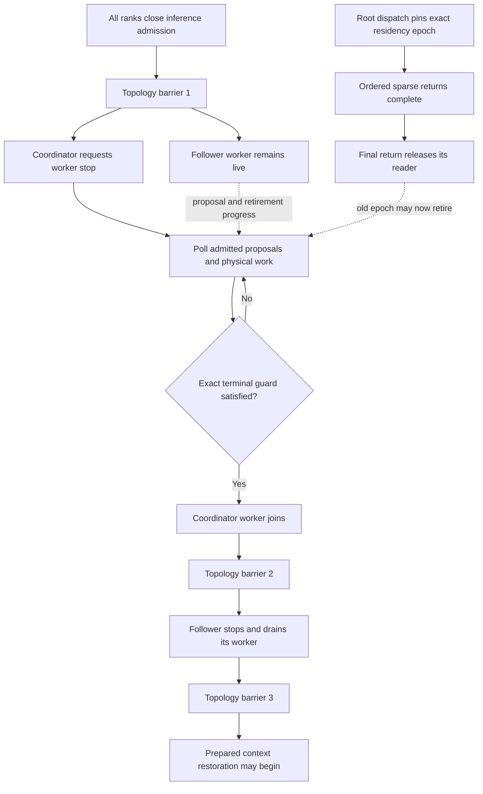

The terminal guard additionally requires Empty retained transaction ownership,
no pending coordinator proposal, no active/aborting/retiring authority work,
and terminal economy certification. These barriers are shutdown ordering, not
per-token inference operations. MPI admits `MPI_THREAD_MULTIPLE`, and the
proposal lane owns a private communicator; the source has no application
mutex held around the main thread's native barrier.

Both gate build targets are current. CTest now discovers **687 Unit + 605
preflight entries**, and the previous 1,291-entry receipt correctly fails its
freshness check. A complete new 1,292-entry receipt is still required before
the next admitted model run. Independently, the frozen real CPU prefix hammer
has **nine clean lifetimes / 360 requests**, with lifetime ten active; the
passive observer reports no native attachment on those retired rank pairs.
Neither the new reader proof nor those passing lifetimes identifies the
original stall's retained frontier. It remains unresolved.

The speedometer is opt-in and outside production preflight. It compiles in
Integration and Release. The first GPU-only diagnostic and two exact native
graph traces now complete without changing the frozen runtime, MTP bounds,
arena or CLI defaults; their measurements are detailed below. One exact
candidate per profiler invocation remains distinct from unprofiled timing.

The Release preparation completes seven target-only commands. A prior dry run
proves none rebuilds the active application or core DSO; their inode, size and
mtime remain unchanged afterward. The new executable resolves the same Core
10 HIP repair and matching BLAS dependency closure. The probe and profiler
processes leave both frozen serving artifacts unchanged. This preparation
does not perturb or change the dormant observer's source-bound native layout.

### October 3: measured retained-verifier dispatch overhead

The first diagnostic holds IQ2_S gate/up, IQ4_XS down, hidden width 2,048,
expert width 512, 256 experts, top-k eight and four live rows constant. Only
captured capacity changes. All four reused/uniform cases pass seven captured
event samples with zero byte mismatches and nonfinite values, including inactive
output rows. Their medians are:

| Route profile | Capacity 4 | Capacity 16 | Extra time |
|---|---:|---:|---:|
| Reused | 209.664 us | 232.378 us | 10.8% |
| Uniform | 221.201 us | 253.318 us | 14.5% |

The CPU lifetime hammer remains active, so these event times are provisional.
They are neither an uncontended performance certificate nor a whole-model gain.
The probe excludes shared experts, router Q8 reuse and the remaining transaction.

Separate SDK-matched v3 traces isolate the reused case at each capacity.
Eight actual `hipGraphLaunch` records each authenticate five dispatches for
capacity four and sixteen for capacity sixteen. Joining by native correlation
and graph-executable IDs excludes eager preparation and serial oracle work;
every declared dispatch count matches. Both captures contain zero memory-copy
records. The ordinary projections retain the same specialization and approximately
104 us gate/up and 117 us down duration under interception. Wider grouping,
both tile directories, dormant tiled projections and the dormant tiled-output
publisher explain the additional captured work. Those profiler durations are
attribution only: the profiler explicitly substitutes its system-memory queue
ring, so they must not replace unprofiled timing.

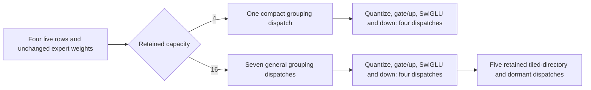

The grouping source selects its compact planner only up to 64 physical route
slots; top-k eight makes capacity sixteen retain 128 slots even when only 32
are live. This count map describes the generic probe entrypoint, not the
complete model transaction; it groups interleaved dispatches by purpose.
The projection selector already reads the device-owned active prefix
and correctly chooses route-owned dots. Thus this is overhead around correct
live arithmetic, not evidence that four rows execute tiled arithmetic. Removing
the tiled family at one endpoint would break admitted depths nine through
fifteen; changing a single stride would break graph ownership. A runtime fix
must preserve the complete 1–15 policy and all preparation, output and transaction
identities, or prove a total, economical grouping/route implementation instead.

Evidence under the ignored result root:
`rocm-capacity-iq2s-iq4xs-live4-diagnostic.S4i9Mj`,
`rocm-capacity-iq2s-iq4xs-live4-cap4-trace.TWmXAE`,
`rocm-capacity-iq2s-iq4xs-live4-cap16-trace.wj6P87`, and
`rocm-capacity-iq2s-iq4xs-live4-analysis.json`. All three independent driver
bookends are complete and clean. Final native metadata reports zero private
storage for every executed entry; linked helper spill evidence remains owned
by the compilation guard. The CPU observer and serving artifact identity are
unchanged. New whole-model performance and the refreshed full gate remain open.

The wider format sweep then passes **all 21 quantized codebooks / 84
profile-capacity cases / 588 samples** in 244.910 seconds, with zero byte
mismatches, zero nonfinite values and complete clean driver evidence.
`rocm-capacity-all-codebooks-live4-math.cp7oHH` retains the result. This is a
component-level mathematical diagnostic, not a new model/image certificate.

**Production-entrypoint qualification:** the subsequent graph audit finds
`Qwen35MoEGraph` explicitly enables runtime row grouping for every grouped main
verifier, including a single participant. The deferred accepted-row route ledger
requires that same runtime authority. `MoEExpertComputeStage` therefore publishes
the complete runtime group plan and executes the published-runtime pipeline;
it does not choose this probe's generic grouping helper. Runtime compact
grouping already supports 256 route slots. Consequently, the generic probe's
six additional grouping dispatches do not establish six production dispatches
to remove. The projection-family observation remains useful, but its contribution
must be measured on the actual runtime entrypoint or the full retained model
transaction. No threshold change is justified from this probe alone. The saved
older whole-model traces report 16,000 additional dispatches over 40 measured
transactions; their original SDK/source identities must remain separate from
these Core 10 fragment observations.

The follow-up read-only reconstruction of those **actual model transactions**
authenticates the device budget/prepare/commit/ticket markers for all 80
transactions, then selects the declared last-40 measured cohort. It reproduces
**56,483 fixed / 72,483 dynamic dispatches** and identical 128-token outputs,
with 88 accepted / 15 rejected drafts and effective depth three. Both cohorts
execute exactly **1,600 runtime compact-group kernels**: their service is
38.223 / 38.231 ms, so there is no grouping launch-count regression here.
The full 16,000-dispatch difference is:

| Additional dynamic family | Dispatches | Profiled kernel service |
|---|---:|---:|
| Tile directories, routed and shared gate/up/down | 6,400 | 25.275 ms |
| Dormant tiled gate/up projections | 3,200 | 13.437 ms |
| Dormant tiled down projections | 3,200 | 17.935 ms |
| Dormant canonical down-partials publishers | 1,600 | 6.087 ms |
| Dormant ordered down-partials publishers | 1,600 | 6.071 ms |

That is ten extra dispatches per main MoE layer per transaction, covering both
routed and shared expert FFNs, and **68.805 ms** summed profiled service. It
is not an unprofiled speedup prediction or proof that the entire remaining
10.61% native gap is eliminated. The saved binary is `build_v2_release`, and
its log identifies HSA 8.20.4; it is not the current Core 10 frozen lifetime.
`analyze-real-mtp-dispatches.py` and
`issue16-real-mtp-dispatch-attribution.json` retain the independently
reconstructible attribution under the ignored result root. No source, default,
arena or admitted depth range changed from these measurements.

The other three GGUF-authenticated Nail expert mixtures also pass their
component byte certificates at **4 / 9 / 16 live rows in capacity 16**:
IQ2_S/Q6_K, IQ3_S/Q6_K and Q2_K/Q4_K. The nine cases yield 63 timing records,
zero mismatches/nonfinite values and complete clean driver evidence, retained
in `rocm-capacity-nail-other-mixtures-math.yawn5y`. These cross the live strategy
boundary and exercise a full retained bucket, but remain generic-entrypoint
diagnostics rather than complete model/image certification.

The following read-only audit independently reconstructs the first **eleven
completed fresh lifetimes / 440 responses**. It matches each saved request to
its nonce-qualified configuration, re-parses needle answers and complete SSE
envelopes, rechecks exact-prefix token equality and partial GDN/MTP restoration,
and invokes the shared final driver-evidence validator. All eleven pass with
distinct nonces and complete clean bookends. The log is
`cpu-fresh-prefix-independent-evidence-validation.log`; no PerfStats payload is
parsed or used as policy authority. These diagnostics still do not identify
the original shutdown failure.

An October 3 read-only fidelity audit traces the ordinary routing stage's
device live-count input into the ROCm row selector: inactive rows publish
expert ID `-1` and zero weight, exactly as the capacity probe does. Routed
grouping and projection consume this publication, rather than borrowing a
separate live-count pointer. Existing `ROCmMoEGroupedRouteAdmission` resolves
the final offset/count on device and admits route-owned work for four live
rows even inside M16. Capture still retains the tiled family because other
live counts can select it; its dormant launches and physical-capacity
grouping remain possible costs, not proof that the active rows run tiled
arithmetic. The probe isolates routed MoE without shared-expert count
publication or router-Q8 reuse and cannot by itself quantify whole-model
dynamic-MTP overhead. No native implementation changes follow from this audit.

The current geometry audit traces three different notions of width, rather
than treating a host-side selector change as the fix:

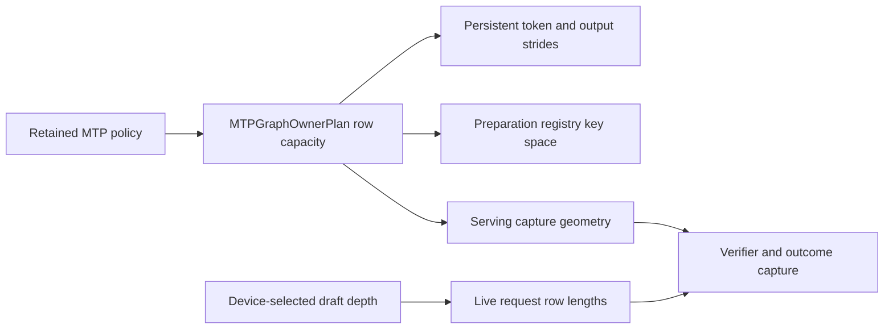

`DeviceGraphOrchestrator.cpp:6555` derives both maximum verifier rows and
the output stride from the graph owner plan. `MTPServingForwardCaptureGeometry.h`
and `MTPVerifierPolicy.h` then select `DynamicDeviceEnvelope` for Dynamic,
where a scalar capture returns that maximum even for fewer current live rows.
The setup path and pipeline-follower main forward both consume that resolver.
The preparation registry additionally authenticates canonical scalar bucket
keys and indexes its owners by control policy, request count and physical
stride (`mtpVerifierPreparationRegistryIndex`). This bounded key space does
not prove that a narrower complete serving verifier graph is materialized.

The 52-byte device dispatch ticket already carries the device-selected next
depth; it remains an immutable scheduling snapshot, not inference authority.
Any later narrower captured-family design must keep input packing, graph
identity, output strides, admitted storage, publication and follower geometry
coherent. No runtime change follows from this audit alone: first measure the
same four live rows at physical capacities four/sixteen for the actual GGUF
format pairs. Neither lowered depth bounds nor one isolated width edit is an
acceptable way to conceal the retained-capacity cost.

### October 3 transaction-consolidation audit — implementation still pending

The current source narrows the next design decision. HIP's materializer already
has a branch directory for every admitted draft depth. It is not necessary to
add a second depth selector or another host controller. However, every branch
borrows the same widest verifier preparation, paired forward signature and
state-publication geometry. Replacing one padded-row argument would leave
those owners inconsistent.

The hosted submission API then selects individual branch fragments. Native
helper captures enter `launchOnStream`; sidecars and the grouped verifier enter
their semantic replay methods. The standalone caller loops through every
selected fragment before publishing the next immutable ticket. This is a source
finding, not a measured claim that host submission dominates the remaining gap:
the older saved kernel-only trace has no HIP API records to establish that.

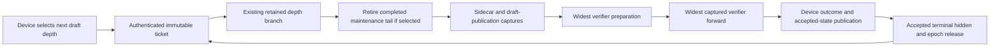

The exact simplification seam is already present:
`IGPUGraphCapture::buildOrderedTimelineTransaction`. Ordinary homogeneous HIP
generation uses it to retain forward plus sampling as one complete native
transaction; MTP need not invent another graph composer. A homogeneous MTP
implementation should similarly retain a complete producer-ordered transaction
for each existing depth branch, preserving device decisions and the full 1–15
range. A heterogeneous boundary remains explicit, rather than becoming an
automatic escape path when native composition fails.

Before implementing that consolidation, account for the semantic replay
methods' publication/lease responsibilities: bypassing those methods without
transferring their exact event and lifecycle edges is not a valid optimization.
Maintenance ordering is also non-negotiable: the observed ticket retires the
completed transaction's selected maintenance tail **before** the next body.
Do not evaluate a previous ticket as the next body's newly produced predicate.
Any newly retained graph owners require the canonical `MTPGraphOwnerPlan` /
physical-memory BOM; an unpriced parent directory is not free memory.

The intended focused regression must inspect actual native composition and
exercise all depths, greedy/stochastic modes, changing live counts, prefix
restore and request reuse. It must prove one complete homogeneous transaction
submission rather than accepting a transaction counter incremented after a
host fragment loop. Register it explicitly in `ProductionTestPreflight`, keep
the backend numerical sweeps, and remeasure the real Release model before
promoting defaults. This audit does not install a new mode or declare the
current performance issue resolved.

The current unchanged SDK/build also passes four focused native regressions:
runtime-owned captured grouping and all-format captured live-row computation,
on both CUDA and ROCm. The latter includes all 21 quantized codebooks plus
FP16, BF16 and FP32 weights, and multipartition floating geometries. Both
independent complete driver windows are clean. Artifacts are
`runtime-row-authority-functional.88rcJS` (two CTest entries, 14.72 seconds) and
`cuda-runtime-row-authority-functional.lYAM1E` (two entries, 10.13 seconds).
Those durations are functional-test wall time under CPU contention, not
performance observations. The frozen CPU serving binary/core and observer
remain unchanged; these passes do not refresh the complete prerequisite
receipt or certify any newly tagged model cell.

The following semantic-replay audit identifies the exact responsibilities that
composition must retain. `replayHostedMTPSidecar` consumes the scheduler's
frontier on its producer stream, validates the current cache and workspace,
binds the sparse request identity, consumes the parent epoch, and arms a remote
follower only when its scope owns that authority. It publishes the sidecar's
terminal back to the scheduler **before** finishing the participant scope.
`replayHostedMTPGroupedVerifier` similarly binds the exact request/depth and
forward signature, supplies the epoch/follower launch hook, and requires the
returned producer stream to equal the retained forward's stream. A complete
native parent cannot simply bypass these responsibilities at a declared sparse
boundary.

For a genuinely self-contained homogeneous graph, the existing strict
`deviceLoopGraphTemplate` export is the correct admission contract: it rejects
segmented captures and stages that still need host replay work. Native parent
composition should consume that proof, rather than infer composability from a
device count or the word `ExpertOverlay`. The current execution-policy selector
answers whether generation uses a native conditional loop or authenticated
hosted submission; that answer alone does not prove whether the selected
transaction is one native capture or a declared cross-participant plan.

Narrowing the verifier is a separate identity change. The present preparation
registry can index bounded widths, but the serving forward family materializes
only its configured envelope and state publication currently has one exact
geometry owner. The target-distribution and stochastic-outcome captures also
validate their immutable row/depth bindings. Any bounded-width family therefore
needs jointly admitted preparation, forward and publication identities, with
all added executable owners included in the canonical memory BOM. Mutating a
singleton's width behind another retained parent is invalid even if the arena
has spare capacity. Keep the full admitted depth range and distinguish physical
storage capacity from the width of the selected captured transaction.

Ten additional model-free native checks pass against the unchanged build:
device-generation controllers, controlled verifier preparation, stochastic
outcomes, learned depth policy, and completed-tail maintenance ordering on both
CUDA and ROCm. The complete driver window has zero new records or findings.
`mtp-transaction-functional.tDKNJT` retains the CTest log and both driver
bookends; all ten entries pass in 81.02 seconds under the live CPU diagnostic.
This is functional evidence, not a performance comparison or proof that the
production caller already submits one complete homogeneous MTP parent. The
frozen serving executable/core inode, size and modification time are unchanged.
The CPU hammer independently reaches 29 clean lifetimes / 1,160 requests, with
lifetime 30 active and no retained shutdown for the observer to attach to.

The checked-in GGUF pattern manifest identifies the actual Qwen3.6
`UD-IQ3_S` routed mixtures: layers 0–33 and 35–37 use IQ2_S gate/up with
IQ4_XS down (37 layers); layers 34/38 use IQ2_S with Q6_K down; layer 39
uses IQ3_S with Q6_K down; the next-token layer 40 uses Q2_K with Q4_K down.
The common geometry is hidden 2048, expert width 512, 256 routed experts and
top-8 routing. Therefore the first capacity comparison must select
`LLAMINAR_MOE_VERIFIER_PREFILL_FORMATS=IQ2_S` and
`LLAMINAR_ROCM_MOE_MTP_DOWN_FORMAT=IQ4_XS`, rather than infer homogeneous
IQ3_S tensors from the checkpoint's filename. The remaining three pairs are
separate measurements with the same live/capacity envelope. This is source
provenance for the planned experiment, not measured dispatch evidence or a
claim that the native tax has been fixed.

The exact local Nail checkpoint used by the matched issue-16 comparison is
checked independently with the existing bounded GGUF header parser: its first
16 MiB contains all 753 tensor descriptors (payload offset 11,000,544). It
declares 41 blocks, 256 experts, top-8 routing and width 512, and has exactly
the same four routed format/layer groups listed above. The gate/up dimensions
are `(2048, 512, 256)` and down dimensions `(512, 2048, 256)` in GGUF order.
This payload-free inspection reads
`cache/models/nail-issue-proof/Nail-Qwen3.6-35B-A3B-MTP-UD-IQ3_S.gguf` from
the persistent model tmpfs; it neither loads a model nor hashes its weights.
Thus the first probe pair is authenticated against the actual benchmark
checkpoint's descriptors, not just a related model's manifest or a filename.

The second cell, Ornith Q4 dual-CPU on the same two-rank topology, is **green
45/45** in 703.18 seconds. It passes all eight long-context checks, completes
coordinated shutdown with exit zero, retains the 42→42 MiB GPU baseline and
has a complete passing driver report with zero new records. Its 1,229,242-record
PerfStats export passes the canonical checks. A bounded, non-pausing host
uprobe during generation finds both maintenance workers healthy with economy
certification observed; the peer is receiving while the coordinator publishes.
This successful cell does not reproduce or resolve the Qwen3.6 IQ3S drain
failure. The aggregate remains red and proceeds to 122B CUDA2+CPU2.

The third cell, **122B CUDA2+CPU2**, also passes **45/45** in 897.05 seconds,
including all eight long-context checks, the complete 2,048-token generation
(262.62 seconds), clean exit, 42→42 MiB retirement and a complete passing driver
report with zero new records. This is only 2.95 seconds below its unchanged
900-second lifetime watchdog; correctness stress timing is not a production
benchmark. Diagnostic attachment attempted after its exit correctly finds no
live process; it must not be interpreted as another stalled rank.

The fourth cell, **122B CUDA2+ROCm4+CPU2**, passes **45/45** in 323.99 seconds,
including all eight long-context checks. It exits cleanly, returns GPU residency
from 42 MiB to 42 MiB, and has an independently checked complete passing driver
report with zero new records or findings.

The fifth cell, **122B ROCm2+CPU2**, passes **45/45** in 696.74 seconds,
including all eight long-context checks and a 2,048-token ordered generation
in 208.72 seconds. Its clean exit, 42→42 MiB retirement and independently
checked complete passing driver report also pass. The window contains one new
informational Linux perf sample-rate adjustment but no AMDGPU/NVIDIA warning
findings; zero findings must not be misreported as zero records.

The sixth cell, **122B ROCm4+CPU2**, passes **45/45** in 597.36 seconds,
including all eight long-context checks and its 2,048-token ordered generation
in 158.11 seconds. Its independently checked driver report is complete and
passing with zero new records/findings; shutdown exits zero with 42→42 MiB
retirement. Diagnostic attachment attempted after rank exit yields no live
process, not another stalled rank.

The seventh cell, **Ornith Q4 CUDA2**, passes **45/45** in 108.16 seconds,
including all eight long-context checks, clean exit, 42→42 MiB retirement and
an independently checked complete driver report with zero new records or
findings. The eighth cell, the explicit Qwen3.6 CUDA2
`GateUpOwnedDownColumns` mode, passes **45/45** in 84.23 seconds: movable
gate/up ownership with sharded down columns, rather than whole-expert
ownership. This is full HTTP correctness evidence for the selectable mode,
not an A/B performance comparison. Single-CUDA Qwen3.6 then passes **45/45**
in 49.48 seconds. Both have clean exit, 42→42 MiB retirement and independently
checked complete driver reports with zero new records or findings.

The tenth cell, **Qwen3.8 dense CUDA2 TP**, passes **45/45** in 156.17 seconds
with all eight long-context checks, clean exit, 42→42 MiB retirement and an
independently checked complete driver report with zero new records/findings.
The eleventh cell, **Qwen3.8 dense CUDA2 PP**, passes **45/45** in 123.56
seconds; single-CUDA Qwen3.8 then passes **45/45** in 108.87 seconds. Each
passes all eight long-context checks, clean exit, 42→42 MiB retirement and an
independently checked complete driver report with zero new records/findings.
The thirteenth cell, **122B CUDA2+ROCm4 without a CPU tier**, passes **45/45**
in 274.75 seconds, including all eight long-context checks, clean exit,
42→42 MiB retirement and an independently checked complete driver report
with zero new records/findings. This is another fresh lifetime within the
aggregate, in addition to its completed twenty-lifetime gate.

The fourteenth cell, **Qwen3.8 dense CUDA2+ROCm2 TP+PP**, passes **45/45**
in 227.51 seconds with all eight long-context checks, clean exit, 42→42 MiB
retirement and an independently checked complete driver report with zero new
records/findings. The fifteenth cell, **Ornith Q4 ROCm2**, passes **45/45**
in 168.18 seconds with all eight long-context checks, clean exit, 42→42 MiB
retirement and an independently checked complete driver report with zero new
records/findings. The sixteenth cell, the explicit Qwen3.6 ROCm2
`GateUpOwnedDownColumns` mode, passes **45/45** in 120.77 seconds with all
eight long-context checks, clean exit, 42→42 MiB retirement and an
independently checked complete driver report with zero new records/findings.
Both selectable CUDA/ROCm projection-owned modes now have full HTTP passes;
their production-default A/B timings remain unmeasured.

The seventeenth cell, **single-ROCm Qwen3.6**, passes **45/45** in 87.11
seconds with all eight long-context checks, clean exit, 42→42 MiB retirement
and an independently checked complete driver report with zero new
records/findings. The eighteenth cell, **Ornith Q4 ROCm1**, passes **45/45**
in 92.98 seconds with all eight long-context checks, clean exit, 42→42 MiB
retirement and an independently checked complete driver report with zero new
records/findings. The nineteenth cell, **Qwen3.8 dense ROCm2 TP**, passes
**45/45** in 222.05 seconds with all eight long-context checks, clean exit,
42→42 MiB retirement and an independently checked complete driver report
with zero new records/findings. The twentieth cell, **Qwen3.8 dense ROCm2
PP**, passes **45/45** in 269.02 seconds with all eight long-context checks,
clean exit, 42→42 MiB retirement and an independently checked complete driver
report with zero new records/findings. The final cell, **single-ROCm Qwen3.8
dense at 32K context**, passes **45/45** in 827.94 seconds. It passes all
eight long-context checks, including 30,205/32,768-token admission (260.18
seconds), clean exit and 42→42 MiB retirement. Its independently checked
driver report is complete and passing; its one new record is an NVMe DMA
address-width notice, not a GPU warning.

The aggregate is **complete and red: 20/21 cells green**, in 7,039.33 seconds
with exit one and `correctness_passed: false`. All twenty successful lifetimes
independently have complete passing driver reports with zero GPU findings,
clean exits and 42→42 MiB retirement. Their driver windows contain two new
kernel records in total: the earlier perf sample-rate adjustment and the NVMe
notice above. The sole failure is the preserved Qwen3.6 CPU2 maintenance drain;
no runtime/harness or timeout changes were made during the aggregate. Diagnosis
now narrows to that exact canonical cell instead of restarting the full matrix
or treating its completed response checks as a pass. Production-default
benchmarks and image certification remain pending.

| Completed cell in this run | HTTP result | Lifecycle result | Wall time |
| --- | --- | --- | --- |
| Qwen3.6 IQ3S CPU2 | All 8 long-context checks pass | Maintenance drain times out; cell red | 900.00 s |
| Ornith Q4 CPU2 | 45/45 | Clean shutdown and driver window | 703.18 s |
| Qwen122B CUDA2+CPU2 | 45/45 | Clean shutdown, VRAM retirement and driver window | 897.05 s |
| Qwen122B CUDA2+ROCm4+CPU2 | 45/45 | Clean shutdown, VRAM retirement and driver window | 323.99 s |
| Qwen122B ROCm2+CPU2 | 45/45 | Clean shutdown, VRAM retirement and driver window | 696.74 s |
| Qwen122B ROCm4+CPU2 | 45/45 | Clean shutdown, VRAM retirement and driver window | 597.36 s |
| Ornith Q4 CUDA2 | 45/45 | Clean shutdown, VRAM retirement and driver window | 108.16 s |
| Qwen3.6 IQ3S CUDA2 GateUpOwnedDownColumns | 45/45 | Clean shutdown, VRAM retirement and driver window | 84.23 s |
| Qwen3.6 IQ3S CUDA1 | 45/45 | Clean shutdown, VRAM retirement and driver window | 49.48 s |
| Qwen3.8 dense CUDA2 TP | 45/45 | Clean shutdown, VRAM retirement and driver window | 156.17 s |
| Qwen3.8 dense CUDA2 PP | 45/45 | Clean shutdown, VRAM retirement and driver window | 123.56 s |
| Qwen3.8 dense CUDA1 | 45/45 | Clean shutdown, VRAM retirement and driver window | 108.87 s |
| Qwen122B CUDA2+ROCm4 | 45/45 | Clean shutdown, VRAM retirement and driver window | 274.75 s |
| Qwen3.8 dense CUDA2+ROCm2 TP+PP | 45/45 | Clean shutdown, VRAM retirement and driver window | 227.51 s |
| Ornith Q4 ROCm2 | 45/45 | Clean shutdown, VRAM retirement and driver window | 168.18 s |
| Qwen3.6 IQ3S ROCm2 GateUpOwnedDownColumns | 45/45 | Clean shutdown, VRAM retirement and driver window | 120.77 s |
| Qwen3.6 IQ3S ROCm1 | 45/45 | Clean shutdown, VRAM retirement and driver window | 87.11 s |
| Ornith Q4 ROCm1 | 45/45 | Clean shutdown, VRAM retirement and driver window | 92.98 s |
| Qwen3.8 dense ROCm2 TP | 45/45 | Clean shutdown, VRAM retirement and driver window | 222.05 s |
| Qwen3.8 dense ROCm2 PP | 45/45 | Clean shutdown, VRAM retirement and driver window | 269.02 s |
| Qwen3.8 dense ROCm1, 32K context | 45/45 | Clean shutdown, VRAM retirement and driver window | 827.94 s |

The source audit distinguishes two coordinated boundaries from the
continuation-only cache work between them:

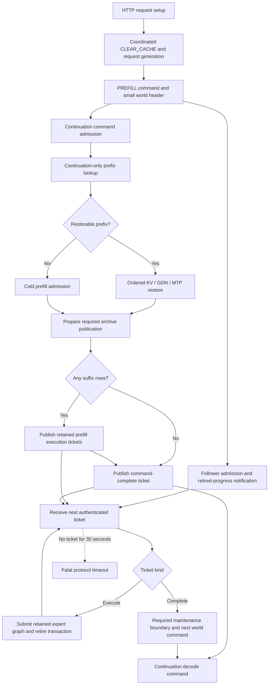

`ChatCompletionHandler::setupInference()` clears request state before
`OrchestrationRunner::prefill()`. Expert-only followers receive neither prompt
tokens nor prefix state: they consume the header and then transaction tickets.
A full prefix hit may legitimately publish only a command-complete ticket;
there is no missing expert prefill graph to manufacture. Notifications wake
background maintenance but do not transfer cache or sampler ownership.

The failed request's follower stack is at `W`. It establishes the observer,
not which continuation operation failed to reach `X` or `E`. The next complete
two-rank snapshot must identify that producer before changing ordering,
cache publication or the controller lifecycle. In particular, adding another
world collective inside continuation-only cache work would make the blocked
states less tractable, not synchronize an expert follower already receiving
tickets.

### Independent SDMA event frontier — 2026-10-02

Investigation of the intermittent GPU-only 122B movement stall exposed a
separate reduced native progress defect. One peer-held captured wait/write
graph and 32 ordinary independent
NoCU copy streams complete **26/32** ordering events on the four-repair Core 10
runtime. Releasing the graph permits all events and every payload byte to
complete. A passive snapshot authenticates all 33 native stream handles and
four shared AQL queues: **all 32 DMA completion signals are zero**, but six
event-record compute barriers have completion value one. Those six barriers
share the held graph's physical queue, whose frontier is read 0/write 9.
Each waits on an already-zero DMA signal. This root-causes the model-free
defect; it is a strong production-stall lead, not yet proof of the exact 122B
lifetime's causal state or post-fix stability.

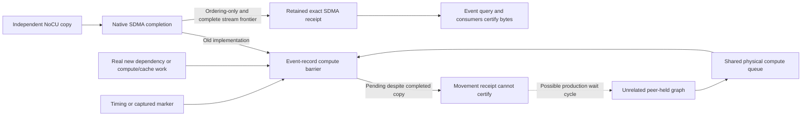

The candidate fifth patch retains that exact SDMA signal for an uncaptured,
timing-disabled ordering event only when there is no pending compute/fence,
external dependency, raw queue wait, callback or IPC scope. Retained references
prevent pool reuse. It adds no host wait, compute blit, queue-limit override,
priority change or recapture. Ordinary timing/capture paths remain intact.

The unchanged original probe passes **32/32** events and exact bytes with
0/1/16/32/64 held graphs under the candidate. The source-controlled enhanced
reproducer adds guarded odd byte extents, three event-reuse generations,
same-frontier record coalescing and external-event/compute negative controls.
Both independent scenarios pass, while both true-dependency scenarios remain
**0/32 ready until their producer is released**, then verify all bytes/guards.
The enhanced reproducer still fails against the unchanged four-repair runtime.

Worker-context events previously used timing-enabled native creation even
though `IBackend` ordering events already disabled timing. The typed
`GPUEventPurpose` API now defaults to Ordering on both CUDA and ROCm. Every
elapsed-time caller explicitly requests Timing; real native and device-free
regressions cover the distinction. The installer receipt and both image
definitions include the fifth repair. Focused Integration and Release builds
pass. The installer-built artifact passes six native entries in **20 fresh
processes each**, **120/120**, **117.39 seconds**, with zero new driver records.
The focused Unit/timeline entries pass **4/4**, **1.33 seconds**. The refreshed
canonical gate rebuilds its complete dependency closure, then passes all
**685/685 Unit entries**, **78.391 seconds**. Its complete **592/592 preflight**
also passes: host 254, CUDA 115, ROCm 137 and exclusive cross-device 86 entries.
Preflight execution takes 1,828.157 seconds; the full transaction including
the rebuild takes 2,305.678 seconds. Its driver bookends contain no new records.
The exact inline upstream reproducer separately fails 26/32 before the repair
and passes 32/32 afterward, with exact final bytes in both runs. No complete
E2E or image certification is claimed yet.

The tested reduced program, source identity, passive queue/signal evidence and
native repair are submitted as
[ROCm/rocm-systems #12676](https://github.com/ROCm/rocm-systems/issues/12676).
This is separate from the earlier finite-graph-collapse issue #12669. The
first untraced GPU-only 122B lifetime remains red against the installer-built
fifth-repair runtime: **35/46 HTTP checks pass**, then the streaming thinking
response stalls at a main-decode follower terminal. The fatal snapshot proves
that all **216/216 native transfers** on each ROCm endpoint have completed and
no maintenance transaction is pending. ROCm endpoints 0/1 have dispatch/return
15/14 on the final odd bank; endpoints 2/3 have 15/15. This does not identify
the missing compute or protocol edge, and the model-free SDMA repair alone is
not a complete production-stability fix.

A token-traced diagnostic run passes six complete lifetimes. It is deliberately
stopped at the start of lifetime seven to switch observers; that cancelled
lifetime is not another natural failure. These traced passes are not the
uninstrumented twenty-run certificate. A CPU-only BPF function-duration probe
can trigger passive native queue/thread snapshots after a terminal has remained
incomplete for three seconds. Its first run passes two complete lifetimes; the
third completes every inference check but fails driver health because overlapping
ROCgdb validation attachments reserve the same debug trap. This is an observer-
induced warning, not another natural inference stall, and is not allowlisted.
The corrected host-only inspector passes both rank validations without taking
GPU debug traps. A second duration-observed run passes five complete lifetimes
and is deliberately cancelled during lifetime six to reduce instrumentation.
None of these observed runs is the clean twenty-run certificate.

The next diagnostic binds cache addresses with a startup-only BPF probe, then
removes every probe after HTTP response four, before the previously failing SSE
request. A separate host process reads only the existing CPU terminal publication
and observation receipts through `process_vm_readv`. Their offsets are compiled
from the actual Release header and compiler/feature closure, not guessed. Running-
kernel BTF resolves the container PID; executable, process birth and harness
ancestry authenticate each address. Torn samples and retired addresses are
rejected. Three fresh observed lifetimes now pass **45/45 HTTP checks each**,
including the previously failing streaming request, tool round trips, all eight
long-context checks and normal shutdown. Their full cell times are 289.390,
287.743 and 289.466 seconds; each has clean driver and retired-VRAM evidence.
They introduce no token tracing or GPU readbacks. These are diagnostics, not the
uninstrumented twenty-run certificate, which is now running separately.

A separate native scheduling lead is not reproduced by a reduced graph using
the exact production `addSystemWaitValue64Node` primitive. A flat fork with an
independent publication passes 20 fresh processes with 20 retained replays each,
400/400. The retained-child variant also passes 20/20. No scheduling override,
extra runtime patch or production workaround is installed from that hypothesis.
An additional copy→captured-compute→event negative control uses the same
production kernel wait/publication primitives on 32 independent streams. Across
five retained generations per process, no ordering event may complete before
its compute frontier is released. Twenty fresh processes pass **3,200/3,200
pending-event assertions**, every final byte and publication receipt, with no
new driver records. This rules out premature completion in that reduced
scenario; it does not establish the cause of the earlier model stall. Evidence
is in `captured-sdma-frontier-20.6VVP3T/` under the ignored result directory.
The same invariant is now added through public worker and TransferEngine APIs
to both vendor variants of `Test__GPUDeviceContext`: 32 retained stream lanes,
five data-only generations, re-recorded Ordering events, guarded odd live-byte
copies and mapped device-written receipts. The explicit
`V2_Integration_NativeWorkerGPUCapturedComputeFrontier_{CUDA,ROCm}` entries
belong to `ProductionTestPreflight`. Both vendor entries now pass in twenty
fresh processes each, **40/40**, in **50.59 seconds**, with no new driver records.
This delta adds focused coverage; it does not replace the earlier complete gate
or claim the new complete inventory has run. The unobserved run completes
16 qualified fresh lifetimes at 45/45 each. Attempt 17 completes every inference,
driver and teardown check too, but is excluded: an in-place harness edit while
Bash still reads its source causes a late parser error. This is an agent-induced
harness failure, not a reproduction of the native stall. A frozen-source
replacement cohort passes **4/4**, taking **1,156.37 seconds**. Their case,
manifest digest, source revision, CPU ISA and complete configuration match the
first cohort. Thus **20 qualified clean full lifetimes**, **900/900 HTTP checks**,
are recorded across the two cohorts. The invalid attempt remains excluded and
the original report remains failed; this is not one uninterrupted twenty-run
aggregate or a full E2E/image certificate. The compact diagnostic receipt is
`rocm10-122b-qualified-clean20.json`.
Immutable tmpfs staging reuses all four GGUF shards with zero copied bytes.
Unit/preflight are amortized over this unchanged implementation, not rerun per
lifetime.

After those twenty lifetimes pass without a native reproduction, the requested
next diagnostic is a continuous public-HTTP lifecycle hammer. Its canonical-cell
wrapper reuses inventory, one model/staging lease, production serve arguments,
readiness, driver observation and retirement. Fourteen requests retain the
original order: the twelve preserved JSON requests, then non-thinking and
thinking SSE arithmetic. The loop retains exact requests and partial responses,
publishes its active/first-failure state atomically, and stops without retrying
the first error. A passive, ancestry/birth/ABI-authenticated host-GDB callback is
dormant until a short request waits ten seconds; there is no steady-state BPF,
token tracing or GPU debug-trap attachment. Tooling has passed 14 device-free
regressions, plus 201 existing HTTP/capture/scheduling/driver-policy tests. New
Unit and explicit ProductionTestPreflight registrations cover its state machine
and actual loopback HTTP timeout/SSE client; both registered entries pass in
**0.64 seconds**. The retained Release server completes **350 cycles / 4,900
requests** in **3,671.42 seconds** without a natural HTTP failure or diagnostic
attachment. The journal is
`http-hammer-delta-gates.D23yRx/model-hammer/hammer/progress.json`. At the user's
request to target prefix edges, the workload child is deliberately interrupted
to replace that sequence with the enhanced diagnostic. Its original evidence
stays interrupted/failed, never certified: the coordinated shutdown subsequently
needs the harness's signal path and exits 143, and the unfinished request leaves
the aggregate graph-boundary check incomplete. Both raw rank exports are
preserved (2.5/1.4 GiB); postprocessing is separately expensive. No new driver
warning is recorded. This is not a natural reproduction of the inference stall
or a clean retirement certificate.

The new `--prefix-pressure` workload projects geometry from the same E2E cell
and GDN/MTP restore obligations from its canonical generation definition. Six
long-prefix probes surround each preserved short sequence: a nonce-distinct
cold needle, full repeat, conversation extension, full extension repeat, then
both full restores after small JSON/SSE requests. The shared generation
consumer validates actual token-prefix eligibility and request-local completed
KV/recurrent/sidecar/terminal restoration; every full repeat is token-exact.
New cycle inputs pressure existing bounded cache tiers without altering their
budgets or model/capture/placement policy. Eviction or compaction must still be
proved by its own completed evidence, not inferred from pressure alone.

The first live attempt (`prefix-pressure.e2N7ot`) verifies the **5,267-token**
cold prompt and its full `mixed`-tier restore, including all recurrent/MTP and
terminal-state flags and token equality. The partial workload is invalid:
adding a newer user turn makes the embedded Qwen template strip the previous
empty-thinking frame. Its tokens diverge at **5,263**; an actual partial restore
at 5,248 does not certify restoration of that earlier complete prompt. The
strict token-boundary gate correctly stops this diagnostic, with all requests
HTTP-200, clean exit/VRAM release and no driver warnings. The replacement
appends only the assistant turn, matching the canonical partial-generation
probe, instead of weakening the validator. Its fresh root is
`prefix-pressure-terminal-assistant.pMKR1G/model-hammer`. The enhanced tooling
passes **19/19** device-free tests, both registered Unit/ProductionTestPreflight
entries (**1.24 seconds**), the existing **225/225** production-pipeline tests,
**29/29** E2E infrastructure tests and long-needle pure-function checks.
At **09:27 UTC**, the corrected live diagnostic has completed **66 requests /
3 full cycles**, including **4 cold, 14 full and 4 partial** prefix proofs, with
no failure or passive attachment. The first producer has **5,268 tokens** and
takes **12.751 seconds**. Full restores take **0.273–0.275 seconds**; its partial
extension restores all 5,268 earlier tokens and takes **0.623 seconds**. Both
full restores after the short sequence remain token-exact and restore GDN,
MTP, terminal logits and terminal hidden state. Actual observed tiers are RAM
and mixed RAM/device; no disk hydration/eviction certificate is claimed yet.
Dynamic MTP executes drafting and verification (12 accepted drafts in these
greedy needle replies); short replies do not prove an adaptive-depth update or
a sustained decode/movement horizon. A read-only check of the still-armed driver
interval reports zero new kernel records. The indefinite diagnostic continues.
No pass-count threshold declares the original stall fixed. A finite tooling
pass or warm-server loop cannot certify the unresolved native lifecycle.

The complete current **686/686 Unit gate** now passes, with **zero skips**, in
**80.26 seconds**. Evidence is `prefix-pressure-unit-full-20261002.{log,xml}`
under the same ignored result root. This includes the enhanced hammer's 19
tooling regressions; it is one amortized gate, not a gate per HTTP cycle.
The earlier complete 592-entry production preflight plus the focused new
functional delta remain distinct from the newer 595-entry inventory: the
latter has not yet run as one aggregate while the six-GPU diagnostic owns the
devices. At **09:44 UTC**, the diagnostic has completed **460 requests / 23
cycles**, including **92 full and 23 partial** proved restores, without a
failure or attachment. Read-only archive metadata shows new admission traffic,
but filesystem growth and RAM/mixed restore outcomes alone do not establish
disk hydration or completed background compaction. No cache or graph-runtime
implementation is changed merely because prefix restore is a plausible
prerequisite of the original unfinished decode transaction.

At **09:47 UTC**, this corrected prefix-pressure lifetime stops on request
**538**, the preserved thinking/SSE `1+1` request, after **537 successful
requests / 26 complete cycles**. It has proved **27 cold, 106 full and 27
partial** prefix outcomes. The disk archive crosses its compaction threshold;
read-only file descriptors show a live replacement owned by discovery-process
**3331999**, with roughly **34.27 GB** copied while the original grows to
**69.74 GB**. The fatal observer is now a **PREFILL transaction-ticket receive**
timeout on execution rank 1, not the original unfinished captured decode
transaction. This is a new useful reproduction, not proof that both faults
share a root cause or that compaction caused the ticket delay. Curl receives
HTTP-200 headers and then fails with code 18 before a complete SSE response.
No new driver warning is recorded. Missing terminal memory/retirement and one
rank's PerfStats export are consequences of the fatal server exit; this
lifetime is failed and uncertified.

Its dormant callback fires at 09:47:27 and authenticates both actual processes.
The discovery-rank-0 snapshot captures the execution follower waiting in
`MoEOverlayMPIInferenceTransactionChannel::receive`, with idle GPU worker
threads. The discovery-rank-1 snapshot exhausts its seven-second budget during
initial thread/symbol loading and does not retain the continuation stack.
No root-cause claim is based on that missing stack. A fresh replay is running
under `prefix-pressure-host-first.EONK5S/model-hammer`, preserving the same
Release binary, native dependencies, canonical cell, request sequence and
durable archive. Its replacement passive callback suppresses initial SDK
autoloading before attach and prioritizes host stacks using only the actual
core ELF symbol table and authenticated load bias. A non-attaching symbol-load
check resolves the exact archive methods in **0.292 seconds**; it does not
inspect or alter device/model state. No runtime repair is introduced yet.

That fresh lifetime fails at **09:59 UTC**, on the same thinking/SSE request,
now ordinal **58**, after **57 successful requests / two complete cycles**.
It has proved **three cold, ten full and three partial** prefix outcomes. The
host-first callback succeeds and retains both process stacks in
`prefix-pressure-host-first.EONK5S/model-hammer/hammer/host-stall.gbStoB`.
The authenticated continuation process is discovery rank 1 / execution rank 0.
Its request thread is in
`hashPrefixBytes -> DiskPrefixStorageBackend::writeBlock ->
PrefixStateCache::persistResidentToDisk -> evictUntilFits -> find ->
findLongestTokenPrefix`. The separate archive worker is copying a replacement
in `rewriteArchive`; the follower is waiting in its transaction receive.
Thus this reproduction has a concrete **foreground disk-hydration / RAM
eviction** edge, rather than only coincident archive growth. The source's
`find()` disk branch verifies a durable record, then synchronously persists
RAM victims before admitting the hydrated allocation. The prefill command and
its follower's receive deadline are already open during that work.

```mermaid
sequenceDiagram
    participant H as HTTP continuation
    participant C as Prefix cache
    participant A as Archive background worker
    participant F as Expert-only follower
    H->>F: Publish PREFILL command
    Note over F: Transaction receive watchdog starts
    H->>C: Find cached token prefix
    C->>C: Verify disk record; prepare RAM capacity
    C->>C: Synchronously checksum and persist RAM victims
    A->>A: Copy committed archive records
    Note over H,C: Request thread has not submitted the first graph ticket
    F--xH: Fatal receive timeout after 30 seconds
```

This diagram describes the observed host edge, not a claim that background
compaction holds the index lock: its copying happens outside that lock. A
bounded metadata-only archive scan finds ordinary 64-token KV/MTP blocks of
**917,504 bytes**, and a recent terminal block of **236,378,112 bytes**, of
which **234,455,040 bytes** is recurrent state. It skips every payload extent;
no model data is read. The archive has meanwhile published a replacement and
is **36.60 GB**, with **34.24 GB** of indexed active payload. Native output
again reports the standard PREFILL receive timeout, curl observes an incomplete
HTTP-200 SSE response, and driver diagnostics report no new warning. No
certificate or original-decode-root-cause claim is made. The next cache fix
must remove heavy victim persistence from live lookup/admission, preserve the
canonical physical leases and crash-safe archive, and prove the command's
preparation/execution boundary. Do not raise the receive timeout, erase the
durable cache, or turn prefix caching off to mask this failure.

The device-free negative control now holds a competing native archive writer's
lock while a request prepares one new 32-byte block in a full 96-byte RAM tier.
The old implementation blocks until that lock is released: it fails the bounded
200-ms observation, then incorrectly appears immediately prepared only because
the test finally releases the writer. The candidate passes this admission test
in 17 ms, returning typed `Busy` with all 96 logical/physical bytes still owned.
The candidate is not yet a production-stall certificate.

The shared disk backend now owns an ordered persistence worker. Request-side
LRU pressure queues the necessary existing immutable payload owner, never a
second full block, then consumes a read-only publication at a later cache
boundary. Only the worker checksums, writes and fsyncs payloads. A pending owner
does not count as free physical RAM; PMA remains the admission authority. A
same-key retirement cancels an unstarted put or follows an executing put in the
same FIFO. Replacement receipts are matched by immutable mutation identity,
and persistence failures seal admission and propagate fatally rather than
becoming misses. Shutdown joins this archive owner before native storage retires.

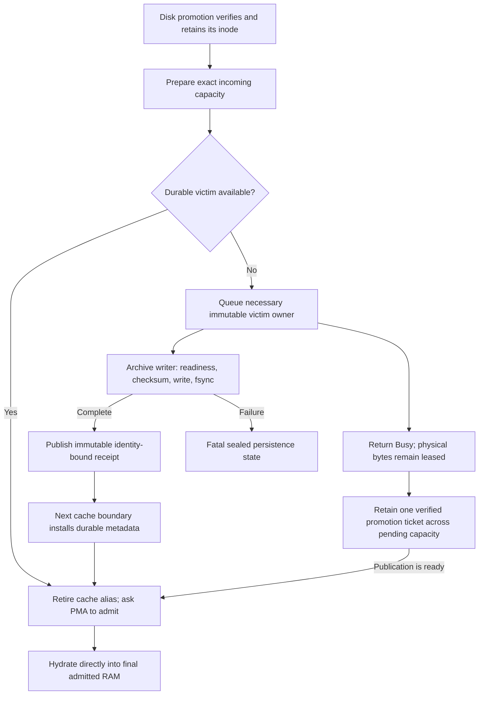

Validation preserves the one-block RAM/disk swap: asynchronous victim writes
can logically evict the record being promoted, so its verified descriptor must
survive until direct hydration. It also verifies physical alias retirement,
the actual background executor, queued same-key cancellation, richer MTP
replacement, bounded write volume and fatal I/O propagation. These are functional
tests, not performance tests, and the explicit
`V2_Integration_PrefixArchivePersistenceAdmission` registration joins
`ProductionTestPreflight`. The first candidate passed all 24 cache tests in
twenty repetitions (480 checks), the focused registrations and the rebuilt
686-test Unit inventory. Its real six-GPU replay nevertheless stopped red at
request 42: the third fresh 5,266-token prompt's terminal archive was skipped,
and its immediate repeat failed the required full restore. That is a cache
admission regression, not a native timeout or a certificate. No gate was relaxed.

The next negative control reproduces its selection error without a model:
an incoming 64-byte payload in a full 96-byte tier requires two 32-byte victims,
but the first candidate queued only one and remained Busy after that write
finished. The revised selection queues all and only the necessary victims.
One immutable `PrefixHarvestSchedule` carries the coordinator's common frontiers
to early preparation and actual execution. Participant-local geometry plans
both the reusable recurrent checkpoint and final prompt image, counting shared
attention/MTP records once and reusing admitted full-hit terminals. Preparation
starts before the first forward interval, while ordinary inference overlaps
the archive worker. Physical capacity still comes only from PMA; pending writes
never become a free-memory credit. A typed model serializer capacity bounds any
additional terminal extension without reading device state.

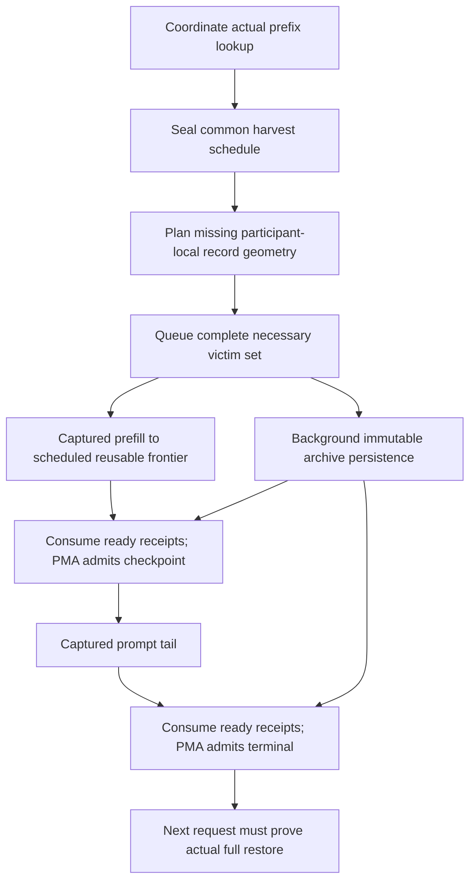

The revised candidate passes all eleven focused CTest registrations and all
26 cache tests in twenty repetitions (520 checks). Both rebuilt aggregate
gates are green: **686/686 Unit** in 78.44 seconds and **598/598 production
preflight** in 2,401.40 seconds, without failures or skips. The new rank- and
pipeline-preparation registrations preserve each participant's admitted
fingerprint while sharing the coordinator's immutable harvest schedule.
These model-free passes do not certify real archive availability: the next
six-GPU Release pressure lifetime retains the existing durable archive, strict
full/partial restores, recurrent/MTP-state checks and needle oracle. The original
captured-DECODE stall remains a separate, unproven cause; removing foreground
archive writes does not diagnose it.

### Required prefix publication ordering — 2026-10-02

The six-GPU Release pressure replay after those model-free gates crossed the
previous request-42 failure, then failed request 44 after 43 successful requests.
Request 43 restored 5,264 prompt tokens and executed only a 19-token extension.
The background victims still retained RAM when its 5,283-token terminal image
was due. Both continuation participants counted `ram_harvest_busy_skips`;
request 44 consequently restored only 5,264 tokens. Its answer was correct and
HTTP completed in 0.523 seconds, but the strict full-restore obligation failed.
Teardown and driver diagnostics were clean. This was a missing required
publication, not a captured-DECODE stall or evidence of numerical drift.

Early preparation alone cannot guarantee a short producer outlasts durable I/O.
The next implementation makes this ordering explicit: preparation remains
nonblocking, while required RAM/SSD publication completes only its specific
archive receipts and then rechecks PMA before allocating. Selected hydration
also completes known swap dependencies rather than manufacturing a miss. Native
readiness/checksum/write/fsync remain on the worker. Later unrelated mutations
are not joined; unknown retained physical owners cannot be credited as free.

Queued cancellation now marks a superseded put instead of prematurely publishing
a completed receipt. The worker releases that source before publishing its
cancelled outcome, preserving the same physical-ownership meaning as success
and failure. There is no global writer drain, sleep/retry policy, GPU stream
synchronization, extra payload buffer, or Busy-to-skip branch.

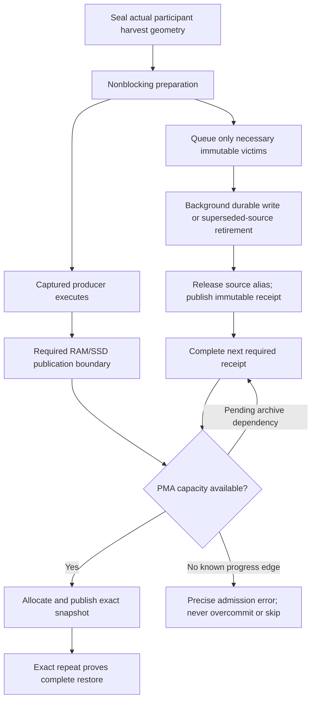

The focused regression forces the producer to finish before two victim writes,
then holds a later unrelated writer's source retirement. The terminal KV/GDN/MTP
image must still become fully restorable while that later receipt is pending.
Companion checks cover cancelled physical leases, empty receipts, fatal storage
failure, invalid/untracked owners, and a one-block PMA-backed hydration swap.
These cases are included in `PrefixArchivePersistenceAdmission` preflight.
Current-source aggregate gates and unchanged Release replay are required before
claiming this candidate fixes the real service interleaving.

Qualification correction: the first aggregate after this change was stopped
after `HIPGraphLaunchOrdering` failed its native entry/exit frontier checks.
Loader inspection showed `/opt/rocm/lib/libamdhip64.so.7`, not the staged,
patched ROCm 10 closure used by the preceding green gate and HTTP lifetime.
The inherited devcontainer `LD_LIBRARY_PATH=/usr/local/cuda/lib64:/opt/rocm/lib`
overrode qualification. This attempt is not current-runtime candidate evidence.
Both local build trees now record the selected closure in standard
`CMAKE_BUILD_RPATH`; qualification removes the inherited override and checks
HIP, HSA and COMGR resolution before running. No native runtime repair or
inference arithmetic changed for this correction. Repeat the focused native
ordering proof before restarting the complete Unit/preflight transaction.

The corrected qualification now binds the five-repair HIP prefix, source-built
RCCL and the same Core 10 SDK explicitly in `LD_LIBRARY_PATH`; loader inspection
also proves the build RUNPATH closure with the inherited override removed.
The complete cache suite passes **30 cases in each of 20 processes (600/600)**,
including the required-publication and selected-hydration interleavings. Native
launch ordering passes **all 220 cases in each of 20 processes (4,400/4,400)**;
the separate twelve-entry-root cases also pass twenty times. The refreshed,
correctly qualified Unit aggregate passes **686/686 in 78.80 seconds**. Both
gate dependency targets and the Release application were relinked against the
selected closure before these proofs. The full **598-entry** preflight then
passes **598/598 in 2,407.67 seconds**; neither a subset nor the wrong-runtime
attempt replaces it.
Evidence prefixes are `prefix-required-publication-cache-20`,
`prefix-required-qualified-{entry,native}-ordering-20`,
`prefix-required-qualified-unit-full` and
`prefix-required-qualified-preflight-full` in the same ignored result root.
The unchanged six-GPU pressure replay follows that aggregate; the
required-publication fix is not yet a model certificate.

The resulting `prefix-required-qualified-pressure.gVIHYM` lifetime passes
**406 requests and 20 complete cycles**. The former request-44 short-tail
failure now restores its entire 5,284-token terminal image in 0.228 seconds;
the changed nonce gives a one-token geometry difference from the earlier
lifetime, not a weaker restoration oracle. All 21 cold, 82 full and 21 partial
prefix probes completed before the next failure. The loop then fails request
**407**, cycle 21, `captured_json_03`: a preserved short conversation asking for
the remembered number 42. The follower aborts its coordinated PREFILL after
the unchanged 30-second transaction-ticket deadline. HTTP returns no response;
the later missing-rank, shutdown and memory failures are consequences, not six
independent inference defects.

The passive snapshot records discovery-rank-0 in native MPI progress with idle
GPU workers. It does not authenticate that PID as the execution continuation
root: automatic selection can reorder ranks, and healthy expert followers also
wait in MPI progress. The other rank's stack was not retained. This is distinct
from the earlier archive write stack and from the independently recorded
captured-DECODE stall. The
lightweight symbol-only collector cannot unwind beyond that first native frame,
so it does **not** identify the blocked collective or establish its cause.
A disposable model-free MPI wait demonstrates that ordinary GDB shared-library
discovery reaches `PMPI_Bcast` and its known application caller, while the
`-readnever`/restricted loader observations can produce truncated, bogus frames.
The next unchanged Release replay uses ordinary unwind discovery, suppresses
debug-script/network loading and prints the main thread first, inside the same
bounded post-stall callback. No inference or native-runtime repair is made from
the incomplete trace.

The midpoint driver observation was clean, but incorrectly finished the
original one-shot checkpoint rather than a diagnostic copy. The terminal
observer consequently rejects its closed lifecycle. Retain that as observer
misuse, not a clean lifetime driver certificate or a GPU-driver finding; the
replacement lifetime leaves its canonical checkpoint armed until teardown.
The correctly qualified Unit/preflight passes above remain valid. This failed
real-model lifetime does not certify the current implementation.

The replacement `prefix-required-qualified-ordering.1LWVO4` preserves the same
runtime, canonical cell, request order and prefix pressure. Its corrected
passive collector remains dormant through **885 completed requests / 44 complete
cycles**, including request 407. The lifetime was deliberately interrupted to
implement consumer-only prompt transport, not because an inference failed.
Its journal retains unfinished request 886; `first_failure` is null. The normal
harness retires both MPI ranks, checks the final driver bookend (no findings),
and retains clean server logs. A read-only midpoint observation also finds no
new driver records without closing the canonical checkpoint. This is interrupted
diagnostic evidence, not a completed lifetime or model certificate.

An additional device-free probe links the unchanged Release ticket transport
and executes **16,384 commands / 24,576 authenticated execution receipts**
without a barrier between commands. It alternates empty/full-hit commands and
one-to-three grouped-verifier transactions through the same two-slot ring.
Both ordinary MPI and the serving process's `mpi_leave_pinned=1` / Vader
single-copy-none settings pass (0.192 / 0.240 seconds). The existing integration
ring test deliberately barriers between commands; this extra diagnostic
removes that artificial edge without changing production ordering. It does
not exercise GPU graphs or establish the cause of the previous stall.
Evidence is `mpi-ticket-transition-probe{,-matched-mpi}.log` in the same ignored
result root. Neither a transport rewrite nor a new inference synchronization
is justified by these passing controls.

Native evidence: `rocm10-sdma-held-queue-negative-03.{log,native}`,
`rocm10-sdma-event-fixed-held-*.log`, `rocm10-sdma-event-contract-*.log` and
`rocm10-sdma-event-runtime-build.log` in the ignored result directory.

### Separate 122B distributed prefix-cache stall — 2026-10-02

The focused `Qwen35_122B_ROCm2_CPU2` end-needle reproduction now has root-rank
host stacks, rather than only the follower's timeout. At 00:24:57, 00:25:09 and
00:25:21 UTC the request thread is in `writeAll → rewriteArchiveLocked →
writeBlock → persistResidentToDisk → evictUntilFits → harvestPrefix → prefill`.
The write chunks are 8 MiB. GPU workers are idle; the maintenance thread is
sleeping normally. The follower fails its standard 30-second PREFILL ticket
receive at 00:25:21.712. No snapshot supports the earlier proposed GPU-worker
publication-cycle diagnosis for this lifetime.

The storage tier synchronously copied every active record while holding both
its process index mutex and archive flock. An archive near its 32 GiB active
budget could therefore make a valid distributed inference command silent for
longer than the protocol timeout. Repeated archive rewrites also churn large
host mappings; the independent USERPTR driver-warning investigation remains
open and is not declared resolved by this host-stack finding.

The implementation under validation replaces synchronous compaction with one
typed worker per shared archive. Immutable committed records are copied without
cache locks. The worker then copies complete append-tail records outside locks
and only publishes at an unchanged committed frontier. The foreground does not
wait for that worker. Verified hydration owns its exact inode descriptor across
logical eviction and cross-process rename. Foreground verification and copying
use disjoint halves of the existing, singly admitted 8 MiB scratch allocation.

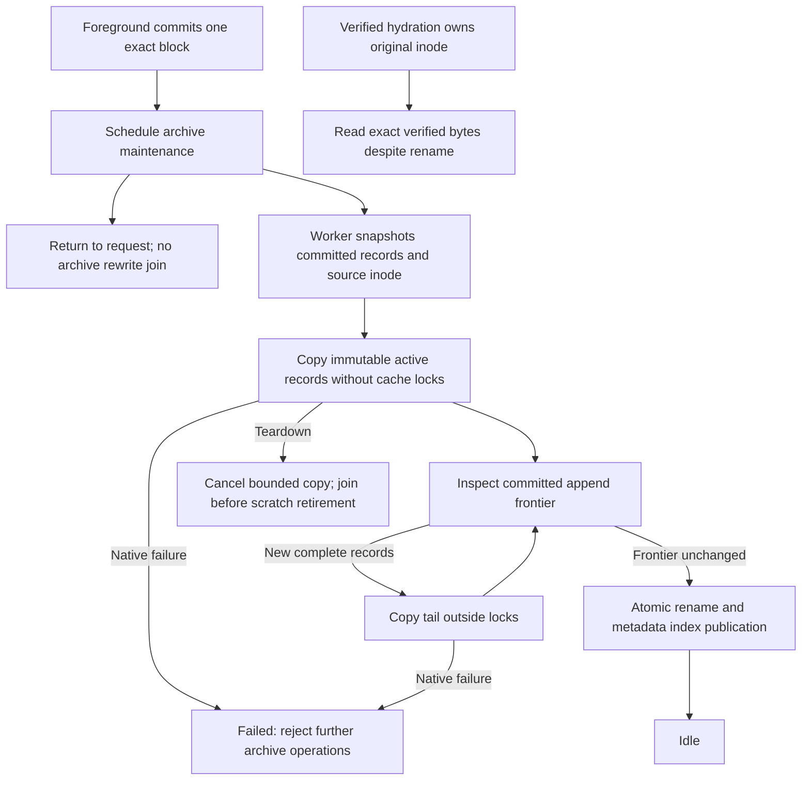

Focused functional regressions cover background executor identity, automatic
capacity-triggered compaction, concurrent appends/deletes and restart, durable
LRU, retained-inode hydration, and asynchronous failure propagation. They are
explicitly registered as `V2_Integration_PrefixArchiveBackgroundPublication`
in `ProductionTestPreflight`. The final implementation passes five focused
tests in **20 fresh CTest processes**, 100/100 GTest executions, 18.43 seconds.
The refreshed complete Unit gate passes **685/685**, 79.02 seconds. Both
canonical gate dependency targets and the Release server are rebuilt. A broad
all-target Integration build separately fails the optional third-party CK
roofline harness's memory-spill guard; that guard was not disabled or waived.
The exact 122B HTTP reproduction now passes **45/45**, including all eight
long-context checks, the 2,048-token structured generation, MTP/placement
evidence, prefix restore, clean shutdown, zero VRAM delta and no new driver
warnings. Its previously failing end needle completes in 65.995 seconds;
beginning/middle needles take 76.081/105.733 seconds and structured generation
takes 213.661 seconds. This is one lifetime, not the requested twenty-lifetime
stability proof. The full 21-cell aggregate remains to be rerun; targeted
coverage now includes one additional formerly red cell. Images are not certified.

This lifetime proves the new path actually ran: its `prefix_archive /
background_compactions` counter records one background publication from a
73,081,994,115-byte source to a 37,824,495,903-byte replacement. It is not a
compaction-free pass. The complete cell takes 813.33 seconds under its unchanged
900-second deadline. The six other previously red cells are being rerun once
each, serially, before any new aggregate certification or stability claim.

The optional CK build failure was traced to stale component discovery:
`CK_INCLUDE_DIR=/opt/rocm/include` resolved to ROCm 7.2.4 while the selected
compiler/runtime was Core 10. `ROCmSDKHeaders.cmake` now resolves optional
components only inside `ROCM_PATH` and retires cached alternate roots. The
actual Core 10 SDK has no CK headers; no incompatible component is borrowed.
The complete all-target Integration build subsequently passes with the spill
guard enforced. Two device-free CMake regressions prove absent-component and
present-component behavior against conflicting SDKs and a reused build tree;
their `V2_Integration_ROCmSDKHeaderDiscovery` entry is explicit preflight.
The SDK unit/discovery/full-compile-database gate passes **3/3**, 1.59 seconds.

The remaining-reds run completes **5/6 green** on the same Release binary and
native dependency closure. Together with the targeted ROCm2+CPU2 pass, six of
the preceding aggregate's seven red cells now pass complete HTTP lifecycles.

| Retried canonical cell | Result | Complete lifetime |
|---|---|---:|
| 122B CUDA2+ROCm4+CPU2 | 45/45, including its previously failing driver check | 321.05 s |
| 122B ROCm4+CPU2 | 45/45, including 2,048-token accuracy generation | 624.47 s |
| 122B CUDA2+ROCm4, no CPU tier | 29/45; movement/graph completion timeout | 202.94 s |
| Qwen38 CUDA2+ROCm2 TP+PP | 45/45 | 294.63 s |
| Ornith ROCm2 whole experts | 45/45 | 161.20 s |
| Qwen36 ROCm2 gate/up ownership + down columns | 45/45 | 122.67 s |

The complete report is `rocm10-post-prefix-remaining-reds.json`. These targeted
passes do not certify a fresh complete aggregate, twenty-lifetime stability or
a Docker image.

### Remaining GPU-only 122B movement stall

The CUDA2+ROCm4 server **does become ready** and answers the first eleven HTTP
requests correctly. It stalls on thinking exact-prefix repeat A, not during
startup. The first transfer warnings at 01:43:23.999 show native copy events
pending for five seconds on every ROCm participant. At 01:43:48.768 both ranks
reach their normal 30-second transaction/graph-terminal deadline. The driver
check is clean and teardown returns VRAM to its 42 MiB starting value.

The device-owned controller retains durable/admission epoch 7 and transaction
8 in `PreparingFollowers`. The bounded command has nine moves: two promotions,
two demotions and five same-priority moves, two cycles and 169,869,312 total
payload bytes. Both transport receipts remain unprepared. Each ROCm mapped
relay has six native copies in flight; no copy API error has been reported.
This evidence locates the blocked boundary but does not prove whether its
origin is native DMA/queue ordering or the production dependency DAG.

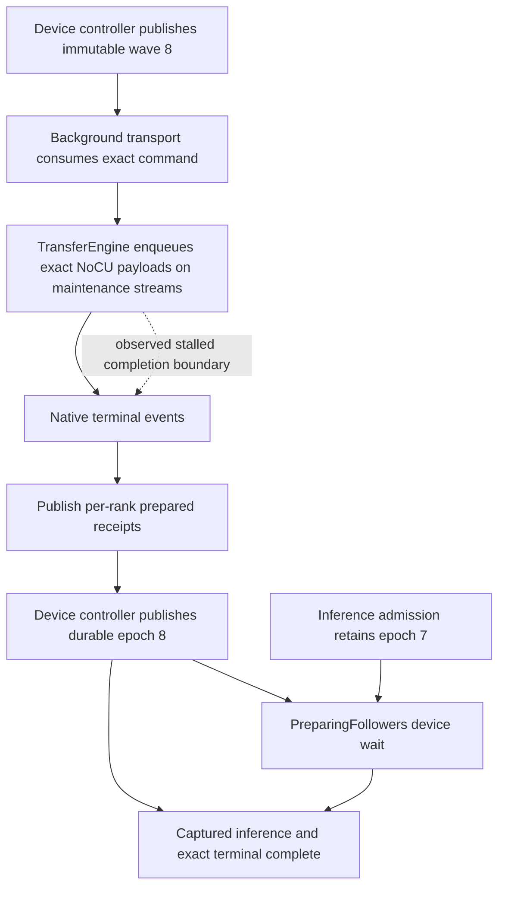

The isolated follow-up keeps the canonical model, placement, MTP and movement
policy. A passive observer attaches only after a real pending-copy warning and
captures host stacks, active dispatches and source-bound Core 10 stream/queue/
signal metadata before the standard timeout retires the processes. It performs
no inferior calls, tensor reads, replacement replay or scheduling overrides;
any attached lifetime is diagnostic rather than certification evidence.

### Earlier diagnostic evidence, before the SDK roll-forward

An earlier Release HTTP inventory completed 20 of 21 cells successfully. Its remaining
cell is Ornith 1.5 Q4_K_M, two ROCm participants, ordinal whole-expert ownership,
dynamic maintenance and dynamic-depth MTP. It intermittently stalls on the
streamed thinking `1 + 1` request after earlier prefix-cache requests succeed.
The projection-sharded expert mode is not selected in this cell.

Uninstrumented cold-start reproductions also stall on other JSON requests and
different device pairs. The two host workers wait while observing the captured
maintenance-ticket publication. That observation is a symptom, not proof that
the ticket protocol or RCCL originated the fault.

In the 2026-10-01 08:56 snapshot, one GPU executes an LL allreduce and its peer
has no active wave. The peer's queue contains a valid pending GDN dispatch,
followed by an invalidated interior dispatch and then more valid work, including
the matching allreduce. Earlier passive snapshots show a similar pattern.
Collective argument/order checks match, and sampled signals have ordinary zero
or one values, not negative/underflow values. These observations make native
packet publication a lead, not a proven causal diagnosis by themselves.

AMD documents the defective batch writer and its repair in
[CLR commit d7a3bf9](https://github.com/ROCm/clr/commit/d7a3bf9b94b56dea4891dcb744005d5d94ee8e21).
Interior valid headers can become visible while their bodies are being copied;
the command processor can prefetch them despite the first packet's invalid
header. This defect exists in our pinned CLR revision.

## Lifecycle audit and narrow repair

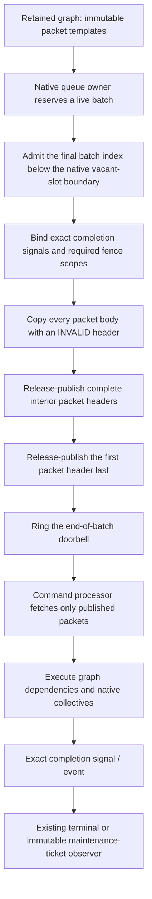

The repair changes native admission and publication, not the Llaminar graph/state
machine. It adds no host execution state, serial replay, recapture, additional
GPU wait, smaller batch policy or alternate transport. Existing completion
signals, system acquire/release scopes, independent queues and the pinned
end-of-batch doorbell correction remain intact. This removes an unsafe
publication assumption instead of adding another orchestration lifecycle.

The queue mask is `N - 1` for an `N`-slot ring. The single-packet and barrier
writers wait while `index - read >= N - 1`. The batch writer instead waited
while `last_index - read > N - 1`, admitting equality and therefore one extra
physical packet. Matching the existing native contract changes only that
comparison, preserves the batch size and costs one ring slot. All completion
signals and graph dependencies retain their existing execution order.

## Release provenance

The latest release, `2026-09-27.1`, was certified from tree
`c241952773356d2d294843f3b281a3eed49f9897`. Its installer and our current installer
both pin CLR `fe5035afc8713dfc6adedd3c00c4306c93a160f8`; neither previously
included AMD's packet-publication repair. The release's node-identity patch does
not change this batch writer. Thus the defective publication routine predates
this branch's staged changes.

That source provenance does **not** establish whether this exact HTTP stall
occurred in the release or whether changed graph/concurrency geometry exposed
it more readily. One matched last-release cold-start diagnostic passed all
70 checks; that single pass does not establish immunity.

## Validation ledger

Evidence through 2026-10-01 14:12 UTC (chronological; earlier passing artifacts
are not certificates for the final runtime):

- Isolated, rebuilt native runtime: two fresh diagnostic server lifetimes,
  70/70 checks each, 94.8 and 94.1 seconds; ordinary shutdown succeeds.
- Full HTTP reproduction: first post-backport lifetime passes all 45 checks,
  including eight full long-context checks, real movement evidence, prefix
  restore, tools, clean teardown, VRAM reclamation and driver health.
- Full Unit gate: 684/684, 77.6 seconds.
- Installer/package reuse tests: 3/3; old partial receipts fail authentication.
- New `V2_Integration_HIPGraphBatchPublication` registered explicitly in
  `ProductionTestPreflight`. Its initial version passed on the old runtime in
  4.0 seconds; this alone is not an independent reproduction of the race.
- The full HTTP loop stopped at its second lifetime: every inference check
  passed, but the driver emitted `amdgpu_amdkfd_restore_userptr_worker` CPU-hog
  evidence. That lifetime is red; the warning is not allowlisted.
- The model-free native proof subsequently stalled without any model, MTP or
  RCCL. The header-publication backport alone is therefore insufficient.
- The same native proof stalled on the exact HIP DSO extracted from the latest
  published AVX-512 image (four passing fresh processes, then a fifth stalled
  process). Both controls used the explicit ROCr host-memory ABI. This proves
  a released native-runtime failure, not yet the exact original HTTP cause.
- Passive metadata shows one full native queue with no running GPU waves;
  three other queues wait for its pending completion. Dispatch geometry is
  valid. The batch writer admits one more physical ring slot than the native
  single-packet writer: its final reserved index uses `>` rather than `>=`
  against `queueSize - 1`.
- An isolated one-character boundary control matching the single-packet
  writer passes **20/20 fresh native lifetimes**, approximately 3.6 seconds
  each. Withdrawing only that correction reproduces the native stall on fresh
  process six, while header publication remains repaired. This is a causal
  native-runtime A/B, not a completed full HTTP certificate.
- Complete preflight, full HTTP twenty-lifetime stability, timing comparison
  and causal certification remain pending. The installed host DSO has not been
  replaced.
- The canonical installer has now built an isolated Release DSO with the whole
  repair, and its authenticated patch receipt matches the source. Focused native
  graph identity, queue placement and packet-publication preflight tests pass
  **3/3** in 7.8 seconds against that installed artifact.
- The original full HTTP cell passes **45/45** in 133.8 seconds against that
  artifact. All eight long-context checks, tool calls, prefix restore, actual
  expert movement, normal shutdown and zero retained VRAM delta pass. A temporary
  kernel trace records zero user-pointer evictions/restores throughout that
  lifetime; no driver warning occurs. This is diagnostic confirmation, not the
  uninstrumented twenty-lifetime certificate.
- Both temporary owned kernel probes have been removed. The required full
  uninstrumented twenty-lifetime run has started, using the same installer-built
  DSO and frozen manifest. It does not rerun Unit/preflight for each lifetime.
- That run stops red on lifetime **two**: lifetime one passes 45/45, while
  lifetime two stalls on the thinking exact-prefix repeat (request 12). The
  fifteen-minute cell watchdog retires the complete process group. This is
  **one pass and one failure**, not a completed twenty-lifetime certificate.
- Passive snapshots of this failure show both selected GPUs running native LL
  allgathers. One is still in the 2,048-byte maintenance plan gather while its
  peer has reached the following 256-byte header gather. Their queue pending
  extents are only 334/335 packets, far below the 16,384-slot capacity; sampled
  completion signals are ordinary zero/one values. No new driver warning is
  recorded. This differs from the earlier full-ring/no-wave native failure.
  Collective counts alone do not prove the originating defect: LL slot progress
  and actual retained graph ordering still need to be matched on both devices.
- The combined native repair therefore fixes an independently reproduced
  runtime defect but is **not sufficient** to certify the original HTTP cell.
  Maintenance/forward collective sequencing, native LL payload publication and
  retained graph identity remain under investigation. No production ordering
  workaround or additional synchronization has been installed.
- A subsequent full HTTP diagnostic completes all inference, accuracy, prefix,
  tool, movement, memory and teardown checks, but fails driver health: **44/45**.
  The USERPTR restore-worker CPU-hog warning occurs at 10:12:45.247, before the
  first HTTP request at 10:12:46.149. Investigation must include registration
  during startup; attributing this warning to a later prefix operation is wrong.
- The next five fresh full HTTP lifetimes pass **5/5, 225/225 checks**, about
  133 seconds each. Their automatically selected physical pairs are ROCm 0/1,
  0/2, 1/2, 2/3 and 2/3. Passing evidence therefore includes the original failed
  pair, not only different hardware. These diagnostics are not the required
  twenty-lifetime post-fix certificate and do not explain the preceding stall.
- Bounded kernel traces cover 55 seconds of warm HTTP requests and 180 seconds
  spanning two full-server startups. Neither records a USERPTR eviction,
  invalidation or restore. Zero events mean the driver failure did not reproduce;
  they do not establish a registration repair. All owned probes were removed.
- A short warm-server diagnostic completes 19 fourteen-request cycles before
  being deliberately stopped with normal server shutdown. A separate cold-start
  diagnostic passes **20/20 independent fourteen-request lifetimes**. Keep these
  280 short HTTP checks distinct from full E2E certification.
- The graph audit exposes a second independently reproducible native contract
  violation in `GraphExec::EnqueueSegmentedGraph`: independent roots on auxiliary
  queues bypass preceding launch-stream work. In the focused regression the
  launch-queue root sees epoch 20, while an auxiliary root executes all twenty
  replays before the producer and sees epoch zero throughout.
- `V2_Integration_HIPGraphLaunchOrdering` expands three entry contracts over
  widths 2, 3, 4 and 8. The previous combined runtime fails **8/12**: all
  same-stream and external-event producer cases. The four parent-node cases
  pass. The exact latest-release HIP DSO produces the same **8/12 failures**;
  this native ordering defect therefore predates the branch. It remains
  unproven whether this is the origin of the original full HTTP LL stall.
- `rocm-hip-graph-entry-ordering.patch` retains one incoming launch command and
  lets only auxiliary root segments consume it through native nonblocking
  markers. Siblings remain independent. RAII owns the command reference on both
  normal and failed submission paths; no new DGO state, host wait, recapture,
  queue cap or transport policy is introduced.
- That narrow repair passes **12/12 cases in twenty fresh native processes**
  (28.8 seconds total). Both diagnostic kernels have zero SGPR/VGPR spills and
  zero private bytes on the shipped gfx906 target.
- The canonical installer builds and authenticates all four graph repairs in
  `hip-native-entry-install/`. Identity, physical queue placement, complete
  packet publication and entry-ordering regressions pass **4/4**, 9.2 seconds,
  against its actual DSO. Package/reuse tests pass **3/3**. Full Unit passes
  **684/684**, 77.2 seconds; the full production-preflight gate is running once
  against this artifact. The installed host DSO remains unchanged.
- The entry-only artifact completes the full production-preflight gate:
  **572/572**, 2,153.6 seconds. Subsequent adversarial exit testing exposes a
  coverage hole, so this result is not reused as the final-runtime gate.
- The packet scheduler reconstructs queue tails from segment dependency levels
  in an unordered map. Several independent segments at the same level can reuse
  one FIFO; the highest graph level is not its last submission. A native
  width-14 proof delays each root in turn and observes the missing root on the
  GPU in the following operation, before host readback. Initialization is
  explicitly complete before the graph, isolating exit ordering from the entry
  defect. The entry-only DSO fails **6/28** direct/child exit cases; the exact
  last-release DSO fails **4/28**. Thus this exit defect also predates the branch.
- The canonical fourth patch now records each FIFO's actual last submitted
  command at enqueue time, removes the redundant depth-based reconstruction,
  and returns the launch stream's joined command to nested consumers. Every
  segment reference follows one cleanup path. The existing native marker DAG,
  packet batching and physical queue bound are preserved; no host wait or
  participant lifecycle flag is introduced.
- `V2_Integration_HIPGraphLaunchOrdering` now expands **220 cases**: twelve
  producer/entry cases and 208 direct/child exit cases. The exit sweep covers
  widths 4, 8, 14, 16, 30 and 32, delaying every root. All four diagnostic
  kernels have zero SGPR/VGPR spills and zero private bytes on gfx906.
- The canonical installer rebuilds the combined artifact in
  `hip-native-frontier-install/`. The four focused native preflight tests pass
  **4/4**, 19.4 seconds; all **220 cases pass in twenty fresh processes**,
  231.3 seconds, with an authenticated clean driver-health bookend. The full
  Unit gate passes **684/684**, 76.9 seconds; package/reuse tests pass **3/3**.
- The original full HTTP cell has started its required twenty fresh lifetimes
  against this final isolated artifact, without per-lifetime Unit/preflight
  reruns. Full HTTP stability, the final full-preflight gate and timing remain
  pending. The entry/exit A/B proofs establish native defects, not yet the sole
  cause of the earlier HTTP LL stall. No system HIP DSO has been replaced.
- That full loop stops on lifetime **eleven**: the first ten pass **45/45**,
  while eleven passes every inference, accuracy, prefix, movement, tool,
  memory and teardown check but fails driver health (**44/45**). The aggregate
  is **10 green, one red, 494/495 checks** across eleven completed lifetimes,
  not a twenty-lifetime certificate. No inference stall occurs in these eleven
  lifetimes. At 12:14:04–12:14:07 UTC the USERPTR restore worker emits four
  CPU-hog warnings during long generation. A concurrent integration rebuild
  is a possible source of memory pressure, not yet a causal diagnosis.
- A freshness audit finds test objects older than branch-wide tensor/header
  changes. Earlier Unit/preflight executions cannot certify those current
  sources merely because a focused native fixture was rebuilt. The unrestricted
  integration build refreshes the pending objects; its only remaining failure
  is the optional CK/hipBLAS INT8 roofline benchmark's spilling CK templates,
  not a production inference target. The two canonical gate dependency targets
  then build cleanly. The fresh full Unit suite passes **684/684**, **81.2 s**.
  Current-source full preflight remains pending.
- A bounded diagnostic now records USERPTR invalidation ranges, owning PIDs,
  restore counts and kernel call chains while the same full HTTP cell runs.
  The actual host module and its ABI determine probe offsets; temporary probes
  are removed at recording completion. Its result cannot substitute for the
  uninstrumented post-fix full-lifetime loop.
- Three complete diagnostic server lifetimes subsequently pass **45/45** each,
  in 141.9, 134.1 and 133.3 seconds. Their probes are diagnostic only, not the
  required uninstrumented stability certificate. The first trace records
  **4,180 invalidations, 4,180 evictions and 358 restores**. Kernel call chains
  attribute every recorded invalidation/eviction to `kcompactd` migration;
  owning-PID and mapping evidence identify RCCL's deleted `/dev/shm/nccl-*`
  file-backed transport mappings. These are real memory registrations, not
  inference activation-buffer copies. The final trace sees no eviction/restore
  and therefore cannot independently establish the warning's cause.
- A query-only control using the old transport implementation fails all four
  new storage assertions, while its captured arithmetic and live-range guards
  pass. The observed connections are registered-file storage rather than
  native pinned storage. This distinguishes the implementation under test from
  an output-only proof that could accidentally certify the old path.
- The source-bound `rccl-native-host-storage.patch` now gives **same-process**
  SHM connections a native portable, mapped pinned allocation. Actual host and
  process identity choose that storage; cross-process connections retain real
  shared-memory IPC. P2P/network control-map callers explicitly retain the
  cross-process contract. This changes neither transport protocol nor capture,
  channel count, message extent, hot-path fences or inference lifecycle.
- A typed storage descriptor and one reference-counted allocation owner replace
  the legacy boolean. Creator-first and importer-first retirement both release
  the backing allocation only after its last owner retires. A passive, versioned
  ABI reports the observed endpoint kinds; its byte counts are not a physical
  memory ledger or a second admission authority.
- Fresh upstream worktrees apply the complete three-patch RCCL chain cleanly;
  all six changed native files match the working implementation. The installer
  is idempotent, packaging tests bind the patch hash and ABI to the build, and
  the configured vendor DSO has been rebuilt. The global HIP DSO is unchanged.
- The new `V2_Integration_RCCLHostTransportStorage` passes **4/4** cases in
  **6.1 seconds**, proving two- and four-GPU captured replay, partial live
  extents, both retirement orders, native pinned connections and zero registered
  file connections. **Twenty fresh processes** then pass the same four-case
  proof, with **zero new kernel records** in the authenticated driver interval.
  This remains a focused transport certificate, not twenty full HTTP lifetimes.
- Device-free dependency/admission and source-packaging regressions pass **3/3**
  CTest entries. All production regressions have explicit
  `ProductionTestPreflight` registration. The refreshed full Unit gate passes
  **684/684 in 77.9 seconds**; current Integration gate targets and the Release
  application both rebuild successfully. The **575-test** production preflight
  is running once against the exact repaired HIP and pinned-storage RCCL DSOs.
  Full HTTP stability and timing remain pending.

## Graph-entry lifecycle audit

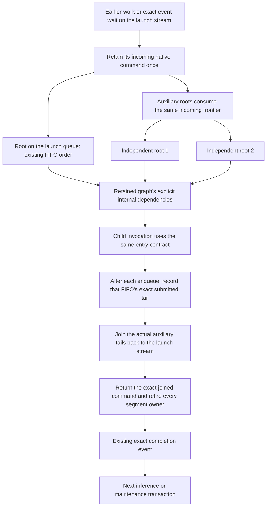

The classic HIP scheduler already imports the incoming launch frontier. The
packet scheduler must obey the same public contract. The repair consolidates
that boundary in the native owner instead of adding participant/rank lifecycle
flags or caller-specific event workarounds. The public exit join is retained,
but its reconstructed graph-depth map is removed: only actual enqueue order
can define a reused FIFO's tail. Returning that joined command also makes child
completion use the same boundary as top-level completion. No additional total
ordering between independent roots is necessary. Full original HTTP stability
remains a separate required proof.

## Native RCCL transport-storage lifecycle

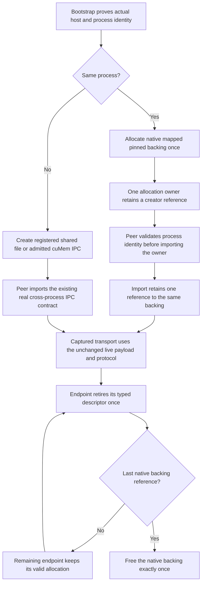

The placement decision belongs to the transport's bootstrap owner, not a model
graph or benchmark override. A native pointer is never offered as cross-process
IPC. The owner refcount permits either endpoint retirement order without new
graph events, host waits, process-wide serialization or an inference state
machine. Storage observations remain passive and are explicitly separate from
`PhysicalMemoryAuthority`'s canonical allocation accounting.

Artifacts remain under the ignored
`parity-results/qwen36-rocm2-prefill/native-live-extent/` directory. The full
header-only loop report is `ornith-rocm2-batch-publication-full-e2e-20.json`;
the combined-repair loop is `capacity-full-http-20.json`, and its installer
artifact is under `hip-native-capacity-install/`;
the pre-backport aggregate is `native-context-full-http.json`. The final combined
entry/exit loop is `native-frontier-full-http-20.json`, its native stability log
is `native-frontier-complete-20.log`, and its artifact is under
`hip-native-frontier-install/`. Do not count
short request loops, warm-server checks or pre-backport passes as the required
twenty fresh full E2E lifetimes.

Pinned-storage evidence is in `rccl-host-storage-native-regression.log`,
`rccl-host-storage-native-20-*.log`,
`rccl-host-storage-native-20-driver-report.json`,
`rccl-host-storage-device-free-gate.log` and
`rccl-host-storage-current-source-unit.log`. The running full gate is
`rccl-host-storage-current-preflight.log`; the old registered-file red control
is `rccl-host-storage-authenticated-registered-control.log`.

## ROCm Core SDK roll-forward — 2026-10-01

The user authorized rolling forward rather than maintaining the older HIP
backport stack. `scripts/docker/rocm-release.env` now owns the SDK package,
matching systems/libraries source revisions, HIP build identity and stable SDK
alias. The upgrade is staged under `/tmp/llaminar-rocm-10.0-stage.IxXZGOA8/`;
the installed system SDK, host driver and running services remain unchanged.

The pinned Core SDK incorporates the prior graph-identity, hardware-queue,
batch-publication and graph-frontier repairs. A remaining native defect is
independently reproduced: an empty captured segment can consume a completion
signal without submitting any packet that publishes it. The local repair keeps
the existing ordered completion barrier when an empty segment requires that
signal. It adds no host synchronization or new graph lifecycle. The issue,
minimal reproducer, exact system information and patch are published as
[ROCm/rocm-systems#12638](https://github.com/ROCm/rocm-systems/issues/12638).

### Fresh upgrade evidence

- The canonical installer builds a Release HIP DSO with only the outstanding
  empty-segment repair. Its authenticated reuse path succeeds without another
  build. Twenty fresh native processes pass the new empty-segment regression,
  covering sixteen direct/child, receipt/empty and fork-width cases each:
  **320/320 cases**, **14.9 seconds**, and **zero new driver records**.
- The source-built gfx906 rocBLAS/Tensile closure completes all **485 build
  commands**. The matching host DSO, all generated device binaries and dispatch
  metadata are installed together; authenticated installer reuse succeeds.
  This is not a foreign kernel-pack graft or an FP32-only build. Functional
  floating-format BLAS coverage on the new stack remains part of preflight.
- The separate project-patched RCCL source build completes all **401 commands**
  against the new SDK. Its existing compact collective, capture-event and
  pinned-host-storage contracts remain selected; runtime preflight is pending.
- The production-pipeline/package Unit tests pass **225/225**, **3.4 seconds**.
  They do not replace the full current-source Unit or device preflight gates.
- The final complete new-stack Unit run passes **684/684**, **77.3 seconds**.
  The first attempt passes 683 cases and fails only the build-flags test because
  this isolated configuration omitted `compile_commands.json`; enabling the
  compilation database fixes that setup error and the complete rerun is green.
- LLVM 23 exposes genuine memory spills in epoch acquisition, NativeVNNI
  schedules and persistent attention. The guard remains enabled. Exact epoch
  launch bounds, bounded dot-product temporary groups and phase-local address
  lifetimes remove the reported spills without reducing concurrency, changing
  formats, increasing workspaces or changing floating-point order.
- The expanded captured NativeVNNI regression finds a pre-existing whole-row
  scale-ordering gap: GEMM scaled after the partition fold, while serial GEMV
  scales each partition before folding. The corrected all-format blockwise and
  whole-row proof passes in **33.3 seconds**, with **zero new driver records**.
- An additional signed-zero negative control proves the reducer's initial
  positive-zero addition is also observable: assigning the first partial
  retains negative zero where the serial reducer produces positive zero.
  Both grouped families now use the same zero-initialized ordered fold with no
  first-partition special case. Its fresh all-format proof passes in **45.4
  seconds**, with **zero new driver records**; the earlier 33.3-second pass is
  not reused as evidence for this later change.
- Both final kernel regressions pass together in **38.8 seconds**, after the
  final Integration rebuild: NativeVNNI covers both scale modes and signed
  zero; captured attention covers FP32, FP16, BF16 and Q8_1. The driver observer
  records no new warnings. The formerly spilling HD128 attention variants use
  **67–68 VGPRs**, down from 128, with **zero private memory**. This is resource
  and correctness evidence, not yet a throughput certificate.
- Runtime closure inspection exposes hipBLAS resolving `librocsolver.so.0`
  from the old system SDK. The new `blas-host` package omits its direct solver
  dependency. Every shared installer profile now explicitly includes the
  matching pinned `solver-host` package; the executable package-boundary test
  also runs in the BLAS packaging preflight. Fresh staged loader inspection
  proves no old-ROCm or unresolved library remains.
- A first unprofiled Release Auto sweep passes **24 grouped GEMM points** across
  Q4_1, Q6_K, IQ1_S and IQ1_M, three real projection geometries and M=16/64.
  All report **zero byte mismatches** and **zero scratch bytes**. The initial
  attempted M=1 point is invalid for this prefill resource-probe harness, which
  expects a GEMM producer; it is retained as a tooling-input failure, not an
  inference failure. Serial-M1 correctness is covered by the focused regression.
- The matched SDK's `rocprofv3` successfully traces one retained IQ1_M graph and
  one formerly spilling HD128 attention graph. The IQ1_M hardware counters cover
  exactly one captured producer dispatch: zero scratch, 68 hardware-allocated
  VGPRs (65 logical), 5,179.7 KiB fetched, 78.7% memory-unit busy and 0.043%
  memory-unit stalled. Counter interception reports a profiler-only queue-ring
  replacement; its timings are not used as the throughput certificate.

### Shared thread-admission failure found by full preflight

The upgraded full preflight run exposes the same native admission abort across
captured channels, projection transfers and ROCm collective graph creation:
`pthread_create() failed` during graph instantiation. The fixed 256 KiB
`CQ_THREAD_STACK_SIZE` cannot hold a valid full-backend client's initial ELF
TLS. Device-free probes isolate the cause: the real linked client returns
`EINVAL` with that fixed stack and succeeds with the native pthread default;
a separate 384 KiB TLS probe reproduces it without GPU initialization.
This is not PID exhaustion, device-memory exhaustion or a graph-ordering error.

Upstream already fixes this exact defect in
[commit ccc4faf](https://github.com/ROCm/rocm-systems/commit/ccc4faf7c7517f3e970ac849cc77f38a41d4f45a)
([PR #9643](https://github.com/ROCm/rocm-systems/pull/9643)), merged on August 10.
Both published `therock-10.0` and `therock-7.14.1` sources still retain the
fixed stack flag. The canonical installer now backports those three CLR changes
verbatim: remove the flag and use the existing native-default stack contract
for the command-queue and hostcall workers. No duplicate upstream issue is filed.
Capture, packet batching, queue counts and dispatch concurrency are unchanged.

`V2_Integration_HIPHostThreadStack` is explicitly registered in
`ProductionTestPreflight`. Its standalone executable retains a real 384 KiB
ELF TLS segment and captures the production 32/64-bit timeline write/wait
operations plus a cold diagnostic branch that requires HIP's native hostcall
listener, then replays through alternating explicit streams. Timeline commands
alone pass against the broken runtime and do not certify worker admission.
The final
upstream-backported DSO is built in a separate staged prefix; no live runtime
has been replaced. The original timeline-only test passed against the broken
runtime and is not a meaningful negative control; the tightened fixture forces
the diagnostic hostcall ABI before claiming worker-admission coverage.
The corrected fixture aborts against the original runtime at native worker
creation and passes against the upstream backport. Its fresh-process proof is
included in the final four-regression run below; the weaker timeline-only
control is preserved but is not counted.

The first complete upgraded preflight finishes **505/577 green**, **72 red**,
in **1,980 seconds**, with **zero new driver records**. Most failures are that
same TLS abort, not independent numerical defects. The complete current Unit
gate passes again **684/684**, **80.1 seconds**, after the stack repair and its
packaging changes. Retesting the failed cells clears the captured channels,
cross-vendor pipeline domains, CPU/GPU arithmetic and four-GPU projection
paths. The separate cached parallel-branch ordering proof is still red.

### SDMA stream-owner exhaustion found by the retest

Mapped maintenance verifies the first two owners' bytes correctly while later
owners lose their copies. The pinned SDK's `SdmaEngineAllocator` insists on
exclusive engine assignments, then returns an empty mask after the finite
physical engine count is exhausted. Required NoCU transfers reject that mask;
later completion markers can still advance. This explains why checking only a
successful terminal event does not prove the bytes arrived.

Upstream already fixes that allocator in
[commit 8c10537](https://github.com/ROCm/rocm-systems/commit/8c1053773aed9a2e90585af3ced0b62e288af7a7)
([PR #9652](https://github.com/ROCm/rocm-systems/pull/9652)), merged on August 6.
The `therock-10.0` source still has the exclusive-only implementation. The
canonical installer backports the exact two CLR changes, preserves exclusive
affinity while available and shares valid engines when oversubscribed. ROCr's
hardware ring orders DMA submissions; no host wait, graph serialization,
larger queue cap or compute-blit substitution is introduced.

`V2_Integration_HIPSDMAStreamSharing` is explicitly registered in
`ProductionTestPreflight`. The native fixture keeps 32 stream owners alive,
checks mapped round trips and captured device copies, varies live extents from
empty through full pages, verifies guards and retains its graphs for twenty
replays without per-copy host joins. The three-repair DSO is built in
`hip-sdma-sharing-final/`; authenticated installer reuse and the three packaging
Unit tests pass. The original runtime reports an empty SDMA engine mask and
required-copy error 4104, then fails the byte assertions on later owners.
The backport passes all three cases. All seven formerly failing production
copy/maintenance entries pass together in **57.4 seconds**, with zero new
driver records. No duplicate upstream issue is filed for either known-fixed
defect.

### Finite-work graph collapse must preserve independent progress

The remaining cached parallel-branch regression has a different cause. Core
10's native barrier-ROI heuristic counts an opaque child graph as one finite
unit of work. It collapses a small parallel parent onto one FIFO. In the
reproducer, `Worker` waits for `Close`, but the collapsed queue submits Worker
before Close: neither can progress. The declared parent is a valid partial
order; its child contains an additional device-side progress obligation which
the cost model does not inspect.

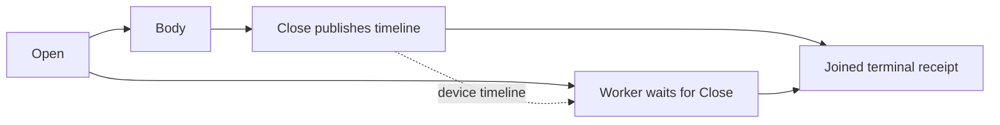

The same native test fails with the default heuristic and passes with the
diagnostic `DEBUG_HIP_GRAPH_MIN_OVERLAP=0` control. That override is not a
production fix. `rocm-hip-graph-progress-safe-collapse.patch` instead establishes
finite-work eligibility before applying ROI: child graphs, host callbacks,
event/semaphore waits and 32/64-bit batch-memory waits retain their declared
parallel streams. Finite compute, copies and write-only batches retain the
existing optimization. No extra event, queue limit, host synchronization,
serial replay or scheduler override is introduced.

`V2_Integration_HIPGraphWaitConcurrency` is explicitly in
`ProductionTestPreflight`. It covers flat/child graphs and both timeline widths,
with twenty retained replays and bounded test-only cancellation after a failed
progress observation. The unfixed runtime fails the two child cases; both flat
cases pass and remain useful coverage. The repaired runtime passes all four.
The standalone `tests/v2/repro/rocm/hip_graph_wait_progress.hip` uses only native
write/wait operations and nonempty children, so it can isolate this repair from
the separate empty-segment completion defect. The exact standalone executable
fails on the stock released runtime (`1,1,0,0,0`) and passes both the diagnostic
counterfactual and the repaired runtime (`1,1,1,1,1`), with zero new driver
records. The complete reproducer and exact patch were submitted upstream as
[ROCm/rocm-systems#12669](https://github.com/ROCm/rocm-systems/issues/12669).

### One SDK must own compiler, headers and device bitcode

Compiler relocation was not sufficient to bind the upgraded SDK. A `clang++
-###` audit found new LLVM/device bitcode but old implicit `/opt/rocm/include`
headers, including HIP-compiled `.cpp` files. CMake's implicit-include metadata
could obscure that mismatch. The HIP compile/link policy now binds both
`--hip-path` and `--rocm-path` to the configured `ROCM_PATH` for every target.
No second environment-owned SDK root is introduced.

The complete compile-database validator rejects missing, conflicting or wrong
roots, and checks HIP-compiled C++ as well as `.hip` sources. Its seven negative
and positive unit controls pass. `V2_Integration_ROCmSDKCompilerBinding` is an
explicit preflight metadata proof and requires no compiler SDK in the installed
test runner. The original generated commands fail; the corrected commands pass.

### Latest source-bound gate evidence

- Complete Integration Unit/preflight dependency rebuild: **755 commands**,
  successful, with exact SDK roots and the spill guard still enabled.
- Complete current Unit gate: **685/685**, **78.73 seconds**.
- Four focused native entries, each repeated in **20 fresh processes**:
  HostThreadStack, SDMAStreamSharing, GraphWaitConcurrency and the exact
  CachedGraphReplay parallel-branch case. All **200 GTest executions** pass in
  **56.35 seconds**, with **zero new driver records**. This is not the full
  twelve-case CachedGraphReplay suite or a full HTTP lifetime proof.
- The final installer-built DSO is isolated in `hip-progress-safe-final/` and
  includes only the four outstanding authenticated repairs: empty completion,
  upstream TLS stack, upstream SDMA sharing and finite-work collapse safety.
- The complete updated **581-entry ProductionTestPreflight** passes against
  that artifact in **2,421.49 seconds**, with **zero new driver records**.
  No earlier subset is substituted for this aggregate.
- Refreshed Release application build: **115 commands**, successful. Both
  explicit HIP SDK roots are validated. A stale local empty CUDA Release-flags
  cache entry is restored to `-O3 -DNDEBUG` before compilation; no throughput
  gain is inferred from that configuration correction. Loader inspection binds
  HIP to the four-repair prefix and hipBLAS/rocBLAS/rocSOLVER/ROCr to the same
  Core 10 SDK, with no unresolved or old-system ROCm dependency.
- The final four-repair installer's authenticated reuse path succeeds without
  rebuilding or replacing the DSO. Its receipt is the same source/patch/library
  identity used by this gate.
- The complete Integration Unit/preflight dependency set also compiles for
  every shipped CUDA target (**SM80/86/89/90**) in **735 commands**, with the
  memory-spill guard enabled. The six compiler-binding and spill-receipt
  metadata entries pass afterward in **1.48 seconds**. This is compile/resource
  coverage for those targets, not runtime coverage on absent cards; the native
  581-entry runtime aggregate above preceded this fat-binary rebuild.
- The original two-MI50 Ornith Q4 HTTP stall cell passes **20/20 fresh full
  server lifetimes**, **900/900 HTTP checks**, in **3,300.88 seconds**. Every
  lifetime runs all eight long-context checks, including 2,048-token structured
  generation, prefix restore, tool calling, authoritative movement evidence,
  driver-health bookends and clean shutdown/VRAM reclamation. No warm-server
  request loop is substituted for this proof. The unfiltered 21-cell HTTP
  matrix is now running against that same native Release/runtime closure.
- The AVX-512 full-matrix test-runner image compiles **2,365 Integration build
  steps** and **701 Release build steps**, including shipped CUDA targets and
  the matching gfx906 rocBLAS/Tensile closure. Both image targets build, but
  discovery rejects incomplete cross-host planning metadata: the real C++
  exporter omitted `planning.mpi_ranks` even though its typed topology contains
  the complete membership. This is a build-phase admission failure, not an
  inference failure or an image certificate.
- A new device-free regression fails against that exporter before the repair.
  The exporter now derives planning membership from the same sealed
  `ModelParityRemoteCPUHosts` authority as topology membership. It passes for
  CUDA and ROCm, both public frontend routes, and 1/2/3/8 remote hosts. The
  focused C++/Python/pipeline gates pass **4/4 in 4.40 seconds**; the rebuilt
  real inventory also admits all **four canonical cross-host scenarios**.
  `V2_Integration_CrossHostE2EPlanningMembership` is registered explicitly in
  `ProductionTestPreflight`. Synthetic Python fixtures alone had not detected
  the missing field at the actual C++ serialization boundary.

Source-bound evidence uses `rocm10-sdk-bound-integration-build.log`,
`rocm10-sdk-bound-full-unit.{log,xml}`, `rocm10-sdk-bound-native-20.{log,xml}`,
`rocm10-sdk-bound-native-20-driver.json`, and
`rocm10-sdk-bound-full-preflight.{log,xml}` and
`rocm10-sdk-bound-full-preflight-driver.json`. The seven production copy entries
are preserved in `rocm10-sdma-production-cells.{log,xml}`. These files live under
the ignored `parity-results/qwen36-rocm2-prefill/native-live-extent/` root.
The shipped-CUDA build uses `rocm10-shipped-cuda-architecture-{configure,build}.log`
and `rocm10-shipped-architecture-metadata.{log,xml}`. The full HTTP stability
report is `rocm10-sdk-bound-full-http-original-20.json`, with per-lifetime
artifacts under `e2e-1790890356907480897/`; the broader matrix has its own
`rocm10-sdk-bound-full-http-matrix.{log,json}` and independent artifact root.

The upgraded full-backend Integration gate and refreshed Release application
builds are complete for the local gfx906/SM86 targets. The earlier Release
timings predate explicit SDK-root binding and are not reused as final evidence.
The first full preflight's former 72 failures have been cleared individually;
the fresh 581-entry aggregate is fully green against all four repairs.
The twenty-fresh-lifetime HTTP proof and shipped-CUDA Integration resource
build are complete. The unfiltered native HTTP matrix has finished at
**14/21 passing cells**; it is not a green aggregate. Both ISA test-runner and
runtime image builds have completed, including all shipped CUDA targets,
gfx906 and the matching floating-format BLAS closure. AVX-512 test-runner/runtime
builds take **600.93/17.71 seconds**, and AVX2 takes **1,532.54/24.64 seconds**.
All image inventory/discovery checks now pass, including the four actual
cross-host planning scenarios. These are build-only qualification results,
not image Unit/preflight, HTTP or benchmark certificates. Matched Release
performance comparisons and both complete Docker certifications remain
outstanding. No new image, branch commit or publication has been certified.

### Full native HTTP matrix and isolated follow-up (October 2)

The matrix report is `rocm10-sdk-bound-full-http-matrix.json`; independent
server artifacts are under `e2e-1790893679662956559/`. The following table
preserves every result rather than treating later passing cells as a repair
for earlier failures.

| Cell(s) | Result | Evidence / remaining investigation |
|---|---|---|
| 1–3: Qwen36 CPU2, Ornith CPU2, Qwen122 CUDA2+CPU2 | Pass | 45/45 checks in each full lifetime. |
| 4: Qwen122 CUDA2+ROCm4+CPU2 | Fail, 44/45 | Accuracy, movement, prefix, tools, shutdown and VRAM pass. A new AMD USERPTR restore-worker CPU-hog warning fails driver health; do not allowlist it. |
| 5: Qwen122 ROCm2+CPU2 | Fail | Short checks and first two long needles pass. CPU rank times out waiting for a PREFILL ticket and RuntimePublished consensus at epoch 34→35. The GPU root stack was not preserved in this aggregate. |
| 6: Qwen122 ROCm4+CPU2 | Fail | Immediate capacity refusal after cell 5's fatal exit: one device reports only 299,892,736 available bytes. Transient driver-retained capacity is a hypothesis, not a proven accounting defect. |
| 7–12: CUDA Ornith2, split-projection Qwen36 CUDA2, Qwen36 CUDA1, Qwen38 CUDA TP2/PP2/single | Pass | All six full HTTP cells pass. |
| 13: Qwen122 CUDA2+ROCm4 | Fail | 180-second readiness expiry and a new USERPTR restore warning. No root stack retained. |
| 14–16: Qwen38 CUDA2+ROCm2 TPPP, Ornith ROCm2, split-projection Qwen36 ROCm2 | Fail | 60-second readiness expiries without an application error. Ornith's separate 20-lifetime proof remains real evidence, but does not make this aggregate green. |
| 17–21: ROCm Qwen36 single, Ornith single, Qwen38 TP2/PP2/single at 32k | Pass | All five full HTTP cells pass. The 32k single-device cell completes 45/45 checks in 848.96 seconds; it is slow stress evidence, not a stall or production-default benchmark. |

The next isolated ROCm2+CPU2 run reproduces the ticket timeout earlier, during
the short tool sequence, after adoption of proposal 11. Evidence is
`rocm10-122b-rocm2-cpu2-publication-diag.{json,log,perf.data,perf.txt}` and
`e2e-1790899531241295531/`. Its bounded kernel trace records **21,303
invalidations, 21,303 evictions and 1,763 restores**, owned by the actual GPU
rank process. Most invalidations are CLEAR notifications with memory-compaction
call chains; exit UNMAP notifications are counted separately. Saved process
maps attribute one 69,287,936-byte interval to Llaminar's node-local shared
activation channel and many smaller intervals to registered heap ranges.
This is not sufficient evidence to attribute those smaller ranges to expert
weights or to RCCL. Their registration callers still need identification.

The registered edges already have NOHUGEPAGE isolation; the trace concerns
interior compaction as well. Native USERPTR churn is established, but its
causal relation to the publication/ticket stall is **not yet proven**. A second
isolated run saves bounded host thread snapshots automatically before a
30-second abort can erase the root process. These diagnostic attachments may
perturb scheduling and cannot be reused as throughput or stability certificates.
No publication-lifecycle fix is claimed from a guessed worker-queue cycle.

The exact homogeneous Tiel checkpoint for issue #14's separate capacity
report is unavailable locally, and the user has no path or download link.
That exact artifact-specific reproduction remains unverified; testing the
original mixed-format checkpoint is not a substitute.

Upgrade artifacts use the `rocm10-*` and `llvm23-*` prefixes in the existing
ignored result directory. In particular, the whole-row proof is
`rocm10-register-lifetime-corrected-whole-row.log`, its driver bookend is
`rocm10-register-lifetime-corrected-whole-row-driver.json`, and the signed-zero
negative control is `rocm10-register-lifetime-signed-zero-control.log`.
Final paired kernel evidence is `rocm10-focused-kernel-final.log` and
`rocm10-focused-kernel-final-driver.json`; loader evidence is
`rocm10-release-runtime-closure.log`.
Complete Unit evidence is `rocm10-full-unit-final.{log,xml}`. Initial Release
samples are `rocm10-release-nvnni-grouped-production-timing.log`; isolated traces
and counters use `rocm10-release-nvnni-iq1m-profile/`,
`rocm10-release-nvnni-iq1m-counter/` and `rocm10-release-attention-profile/`.
