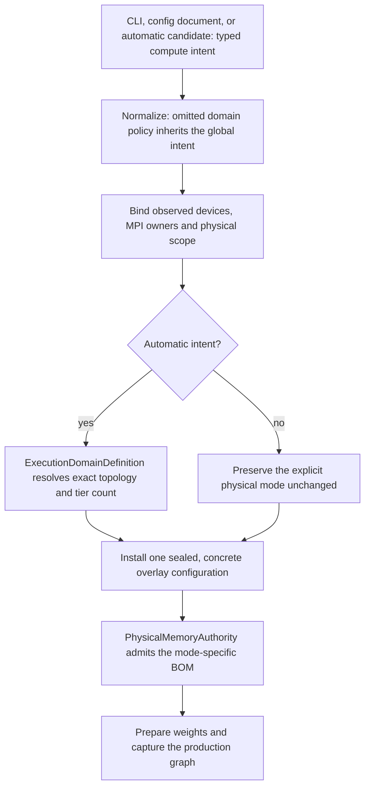
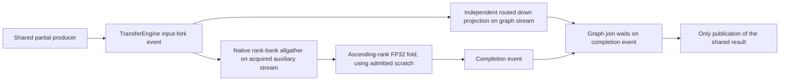
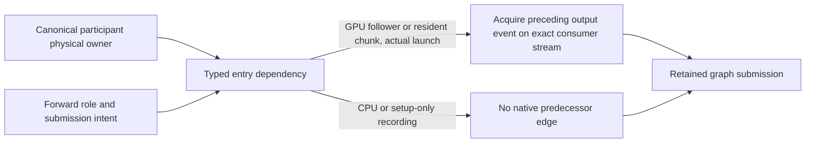

# Automatic MoE compute ownership

Implementation slice: 2026-10-03. Native qualification is in progress; this is
not an image certificate or evidence that cross-rank projection work is supported.

## One request policy, one resolved physical policy

The user-facing default is `--moe-routed-expert-compute auto`. It resolves to
`gate-up-owned-down-columns` for one homogeneous, rank-local multi-GPU tier.
CPU, heterogeneous, multi-tier and cross-rank topologies retain `apportioned`
whole-expert execution. Current-batch least-loaded assignment also requires
complete residents and selects whole experts. An explicit compute mode is
never changed, including an explicit `apportioned` A/B control.

This is setup-time policy selection, not a runtime capability fallback. A
rejected projection plan does not retry whole experts. Memory admission and
graph lowering accept only the resolved concrete mode and fail on `Automatic`.
The existing ExpertOverlay controller remains the only live movement authority;
this change adds no controller, calibration or hot-path state.

## Authorities and boundaries

- `Unspecified` means domain inheritance, not whole experts. Conversion from
  an execution-domain declaration must preserve that omission until shared
  normalization applies the global request. This makes a global explicit
  whole-expert override effective regardless of argument order.
- `ExecutionDomainDefinition::resolveRoutedComputePolicy` owns the topology
  rule. It requires bound scope for automatic intent and preserves every
  explicit physical mode. Tier names, integer priority values, GPU ordinals
  and which socket owns the GPUs do not choose the mode.
- The existing inventory binder invokes that rule before publishing its plan.
  Implicit LocalTP synthesis uses the same rule with already resolved devices.
- Installation authenticates an automatic-to-concrete transition against that
  exact rule. It does not weaken the existing location/intent equivalence
  checks to accept arbitrary policy mutation.
- Single-device/dense execution has no multi-participant expert domain and
  returns a concrete ordinary compute policy before physical admission.
- The bounded communication measurement basis includes counted-channel host
  scopes for automatic TP candidates. This is preparation evidence, not an
  inference transport change or an extra per-candidate calibration round.

## Qualification

Device-free tests cover CPU/CUDA/ROCm, participant degrees 1/2/3/4/8, one and
multiple tiers, single/rank-local/node/global scope, mixed vendors, explicit
overrides, missing inventory, argument order and lossless config documents.
The real rank compiler is exercised with either GPU-owning rank, both backends,
implicit and compact declarations, repeated resolution, and original-request
immutability. Arena binding rejects unresolved automatic intent.

The focused contracts are explicitly registered in `ProductionTestPreflight`:
`V2_Integration_AutomaticMoEComputePolicy` and
`V2_Integration_AutomaticMoEComputeResolution`. Existing projection planning,
capacity, preparation, movement, communication and graph regressions remain
required. Full Unit and production preflight are amortized gates, not per-cell
setup.

Real-weight Release validation must also use ordinary auto-planner commands
without a compute override. Authenticate the selected physical policy before
comparing unprofiled timing, token output, MTP work and actual communication
extents. Qualify the affected HTTP/prefix/long-context cells and driver-log
bookends before publication. Do not update a high-water baseline to hide a
regression or substitute native evidence for a Docker certificate.

Automatic proposal construction additionally requires an integral output-column
partition for the selected source model. `MoEProjectionArenaGeometry` owns this
invariant for both search and arena admission. A nonintegral optional topology
is not proposed; its compute policy is not changed to whole experts. Explicit
application still rejects incompatible geometry. Degree three is not banned:
divisible models retain it, and multi-tier whole-expert plans are unaffected.

The canonical projection HTTP/benchmark exporters now omit the compute-mode
override and require eligibility for the automatic default. Their expected
physical policy remains `gate-up-owned-down-columns` in the planning receipt.
Whole-expert A/B controls still explicitly select `apportioned`. The existing
`V2_Integration_MoEProjectionParityMatrix` and
`V2_Integration_ExpertOverlayCertificationControls` regressions prove both
surfaces and reject unresolved or ineligible physical declarations.

Ornith's Q4 CUDA2/ROCm2 projection variants inherit the parent's complete
matrix, and its Q8 ROCm4 projection variant derives from the reported
whole-expert definition. Each adds one Dynamic/Ordinal/adaptive HTTP/benchmark
tag alongside its existing control; no weights, prompts, oracle packs or
numerical gates are copied. This expands canonical HTTP discovery from 24 to
27 cells and keeps the degree-four default in routine certification, rather
than leaving its successful launch as a one-off diagnostic. Fresh generated
discovery confirms all 27 tags; the three additive native Release HTTP cells
pass **135/135 checks** in **416.80 seconds**, with clean driver intervals and
retirement. Their focused five-entry metadata/contract gate passes in 1.15
seconds. The original whole-expert controls remain intact.

The five native automatic-default benchmark probes have passed, with no
compute-mode overrides, production-default depth/economics and profiling off:

| Model/format | Devices | Prefill tok/s | Decode tok/s |
|---|---|---:|---:|
| Qwen3.6 MoE IQ3_S | CUDA2 | 2,074.82 | 204.06 |
| Ornith Q4_K_M | CUDA2 | 1,915.28 | 222.09 |
| Qwen3.6 MoE IQ3_S | ROCm2 | 1,423.45 | 130.80 |
| Ornith Q4_K_M | ROCm2 | 1,429.62 | 143.93 |
| Ornith Q8_0 | ROCm4 | 1,207.82 | 98.75 |

The ROCm4 result follows the repair below. Its matched whole-expert control is
964.51/50.41 tok/s; all three completion token streams and MTP work counts match
exactly, and the driver interval is clean. Timing uses the canonical 512-token
prompt, 256-token generation, one warm-up and three measured iterations. These
are working-tree Release diagnostics, not image certificates or high-water
baseline updates. The subsequent source-derived three-cell canonical benchmark
projection passes in **153.98 seconds**: Ornith Q4 CUDA2 **1,915.07/222.07**,
Q4 ROCm2 **1,427.09/143.90**, and Q8 ROCm4 **1,205.46/99.11** prefill/decode
tok/s. No high-water file changes. A retrospective extension of the preceding
HTTP driver's retained log cursor observes no new kernel records; it is not a
separately armed benchmark-driver certificate. The affected HTTP cohort is
individually green after the focused idle retry below; final aggregate gates
and image-bound qualification remain pending.

## Degree-four shared projection reduction

The first automatic-default qualification passed Qwen/Ornith CUDA2 and ROCm2
benchmarks, but Ornith Q8 ROCm4 failed before capture. Its shared-expert decode
reduction declares `CanonicalRankOrder`; the overlap builder previously accepted
only `NativeCollective`. Degree two did not exercise that declaration.

The repair retains the same arithmetic and event lifecycle, rather than
changing precision, returning to whole experts or disabling overlap:

Both visible event edges forward the original operation's workspace declaration
and shared setup binding. The existing workspace authority merges the stable
name into one allocation; the overlap adds no scratch owner or arithmetic
implementation. Ordinary and forked execution call the same canonical fold.
Control sidebands, invalid participants/precision, aliases and cycles still
fail before graph mutation.

New focused preflight entries exercise two-device CUDA/ROCm and four-device
ROCm captured replay, cancellation inputs, grouped rows, and full/partial/empty
live prefixes. All 15 selected overlap contract/backend tests pass in 61.73
seconds, with a clean driver interval. The failed real-weight benchmark now
passes with the measurements above; the fresh ROCm4 HTTP lifetime additionally
passes all 45 checks, including long-context recall, 2,048-token generation,
clean shutdown and return to its initial VRAM occupancy.

The complete affected cohort finishes 10/11 green. The first Qwen CUDA2
launch exceeds its unchanged 60-second readiness limit during the gate build;
its uncontended, unchanged-runtime retry passes 45/45 in 80.39 seconds. The
original failure remains separate evidence. All five automatic-default MoE
configurations and all six dense single/TP/PP configurations are individually
green. This does not turn the original aggregate receipt into a passing one.

## Full-gate audit: physical ownership and proposal geometry

The first normal checkpoint hook passes **688/688 Unit** in 80.68 seconds but
ends **611/615 preflight** in 2,369.56 seconds. Both backend pipeline-MTP suites
fail only their predecessor-ordering byte proof; both MPI sampling suites fail
bounded request-cost preparation. The driver interval is complete and clean.
No commit or PR is created from that red gate.

The entry-ordering extraction consulted `ForwardInput.device`, although the
existing prelude also accepts an exact physical execution device. A minimal
follower declaration therefore bypassed its predecessor wait on both backends.
The typed policy now requires the canonical participant owner explicitly:

This restores the existing event contract without a host wait, recapture or
duplicate device authority. Request placement hints cannot suppress that edge.
The unchanged native byte proof holds the predecessor for twenty replays and
cycles main, condition and grouped-verifier roles. A focused preflight entry
now selects that proof explicitly on each backend.

The planner audit finds two related assumptions, not another transport defect:
replicated dense decode does not remove projection-column publication, and a
three-participant proposal cannot evenly partition a 256-column fixture. Its
request-cost assertion now follows the admitted physical mode; immutable
proposal geometry uses the arena's same partition invariant before pricing.
No compiler/evaluator exception is swallowed and no incompatible candidate is
retried under a different mode. Device-free coverage checks all degrees 2–8,
both GPU vendors, divisible degree-three models, explicit whole-expert controls
and multi-tier plans. All nine selected Unit/integration entries now pass in
80.32 seconds, including both complete pipeline-MTP suites and both real-MPI
sampling suites. The explicit predecessor-ordering regression additionally
passes twenty consecutive CTest executions per GPU backend (forty executions
total, each holding the predecessor across twenty internal replays), in 54.85
seconds. The authenticated driver interval is complete and clean. The affected
three canonical pipeline HTTP lifetimes additionally pass **135/135 checks** in
533.86 seconds: CUDA PP, mixed CUDA/ROCm TP+PP, and ROCm PP. Each exercises full
long-context recall, 2,048-token structured generation, prefix-cache lifecycle,
context-boundary admission, clean shutdown and native memory retirement; every
driver interval is clean. Publication still requires the renewed complete
normal Unit/production-preflight hook and subsequent image-bound PR gate.
