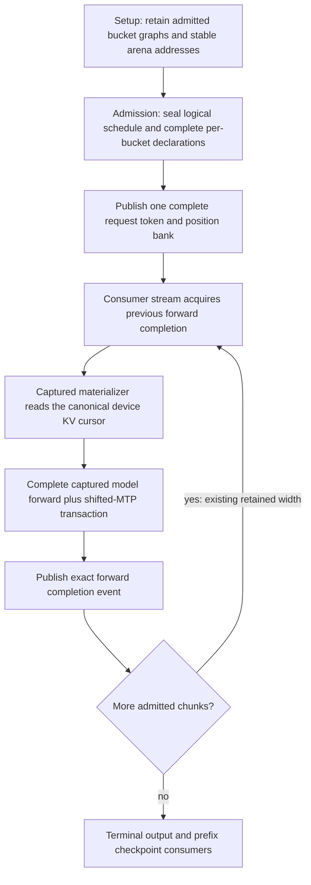

# Retained prefill bucket family and incoming ordering

Investigation date: 2026-10-03. This is evidence for the current working-tree
slice, not a claim that a new image has been certified.

## Why the change is needed

The production-default Qwen3.8 dense CUDA benchmark contains 512 live prompt
tokens. Prefix checkpointing submits a nonterminal 448-token range and a
terminal 64-token range. With a 384-row admitted resident maximum, the old
nonterminal scheduler selected two physical 384-row forwards, even though its
second forward had only 64 live rows. The terminal range then used 64 rows.
Consequently each request computed 832 physical rows, not 512. The frozen
benchmark's five prefills recorded 2,560 real rows and 1,600 padded rows.

Simply choosing a smaller host schedule was insufficient. The participant
admitted only one materializer identity for the entire schedule, and shifted
MTP identity embeds that identity too. Changing widths must retain exact
shape-specific declarations from the same request/storage authority.

The next real-model attempt also exposed a missing incoming dependency:
independently retained bucket executables can use different streams while
sharing chunk metadata, activations, KV and recurrent storage. Same-width FIFO
ordering had hidden that assumption. A 384-to-64 transition without its incoming
forward completion produced an asynchronous CUDA launch failure and an NVIDIA
Xid 43. That failed evidence is retained; it is not a successful performance run.

## Ownership and execution

The host's schedule is immutable request-admission geometry. It does not read
back device counters, advance a second execution cursor, slice/upload each
chunk, recapture a graph, or create an eager/segmented substitute. Every chunk
remains a complete captured model forward. Its materializer derives live source
offset and row count from the same canonical device KV cursor. Exact physical
widths may differ without replacing any persistent GPU buffer.

The incoming edge is a native stream/event wait, not a stream/device sync.
`ForwardGraphEntryOrdering.h` classifies externally submitted resident chunk
views and pipeline followers as consumers of the preceding forward completion.
Setup-only declarations require no preceding inference. CPU execution remains
host-owned. Complete captured generation parents retain their internal DAG;
the new external prelude does not add work inside the decode loop.

## Code authorities

- `PrefillChunkSchedulerPolicy::forRetainedBucketFamily` keeps the admitted
  ladder and selects its smallest adequate remainder. Explicit single-width
  transaction policies retain their existing fixed-width semantics.
- `DeviceGraphOrchestrator::makeDevicePrefillChunkGraphBinding` owns immutable
  materializer pointer/geometry identity. The existing shifted-MTP binder seals
  the matching predictor identity for each width.
- `ForwardExecutionEngine::runPrefillChunkSchedule` validates the complete
  family before executing its first chunk. All declarations retain the same
  request banks, KV counter, physical storage, device and publication stream.
  Missing, mismatched or foreign identities reject admission; there is no
  partial execution followed by a tail repair.
- The participant live-state prelude consumes the existing durable
  `ForwardGraphOutputReady` publication on the exact new graph stream. This is
  the ordering authority, not a private host shadow of model state.

## Focused regressions and qualification

`V2_Unit_PrefillGraphCache` covers economical tail selection and typed incoming
ordering for CPU/CUDA/ROCm, setup versus live submission, owner versus pipeline
follower, and widths 1/64/384/4096. Explicit fixed-interval tests are preserved.
`V2_Integration_PrefillGraphEntryOrderingPolicy` registers that ordering
invariant explicitly in `ProductionTestPreflight`.

`V2_Integration_PrefillRetainedRemainder_CUDA` and its ROCm counterpart exercise
real captured materializers and KV append, a 128+64 schedule, the same persistent
request bank, repeated data resets, retained replay and exact native event
handoffs. Missing or foreign family declarations must fail before any model
build or output publication. The terminal bank must contain token 128 and its
geometry must be exactly 64 live/64 physical rows.

After these pass, repeat the exact unprofiled production-default benchmark,
authenticate all three generated token streams and MTP work against the frozen
control, and verify zero avoidable padding and no runtime recapture. Driver-log
bookends must be clean. Then qualify affected full HTTP/prefix/long-context
cells and the amortized Unit/production-preflight gate before publication.
No new high-water baseline or Docker certificate is created by native diagnostics.

### Focused receipt

The ordered family passes the focused six-entry gate and **20/20 native
lifetimes per backend**. The CUDA/ROCm driver interval is clean. Its first
unprofiled CUDA dense run measures **920.70 prefill / 62.14 decode tok/s**, up
from the frozen **614.26 / 61.65** control. All three measured token streams and
MTP verification counts are identical. Across five prefills, avoidable padding
falls from **1,600 to zero rows** while the retained capture count stays four.
The subsequent broader sweep repeats the dense result at **900.68 / 61.56**.
Both runs are native diagnostics. The affected HTTP cohort now passes all six
dense configurations individually: CUDA/ROCm single-device, TP and PP. Each
passes 45/45 checks; the 32K ROCm single-device cell certifies a 30,205-token
near-boundary prompt and 2,048-token generation. Driver intervals and retirement
are clean. Final amortized Unit/preflight qualification remains required before
publishing the new source.

Local evidence: `checkpoint-dense-cuda-ordered-family-benchmark.json`,
`checkpoint-prefill-entry-ordering-stress20.log`,
`checkpoint-prefill-entry-ordering-driver-report.json`, and
`checkpoint-corrected-full-benchmarks.json` under the ignored
`parity-results/qwen36-rocm2-prefill/native-live-extent/` root. Preserve the earlier
red `checkpoint-prefill-family-driver-report.json` separately; a later clean
interval must never overwrite or sanitize the original NVIDIA Xid 43 evidence.
