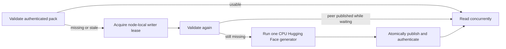

# Production parity campaigns

The V2 parity framework compares the live Llaminar inference path against a
CPU/FP32 PyTorch reference generated from the same real GGUF bytes. It retains
the existing layer-by-layer mathematics and diagnostic CSVs while avoiding a
new model load for every prefill, decode, snapshot, backend, and KV-precision
case.

CTest registration in `tests/v2/CMakeLists.txt` is the matrix source of truth.
Do not maintain a second model/backend/precision manifest in scripts or docs.

## What one production cell proves

Each parameterized `ProductionParity` cell uses one production runner session
to perform this contract:

1. Authenticate or generate the CPU PyTorch reference pack.
2. Construct the configured production model, topology, collectives, kernels,
   arenas, streams, graph, and KV-cache policy.
3. Run prefill and compare embedding, every published per-layer stage, final
   norm, and LM-head distributions against PyTorch.
4. Assert that the live graph published the required snapshot boundaries.
5. Reset request-owned snapshots and cache data without rebuilding topology or
   recapturing merely to cross the request boundary.
6. Run incremental decode and compare every requested decode checkpoint and
   output distribution.
7. Export the normal numerical diagnostics plus structured production-path and
   wall-time evidence.

The comparison code remains in `ParityTestBase.h`: cosine similarity, relative
L2, KL divergence, Top-K overlap, distribution statistics, NaN/Inf checks, and
per-layer threshold assertions are unchanged. Fusing phases removes duplicate
setup; it does not weaken the oracle or compare fewer checkpoints.

Missing models, hardware, decode references, graph evidence, or snapshot
publication are failures in a production campaign. Focused developer tests may
still skip when their optional prerequisite is absent.

## Model-free integration preflight

Every aggregate campaign run begins with the registered
`ProductionParityPreflight` CTest label. It runs before the model-download
fixture and before GGUF staging, so a broken rank lifecycle, graph/event
contract, or ExpertOverlay epoch cannot consume model-loading time or
contaminate a later parity process.

`tests/v2/CMakeLists.txt` is the sole preflight inventory authority. The Python
driver discovers the label and fails closed unless it is nonempty and every
member:

- is a `V2_Integration_*` test with the `Integration` label;
- has no `FIXTURES_REQUIRED` or `REQUIRED_FILES` dependency;
- has a positive timeout no greater than 120 seconds; and
- exercises production infrastructure without loading a real model.

The gate covers established MPI/rank and orchestration lifecycle, CUDA/ROCm
explicit-stream event ordering, native graph capture and retained replay,
prefill graph buckets, heterogeneous captured-ticket dispatch, prepared
ExpertOverlay weights, and asynchronous overlay epochs. When a campaign defect
exposes a new model-free invariant, add a focused integration regression and
add that existing test registration to
`V2_PRODUCTION_PARITY_PREFLIGHT_TESTS`. Do not add a second list to the
campaign driver.

Run it independently with:

```bash
ctest --test-dir build_v2_integration \
  --output-on-failure --parallel --no-tests=error \
  -L '^ProductionParityPreflight$'
```

A preflight failure prevents fixture setup, model staging, and all model parity
children. Report schema 10 records its return code, elapsed time, discovered
test count, and exact test names. Its elapsed time is included in the single
75-minute aggregate target.

## Reference-pack identity

`metadata.txt` is published atomically after the NumPy files. A production
campaign accepts an existing pack only when it binds all of the following:

- supported snapshot schema;
- PyTorch on CPU using FP32;
- SHA-256 of the exact GGUF file used by the native runner;
- SHA-256 of the exact UTF-8 prompt bytes;
- nonempty tokenizer output and its SHA-256;
- sufficient decode depth, decode tokens, and boundary snapshots.

Before inference, the aggregate runner copies the complete selected GGUF corpus
into a private directory on `/dev/shm`. CTest's `REQUIRED_FILES` property is the
machine-readable model declaration for each production campaign. The runner
expands split GGUF siblings, resolves symlink aliases, rejects basename
collisions, verifies that the entire corpus plus a reserve fits on tmpfs, and
computes source SHA-256 while atomically publishing each read-only RAM copy.
Full-write and byte-count checks, source mutation detection, read-only mode, and
source/destination identity binding protect the transaction. Each production
child then performs the single canonical destination SHA-256 check against its
authenticated reference pack before inference; a shared identity-keyed digest
cache coalesces that check across campaigns. Any missing declaration,
non-memory filesystem, capacity shortfall, mutation during copy, reference
digest mismatch, exact-cell timeout, or completion timeout is a hard failure.
Every generated GTest cell has a fixed 600-second progress deadline spanning
its setup, inference, evidence publication, teardown, and transition to the
next cell. The staging and authentication time are part of the same 75-minute
target; by default the temporary corpus is removed when the run exits.

Runners with a different memory mount can pass
`--model-ramdisk-root /path/to/tmpfs`. The directory must already reside on
`tmpfs` or `ramfs`; the driver never falls back to disk or a partial corpus.
For persistent local iteration, create the repository-owned mount once. This
mount is separate from `/dev/shm`, so host-login IPC cleanup cannot remove it
while the devcontainer mount namespace remains alive:

```bash
scripts/ci/setup_production_parity_tmpfs.sh
```

For rapid local iteration, explicitly retain the authenticated corpus and digest
records in a stable child directory:

```bash
python3 scripts/ci/run_production_parity_campaigns.py \
  --build-dir build_v2_integration \
  --model-ramdisk-root /mnt/llaminar-production-parity \
  --persistent-model-cache-dir cache
```

The first invocation computes source SHA-256 during the copy, atomically
publishes each read-only GGUF, and authenticates the published bytes once through
the reference-pack gate. Later invocations reuse an entry only when its source
device, inode, size, nanosecond mtime, nanosecond ctime, and read-only cached-file
identity are unchanged; the persistent digest cache binds the prior reference
authentication to that exact destination identity. Changed entries are replaced
atomically, while a changed cached identity is reauthenticated before inference.
One exclusive cache lock spans staging and every child inference process, so a
concurrent run cannot replace weights still in use. After acquiring that lock,
the driver reclaims only unpublished copy/manifest transaction files left by an
interrupted process or host reboot; published models and operator-owned files
remain untouched. While idle, the driver removes owner-write permission from
the cache root, model directory, and digest directory. During a campaign the
root and published-model directory remain sealed while child processes append
digest evidence. This makes an ordinary same-user sweep fail before it can
unlink the manifest or GGUFs. The driver never deletes this directory.

"Persistent" means persistent for the lifetime of the same mounted memory
filesystem. A host reboot, container replacement, or explicit unmount/remount
necessarily destroys tmpfs contents; an explicit privileged deletion can do so
as well. The dedicated mount also survives host-user logout in this host-IPC
devcontainer; `/dev/shm` does not, because systemd-logind may remove its IPC
objects when that session ends. Omitting `--persistent-model-cache-dir`
deliberately selects a separate run-scoped directory which is removed at exit.
Campaign failure, timeout, source identity changes, and ordinary successful
exit do not empty a persistent cache; a changed source atomically replaces only
its matching file. After all campaigns exit, explicitly destroy the dedicated
tmpfs (and therefore every cached model) with:

```bash
scripts/ci/setup_production_parity_tmpfs.sh --unmount
```

Registered `ProductionCampaign_*` CTest entries are internal children used by
the aggregate driver for discovery and backend scheduling. Running one directly
with `ctest -R ...ProductionCampaign...` intentionally fails before model
mapping because it has no authenticated tmpfs publication or cache lock. Use
the driver command above (with `--campaign` for a narrow child selection), or
run a non-campaign focused GTest diagnostic explicitly.

Every child process then re-authenticates the RAM copy against the reference
pack. Those streaming digests are coalesced through a private run-scoped cache,
or the explicitly selected persistent cache, keyed by canonical path, device,
inode, size, nanosecond mtime, and nanosecond ctime. This prevents both repeated
multi-gigabyte scans and stale pathname trust. Qwen2/Qwen3 use
`python/reference/generate_qwen_pipeline_snapshots.py`; Qwen3.5, Qwen3.6, and
their MoE variants use the architecture-specific generators under
`python/reference/`.

Reference generation has one node-local writer authority because every
backend's Hugging Face oracle consumes the same host cores and can require well
over 100 GiB for a 35B model. The ordinary fixture and architecture-specific
MTP helpers use `ReferenceGenerationLease` and follow the same double-checked
publication lifecycle:



The lease covers only generation and publication. Validated reference reads
and production CPU/CUDA/ROCm inference still overlap. Any new custom reference
helper must join this lifecycle; spawning Python directly from a backend test
creates an unbounded RAM race and is not a supported campaign path.

## Process campaign and ownership

`discover_v2_parity_tests()` runs `--gtest_list_tests` after each parity binary
is built. Focused diagnostics remain isolated CTests. Every discovered
`ProductionParity` case is instead placed in one exact, wildcard-free GTest
filter per test type and backend signature. All precision cells for that test
type/backend execute in one process.

Across compatible non-overlay precision cells, the process may retain one
bounded `ModelContext` and its authoritative `PreparedWeightStore`. The reuse
key includes model path, weight distribution, topology, devices, collectives,
activation precision, ranks, and PP partitioning. KV precision is deliberately
excluded when it cannot affect prepared-weight capacity because KV storage is
runner-owned. Every cell still constructs an exact runner, arena, stream set,
graph identity, and KV policy; a key change evicts the prior model before
loading another, so the cache cannot grow without bound.

ExpertOverlay has a stricter boundary. A bare `ModelContext` cannot prove the
resolved rank plan, model-frozen tier quotas, owner order, or prepared expert
set. Fresh overlay cells let the production runner own loading and
certification. Reuse is legal only through a `ModelContextReuseContract`
emitted by an initialized runner and accepted after exact plan and routed-weight
identity validation. Cells that change residency policy, owner placement, or
another capacity-affecting field construct a fresh authority rather than
guessing compatibility in the fixture.

## Production-path evidence

Production campaigns force declarative graph execution and enable structured
PerfStats. Every homogeneous CUDA-only or ROCm-only cell requires:

- native decode graph capture or replay;
- no segmented plan, segmented capture, or segmented replay.

Ordinary non-MTP inference additionally requires a complete native graph
capture or replay. MTP uses a backend-specific generation proof:

- CUDA requires one native conditional parent and complete `full_graph_*`
  capture/replay.
- ROCm requires HIP's authenticated 48-byte immutable scheduler ticket and the
  retained captured transaction family it selects. The device controller owns
  every decision and mutable value; the host only submits the named branch.
  Consequently `forward_full_graph_*` proves each captured transaction while
  the complete `full_graph_*` fields truthfully remain false.

Explicitly heterogeneous placements may segment only at their declared
backend/collective boundary. CPU cells must still use the production graph
execution path. No campaign falls back to eager execution, deterministic test
kernels, serial replay, or a different backend.

Each results directory contains `production_path.csv`, recording the typed
global execution topology, rank-local graph contract, execution path,
inner-forward versus complete graph
evidence, MTP generation-controller authority, backend policy certification,
segmentation evidence, model-context reuse, elapsed time, budget, and pass/fail
status. The artifact auditor applies the same fail-closed graph contract as the
C++ fixture: CPU-only declarative execution, homogeneous native capture, or
heterogeneous captured segmentation. ROCm certification requires
exact ticket ABI/provenance, participant graph-family evidence, matching
ticket/submission/controller ledgers, and a standalone or participant-complete
rank launch. `generation_certification_detail` identifies the first missing
invariant. Every mathematical production cell retains the canonical numerical
artifacts:

- `prefill_layers.csv`
- `prefill_summary.csv`
- `prefill_stages.csv`
- `decode_steps.csv`
- `decode_layers.csv`
- `decode_stages.csv`

Every typed MTP cell additionally writes `mtp_transactions.csv`; specialized
long-horizon campaigns may also write `mtp_sidecar_token_trace.csv`. Their
committed verifier columns (`verifier_identity_transaction_count`,
`verifier_identity_depth`, and `production_verifier_draft_tokens`) come from
the device-owned identity published by the same fused response/state commit
that advances the generation controller. They must agree with the transaction
delta and selected depth for every speculative call. The token vector also
selects a branch-qualified Hugging Face sidecar oracle whenever quantized
predictor argmax leaves the canonical HF branch; comparing that row with the
unqualified tensor is invalid. Reusable proposal or verifier-input scratch is
not admissible post-transaction evidence. A terminal absorbing call may retain
the preceding committed identity while selecting depth zero, because it does
not claim a new verifier transaction.

Cross-rank pipeline cells first write rank-local diagnostic fragments, then
merge them into the same canonical files. The merged result must contain every
owned layer and stage from every rank, the head-rank embedding boundary, and
the tail-rank norm/LM-head distribution; partial rank-zero CSVs are a failure.
Temporary rank fragments are removed after a successful merge.

MoE policy cells certify behavior through request-local ExpertOverlay PerfStats
in addition to checkpoint mathematics. Host-authoritative transactions publish
through `moe_rebalance`; device-authoritative all-GPU transactions also publish
their accepted policy/byte evidence through `moe_overlay_controller` and their
staged/applied placement through `moe_overlay_residency`. Fresh Dynamic and LLEP
cells must prove a payload was copied or staged, nonzero packed expert bytes
crossed the live transport, and the destination placement was published.
Static-owner cells assert that CPU, CUDA, and ROCm planner/copy/transport/apply
movement counters all remain zero. Setup-only `moe_placement` records separately
authenticate ordinal or random physical expert placement and are not counted as
request movement. Every ExpertOverlay cell retains per-rank
`expert_residency_diagnostics*.csv` files for post-run audit. A restored
full-prefix request need not invent a redundant migration; its preceding fresh
request must already have supplied the positive movement proof.

Completed movement authority is the typed
`IOrchestrationRunner::moeOptimizationMovementLedger()`, serialized as
`expert_movement.csv`. Its `movement_axis` records whether the closed physical
cycle advanced tier residency, participant placement, or both; `direction`
records only the endpoint-priority relationship. Do not infer skew progress
from `same_priority` counts or from PerfStats proposals: a participant change
may be economically absorbed into promotion/demotion destinations. Static
requires an empty ledger, while a Dynamic topology with both degrees of freedom
requires authoritative tier and participant axis progress (a `combined` cycle
satisfies both).

`promoted_expert_execution.csv` binds moved expert identities to independent
native/reference routed rows. Rows that are exactly zero on both sides count as
exact equality and appear in `exact_zero_route_rows`; a one-sided zero appears
in `one_sided_zero_route_rows` and fails closed. `reference_lineage` records
whether earlier discrete routing still followed the same HF branch, and
`proof_disposition` is `certified`, `inconclusive`, or `failed`. A numerical
mismatch after prior route divergence is explicitly inconclusive because the
expert inputs differ; it does not satisfy the required positive destination
witness. Canonical-lineage mismatches and structural publication defects remain
fatal, and each observed destination must still have an independently certified
same-expert row.

## 75-minute economy gate

The complete discovered matrix is the performance unit. All model families,
topologies, backends, precision cells, MoE policies/owner placements, and MTP
depths selected for a run share one 4,500-second wall-clock target. A CTest
campaign is only a process-resident scheduling unit used to amortize immutable
weights and claim backend resources; it does not receive a fresh budget. Missing
the target is a performance failure reported after the matrix completes, not a
reason to stop admitting work or discard later correctness evidence.

The driver first runs the model-free integration preflight, then stages the
download fixture once, stages and authenticates the selected real weights into
RAM once, overlaps only backend-disjoint work, runs every campaign even after
the target is missed, and records the complete correctness result. Every exact
matrix cell has a fixed 600-second watchdog.
The driver observes that cell's fresh `test_log.txt`; entering the next cell
renews the deadline, while expiry terminates the complete CTest/MPI process
group and records `exact_cell_timeout` plus the exact GTest identity. This
retains process-resident model/prepared-weight reuse without permitting a
silent aggregate to occupy devices for hours. An independent 21,600-second
completion ceiling bounds fixture staging and the complete run, not one cell or
the economy requirement; configure it separately with
`--completion-timeout-seconds`. C++ cells write timing evidence but do not
assert the 75-minute target individually. `production-campaigns.json` records
separate correctness and performance statuses, timeout evidence, staged byte
count, source/destination digests, staging filesystem/time, and campaign
coverage.

List the configured coverage without loading a model:

```bash
python3 scripts/ci/run_production_parity_campaigns.py \
  --build-dir build_v2_integration --list
```

The listing validates campaign labels, environment, timeout, declared GGUF
manifest, forward-graph PerfStats, and exact GTest filters, then reports
campaign count, exact matrix cell count, backend signatures, and precision
tags. A non-list run additionally validates and executes the
`ProductionParityPreflight` label before model admission.

Run every configured campaign and write machine-readable timing evidence:

```bash
python3 scripts/ci/run_production_parity_campaigns.py \
  --build-dir build_v2_integration \
  --report parity-results/production-campaigns.json
```

Architecture slices retain the same discovery authority, backend-exclusive
scheduler, whole-slice target, and JSON evidence. Select only registered CTest
campaign names; do not maintain a copied model/topology list. For example, a
non-ExpertOverlay certification pass can omit the tier implementation slice:

```bash
python3 scripts/ci/run_production_parity_campaigns.py \
  --build-dir build_v2_integration \
  --exclude-campaign '.*(?:ExpertOverlay|MoEGraphNative).*' \
  --report /tmp/non-overlay-production-campaigns.json
```

Filter with full-match regular expressions when validating one backend or
precision subset:

```bash
python3 scripts/ci/run_production_parity_campaigns.py \
  --build-dir build_v2_integration \
  --backend 'CUDA' --precision 'ALL'
```

The report path is generated debris and must not be committed.

To run one exact campaign directly, discover its name first:

```bash
ctest --test-dir build_v2_integration -N -L Campaign
ctest --test-dir build_v2_integration \
  -R '^V2_Integration_Parity_Qwen2_SingleDevice_ProductionCampaign_CUDA_ALL_PRECISIONS$' \
  --output-on-failure
```

## Adding or extending a matrix

Use a substantive file header and keep configurations declarative.

1. Declare the immutable GGUF/reference identity as a
   `ModelParityModelDefinition` and the participant addresses, MPI ownership,
   topology kind, collective, and optional ExpertOverlay plan as one
   `ModelParityTopologyDefinition`.
2. Compose those values, the precision matrix, thresholds, and standard feature
   profiles into `ModelParityDefinition`, then use
   `expandModelParityDefinition()` as the only axis expander. Keep the emitted
   `ModelParityCase` as the GoogleTest parameter; do not parse the generated
   name to recover policy. Backend identity must appear unambiguously in the
   topology ID as `CPU`, `CUDA`, or `ROCm`.
3. Implement one `ProductionParity` test that calls
   `runProductionParityCampaign()`, or an architecture-specific fused body when
   additional production evidence is required.
4. Register the binary with `discover_v2_parity_tests()` and declare every GGUF
   that all of its `ProductionParity` cells can select with `MODEL_FILES`.
   Backend-specific additions use `CPU_MODEL_FILES`, `CUDA_MODEL_FILES`, or
   `ROCM_MODEL_FILES`, which prevents a focused backend slice from staging
   unrelated large models. Registration and runtime path resolution fail closed
   if these drift. If a specialized path asserts another PerfStats domain, pass
   `PRODUCTION_PERF_STATS_FILTER "forward_graph,<domain>"`.
5. Build the target so its generated CTest include is refreshed, then run the
   campaign unit test and `--list` coverage audit.
6. Add each new model-free infrastructure or production-path regression to the
   CMake-owned `ProductionParityPreflight` inventory, run that gate, then stage
   the real model files and run every affected backend campaign. A new defect
   needs a focused regression in addition to the full campaign cell.

Do not create separate `PrefillParity`, `DecodeParity`, and
`SnapshotInfrastructure` model-loading tests for a new matrix. Their contracts
belong in the fused production cell. Prefix-cache, MTP, stochastic sampling,
dynamic-depth, and other specialized behavioral suites remain focused gates
when they exercise a different state machine; they do not replace mathematical
production parity. MTP registration must cover fixed depths 1, 2, 3, and 15
plus dynamic depth on CPU, CUDA, and ROCm. Dynamic depth additionally proves
one full-budget, serial-token-exact adaptive transaction whose
controller-window, attempted-draft, and verifier counters increase after any
initially due ExpertOverlay movement boundary is retired. MoE MTP cells inherit
the same explicit Static/Dynamic movement contract and routed-owner placement
as their ordinary inference cells. LLEP joins that standard matrix only when
its selected topology has a complete first-class implementation; no production
cell substitutes another movement policy for it.

## Local verification

Fast, device-free framework checks:

```bash
python3 tests/v2/unit/scripts/test_production_parity_campaigns.py
python3 -m pytest -q python/reference/tests/test_snapshot_metadata.py
ctest --test-dir build_v2_integration \
  -R '^V2_Unit_ProductionParityCampaigns$' --output-on-failure
```

Build parity targets with the repository's normal unrestricted concurrency:

```bash
cmake --build build_v2_integration --parallel \
  --target v2_integration_parity_qwen2_single_device
```

## Troubleshooting

- “reference pack is stale or unauthenticated” names the exact failed identity
  field; regeneration occurs once on rank zero and all ranks wait for its
  completion.
- A production model or accelerator prerequisite failure is intentional. Stage
  the configured GGUF and schedule the campaign on its declared backend.
- A homogeneous GPU segmentation failure means the live path violated its
  backend-native captured-generation contract; fix graph construction or
  capture identity.
- A generation certification failure is diagnosed first through
  `generation_certification_detail`. Do not accept a policy name without its
  native-parent or authenticated-ticket ledger proof.
- Numerical failures retain the layer/stage/decode CSVs and test log in the
  case-specific results directory.
- Use `LLAMINAR_LOG_LEVEL=DEBUG` for lifecycle diagnostics. Stage dumping is a
  focused diagnostic and is not production-path certification.

Parity tests require Python with PyTorch/Transformers/NumPy, `cnpy`, ZLIB, the
configured MPI runtime, and the relevant backend libraries. Integration builds
must have pipeline snapshots enabled.
