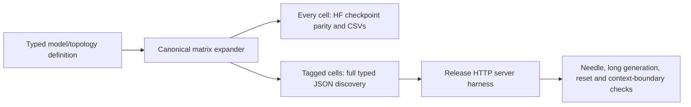
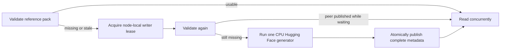

# Production parity campaigns

The V2 parity framework compares the live Llaminar inference path against a
CPU/FP32 PyTorch reference generated from the same real GGUF bytes. It retains
the existing layer-by-layer mathematics and diagnostic CSVs while avoiding a
new model load for every prefill, decode, snapshot, backend, and KV-precision
case.

CTest registration in `tests/v2/CMakeLists.txt` is the matrix source of truth.
Do not maintain a second model/backend/precision manifest in scripts or docs.

Production activation precision is currently FP32 only. The shared admission
policy rejects other activation axes before matrix expansion, just as CLI and
configuration admission reject them as unimplemented. `ActFP32_KVFP16` means
FP32 model activations with FP16 KV storage. Weight formats and kernel-local
quantized operands are independent of those two settings. Historical 122B
`ActFP16` results used an unsupported requested setting and do not certify
FP16 model activations; their names must not be reused as precision evidence.

## Matrix and cell naming

Production binaries use `v2_integration_parity_<model>_<scope>_matrix`.
The scope describes the fixture's execution family, such as `single_device`,
`local_tp`, `node_pp`, or `node_expert_overlay`, not a particular generated
configuration. Include model size when separate binaries load different sizes.
For example, `v2_integration_parity_qwen35moe_122b_node_expert_overlay_matrix`
covers its declared topology matrix, not a fixed CUDA/ROCm/CPU tier layout.
Discovery rejects production cells in a binary without this matrix identity.

CTest prefixes and GoogleTest fixture names likewise identify model and scope.
The `ProductionCampaign` marker identifies a scheduled aggregate; its generated
suffix identifies the backend signature and any required process-isolation
slice. Each `ProductionParity/<case>` suffix comes from the typed expander and
records topology, placement, movement, activation/KV precision, and MTP policy.
Do not copy those axes into a shared fixture name. `Math` and `GraphNative` are
not distinguishing production suite types: every production cell owes the
same mathematical and graph-path proof. Focused-only diagnostics may retain
feature-specific names such as `PrefixMTP`.

Renaming a fixture changes exact GTest/artifact identities. Historical evidence
keeps its original identity; never rename old CSV directories to imply a fresh
pass. Audit the generated parameter inventory and scheduling properties before
and after a rename, then run discovery's Unit regressions and the integration
preflight gate.

## Building shared fixtures

Keep model registration separate from proof implementation. The Qwen3.5 node
ExpertOverlay matrices link the same `v2_parity_qwen35moe_node_overlay` object
library; the 35B and 122B registration sources select their own typed cases and
model manifests without recompiling the implementation for a model-size macro.
Object linkage retains the common GoogleTest registrars. The library and both
registrations reuse one precompiled fixture header with identical compile
settings.

Implementation lives in `qwen35moe/node_overlay/`, split by lifecycle, placement,
movement, graph/routing evidence, MTP diagnostics, and reference handling. Heavy
method bodies belong in those source files, not the shared declaration header.
Process-local bindings and retained caches must have one out-of-line definition;
never turn them into anonymous-namespace header copies when splitting a file.
The preflight shard-ownership test exercises configuration lookup across these
translation-unit boundaries without loading a model. CMake owns the source
inventory, and source-policy gates inspect the shared fixture family.

## Tagged HTTP / long-context certification

`ModelParityDefinition::e2e_certifiable` opts exact existing configurations into
the Release HTTP gate. Each typed selector names activation/KV precision, MTP,
prefill profile and, for ExpertOverlay, both movement and owner order. Model and
topology are inherited from the containing definition. Tags do not multiply or
remove numerical cells. Unmatched and overlapping selectors fail expansion.
Eligibility is not a passing certificate.

The profile also owns typed `thinking_modes`: `ThinkingAndNonThinking` (the
default) or `NonThinkingOnly` for a model that does not support reasoning mode.
Discovery exports `both` or `non-thinking` and pins the harness environment.
Renaming a GGUF or testing a fine-tune must never silently remove thinking-mode
checks. Stale manifests without this field fail admission. Standalone harness
diagnostics use `LLAMINAR_E2E_THINKING_MODES` explicitly (default `both`);
there is no filename-based model capability table.

The initial tags select dynamic-depth MTP for single-GPU Qwen3.8 dense 27B
and Qwen3.6 MoE 35B on CUDA and ROCm. The Qwen3.5 MoE 122B topology declarations
also select Dynamic movement, ordinal initial placement, and dynamic-depth MTP
for two CUDA GPUs plus two CPU sockets, two or four ROCm GPUs plus two CPU
sockets, and two CUDA GPUs plus four ROCm GPUs. In each two-tier case the GPU
continuation domain has priority zero; CPU, or ROCm in the mixed-vendor case,
has the lower residency priority. GPU-to-socket placement remains inventory
resolved. On the certification host these are the 3090 and MI50 devices, not
hardcoded GPU product names in the topology. Use discovery below for the exact
current inventory; adding a tag must not add a runner-side configuration.
Qwen3.6 MoE 35B also tags a CPU-only, two-socket NodeTP cell with ordinal
placement, Dynamic rebalancing, and dynamic-depth MTP. Its single CPU tier
rebalances expert skew between participants; it has no tier-migration axis.

Ornith 1.5 MoE 35B (`Ornith-1.5-35B-Q4_K_M.gguf`) inherits the tagged
Qwen3.6 MoE topology definitions: single ROCm, two-CUDA NCCL and two-ROCm RCCL
ExpertOverlay, and two-socket CPU NodeTP. All overlays select Dynamic movement
with ordinal placement; all four use dynamic-depth MTP and full context budgets.
The larger fine-tune uses two CUDA devices instead of a single CUDA cell. It
retains the standard feature matrix and context budgets,
but has independent model, reference-pack, and result identities. These
definitions also expand the standard numerical cases; the HTTP runner has no
Ornith-specific configuration branch.



Build and list without loading a model:

```bash
cmake --build build_v2_integration --parallel --target v2_model_parity_matrices
python3 scripts/ci/run_model_parity_e2e.py --build-dir build_v2_integration --list
```

Run the selected certification set (or narrow using `--backend`, `--campaign`,
and `--cell` full-match filters):

```bash
python3 scripts/ci/run_model_parity_e2e.py \
  --build-dir build_v2_integration --binary build_v2_release/llaminar2 \
  --report parity-results/e2e-certification.json
```

The runner reuses the parity driver's persistent tmpfs lease and staging
authority. It starts one server per tagged cell, passes an argument vector
exported from that cell's production configuration, and invokes the mature
`test_server_e2e.sh` checks. The full helper proves beginning/middle/end needle
recall, multi-needle JSON recall, structured long generation, cache reset,
near-limit admission and oversized-context rejection. It additionally retains
the harness's chat, streaming, prefix, error-response, graph/PerfStats, memory,
and shutdown checks. There is no model-size skip for a tagged cell. Each HTTP
cell has the canonical ten-minute watchdog, including startup and shutdown;
expiry retires its full server/MPI process group and records a timeout.

Prefix checks include both a different-answer shared-prefix request and an exact
repeat. Short shared text alone may not reach a stored hybrid-state boundary.
Short arithmetic responses must finish naturally; reaching the token limit
with the expected number somewhere in a repeated answer is a failed check.
Thinking delimiters frame response fields and cannot replace the runner's
request-completion authority or truncate subsequent answer text. Qwen model
schemas own the complete thinking-budget continuation, including its paragraph
boundary; callers encode it without BOS/EOS and must not trim it.
If a forced-thinking response loops, compare the exact forced token prefix
against the CPU/FP32 reference before attributing it to MTP or cache reuse.
Certification also requires a completed prefix restore (including MTP
state when enabled), not merely lookup hits or correct answers after a miss.
Selected MTP must attempt and accept drafts, and adaptive depth must advance
its controller. Dynamic placement must publish completed physical movement;
Static must not move experts. These post-shutdown observers consume production
evidence and never become runtime state or placement authorities.
Discovery exports `ModelParityCase::movementEvidence()` as `movement_evidence`
(`not_applicable`, `forbidden`, or `required`). The runner pins this obligation
for the harness; missing or stale metadata fails admission. A single-device
cell may retain Dynamic maintenance defaults without a movement axis, so the
validator must not derive this obligation from a CLI default or missing records.

The typed profile owns context and token budgets. Inherited `lite` or shorter
context settings cannot weaken certification. Each cell retains its exact
configuration, harness/server logs, complete numbered non-streaming chat
request/response JSON (including finish reason and reasoning fields), PerfStats
and all eight outcomes in
`long_context_results.json`; missing or incomplete evidence fails even when
the shell exits zero. HTTP behavioral evidence complements, but does not replace,
the numerical campaign's canonical CSVs or its separate economy target.

Server PerfStats uses rank-qualified raw artifacts. The collector validates
runtime-declared communicator membership (including a nonzero HTTP authority),
then retains every participant row in one rank-qualified aggregate. Missing
participants or mismatched membership fail certification; graph lifecycles are
matched by rank as well as device and context. Memory checks use the canonical
`PhysicalMemoryAuthority` admission and owner attestation, not a second budget
derived from a GGUF filename or shard size. Process-tree RSS remains telemetry
because shared/file-backed pages are not equivalent to engine-owned bytes.
Graceful shutdown must return zero and preserve every rank's final evidence.

Heterogeneous retained parents have their own executable/materialization/launch
records; compilation children and an unrelated full-graph helper cannot certify
them. The host-transfer gate admits the reviewed shared activation collective
only with a declared mixed topology, same-rank node-local mapping evidence and
its exact nonblocking payload contract. CPU expert inputs are an explicit
collective boundary, not permission to mirror GPU execution state on the host.

The same profile owns `readiness_timeout_seconds` (default 60). Override it in
an exact certification selector's `.profile` when model loading and graph setup
need a larger budget; the initial 122B tags use 180 seconds. Discovery exports
this value and the driver passes it to the HTTP harness, overriding inherited
startup-timeout environment settings. It is independent of the request timeout
and cannot extend the ten-minute exact-cell watchdog. Neither the runner nor
the harness infers a timeout from model size or a cell name. Rebuild and export
the manifest after changing a profile.

GoogleTest's JSON list output preserves full typed parameters; its console
listing truncates parameters and must never be parsed as configuration. CI
exports this discovery with `--export-manifest`, publishes the revision-bound
artifact, then consumes it with `--manifest` in runtime-container jobs. The
container adapter only filters backend signatures. Neither it nor the shell
harness owns a default model/topology table. Explicit `--suite` remains a
developer diagnostic, not canonical certification.

Dense Qwen3.8 uses the installed `Qwen3.8-27B-IQ4_XS.gguf` and a distinct
reference directory. The file declares `qwen35`, 64 main blocks and one MTP
predictor, so it uses the existing hybrid-GDN/HF reference family. Its canonical
dense matrix replaces Qwen3.6 dense; historical focused Qwen3.6 regressions and
the separate Qwen3.6 MoE matrix retain their original model identities.

## Numerical cell contract

Each parameterized `ProductionParity` cell uses one production runner session
to perform this contract:

1. Authenticate or generate the CPU PyTorch reference pack.
2. Construct the configured production model, topology, collectives, kernels,
   arenas, streams, graph, and KV-cache policy.
3. Run prefill and compare embedding, every published per-layer stage, final
   norm, and LM-head distributions against PyTorch.
4. Assert that the live graph published the required snapshot boundaries.
5. Reset request-owned snapshots and cache data without rebuilding topology or
   recapturing merely to cross the request boundary.
6. Run incremental decode and compare every requested decode checkpoint and
   output distribution.
7. Export the normal numerical diagnostics plus structured production-path and
   wall-time evidence.

The comparison code remains in `ParityTestBase.h`: cosine similarity, relative
L2, KL divergence, Top-K overlap, distribution statistics, NaN/Inf checks, and
per-layer threshold assertions are unchanged. Fusing phases removes duplicate
setup; it does not weaken the oracle or compare fewer checkpoints.

Missing models, hardware, decode references, graph evidence, or snapshot
publication are failures in a production campaign. Focused developer tests may
still skip when their optional prerequisite is absent.

## Model-free prerequisite gates

Every aggregate campaign run first builds the CMake-owned `v2_unit_gate` target
and runs the complete `V2_Unit_*` CTest namespace. It then runs the registered
`ProductionParityPreflight` CTest label. Both phases precede the model-download
fixture and GGUF staging, so a broken device-free invariant, rank lifecycle,
graph/event contract, or ExpertOverlay epoch cannot consume model-loading time
or contaminate a later parity process.

CTest naming and labels are the sole Unit inventory authority. The CMake helper
collects each Unit executable into `v2_unit_gate`; Python/script-only Unit tests
need no build dependency and still run in the CTest phase. Unit registration
implicitly means model-free, and campaign discovery rejects any Unit entry with
a model fixture or external-file dependency.

`tests/v2/CMakeLists.txt` is the sole preflight inventory authority. The Python
driver discovers the label and fails closed unless it is nonempty and every
member:

- is a `V2_Integration_*` test with the `Integration` label;
- has no `FIXTURES_REQUIRED` or `REQUIRED_FILES` dependency;
- has a positive timeout no greater than 120 seconds; and
- exercises production infrastructure without loading a real model.

The Integration preflight covers established MPI/rank and orchestration
lifecycle, CUDA/ROCm explicit-stream event ordering, native graph capture and
retained replay,
prefill graph buckets, heterogeneous captured-ticket dispatch, prepared
ExpertOverlay weights, and asynchronous overlay epochs. When a campaign defect
exposes a new model-free invariant, add a focused integration regression and
add that existing test registration to
`V2_PRODUCTION_PARITY_PREFLIGHT_TESTS`. Do not add a second list to the
campaign driver.

Run both phases independently with:

```bash
cmake --build build_v2_integration --parallel --target v2_unit_gate
ctest --test-dir build_v2_integration \
  --output-on-failure --parallel --no-tests=error -R '^V2_Unit_'
ctest --test-dir build_v2_integration \
  --output-on-failure --parallel --no-tests=error \
  -L '^ProductionParityPreflight$'
```

A Unit build/test or Integration preflight failure prevents fixture setup,
model staging, and all model parity children. The campaign report's preflight
receipt records the combined return code, elapsed time, discovered test count,
and exact Unit-plus-Integration test identities. Its elapsed time is included
in the single 75-minute aggregate target.

## Reference-pack identity

`metadata.txt` is published atomically after the NumPy files. A production
campaign accepts an existing pack only when it binds all of the following:

- supported snapshot schema;
- PyTorch on CPU using FP32;
- the typed campaign's GGUF filename and byte-length descriptor when present;
- SHA-256 of the exact UTF-8 prompt bytes;
- nonempty tokenizer output and its SHA-256;
- sufficient decode depth, decode tokens, and boundary snapshots.

Before inference, the aggregate runner copies the complete selected GGUF corpus
into a private directory on `/dev/shm`. CTest's `REQUIRED_FILES` property is the
machine-readable model declaration for each production campaign. The runner
expands split GGUF siblings, resolves symlink aliases, rejects basename
collisions, verifies that the entire corpus plus a reserve fits on tmpfs, and
atomically publishes each read-only RAM copy. Full-write and byte-count checks,
source mutation detection, read-only mode, and source/destination identity
binding protect the transaction. There is deliberately no whole-GGUF hash pass:
the campaign's checkpoint comparisons are the mathematical proof that the
loaded weights match the reference. Any missing declaration,
non-memory filesystem, capacity shortfall, mutation during copy, reference
descriptor mismatch, exact-cell timeout, or setup completion timeout is a hard
failure.
Every generated GTest cell has a fixed 600-second progress deadline spanning
its setup, inference, evidence publication, teardown, and transition to the
next cell. The staging and authentication time are part of the same 75-minute
target; by default the temporary corpus is removed when the run exits. Every
registered aggregate also sets `GTEST_FAIL_FAST=1`. The first exact red ends
that aggregate, becomes the driver's immutable first-failure identity, cancels
already-running backend-disjoint sibling process groups, and prevents pending
campaign admission. Cancelled and not-started campaigns remain distinct from
the preserved first red in the JSON report.

Runners with a different memory mount can pass
`--model-ramdisk-root /path/to/tmpfs`. The directory must already reside on
`tmpfs` or `ramfs`; the driver never falls back to disk or a partial corpus.
For persistent local iteration, create the repository-owned mount once. This
mount is separate from `/dev/shm`, so host-login IPC cleanup cannot remove it
while the devcontainer mount namespace remains alive:

```bash
scripts/ci/setup_production_parity_tmpfs.sh
```

For rapid local iteration, explicitly retain the identity-bound corpus in a
stable child directory:

```bash
python3 scripts/ci/run_production_parity_campaigns.py \
  --build-dir build_v2_integration \
  --model-ramdisk-root /mnt/llaminar-production-parity \
  --persistent-model-cache-dir cache
```

If an unfiltered local sweep was interrupted, add one repeatable
`--prioritize-unseen-from-artifact-root PATH` option for each preserved
`production-campaign-artifacts/<run>` directory. The driver then schedules
wholly unseen aggregates before partial aggregates and previously complete
aggregates. Prior artifacts are ordering hints only: no selected exact cell is
skipped, old evidence cannot satisfy the new report, and every new artifact is
still subject to the complete freshness and canonical CSV contract.

The first invocation atomically publishes each read-only GGUF while checking
the exact copied byte count and source stability. Later invocations reuse an
entry only when its source
device, inode, size, nanosecond mtime, nanosecond ctime, and read-only cached-file
identity are unchanged. Changed entries are replaced atomically; a changed or
incomplete cached identity is a miss rather than a reason to scan the payload.
One exclusive cache lock spans staging and every child inference process, so a
concurrent run cannot replace weights still in use. After acquiring that lock,
the driver reclaims only unpublished copy/manifest transaction files left by an
interrupted process or host reboot; published models and operator-owned files
remain untouched. While idle, the driver removes owner-write permission from
the cache root and model directory. During a campaign both remain sealed. This
makes an ordinary same-user sweep fail before it can unlink the manifest or
GGUFs. The driver never deletes this directory.

"Persistent" means persistent for the lifetime of the same mounted memory
filesystem. A host reboot, container replacement, or explicit unmount/remount
necessarily destroys tmpfs contents; an explicit privileged deletion can do so
as well. The dedicated mount also survives host-user logout in this host-IPC
devcontainer; `/dev/shm` does not, because systemd-logind may remove its IPC
objects when that session ends. Omitting `--persistent-model-cache-dir`
deliberately selects a separate run-scoped directory which is removed at exit.
Campaign failure, timeout, source identity changes, and ordinary successful
exit do not empty a persistent cache; a changed source atomically replaces only
its matching file. After all campaigns exit, explicitly destroy the dedicated
tmpfs (and therefore every cached model) with:

```bash
scripts/ci/setup_production_parity_tmpfs.sh --unmount
```

Registered `ProductionCampaign_*` CTest entries are internal children used by
the aggregate driver for discovery and backend scheduling. Running one directly
with `ctest -R ...ProductionCampaign...` intentionally fails before model
mapping because it has no identity-bound tmpfs publication or cache lock. Use
the driver command above (with `--campaign` for a narrow child selection), or
run a non-campaign focused GTest diagnostic explicitly.

Every child validates the typed model mapping and inexpensive reference-pack
descriptor, then lets full checkpoint parity prove the weight contents. No
child rereads the model merely to hash it. Qwen2/Qwen3 use
`python/reference/generate_qwen_pipeline_snapshots.py`; Qwen3.5, Qwen3.6, and
their MoE variants use the architecture-specific generators under
`python/reference/`.

Reference generation has one node-local writer authority because every
backend's Hugging Face oracle consumes the same host cores and can require well
over 100 GiB for a 35B model. The ordinary fixture and architecture-specific
MTP helpers use `ReferenceGenerationLease` and follow the same double-checked
publication lifecycle:



The lease covers only generation and publication. Validated reference reads
and production CPU/CUDA/ROCm inference still overlap. Any new custom reference
helper must join this lifecycle; spawning Python directly from a backend test
creates an unbounded RAM race and is not a supported campaign path.

## Process campaign and ownership

`discover_v2_parity_tests()` runs `--gtest_list_tests` after each parity binary
is built. Focused diagnostics remain isolated CTests. Every discovered
`ProductionParity` case is instead placed in one exact, wildcard-free GTest
filter per test type and backend signature. All precision cells for that test
type/backend execute in one process.

Across compatible non-overlay precision cells, the process may retain one
bounded `ModelContext` and its authoritative `PreparedWeightStore`. The reuse
key includes model path, weight distribution, topology, devices, collectives,
activation precision, ranks, and PP partitioning. KV precision is deliberately
excluded when it cannot affect prepared-weight capacity because KV storage is
runner-owned. Every cell still constructs an exact runner, arena, stream set,
graph identity, and KV policy; a key change evicts the prior model before
loading another, so the cache cannot grow without bound.

ExpertOverlay has a stricter boundary. A bare `ModelContext` cannot prove the
resolved rank plan, model-frozen tier quotas, owner order, or prepared expert
set. Fresh overlay cells let the production runner own loading and
certification. Reuse is legal only through a `ModelContextReuseContract`
emitted by an initialized runner and accepted after exact plan and routed-weight
identity validation. Cells that change residency policy, owner placement, or
another capacity-affecting field construct a fresh authority rather than
guessing compatibility in the fixture.

## Production-path evidence

Production campaigns force declarative graph execution and enable structured
PerfStats. Every homogeneous CUDA-only or ROCm-only cell requires:

- native decode graph capture or replay;
- no segmented plan, segmented capture, or segmented replay.

Ordinary non-MTP inference additionally requires a complete native graph
capture or replay. MTP uses a backend-specific generation proof:

- CUDA requires one native conditional parent and complete `full_graph_*`
  capture/replay.
- ROCm requires HIP's authenticated ABI-v2 52-byte immutable scheduler ticket and the
  retained captured transaction family it selects. The device controller owns
  every decision and mutable value; the host only submits the named branch.
  Consequently `forward_full_graph_*` proves each captured transaction while
  the complete `full_graph_*` fields truthfully remain false.

Explicitly heterogeneous placements may segment only at their declared
backend/collective boundary. CPU cells must still use the production graph
execution path. No campaign falls back to eager execution, deterministic test
kernels, serial replay, or a different backend.

Each results directory contains `production_path.csv`, recording the typed
global execution topology, rank-local graph contract, execution path,
inner-forward versus complete graph
evidence, MTP generation-controller authority, backend policy certification,
segmentation evidence, model-context reuse, elapsed time, budget, and pass/fail
status. The artifact auditor applies the same fail-closed graph contract as the
C++ fixture: CPU-only declarative execution, homogeneous native capture, or
heterogeneous captured segmentation. ROCm certification requires
exact ticket ABI/provenance, participant graph-family evidence, matching
ticket/submission/controller ledgers, and a standalone or participant-complete
rank launch. `generation_certification_detail` identifies the first missing
invariant. Every mathematical production cell retains the canonical numerical
artifacts:

- `prefill_layers.csv`
- `prefill_summary.csv`
- `prefill_stages.csv`
- `decode_steps.csv`
- `decode_layers.csv`
- `decode_stages.csv`

Every typed MTP cell additionally writes `mtp_transactions.csv`; specialized
long-horizon campaigns may also write `mtp_sidecar_token_trace.csv`. Their
committed verifier columns (`verifier_identity_transaction_count`,
`verifier_identity_depth`, and `production_verifier_draft_tokens`) come from
the device-owned identity published by the same fused response/state commit
that advances the generation controller. They must agree with the transaction
delta and selected depth for every speculative call. The token vector also
selects a branch-qualified Hugging Face sidecar oracle whenever quantized
predictor argmax leaves the canonical HF branch; comparing that row with the
unqualified tensor is invalid. Reusable proposal or verifier-input scratch is
not admissible post-transaction evidence. A terminal absorbing call may retain
the preceding committed identity while selecting depth zero, because it does
not claim a new verifier transaction.

Cross-rank pipeline cells first write rank-local diagnostic fragments, then
merge them into the same canonical files. The merged result must contain every
owned layer and stage from every rank, the head-rank embedding boundary, and
the tail-rank norm/LM-head distribution; partial rank-zero CSVs are a failure.
Temporary rank fragments are removed after a successful merge.

MoE policy cells certify behavior through request-local ExpertOverlay PerfStats
in addition to checkpoint mathematics. Host-authoritative transactions publish
through `moe_rebalance`; device-authoritative all-GPU transactions also publish
their accepted policy/byte evidence through `moe_overlay_controller` and their
staged/applied placement through `moe_overlay_residency`. Fresh Dynamic and LLEP
cells must prove a payload was copied or staged, nonzero packed expert bytes
crossed the live transport, and the destination placement was published.
Static-owner cells assert that CPU, CUDA, and ROCm planner/copy/transport/apply
movement counters all remain zero. Setup-only `moe_placement` records separately
authenticate ordinal or random physical expert placement and are not counted as
request movement. Every ExpertOverlay cell retains per-rank
`expert_residency_diagnostics*.csv` files for post-run audit. A restored
full-prefix request need not invent a redundant migration; its preceding fresh
request must already have supplied the positive movement proof.

Completed movement authority is the typed
`IOrchestrationRunner::moeOptimizationMovementLedger()`, serialized as
`expert_movement.csv`. Its `movement_axis` records whether the closed physical
cycle advanced tier residency, participant placement, or both; `direction`
records only the endpoint-priority relationship. Do not infer skew progress
from `same_priority` counts or from PerfStats proposals: a participant change
may be economically absorbed into promotion/demotion destinations. Static
requires an empty ledger, while a Dynamic topology with both degrees of freedom
requires authoritative tier and participant axis progress (a `combined` cycle
satisfies both).

`promoted_expert_execution.csv` binds moved expert identities to independent
native/reference routed rows. Rows that are exactly zero on both sides count as
exact equality and appear in `exact_zero_route_rows`; a one-sided zero appears
in `one_sided_zero_route_rows` and fails closed. `reference_lineage` records
whether earlier discrete routing still followed the same HF branch, and
`proof_disposition` is `certified`, `inconclusive`, or `failed`. A numerical
mismatch after prior route divergence is explicitly inconclusive because the
expert inputs differ; it does not satisfy the required positive destination
witness. Canonical-lineage mismatches and structural publication defects remain
fatal, and each observed destination must still have an independently certified
same-expert row.

## 75-minute economy gate

The complete discovered matrix is the performance unit. All model families,
topologies, backends, precision cells, MoE policies/owner placements, and MTP
depths selected for a run share one 4,500-second wall-clock target. A CTest
campaign is only a process-resident scheduling unit used to amortize immutable
weights and claim backend resources; it does not receive a fresh budget. Missing
the target is a performance failure reported after the matrix completes, not a
reason to stop admitting work or discard later correctness evidence.

Every Dynamic cell still proves economically admitted physical movement and
emits the full numerical/CSV evidence. The substantially longer matched
before/after throughput cohort is a separate typed obligation:
`ModelParityFeatureMatrix::dynamic_speedup_witness` selects an ordinal, random,
both-owner, or disabled representative for an exact model/topology definition.
The expander assigns that cohort only to the first activation/KV pair, ordinary
prefill profile, and MTP-off cell. This keeps owner order, precision, prefill,
and MTP as complete mathematical axes without repeating the same topology
economy experiment in every cell. Inspect the model-owned definitions for the
current representative set; fixtures must not infer it from test names or the
presence of a CPU participant.

The driver first builds and runs the complete model-free Unit suite and then
runs the model-free integration preflight, before staging the
download fixture once, stages the selected real weights into
RAM once, overlaps only backend-disjoint work, runs every campaign even after
the target is missed, and records the complete correctness result. Every exact
matrix cell has a fixed 600-second watchdog.
The driver observes that cell's fresh `test_log.txt`; entering the next cell
renews the deadline, while expiry terminates the complete CTest/MPI process
group and records `exact_cell_timeout` plus the exact GTest identity. This
retains process-resident model/prepared-weight reuse without permitting a
silent aggregate to occupy devices for hours. An independent 21,600-second
completion ceiling bounds setup phases that cannot publish exact-cell progress;
configure it separately with `--completion-timeout-seconds`. It is not a
cumulative matrix deadline. Once inference begins, the ten-minute exact-cell
watchdog is the sole timeout authority. C++ cells write timing evidence but do not
assert the 75-minute target individually. `production-campaigns.json` records
separate correctness and performance statuses, timeout evidence, staged byte
count, source/destination identities, staging filesystem/time, and campaign
coverage.

List the configured coverage without loading a model:

```bash
python3 scripts/ci/run_production_parity_campaigns.py \
  --build-dir build_v2_integration --list
```

The listing validates campaign labels, environment, timeout, declared GGUF
manifest, forward-graph PerfStats, and exact GTest filters, then reports
campaign count, exact matrix cell count, backend signatures, and precision
tags. A non-list run additionally validates and executes the
`ProductionParityPreflight` label before model admission.

Run every configured campaign and write machine-readable timing evidence:

```bash
python3 scripts/ci/run_production_parity_campaigns.py \
  --build-dir build_v2_integration \
  --report parity-results/production-campaigns.json
```

Architecture slices retain the same discovery authority, backend-exclusive
scheduler, whole-slice target, and JSON evidence. Select only registered CTest
campaign names; do not maintain a copied model/topology list. For example, a
non-ExpertOverlay certification pass can omit the tier implementation slice:

```bash
python3 scripts/ci/run_production_parity_campaigns.py \
  --build-dir build_v2_integration \
  --exclude-campaign '.*ExpertOverlay.*' \
  --report /tmp/non-overlay-production-campaigns.json
```

Filter with full-match regular expressions when validating one backend or
precision subset:

```bash
python3 scripts/ci/run_production_parity_campaigns.py \
  --build-dir build_v2_integration \
  --backend 'CUDA' --precision 'ALL'
```

The report path is generated debris and must not be committed.

To run one exact campaign directly, discover its name first:

```bash
ctest --test-dir build_v2_integration -N -L Campaign
ctest --test-dir build_v2_integration \
  -R '^V2_Integration_Parity_Qwen2_SingleDevice_ProductionCampaign_CUDA_ALL_PRECISIONS$' \
  --output-on-failure
```

## Adding or extending a matrix

Use a substantive file header and keep configurations declarative.

1. Declare the immutable GGUF/reference identity as a
   `ModelParityModelDefinition` and the participant addresses, MPI ownership,
   topology kind, collective, and optional ExpertOverlay plan as one
   `ModelParityTopologyDefinition`.
2. Compose those values, the precision matrix, thresholds, and standard feature
   profiles into `ModelParityDefinition`, then use
   `expandModelParityDefinition()` as the only axis expander. Keep the emitted
   `ModelParityCase` as the GoogleTest parameter; do not parse the generated
   name to recover policy. Backend identity must appear unambiguously in the
   topology ID as `CPU`, `CUDA`, or `ROCm`.
3. Implement one `ProductionParity` test that calls
   `runProductionParityCampaign()`, or an architecture-specific fused body when
   additional production evidence is required.
4. Register the binary with `discover_v2_parity_tests()` and declare every GGUF
   that all of its `ProductionParity` cells can select with `MODEL_FILES`.
   Backend-specific additions use `CPU_MODEL_FILES`, `CUDA_MODEL_FILES`, or
   `ROCM_MODEL_FILES`, which prevents a focused backend slice from staging
   unrelated large models. Registration and runtime path resolution fail closed
   if these drift. If a specialized path asserts another PerfStats domain, pass
   `PRODUCTION_PERF_STATS_FILTER "forward_graph,<domain>"`.
5. Build the target so its generated CTest include is refreshed, then run the
   campaign unit test and `--list` coverage audit.
6. Add each new device-free regression as a `V2_Unit_*` test; it joins the
   prerequisite automatically. Add each model-free backend/integration
   production-path regression to the CMake-owned
   `ProductionParityPreflight` inventory. Run both gates, then stage the real
   model files and run every affected backend campaign. A new defect needs a
   focused regression in addition to the full campaign cell.

Do not create separate `PrefillParity`, `DecodeParity`, and
`SnapshotInfrastructure` model-loading tests for a new matrix. Their contracts
belong in the fused production cell. Prefix-cache, MTP, stochastic sampling,
dynamic-depth, and other specialized behavioral suites remain focused gates
when they exercise a different state machine; they do not replace mathematical
production parity. MTP registration must cover fixed depths 1, 2, 3, and 15
plus dynamic depth on CPU, CUDA, and ROCm. Dynamic depth additionally proves
one full-budget, serial-token-exact adaptive transaction whose
controller-window, attempted-draft, and verifier counters increase after any
initially due ExpertOverlay movement boundary is retired. MoE MTP cells inherit
the same explicit Static/Dynamic movement contract and routed-owner placement
as their ordinary inference cells. LLEP joins that standard matrix only when
its selected topology has a complete first-class implementation; no production
cell substitutes another movement policy for it.

## Local verification

Fast, device-free framework checks:

```bash
python3 tests/v2/unit/scripts/test_production_parity_campaigns.py
python3 -m pytest -q python/reference/tests/test_snapshot_metadata.py
ctest --test-dir build_v2_integration \
  -R '^V2_Unit_ProductionParityCampaigns$' --output-on-failure
```

Build parity targets with the repository's normal unrestricted concurrency:

```bash
cmake --build build_v2_integration --parallel \
  --target v2_integration_parity_qwen2_single_device_matrix
```

## Troubleshooting

- “reference pack is stale or unauthenticated” names the exact failed identity
  field; regeneration occurs once on rank zero and all ranks wait for its
  completion.
- A production model or accelerator prerequisite failure is intentional. Stage
  the configured GGUF and schedule the campaign on its declared backend.
- A homogeneous GPU segmentation failure means the live path violated its
  backend-native captured-generation contract; fix graph construction or
  capture identity.
- A generation certification failure is diagnosed first through
  `generation_certification_detail`. Do not accept a policy name without its
  native-parent or authenticated-ticket ledger proof.
- Numerical failures retain the layer/stage/decode CSVs and test log in the
  case-specific results directory.
- Use `LLAMINAR_LOG_LEVEL=DEBUG` for lifecycle diagnostics. Stage dumping is a
  focused diagnostic and is not production-path certification.

Parity tests require Python with PyTorch/Transformers/NumPy, `cnpy`, ZLIB, the
configured MPI runtime, and the relevant backend libraries. Integration builds
must have pipeline snapshots enabled.
